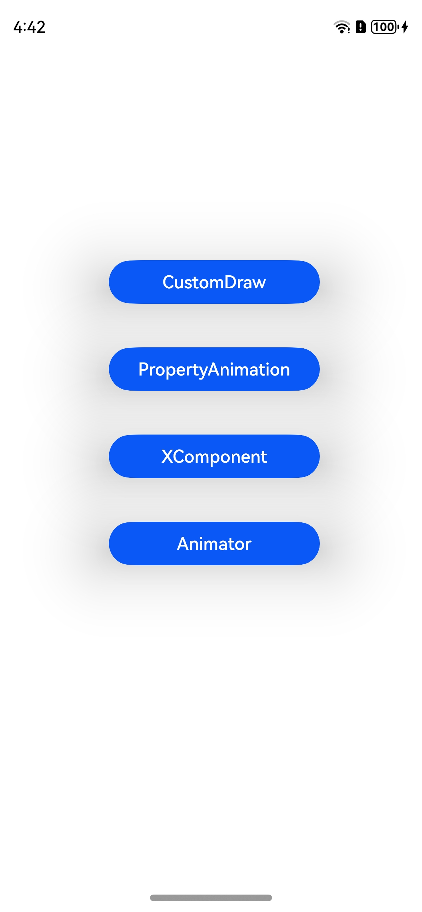

# DisplaySync分级管控

### 介绍

本示例通过DisplaySync分级管控功能对自绘制、属性动画、XComponent的绘制内容设置开发者所期望的帧率
### 效果预览

|初始页|自绘制|属性动画|XComponent|Animator|
|--------------------------------|--------------------------------|--------------------------------|--------------------------------|--------------------------------|
|  |  |  |  | |

使用说明

1.在初始页面点击“**CustomDraw**”，进入自绘制页面，点击“**Start**”，数字“**30**”按照30Hz帧率放大缩小，数字“**60**”按照60Hz帧率放大缩小；点击“**Stop**”绘制停止；点击“**Back**”返回初始页面

2.在初始页面点击“**PropertyAnimation**”，进入属性动画页面，点击“**Start**”，三个方块分别按照30Hz、40Hz、60Hz移动；点击“**Back**”返回初始页面

3.在初始页面点击“**XComponent**”，进入属性动画页面，点击“**Start**”，两个方块分别按照30Hz、120Hz移动；点击“**Stop**”动画停止；点击“**Back**”返回初始页面

4.在初始页面点击“**Animator**”，进入Animator动画页面，先点击“**Create**”，再点击“**Play**”三个方块分别按照10Hz、30Hz、60Hz变大；点击“**Back**”返回初始页面

### 工程目录
```
├──entry/src/main
│  ├──cpp                                       // C++代码区
│  │  ├──CMakeLists.txt                         // CMake配置文件
│  │  ├──hello.cpp                              // Napi模块注册
│  │  ├──common
│  │  │  └──log_common.h                        // 日志封装定义文件
│  │  ├──plugin                                 // 生命周期管理模块
│  │  │  ├──plugin_manager.cpp
│  │  │  └──plugin_manager.h
│  │  ├──samples                                // samples渲染模块
│  │  │  ├──sample_xcomponent.cpp
│  │  │  └──sample_xcomponent.h
│  ├──ets                                       // ets代码区
│  │  ├──entryability
│  │  │  ├──EntryAbility.ts                     // 程序入口类
|  |  |  └──EntryAbility.ets
|  |  ├──interface
│  │  │  └──XComponentContext.ts                // XComponentContext
│  │  ├──pages                                  // 页面文件
│  │  |  ├──Index.ets                           // 初始页面
│  │  |  ├──CustomDrawDisplaySync.ets           // 自绘制页面
│  │  |  ├──PropertyAnimationDisplaySync.ets    // 属性动画页面
│  │  |  ├──XComponentDisplaySync.ets           // XComponent页面
|  |  |  └──AnimatorDisplaySync.ets             // Animator动画
│  │  ├──utils                                  // 工具类
|  ├──resources         			                  // 资源文件目录
```

### 具体实现

* 自绘制：通过调用[@ohos.graphics.displaySync](https://gitee.com/openharmony/docs/blob/master/zh-cn/application-dev/reference/apis-arkgraphics2d/js-apis-graphics-displaySync.md)接口，通过注册回调和设置刷新了区间控制回调周期
    * 涉及到的相关接口：
      
      通过`import displaySync from '@ohos.graphics.displaySync'`引入
      
      | 接口名 | 描述 |
      | -------- | -------- |
      | Create(): DisplaySync | 创建一个DisplaySync实例 |
      | setExpectedFrameRateRange(rateRange: ExpectedFrameRateRange): void | 设置期望帧率 |
      | on(type: 'frame', callback: Callback<IntervalInfo>): void | 设置自定义绘制内容回调函数 |
      | off(type: 'frame', callback?: Callback<IntervalInfo>): void | 清除自定义绘制内容回调函数 |
      | start(): void | DisplaySync使能 |
      | stop(): void | DisplaySync失能 |
    
* 属性动画：通过[animation](https://gitee.com/openharmony/docs/blob/master/zh-cn/application-dev/reference/apis-arkui/arkui-ts/ts-animatorproperty.md)和[animateTo](https://gitee.com/openharmony/docs/blob/master/zh-cn/application-dev/reference/apis-arkui/arkui-ts/ts-explicit-animation.md)接口新增的参数expectedFrameRateRange，设置动画刷新率的区间，预期设置的刷新率，作为动画的属性之一，作用于动画场景
    * 涉及到的相关接口：
      
      | 新增动画属性 | 描述 |
      | -------- | -------- |
      | expectedFrameRateRange | animation和animateTo接口的动画属性参数中可选配置expectedFrameRateRange参数 |

* XComponent：通过在IDE中的Native c++ 工程，在c++代码中定义对外接口为register和unregister，并调用新增的CAPI接口,可在页面上使用drawing根据设定的期望帧率来绘制
    * 涉及到的相关接口([CAPI接口链接](https://gitee.com/openharmony/docs/blob/master/zh-cn/application-dev/reference/apis-arkui/_o_h___native_x_component.md))：

      | 接口名 | 描述 | 
      | -------- | -------- |
      | OH_NativeXComponent_SetExpectedFrameRateRange| 设置期望帧率范围 |
      | OH_NativeXComponent_RegisterOnFrameCallback  | 注册更新回调 |
      | OH_NativeXComponent_UnregisterOnFrameCallback  | 取消更新回调 |

* 动画：通过[animator](https://gitee.com/openharmony/docs/blob/master/zh-cn/application-dev/reference/apis-arkui/js-apis-animator.md)新增的接口setExpectedFrameRateRange，设置期望的帧率范围，作用于动画场景
    * 涉及到的相关接口：
      
      | 接口名 | 描述 |
      | ----------------------------------------------------------------- | -------- |
      | setExpectedFrameRateRange: (rateRange: ExpectedFrameRateRange): void | 设置期望的帧率范围 |


### 相关权限

不涉及

### 依赖

不涉及

### 约束与限制

1.本示例仅支持在标准系统上运行，支持设备：RK3568。

2.本示例为Stage模型，已适配API version 12版本SDK，SDK版本号(API Version 12 5.0.0.18),镜像版本号(5.0.0.18)。

3.本示例需要使用DevEco Studio 版本号(3.1.0.501)及以上版本才可编译运行。


### 下载

如需单独下载本工程，执行如下命令：
```
git init
git config core.sparsecheckout true
echo code/BasicFeature/Graphics/DisplaySync/ > .git/info/sparse-checkout
git remote add origin https://gitee.com/openharmony/applications_app_samples.git
git pull origin master

```
