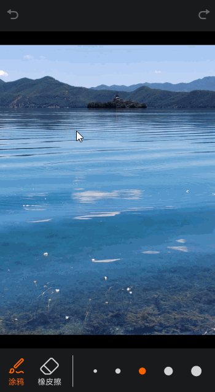

# 橡皮擦案例

### 介绍

本示例通过[@ohos.graphics.drawing](https://gitee.com/openharmony/docs/blob/master/zh-cn/application-dev/reference/apis-arkgraphics2d/js-apis-graphics-drawing.md)库和[blendMode颜色混合](https://gitee.com/openharmony/docs/blob/master/zh-cn/application-dev/reference/apis-arkui/arkui-ts/ts-universal-attributes-image-effect.md#blendmode11)实现了橡皮擦功能，能够根据手指移动轨迹擦除之前绘制的内容，并且可以进行图案的撤销和恢复。

### 效果图预览



**使用说明**

1. 页面底部左侧展示涂鸦和橡皮擦按钮，点击可以切换选中状态和当前的绘制模式，右侧为线宽列表，点击可以修改绘制时的轨迹宽度。
2. 在图片上触摸并拖动手指，可以绘制路径，涂鸦模式时绘制橙色线条，橡皮擦模式时擦除线条。
3. 页面顶部按钮默认不可用，进行绘制操作后左侧撤销按钮高亮，点击可以撤销上一步绘制，撤销后未进行绘制时右侧恢复按钮高亮，点击可以恢复上一次撤销。

### 实现思路

1. 使用`NodeContainer`构建绘制区域。

   - 定义`NodeController`的子类`MyNodeController`，实例化后可以通过将自绘制渲染节点`RenderNode`挂载到对应节点容器`NodeContainer`上实现自定义绘制。源码参考[RenderNodeModel.ets](casesfeature/erasercomponent/src/main/ets/model/RenderNodeModel.ets)

   ```ts
   /**
    * NodeController的子类MyNodeController
    */
   export class MyNodeController extends NodeController {
     private rootNode: FrameNode | null = null; // 根节点
     rootRenderNode: RenderNode | null = null; // 从NodeController根节点获取的RenderNode，用于添加和删除新创建的MyRenderNode实例
   
     // MyNodeController实例绑定的NodeContainer创建时触发，创建根节点rootNode并将其挂载至NodeContainer
     makeNode(uiContext: UIContext): FrameNode {
       this.rootNode = new FrameNode(uiContext);
       if (this.rootNode !== null) {
         this.rootRenderNode = this.rootNode.getRenderNode();
       }
       return this.rootNode;
     }
   
     // 绑定的NodeContainer布局时触发，获取NodeContainer的宽高
     aboutToResize(size: Size): void {
       if (this.rootRenderNode !== null) {
         // NodeContainer布局完成后设置rootRenderNode的背景透明
         this.rootRenderNode.backgroundColor = 0X00000000;
         // rootRenderNode的位置从组件NodeContainer的左上角(0,0)坐标开始，大小为NodeContainer的宽高
         this.rootRenderNode.frame = {
           x: 0,
           y: 0,
           width: size.width,
           height: size.height
         };
       }
     }
   
     // 添加节点
     addNode(node: RenderNode): void {
       if (this.rootNode === null) {
         return;
       }
       if (this.rootRenderNode !== null) {
         this.rootRenderNode.appendChild(node);
       }
     }
   
     // 清空节点
     clearNodes(): void {
       if (this.rootNode === null) {
         return;
       }
       if (this.rootRenderNode !== null) {
         this.rootRenderNode.clearChildren();
       }
     }
   }
   ```

   - 创建自定义节点容器组件`NodeContainer`，接收`MyNodeController`的实例，组件的宽高为图片加载完成后实际内容区域的宽高，并通过相对容器布局的`alignRules`使`NodeContainer`与图片内容区域重叠，控制绘制区域。源码参考[EraserMainPage.ets](casesfeature/erasercomponent/src/main/ets/pages/EraserMainPage.ets)

   ```ts
   @Builder
   drawingArea() {
     Image($r('app.media.palette_picture'))
       .width($r('app.string.palette_full_size'))
       .objectFit(ImageFit.Contain)
       .alignRules({
         top: { anchor: Constants.TOP_BUTTON_LINE_ID, align: VerticalAlign.Bottom },
         middle: { anchor: Constants.CONTAINER_ID, align: HorizontalAlign.Center },
         bottom: { anchor: Constants.BOTTOM_PEN_SHAPE_ID, align: VerticalAlign.Top }
       })
       .onComplete((event) => {
         if (event !== undefined) {
           // NodeContainer的宽高设置为图片成功加载后实际绘制的尺寸
           this.nodeContainerWidth = px2vp(event.contentWidth);
           this.nodeContainerHeight = px2vp(event.contentHeight);
         }
       })
     if(this.nodeContainerWidth && this.nodeContainerHeight){
      NodeContainer(this.myNodeController)
       .width(this.nodeContainerWidth)
       .height(this.nodeContainerHeight)
       .alignRules({
         top: { anchor: Constants.TOP_BUTTON_LINE_ID, align: VerticalAlign.Bottom },
         middle: { anchor: Constants.CONTAINER_ID, align: HorizontalAlign.Center },
         bottom: { anchor: Constants.BOTTOM_PEN_SHAPE_ID, align: VerticalAlign.Top }
       })
       .id(Constants.NODE_CONTAINER_ID)
       // ...
     }
   }
   ```
   
   - `NodeContainer`设置属性`blendMode`创建一个离屏画布，`NodeContainer`的子节点进行颜色混合时将基于该画布进行混合。源码参考[EraserMainPage.ets](casesfeature/erasercomponent/src/main/ets/pages/EraserMainPage.ets)

   ```ts
   .blendMode(BlendMode.SRC_OVER, BlendApplyType.OFFSCREEN)
   ```
   
2. 使用`MyImageRenderNode`类创建一个节点作为绘图基本层，管理整个画布的绘制历史，记录每次绘制后的画布状态（`pixelMap`）。

   - 创建`MyImageRenderNode`类，定义属性`pixelMapHistory`和`cacheStack`用于管理和记录画布上的图案变化，节点渲染时将`pixelMapHistory`栈顶的`pixelMap`绘制到画布上。源码参考[RenderNodeModel.ets](casesfeature/erasercomponent/src/main/ets/model/RenderNodeModel.ets)
   
   ```ts
   /**
    * MyImageRenderNode类，绘制和记录画布图案的pixelMap
    */
   export class MyImageRenderNode extends RenderNode {
     pixelMapHistory: image.PixelMap[] = []; // 记录每次绘制后画布的pixelMap
     cacheStack: image.PixelMap[] = []; // 记录撤销时从pixelMapHistory中出栈的pixelMap，恢复时使用
   
     // RenderNode进行绘制时会调用draw方法
     draw(context: DrawContext): void {
       const canvas = context.canvas;
       if (this.pixelMapHistory.length !== 0) {
         // 使用drawImage绘制pixelMapHistory栈顶的pixelMap
         canvas.drawImage(this.pixelMapHistory[this.pixelMapHistory.length - 1], 0, 0);
       }
     }
   }
   ```
   
   - 在`NodeContainer`的`onAppear`生命周期中初始化创建和挂载一个`MyImageRenderNode`节点`currentImageNode`，作为绘图的基础层。源码参考[EraserMainPage.ets](casesfeature/erasercomponent/src/main/ets/pages/EraserMainPage.ets)
   
   ```ts
   NodeContainer(this.myNodeController)
     // ...
     .onAppear(() => {
       // NodeContainer组件挂载完成后初始化一个MyImageRenderNode节点添加到根节点上
       if (this.currentImageNode === null) {
         // 创建一个MyImageRenderNode对象
         const newNode = new MyImageRenderNode();
         // 定义newNode的大小和位置，位置从组件NodeContainer的左上角(0,0)坐标开始，大小为NodeContainer的宽高
         newNode.frame = {
           x: 0,
           y: 0,
           width: this.nodeContainerWidth,
           height: this.nodeContainerHeight
         };
         this.currentImageNode = newNode;
         this.myNodeController.addNode(this.currentImageNode);
       }
     })
   ```
   
3. 创建`MyRenderNode`类来负责绘制路径，并定义其属性如路径对象、颜色混合模式和线宽以便动态修改。源码参考[RenderNodeModel.ets](casesfeature/erasercomponent/src/main/ets/model/RenderNodeModel.ets)

   ```ts
   /**
    * MyRenderNode类，初始化画笔和绘制路径
    */
   export class MyRenderNode extends RenderNode {
     path: drawing.Path = new drawing.Path(); // 新建路径对象，用于绘制手指移动轨迹
     pen: drawing.Pen = new drawing.Pen(); // 创建一个画笔Pen对象，Pen对象用于形状的边框线绘制
     blendMode: drawing.BlendMode = drawing.BlendMode.SRC_OVER; // 画笔的颜色混合模式
     lineStrokeWidth: number = 0; // 画笔线宽
   
     constructor() {
       super();
       // 设置画笔颜色
       const pen_color: common2D.Color = {
         alpha: 0xFF,
         red: 0xFA,
         green: 0x64,
         blue: 0x00
       };
       this.pen.setColor(pen_color);
       // 设置画笔开启反走样，可以使得图形的边缘在显示时更平滑
       this.pen.setAntiAlias(true);
       // 开启画笔的抖动绘制效果。抖动绘制可以使得绘制出的颜色更加真实。
       this.pen.setDither(true);
       // 设置画笔绘制转角的样式为圆头
       this.pen.setJoinStyle(drawing.JoinStyle.ROUND_JOIN);
       // 设置画笔线帽的样式，即画笔在绘制线段时在线段头尾端点的样式为半圆弧
       this.pen.setCapStyle(drawing.CapStyle.ROUND_CAP);
     }
   
     // RenderNode进行绘制时会调用draw方法
     draw(context: DrawContext): void {
       const canvas = context.canvas;
       // 设置画笔的颜色混合模式，根据不同的混合模式实现涂鸦和擦除效果
       this.pen.setBlendMode(this.blendMode);
       // 设置画笔的线宽，单位px
       this.pen.setStrokeWidth(this.lineStrokeWidth);
       // 将Pen画笔设置到canvas中
       canvas.attachPen(this.pen);
       // 绘制path
       canvas.drawPath(this.path);
     }
   }
   ```
   
4. 在`NodeContainer`组件的`onTouch`回调函数中，处理手指按下、移动和抬起事件，以便在屏幕上绘制或擦除路径。

   - 手指按下时，如果是初次绘制，创建一个新的`MyRenderNode`节点`currentNodeDraw`并将其挂载到根节点上，否则在`currentNodeDraw`中重新添加路径，根据当前的选择状态（绘制或擦除）修改节点中画笔的`blendMode`，控制画笔涂鸦和擦除。源码参考[EraserMainPage.ets](casesfeature/erasercomponent/src/main/ets/pages/EraserMainPage.ets)

   ```ts
   case TouchType.Down: {
     // 初次绘制时创建一个新的MyRenderNode对象，用于记录和绘制手指移动的路径，后续绘制时在已创建的currentNodeDraw中重新添加路径
     let newNode: MyRenderNode;
     if (this.currentNodeDraw !== null) {
       this.currentNodeDraw.path.moveTo(positionX, positionY);
     } else {
       const newNode = new MyRenderNode();
       newNode.frame = {
         x: 0,
         y: 0,
         width: this.nodeContainerWidth,
         height: this.nodeContainerHeight
       };
       this.currentNodeDraw = newNode;
       this.currentNodeDraw.path.moveTo(positionX, positionY);
       this.myNodeController.addNode(this.currentNodeDraw);
     }
     // TODO：知识点：给画笔设置不同的颜色混合模式，实现涂鸦和擦除效果
     if (!this.isClear) {
       // SRC_OVER类型，将源像素（新绘制内容）按照透明度与目标像素（下层图像）进行混合，覆盖在目标像素（下层图像）上
       this.currentNodeDraw.blendMode = drawing.BlendMode.SRC_OVER;
     } else {
       // CLEAR类型，将源像素（新绘制内容）覆盖的目标像素（下层图像）清除为完全透明
       this.currentNodeDraw.blendMode = drawing.BlendMode.CLEAR;
     }
     // 修改画笔线宽
     this.currentNodeDraw.lineStrokeWidth = this.currentLineStrokeWidth;
     break;
   }
   ```
   
   - 手指移动时，更新`currentNodeDraw`中的路径对象，并触发节点的重新渲染，绘制或擦除对应的移动轨迹。源码参考[EraserMainPage.ets](casesfeature/erasercomponent/src/main/ets/pages/EraserMainPage.ets)

   ```ts
   case TouchType.Move: {
     if (this.currentNodeDraw !== null) {
       // 手指移动，绘制移动轨迹
       this.currentNodeDraw.path.lineTo(positionX, positionY);
       // 节点的path更新后需要调用invalidate()方法触发重新渲染
       this.currentNodeDraw.invalidate();
     }
     break;
   }
   ```
   
   - 手指抬起时，通过组件截图功能获取当前`NodeContainer`上绘制结果的`pixelMap`，将其存入`currentImageNode`节点的历史记录栈`pixelMapHistory`中，并重新渲染`currentImageNode`节点。然后重置`currentNodeDraw`节点中的路径对象，并刷新节点。源码参考[EraserMainPage.ets](casesfeature/erasercomponent/src/main/ets/pages/EraserMainPage.ets)

   ```ts
   /**
    * touch事件触发后绘制手指移动轨迹
    */
   onTouchEvent(event: TouchEvent): void {
     // 获取手指触摸位置的坐标点
     const positionX: number = vp2px(event.touches[0].x);
     const positionY: number = vp2px(event.touches[0].y);
     switch (event.type) {
       // ...
       case TouchType.Up: {
         // 之前没有绘制过，即pixelMapHistory长度为0时，擦除操作不会更新绘制结果
         if (this.isClear && this.currentImageNode?.pixelMapHistory.length === 0 && this.currentNodeDraw !== null) {
           // 重置绘制节点的路径，
           this.currentNodeDraw.path.reset();
           this.currentNodeDraw.invalidate();
           return;
         }
         // 手指离开时更新绘制结果
         this.updateDrawResult();
       }
       default: {
         break;
       }
     }
   }
   
   /**
    * 更新绘制结果
    */
   updateDrawResult() {
     // TODO：知识点：通过组件截图componentSnapshot获取NodeContainer上当前绘制结果的pixelMap，需要设置waitUntilRenderFinished为true尽可能获取最新的渲染结果
     componentSnapshot.get(Constants.NODE_CONTAINER_ID, { waitUntilRenderFinished: true })
       .then(async (pixelMap: image.PixelMap) => {
         if (this.currentImageNode !== null) {
           // 获取到的pixelMap推入pixelMapHistory栈中，并且调用invalidate重新渲染currentImageNode
           this.currentImageNode.pixelMapHistory.push(pixelMap);
           this.currentImageNode.invalidate();
           // 更新绘制结果后将用于恢复的栈清空
           this.currentImageNode.cacheStack = [];
           // 更新撤销和恢复按钮状态
           this.redoEnabled = false;
           this.undoEnabled = true;
           if (this.currentNodeDraw !== null) {
             // 重置绘制节点的路径，
             this.currentNodeDraw.path.reset();
             this.currentNodeDraw.invalidate();
           }
         }
       })
   }
   ```

5. 通过操作`currentImageNode`节点的属性`pixelMapHistory`和`cacheStack`中画布状态(`pixelMap`)的出入栈实现撤销和恢复功能。

   - 从历史记录栈`pixelMapHistory`中移除最近一次绘制的`pixelMap`，刷新`currentImageNode`节点实现撤销功能，移除的`pixelMap`放入缓存栈`cacheStack`中以备恢复时使用。源码参考[EraserMainPage.ets](casesfeature/erasercomponent/src/main/ets/pages/EraserMainPage.ets)

   ```ts
   /**
    * 撤销上一笔绘制
    */
   undo() {
     if (this.currentImageNode !== null) {
       // 绘制历史记录pixelMapHistory顶部的pixelMap出栈，推入cacheStack栈中
       const pixelMap = this.currentImageNode.pixelMapHistory.pop();
       if (pixelMap) {
         this.currentImageNode.cacheStack.push(pixelMap);
       }
       // 节点重新渲染，将此时pixelMapHistory栈顶的pixelMap绘制到画布上
       this.currentImageNode.invalidate();
       // 更新撤销和恢复按钮状态
       this.redoEnabled = this.currentImageNode.cacheStack.length !== 0 ? true : false;
       this.undoEnabled = this.currentImageNode.pixelMapHistory.length !== 0 ? true : false;
     }
   }
   ```

   - 从缓存栈`cacheStack`中取出栈顶的`pixelMap`，重新放入历史记录栈`pixelMapHistory`中，刷新`currentImageNode`节点恢复上次撤销之前的状态。源码参考[EraserMainPage.ets](casesfeature/erasercomponent/src/main/ets/pages/EraserMainPage.ets)

   ```ts
   /**
    * 恢复上一次撤销
    */
   redo() {
     if (this.currentImageNode !== null) {
       // cacheStack顶部的pixelMap出栈，推入绘制历史记录pixelMapHistory栈中
       const pixelMap = this.currentImageNode.cacheStack.pop();
       if (pixelMap) {
         this.currentImageNode.pixelMapHistory.push(pixelMap);
       }
       // 节点重新渲染，将此时pixelMapHistory栈顶的pixelMap绘制到画布上
       this.currentImageNode.invalidate();
       // 更新撤销和恢复按钮状态
       this.redoEnabled = this.currentImageNode.cacheStack.length !== 0 ? true : false;
       this.undoEnabled = this.currentImageNode.pixelMapHistory.length !== 0 ? true : false;
     }
   }
   ```
   
### 高性能知识点

1. onTouch是系统高频回调函数，避免在函数中进行冗余或耗时操作，例如应该减少或避免在函数打印日志，会有较大的性能损耗。

### 工程结构&模块类型

   ```
   erasercomponent                               // har类型
   |---model                        
   |   |---RenderNodeModel.ets                   // 数据模型层-节点数据模型
   |---pages                        
   |   |---EraserMainPage.ets                    // 视图层-主页面
   |---constants                        
   |   |---Constants.ets                         // 常量数据
   ```

### 参考资料

[@ohos.graphics.drawing (绘制模块)](https://gitee.com/openharmony/docs/blob/master/zh-cn/application-dev/reference/apis-arkgraphics2d/js-apis-graphics-drawing.md)

[NodeController](https://gitee.com/openharmony/docs/blob/master/zh-cn/application-dev/reference/apis-arkui/js-apis-arkui-nodeController.md)

[自渲染节点RenderNode](https://gitee.com/openharmony/docs/blob/master/zh-cn/application-dev/reference/apis-arkui/js-apis-arkui-renderNode.md)

[RelativeContainer相对布局](https://gitee.com/openharmony/docs/blob/master/zh-cn/application-dev/reference/apis-arkui/arkui-ts/ts-container-relativecontainer.md)

[blendMode](https://gitee.com/openharmony/docs/blob/master/zh-cn/application-dev/reference/apis-arkui/arkui-ts/ts-universal-attributes-image-effect.md#blendmode11)

### 约束与限制

1.本示例仅支持在标准系统上运行。

2.本示例需要使用DevEco Studio 5.0.0 Release 才可编译运行。

### 下载

如需单独下载本工程，执行如下命令：
```
git init
git config core.sparsecheckout true
echo /code/BasicFeature/Graphics/Graphics2d/Eraser > .git/info/sparse-checkout
git remote add origin https://gitee.com/openharmony/applications_app_samples.git
git pull origin master
```
