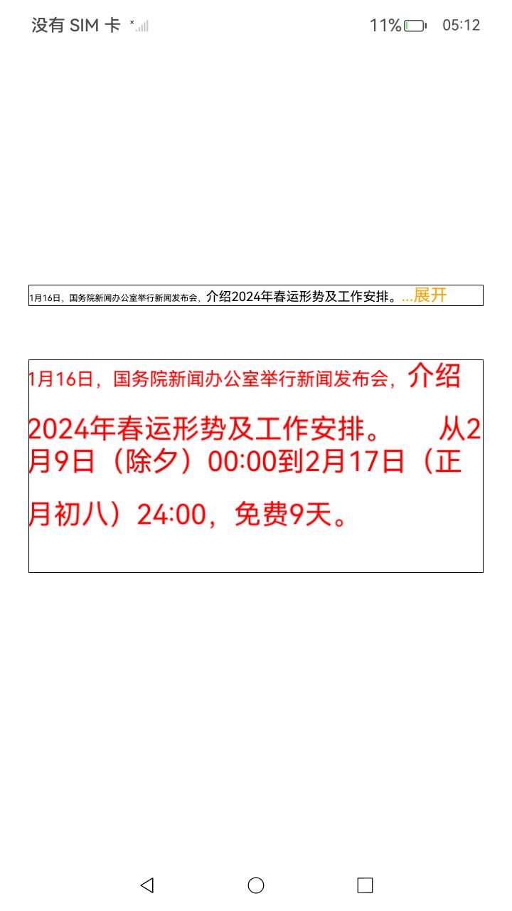
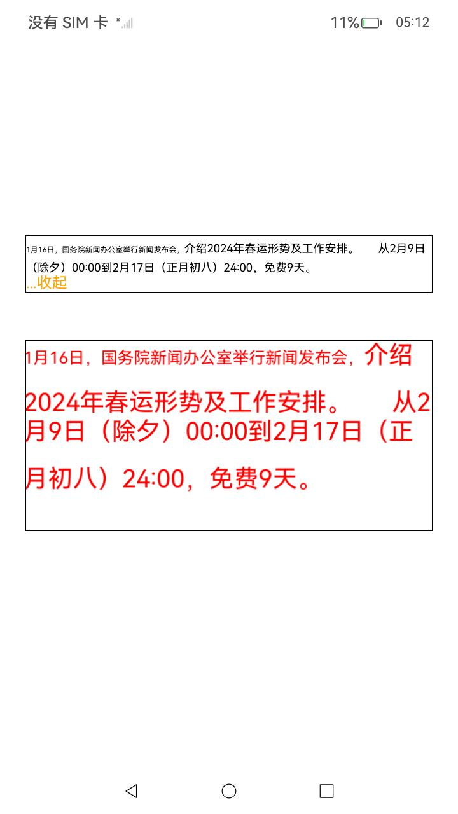

# 2D引擎接口示例

### 介绍

本实例主要测试了当前2D引擎提供的接口功能，主要调用了[@ohos.graphics.drawing](https://gitee.com/openharmony/docs/blob/master/zh-cn/application-dev/reference/apis-arkgraphics2d/js-apis-graphics-drawing.md)和[@kit.ArkGraphics2D](https://gitee.com/openharmony/docs/blob/master/zh-cn/application-dev/reference/apis-arkgraphics2d/js-apis-effectKit.md)中的接口，测试了每一个接口的功能。2D引擎渲染的画面会被显示在[Text](https://gitee.com/openharmony/docs/blob/master/zh-cn/application-dev/reference/apis-arkui/arkui-ts/ts-basic-components-text.md)这一控件中。点击“...展开”会有评论区展开效果，点击“...收起”会展示收起效果。

### 使用说明

1. 启动应用，点击“...展开”显示文本展开效果，点击“...收起”显示文本收起效果。

### 效果预览

| 收起效果                         | 展开效果                          |
|-------------------------------------|------------------------------------------|
|  |  |

### 工程目录

```
entry/src/main/
├── ets
│   ├── entryability
│   ├── entrybackupability
│   └── pages
│       └── TextCollapseEtsDemo.ets
└── resources
    ├── base
    │   ├── element
    │   ├── media
    │   └── profile
    ├── en_US
    │   └── element
    ├── rawfile
    │   ├── FZBWKSJW.TTF
    │   └── STXINGKA.ttf
    └── zh_CN
        └── element
```

### 具体实现
* getFoldIndex主要逻辑（根据给定的试图模型列表来设置文本的样式和内容）
    * 定义一个文本样式（myTextStyle）和一个段落样式（myParagraphStyle），并加载一个自定义字体；
    * 创建一个段落构造器（ParagraphGraphBuilder），并根据视图模型列表中的每个元素的类型和内容来添加文本或占位符；
    * 构建段落，并计算段落的布局，如果段落的行数大于2，会计算出在给定宽度下的折叠点；
    * 创建一个画布，并将段落绘制到画布上，并返回折叠点的索引和行数；
* getResultFromNdk主要逻辑（由原始列表originViewModelList转换成折叠列表collapseViewModelList）
    * getFoldIndex获取折叠索引和行数；
    * 如果行数小于等于2，不需要处理直接返回；
    * 如果行数大于2，进行裁剪，裁剪过程会根据折叠索引来决定哪些原始列表数据应该被保留，哪些应该被裁剪；
    * 裁剪规则：如果原始列表的类型为0，直接将其内容长度累加到当前索引上；如果是1，将索引加1；

### 相关权限

暂无

### 依赖

暂无

### 约束与限制

1. 本示例仅支持标准系统上运行，支持设备：RK3568;
2. 本示例仅支持API12版本SDK，SDK版本号：(API Version 12 5.0.0.31)，镜像版本号：OpenHarmony 5.0.0.31；
3. 本示例需要使用DevEco Studio NEXT Developer Preview1(Build Version: 4.1.3.500)才可编译运行；

### 下载

```
git init
git config core.sparsecheckout true
echo code/BasicFeature/Graphics/Graphics2d/ExpandText/ > .git/info/sparse-checkout
git remote add origin https://gitee.com/openharmony/applications_app_samples.git
git pull origin master
```