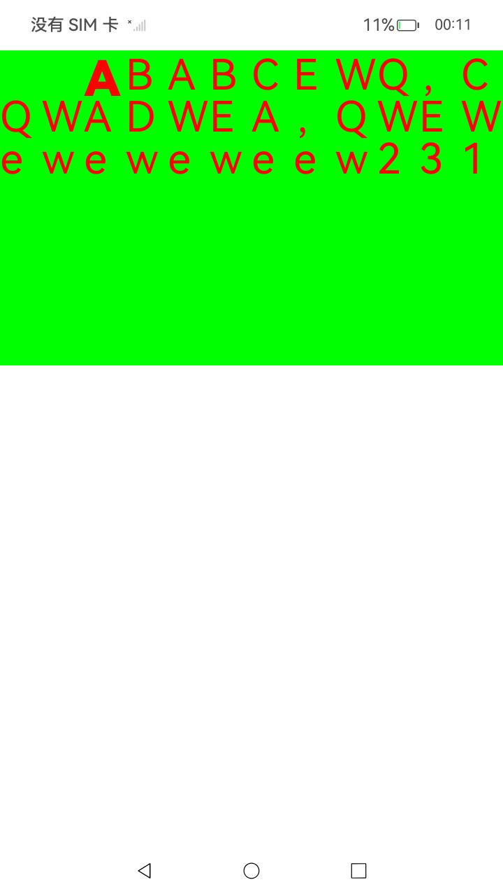

# 2D引擎接口示例

### 介绍

本实例主要测试了当前2D引擎提供的接口功能，主要调用了[@ohos.graphics.drawing](https://gitee.com/openharmony/docs/blob/master/zh-cn/application-dev/reference/apis-arkgraphics2d/js-apis-graphics-drawing.md)中的接口，测试了每一个接口的功能。实现文字逐字绘制。
### 效果预览

| 效果                         |
|-------------------------------------|
|  |

### 工程目录

```
entry/src/main/
├── ets
│   ├── entryability
│   └── pages
│       └── Index.ets
        └── NativeRender.ets
└── resources
    ├── base
    │   ├── element
    │   ├── media
    │   └── profile
    ├── en_US
    │   └── element
    └── zh_CN
        └── element
```

使用说明

1.启动应用，出现页面加载如效果图显示即可

### 具体实现
* DrawParagraph主要逻辑（分解字符串逐字绘制计算每个字符位置并实现首行缩进与首字放大加粗）
    * 字符串逐字分解；
    * 定义两个文本样式（myTextStyle）与一个段落对象(paragraph)；
    * 首字计算，当为首字时，加载首字风格与缩进格式；
    * 当所有字体宽度和大于容器宽度进行换行;
    * 创建一个画布，绘制所有字符；


### 相关权限

暂无

### 依赖

暂无

### 约束与限制

1. 本示例仅支持标准系统上运行，支持设备：RK3568;
2. 本示例仅支持API12版本SDK，SDK版本号：(API Version 12 5.0.0.31)，镜像版本号：OpenHarmony 5.0.0.31；
3. 本示例需要使用DevEco Studio NEXT Developer Preview1 (Build Version: 4.1.3.500, built on January 20, 2024)才可编译运行；

### 下载

```
git init
git config core.sparsecheckout true
echo code/BasicFeature/Graphics/Graphics2d/PaintVerbatim/ > .git/info/sparse-checkout
git remote add origin https://gitee.com/openharmony/applications_app_samples.git
```