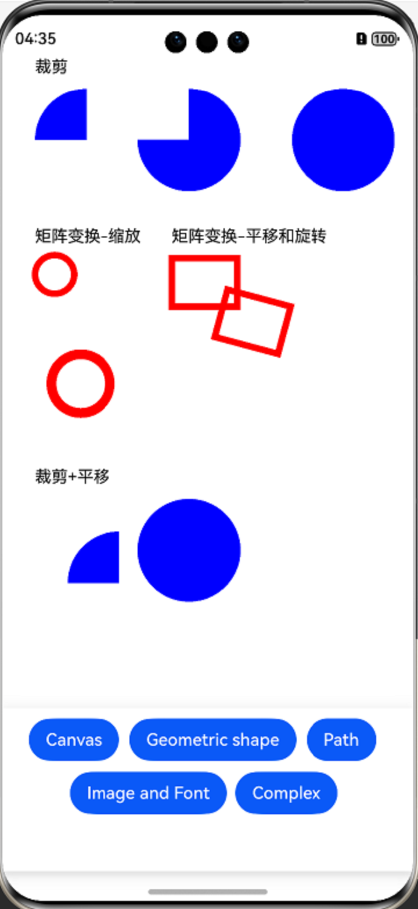
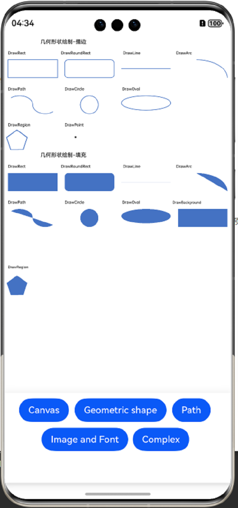
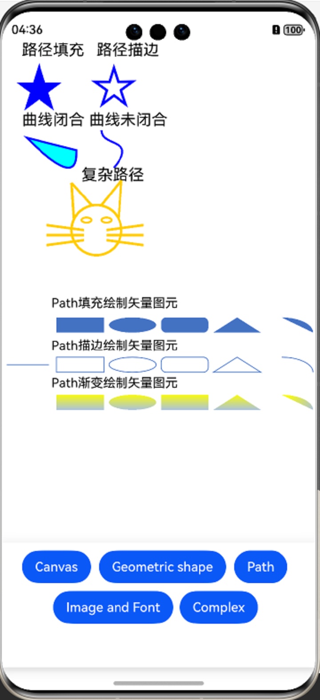
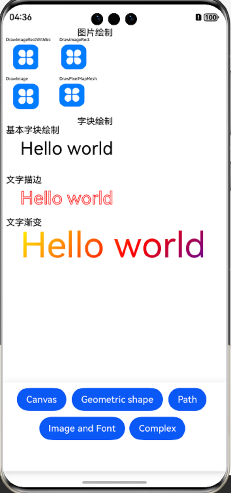
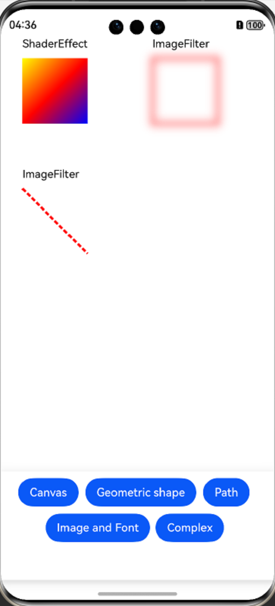

# 图形绘制与显示的示例（TSDrawingSample）

#### 介绍

本示例使用Drawing进行图形绘制与显示时，使用[@ohos.graphics.drawing](https://gitee.com/openharmony/docs/blob/master/zh-cn/application-dev/reference/apis-arkgraphics2d/js-apis-graphics-drawing.md)模块的画布画笔绘制基本的2D图形和文字，调用绘制和显示的逻辑，在应用上显示图形和文字。

#### 使用说明

1. 使用DevEco Studio 5.0.0及以上版本打开此工程，编译运行；

2. 点击页面底部“画布操作及状态”按钮，页面将绘制与画布裁剪、矩阵变换等相关内容；

3. 点击页面底部“几何形状绘制”按钮，页面将绘制几何形状（矩形、圆角矩形、椭圆等）；

4. 点击页面底部“路径绘制”按钮，页面将绘制路径（路径填充、路径描边、曲线闭合、曲线未闭合等）；

5. 点击页面底部“图片和字块绘制”按钮，页面将绘制图片和文字等相关内容；

6. 点击页面底部“复杂绘制效果”按钮，页面将复杂绘制效果等相关内容。

#### 效果预览

| 主页      | 画布操作及状态    | 几何形状绘制  | 路径绘制  | 图片和字块绘制  | 复杂绘制效果  |
| ------------- |-----------|----------------|------------ |------------ |------------ |
|  |  |  |  |  |  |

#### 工程目录

```
├──entry/src/main
│  ├──ets                                 // ets代码区
│  │  ├──common
│  │  │  └──Logger.ts                     // 日志封装定义文件
│  │  │  └──CanvasRenderNode.ets          // 画布操作及状态相关的RenderNode
│  │  │  └──ShapeRenderNode.ets           // 几何形状绘制相关的RenderNode
│  │  │  └──PathRenderNode.ets            // 路径绘制相关的RenderNode
│  │  │  └──ImageRenderNode.ets           // 图片绘制相关的RenderNode
│  │  │  └──TextBlobRenderNode.ets        // 字块绘制相关的RenderNode
│  │  │  └──ComplexRenderNode.ets         // 复杂绘制效果相关的RenderNode
│  │  ├──entryability                     // 不涉及
│  │  ├──entrybackupability               // 不涉及
│  │  └──pages                            // 页面文件
│  │     └──Index.ets                     // 主界面
|  ├──resources                           // 资源文件目录
```

#### 相关权限

暂无

#### 依赖

暂无

#### 约束与限制

1. 本示例仅支持标准系统上运行,支持设备：Phone;
2. 本示例为Stage模型，已适配API version 14版本SDK，SDK版本号(API Version 14 Release),镜像版本号(5.0.2 Release);
3. 本示例需要使用DevEco Studio 版本号(5.0 Release)及以上版本才可编译运行。

### 下载

如需单独下载本工程，执行如下命令：

```
git init
git config core.sparsecheckout true
echo code/BasicFeature/Graphics/Graphics2d/TsDrawingSample/ > .git/info/sparse-checkout
git remote add origin https://gitee.com/openharmony/applications_app_samples.git
git pull origin master
```