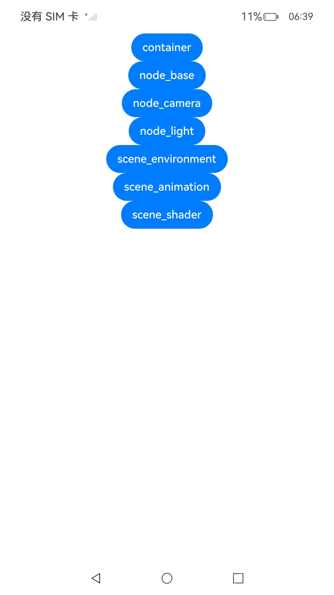
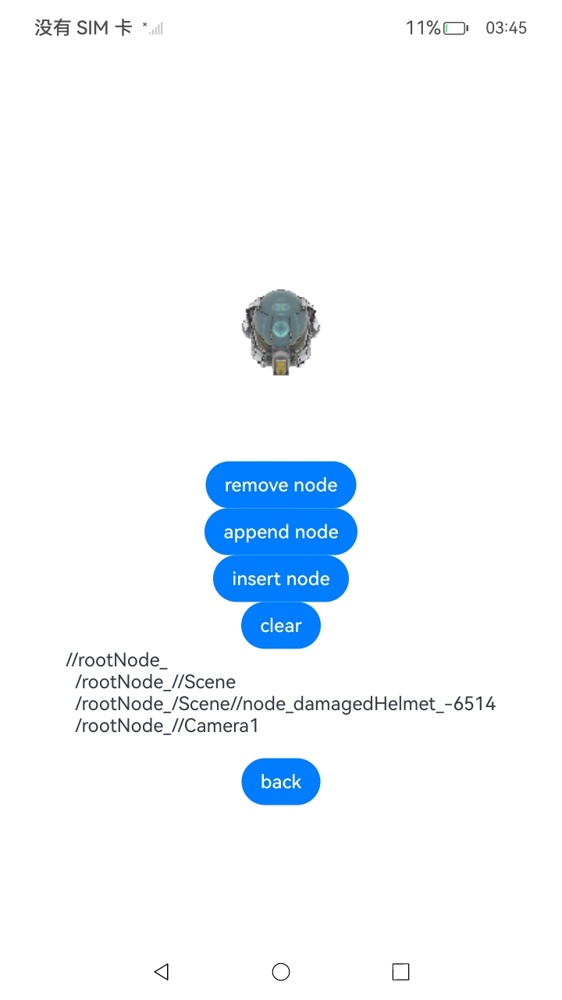
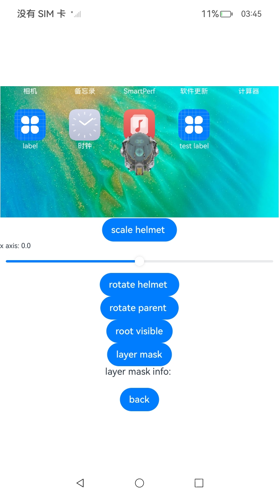
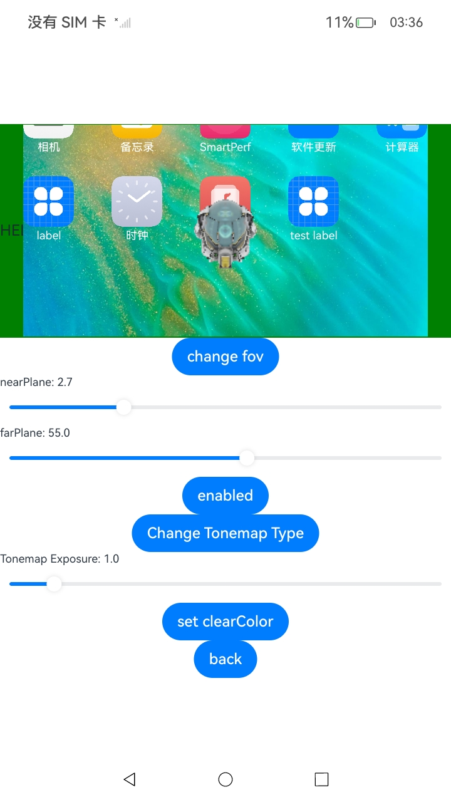
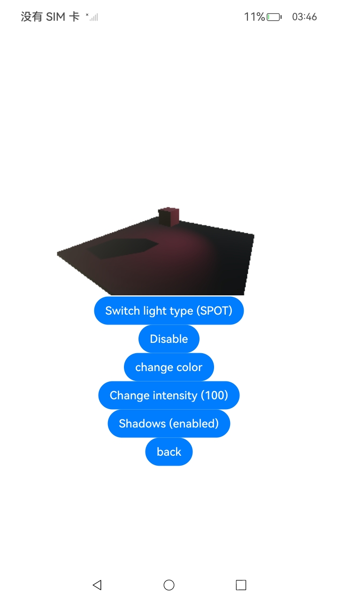
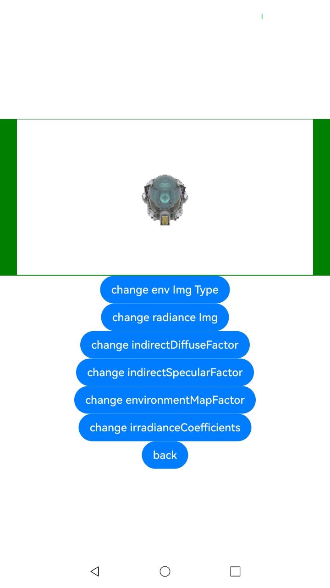
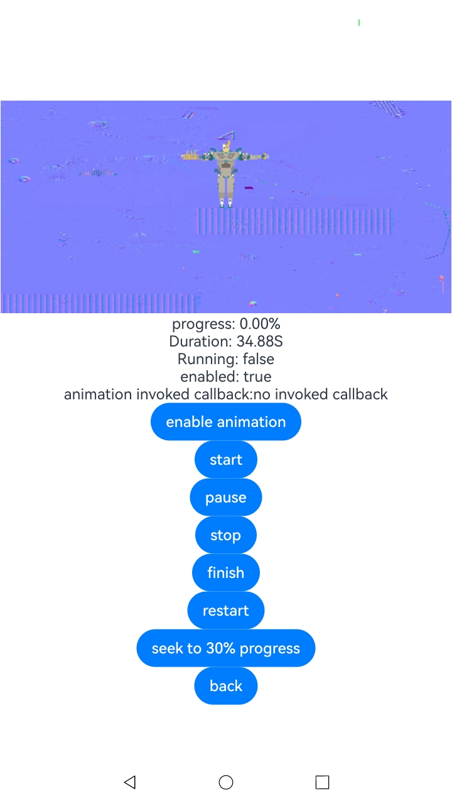
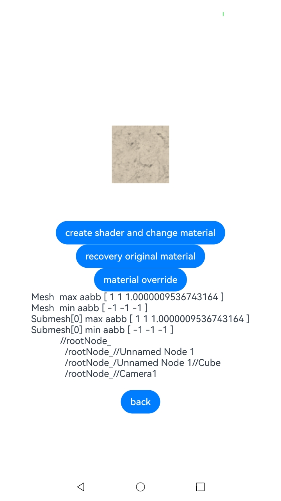

# 3D引擎接口示例

### 介绍

本实例主要测试了当前3D引擎提供的接口功能，调用了[@ohos.graphics.scene](https://gitee.com/openharmony/interface_sdk-js/blob/master/api/@ohos.graphics.scene.d.ts)中的接口，测试了每一个接口的功能。3D引擎渲染的画面会被显示在[Component3D](https://gitee.com/openharmony/interface_sdk-js/blob/master/api/@internal/component/ets/component3d.d.ts)这一控件中。点击按钮触发不同的功能，用户可以观察渲染画面的改变；此外，许多接口将不会直接导致渲染效果的改变，因此应用将会打印日志来检测这些接口是否正常，可以用“lume_api_test"来过滤。

### 效果预览

| 主页                                  | container                                | node_base                           | node_camera                |
|-------------------------------------|------------------------------------------|-------------------------------------|----------------------------|
|  |  |  |  |

| node_light                           | scene_environment                           | scene_animation                           | scene_shader                           |
|--------------------------------------|---------------------------------------------|-------------------------------------------|----------------------------------------|
|  |  |  |  |

使用说明

1. 在主界面，可以点击按钮进入不同的子页面，每一个子页面分别测试了一类3D引擎的接口功能，在子页面点击back返回主界面。
2. 在container界面，点击按钮，可以添加、移除子节点，节点的结构信息已打印在界面上。在本示例中操作的子节点是一个头盔模型。
3. 在node_base界面，点击按钮对节点的基础属性如位置、旋转、大小、可见性等进行操作。在本示例中操作的子节点是一个头盔模型。
4. 在node_camera界面，点击按钮对相机的属性如投影、后处理等进行操作。
5. 在node_light界面，点击按钮对灯光的类型、颜色、强度、阴影等进行操作。
6. 在scene_environment界面，点击按钮对背景进行操作。
7. 在scene_animation界面，点击按钮进行动画的播放、暂停等操作的功能。
8. 在scene_shader界面，点击按钮进行纹理材质的操作。

### 工程目录

```
entry/src/main/
├─ets
│  ├─entryability
│  ├─graphics3d
│  └─pages
│      ├─container.ets					// 子节点操作demo
│      ├─Index.ets						// 主界面
│      ├─node_base.ets					// 节点基础demo
│      ├─node_camera.ets				// 相机demo
│      ├─node_light.ets					// 灯光demo
│      ├─scene_animation.ets			// 动画demo
│      ├─scene_environment.ets			// 背景demo
│      ├─scene_shader.ets				// 纹理demo
└─resources
    ├─base
    │  ├─element
    │  ├─media
    │  └─profile
    ├─en_US
    │  └─element
    ├─rawfile
    │  ├─assets
    │  │  └─app
    │  │      ├─rendernodegraphs
    │  │      └─shaders
    │  │          └─shader
    │  ├─gltf							// 本示例中用到的模型
    │  │  ├─BrainStem
    │  │  │  ├─glTF
    │  │  │  ├─glTF-Binary
    │  │  │  ├─glTF-Draco
    │  │  │  ├─glTF-Embedded
    │  │  │  ├─glTF-Meshopt
    │  │  │  └─screenshot
    │  │  ├─Cube
    │  │  │  ├─glTF
    │  │  │  └─screenshot
    │  │  ├─CubeWithFloor
    │  │  │  └─glTF
    │  │  ├─DamagedHelmet
    │  │  │  └─glTF
    │  │  └─Environment
    │  │      └─glTF
    │  │          └─images
    │  └─shaders
    │      └─custom_shader
    └─zh_CN
        └─element
```

### 具体实现
* 添加、移除、遍历节点的功能接口封装在graphics3d/[SceneNodes.d.ts](https://gitee.com/openharmony/interface_sdk-js/blob/master/api/graphics3d/SceneNodes.d.ts)，源码参考：container.ets
    * 初始时会使用深度优先的方式遍历并打印场景中每一个节点的信息，从场景的root节点开始；
    * 删除节点：调用remove方法删除指定节点，不会重复删除，在本示例中删除了头盔节点；
    * 添加节点：调用append方法在子节点列表的末尾添加指定节点，不会重复添加，在本示例中添加了头盔节点；
    * 添加节点：调用insertAfter方法在子节点列表的指定位置添加指定节点，不会重复添加，在本示例中添加了头盔节点；
    * 清除子节点：调用clear方法清除子节点列表的所有节点，本示例中清除了root的子节点；
    * 获取子节点：调用get方法获取子节点列表中的指定节点；
    * 获取子节点个数：调用count方法获取子节点列表的大小。
* 对节点的基础属性如位置、旋转、大小等操作的功能接口封装在graphics3d/[SceneNodes.d.ts](https://gitee.com/openharmony/interface_sdk-js/blob/master/api/graphics3d/SceneNodes.d.ts)，源码参考：node_base.ets
    * 修改scale属性改变节点的大小，本示例中改变了头盔的大小；
    * 修改position属性改变节点的位置，本示例中改变了头盔的x轴坐标；
    * 修改rotation属性改变节点的旋转方向，改变子节点的父节点的rotation同样会改变子节点的旋转方向（position同理），本示例中改变了头盔的旋转方向；
    * 修改节点的visible属性改变节点的可见性，本示例中改变了头盔的可见性；
    * 使用getEnabled和setEnabled操作节点的layerMask，本示例中将layerMask的信息打印在界面上。
    
* 对相机的属性如投影、后处理等进行操作的功能接口封装在graphics3d/[SceneNodes.d.ts](https://gitee.com/openharmony/interface_sdk-js/blob/master/api/graphics3d/SceneNodes.d.ts)，源码参考：node_camera.ets
  * 修改fov属性改变投影的视场角，本示例中设置了45/60/90三种；
  * 修改nearPlane和farPlane属性投影的近平面和远平面；
  * 修改enabled属性改变相机是否启用，设为false之后控件中的画面将不再刷新；
  * 修改postProcess.toneMapping.type属性可以改变用于色调映射的方法，目前有ACES/ACES_2020/FILMIC三种；
  * 修改postProcess.toneMapping.exposure属性可以改变用于色调映射的曝光参数。
  * 修改clearColor属性可以设置每一帧的刷新背景色，设置a通道为零可以获得一个透明的背景，设置为null时不会刷新全部背景像素。

* 对灯光的类型、颜色、强度、阴影等进行操作的功能接口封装在graphics3d/[SceneNodes.d.ts](https://gitee.com/openharmony/interface_sdk-js/blob/master/api/graphics3d/SceneNodes.d.ts)，源码参考：node_light.ets
  * lightType属性为只读，表示灯光的种类，目前有DIRECTIONAL和SPOT两种，分别为平行光和点光源；
  * 修改enabled属性改变灯光是否启用；
  * 修改color属性可以改变灯光的颜色，本示例中有三种可以变化；
  * 修改intensity属性可以改变灯光的强度。
  * 修改shadowEnabled属性可以设置灯光是否产生阴影。

* 对背景进行操作的功能接口封装在graphics3d/[SceneResources.d.ts](https://gitee.com/openharmony/interface_sdk-js/blob/master/api/graphics3d/SceneResources.d.ts)，源码参考：scene_environment.ets
  * 同时修改backgroundType和environmentImage可以设置背景图片，backgroundType为BACKGROUND_IMAGE或BACKGROUND_EQUIRECTANGULAR时对应png或者jpeg格式的图片；类型为BACKGROUND_CUBEMAP时对应ktx格式的图片；类型为BACKGROUND_NONE时不设置背景图片，需要同时将camera的clearColor的a通道设置为0以获得透明背景；
  * 修改radianceImage属性改变PBR中的环境贴图；
  * 修改indirectDiffuseFactor属性改变PBR中的相应参数；
  * 修改indirectSpecularFactor属性改变PBR中的相应参数；
  * 修改irradianceCoefficients属性改变PBR中的相应参数；
  * 修改environmentMapFactor属性改变背景图的相应参数。

* 对动画的播放、暂停等进行操作的功能接口封装在graphics3d/[SceneResources.d.ts](https://gitee.com/openharmony/interface_sdk-js/blob/master/api/graphics3d/SceneResources.d.ts)，源码参考：scene_animation.ets
  * 修改enabled属性改变动画是否启用；
  * 只读属性duration、running、progress为动画的时长、进行状态、已经进行的比例；
  * 调用start方法控制动画开启；
  * 调用pause方法控制动画暂停；
  * 调用stop方法控制动画停止，并将动画状态设置为开头；
  * 调用finish方法控制动画结束，并将动画状态设置为结尾；
  * 调用restart方法控制动画从头开始；
  * 调用seek方法控制动画设置到指定状态；
  * onStarted方法在动画开始时执行传入的回调；
  * onFinished方法在动画结束时执行传入的回调。

- 对纹理材质进行操作的功能接口封装在graphics3d/[SceneResources.d.ts](https://gitee.com/openharmony/interface_sdk-js/blob/master/api/graphics3d/SceneResources.d.ts)，源码参考：scene_shader.ets
  * 首先创建一个shader作为ShaderMaterial的colorShader，再创建一个material作为纹理的ShaderMaterial；
  * 使用Geometry获取相应的带有Material的Mesh节点；
  * 修改shader的input参数；
  * 修改subMesh的material属性，将其变为自定义的ShaderMaterial；
  * 修改materialOverride属性，将纹理覆盖为自定义的ShaderMaterial。

### 相关权限

暂无

### 依赖

暂无

### 约束与限制

1. 本示例仅支持标准系统上运行，支持设备：RK3568;
2. 本示例仅支持API12版本SDK，SDK版本号：(API Version 12 5.0.0.24)，镜像版本号：OpenHarmony 5.0.0.24；
3. 本示例需要使用DevEco Studio Next Developer Preview2 (Build Version: 4.1.3.700)才可编译运行；

### 下载

```
git init
git config core.sparsecheckout true
echo code/BasicFeature/Graphics/Graphics3d/ > .git/info/sparse-checkout
git remote add origin https://gitee.com/openharmony/applications_app_samples.git
git pull origin master
```