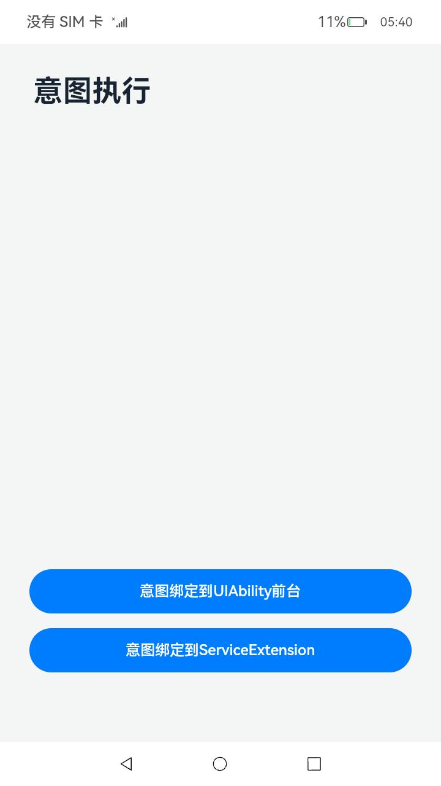
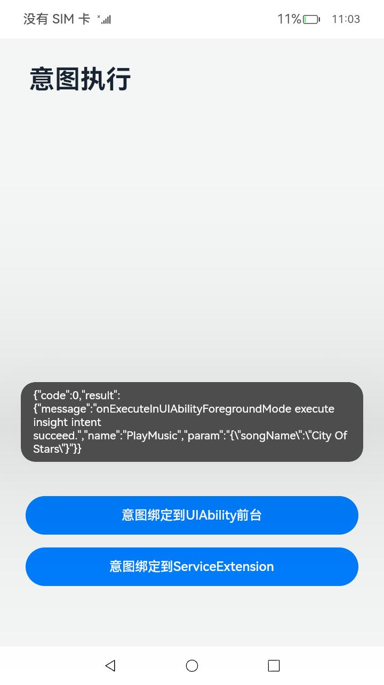

# 意图执行

### 介绍

本示例使用[@ohos.app.ability.InsightIntentExecutor](https://gitee.com/openharmony/docs/blob/master/zh-cn/application-dev/reference/apis/js-apis-app-ability-insightIntentExecutor.md)、[@ohos.app.ability.insightIntent](https://gitee.com/openharmony/docs/blob/master/zh-cn/application-dev/reference/apis/js-apis-app-ability-insightIntent.md)等接口，展示了意图绑定到UIAbility前台执行，主要包括构造意图配置文件、响应绑定到UIAbility前台执行的意图调用等。

### 效果预览：

| 主页（参照系统应用[IntentDriver](../../../SystemFeature/InsightIntent/IntentDriver)） | 意图绑定到UIAbility前台执行迁移页面                          | 意图绑定到UIAbility前台执行结果                              |
| ------------------------------------------------------------ | ------------------------------------------------------------ | ------------------------------------------------------------ |
|  |  |  |

使用说明

1.启动系统应用[IntentDriver](../../../SystemFeature/InsightIntent/IntentDriver)应用后，主页面上显示两个按钮：意图绑定到UIAbility前台、意图绑定到ServiceExtension；

2.点击按钮“意图绑定到UIAbility前台”，触发本应用的意图执行，并加载新的页面，返回意图调用结果通过promptAction.showToast显示在IntentDriver应用；

### 工程目录

```
entry/src/main/
├─ets
│  ├─entryability
│  │  └─EntryAbility.ets				  // UIAbility，意图绑定到该UIAbility前台执行
│  ├─intents
│  │  └─PlayMusicIntentExecutorImpl.ets	  // 通过意图调用执行基类对接端侧意图框架，实现响应意图调用的业务逻辑
│  ├─pages
│  │  ├─Index.ets				          // 主页面
│  │  └─IntentPage.ets                    // 意图绑定到该UIAbility前台执行时加载的页面
│  └─util
│     └─Logger.ets				          // 日志工具
└─resources
    └─base
      └─profile
         └─insight_intent.json            // 意图配置文件
```

### 具体实现

* 实现意图调用业务逻辑的功能接口封装在PlayMusicIntentExecutorImpl，源码参考：[PlayMusicIntentExecutorImpl.ets](entry/src/main/ets/intents/PlayMusicIntentExecutorImpl.ets)
    * 意图绑定到UIAbility前台运行的业务逻辑：
      实现意图调用执行基类InsightIntentExecutor的onExecuteInUIAbilityForegroundMode()回调函数；
* 在意图配置文件[insight_intent.json](entry/src/main/resources/base/profile/insight_intent.json)中配置应用支持的意图API列表
    * 配置内容包括：
    意图API名称、意图API所属的垂域、意图API版本号、代码相对路径入口、执行模式等；
* 页面[IntentPage.ets](entry/src/main/ets/pages/IntentPage.ets)是绑定到UIAbility前台运行的意图拉起的页面

### 相关权限

不涉及。

### 依赖

本应用的运行依赖系统应用[IntentDriver](../../../SystemFeature/InsightIntent/IntentDriver)。

### 约束与限制

1.本示例仅支持标准系统上运行，支持设备：RK3568;

2.本示例为Stage模型，支持API11版本SDK，版本号：4.1.3.1；

3.本示例需要使用DevEco Studio 3.1.1 Release (Build Version: 3.1.0.501, built on June 20, 2023)才可编译运行；

### 下载

如需单独下载本工程，执行如下命令：

```
git init
git config core.sparsecheckout true
echo code/BasicFeature/InsightIntent/IntentExecutor/ > .git/info/sparse-checkout
git remote add origin https://gitee.com/openharmony/applications_app_samples.git
git pull origin master
```
