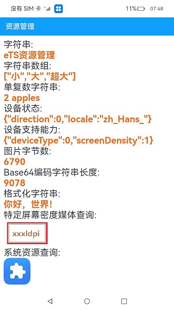

# 资源管理器

### 介绍

本示例使用[@ohos.app.ability.common](https://gitee.com/openharmony/docs/blob/master/zh-cn/application-dev/reference/apis/js-apis-app-ability-common.md)
接口中的AbilityContext类，获取资源管理器resourceManager，实现了获取字符串和图片资源信息的功能。

### 效果预览

|主页|
|---|
||

使用说明

应用界面中展示了资源管理API各类接口的调用，包括读取的字符串、字符串数组、根据指定数量获取指定ID字符串表示的单复数字符串，指定资源ID对应的媒体文件内容字节数、指定资源ID对应的图片资源Base64编码字符串的长度，以及获取设备状态和设备支持的能力。

### 工程目录

```
entry/src/main/ets/
|---entryability
|---pages
|   |---Index.ets                          // 首页
|---utils                                  // 日志工具
```

### 具体实现

使用getContext()接口获取context对象，使用context.resourceManager获取资源管理对象，然后调用resourceManager内部的相关接口获取对应资源信息,源码参考：[Index.ets](https://gitee.com/openharmony/applications_app_samples/blob/master/code/BasicFeature/Internationalnation/ResourceManager/entry/src/main/ets/pages/Index.ets)
。例如：
* 获取字符串资源：resourceManager.getStringValue()
* 获取字符串数组资源：resourceManager.getStringValue()
* 获取图片资源：resourceManager.getMediaContent()


### 相关权限

不涉及。

### 依赖

不涉及。

### 约束与限制

1. 本示例仅支持标准系统上运行。

2. 本示例已适配API10版本SDK，版本号：4.0.5.1。

3. 本示例需要使用DevEco Studio 3.1 Canary1 (Build Version: 3.1.0.100)及以上版本才可编译运行。

### 下载

如需单独下载本工程，执行如下命令：

```
git init
git config core.sparsecheckout true
echo code/BasicFeature/Internationalnation/ResourceManager/ > .git/info/sparse-checkout
git remote add origin https://gitee.com/openharmony/applications_app_samples.git
git pull origin master
```

