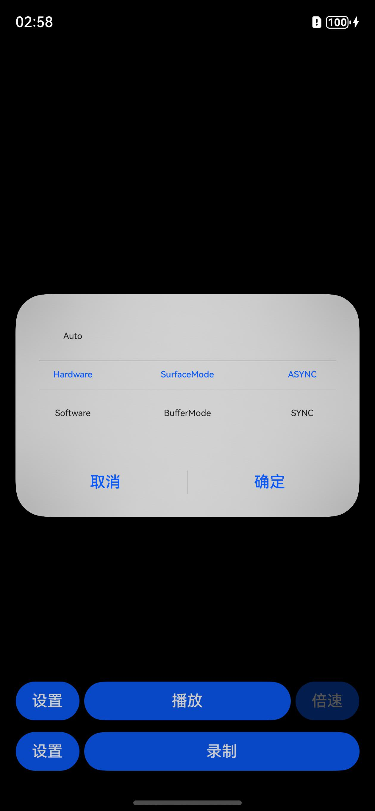
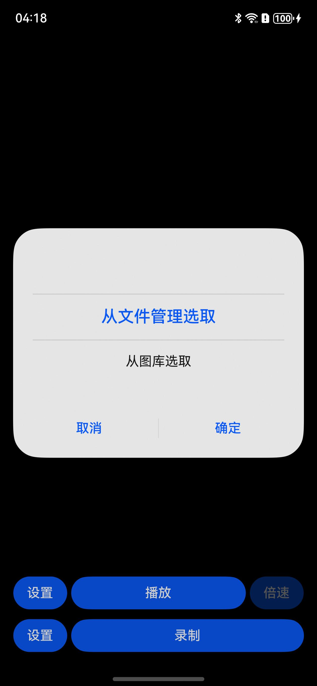
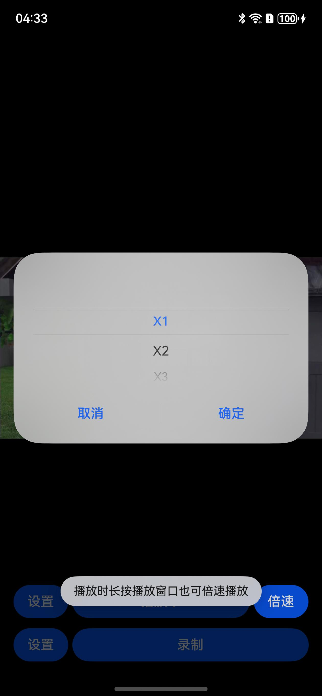
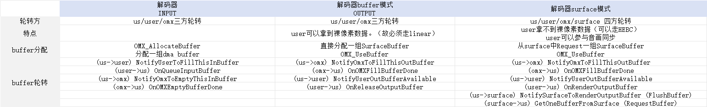
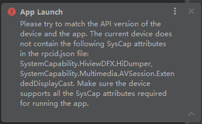

# AVCodecSample

English | [简体中文](./README_zh.md)

### Introduction

AVCodecSample is an API 26 sample for video and audio playback, camera recording, encoding, demuxing, muxing, graphics output, and media lifecycle handling.

- Playback pipeline: media file -> demuxer -> audio/video decoder -> graphics/audio output.
- Recording pipeline: camera and microphone capture -> audio/video encoder -> MP4 or FLV muxer.

### First Run

You do not need to understand every setting before verifying the sample. Start with an H.264 + AAC MP4 file and use this path:

1. Build and install the application with DevEco Studio on a physical device running API 26 or later.
2. Keep the default playback settings: **Automatic**, **SurfaceMode direct output**, **Async**, and decoded-frame dump disabled.
3. Tap **Play**, choose the file from File Manager or Gallery, and confirm that both picture and sound work. This verifies source access, demuxing, decoding, graphics output, and audio output together.
4. Test recording separately by tapping **Record** and granting camera/microphone permission. The default is a compatibility-oriented MP4, H.264, 1080p, 30 fps, and AAC configuration.

Choose non-default playback settings only for a specific reason:

| Goal | Suggested settings | Why |
|---|---|---|
| Regular playback | Automatic + SurfaceMode direct output + Async | The default path avoids an application-level pixel copy and is the preferred performance/power choice. |
| Investigate hardware decode compatibility | Software decoder + SurfaceMode direct output | Helps determine whether a problem is specific to the device hardware decoder; software decode uses more CPU. |
| Inspect pixels, color, or HDR metadata | Automatic + BufferMode copy output | Gives the application access to decoder output, but adds a pixel copy for every presented frame. |
| Export decoded frames | BufferMode copy output + decoded-frame dump | Intended for debugging. Files are written to the app sandbox and should not remain enabled during ordinary playback. |
| Validate the GLES path | Surface-window OpenGL output | Ordinary 8-bit content is decoded to a NativeImage Surface and drawn through an EGL/GLES external texture. If that path cannot be built, the player falls back to decoder-buffer output. HDR Vivid to BT.709 is unavailable in this mode. |
| Validate the Vulkan path | Surface-window Vulkan output | Scales decoder output to the display size, converts it to RGBA, and presents it through a Vulkan Swapchain with rotation-aware aspect-fit. HDR Vivid to BT.709 is unavailable in this mode. |
| High-frame-rate speed playback | Automatic + smart fluency when available | Speed control is always available. Smart fluency depends on the active decoder, device, and SDK. |

### Basic Terms

| Term | Meaning in this sample |
|---|---|
| Container | The file layout, such as MP4, MKV, MPEG-TS, or FLV. One container may contain several audio, video, or subtitle tracks. |
| Codec / elementary stream | The compressed audio/video format, such as H.264, H.265, AAC, or MP3. The player creates a suitable decoder for each selected track. |
| Track | One independent stream in a container, for example one video track or one of four audio tracks. |
| Demuxing | Reading track metadata and compressed samples from a file. This sample uses `OH_AVSource` and `OH_AVDemuxer`. |
| PTS | The media time at which content should play or appear. Progress, subtitles, A/V sync, and seek all use it. |
| SurfaceMode | The decoder sends pictures directly to the XComponent Surface. The application cannot inspect pixels for each frame. |
| BufferMode | The decoder returns output buffers to the application, which copies them to a NativeWindow before presentation. This enables dump and HDR metadata handling. |
| OpenGL mode | Ordinary 8-bit content is decoded to a NativeImage producer Surface. When a frame arrives, the application draws the external texture to the XComponent window. NativeImage or EGL initialization failure falls back to decoder-buffer output. |
| Vulkan mode | The application converts decoder output to RGBA, copies it through a staging buffer, and presents it with an OpenHarmony Vulkan Surface and Swapchain. Initialization failures fall back to BufferMode. |
| Sync / Async codec mode | How codec buffers are obtained: worker-thread queries or callback queues. It does not mean A/V synchronization is disabled in one mode. |
| EOS | End of stream. After input ends, a codec or muxer still needs time to drain buffered output before it is released. |

<a id="feature-navigation"></a>

### Feature Overview and Navigation

Alongside the basic codec APIs, the sample connects file selection, validation, four video output paths, A/V synchronization, speed control, seeking, media information, camera recording, and muxing into a working flow.

#### Playback Features

| Feature | Behavior in this sample | Details |
|---|---|---|
| File selection and validation | Select media from File Manager or Gallery; empty and invalid files produce recognizable errors | [Playback entry and structured configuration](#playback-entry) |
| Demuxing | Reads source and track information such as duration, bitrate, dimensions, frame rate, profile, and codec configuration | [Demuxing](#demuxer) |
| Decoder selection | Supports automatic, hardware, and software decoder selection; automatic mode retries with software decoding after initialization failure | [Video decoding](#video-decoding) |
| Synchronous/asynchronous codec mode | Async mode uses callback queues; sync mode actively queries input and output buffers from worker threads | [Video decoding](#video-decoding) |
| SurfaceMode output | The decoder outputs directly to the XComponent Surface and releases frames at the scheduled render time | [SurfaceMode output](#surface-output) |
| Last-frame behavior on stop | Choose whether SurfaceMode retains the last frame or outputs a blank frame when stopped/destroyed | [SurfaceMode output](#surface-output) |
| BufferMode output | The application obtains decoded buffers, copies them to a NativeWindowBuffer with stride awareness, and submits them through graphics APIs | [BufferMode output](#buffer-output) |
| OpenGL output | Ordinary 8-bit content reaches an EGL/GLES external texture through a NativeImage Surface; decoder buffers are converted to RGBA only after a fallback | [OpenGL/Vulkan output](#gpu-output) |
| Vulkan output | Uploads converted RGBA data through a staging buffer and presents it with a Vulkan Swapchain | [OpenGL/Vulkan output](#gpu-output) |
| BufferMode HDR Vivid | Propagates color space and HDR static/dynamic metadata and displays an HDR Vivid watermark after bitstream confirmation | [HDR Vivid detection and output](#hdr-vivid-output) |
| Decoded-frame dump | BufferMode and Vulkan can save decoded frames in the application sandbox; OpenGL can do so only after it has fallen back from NativeImage Surface output to decoder-buffer output | [Buffer dump](#buffer-dump) |
| Audio decoding and playback | Decodes compressed audio to PCM and continuously feeds AudioRenderer | [Audio decoding and playback](#audio-playback) |
| System audio interruptions and background recovery | Handles calls, audio focus loss, and app background/foreground transitions without mistaking them for codec failures | [Audio interruptions and background recovery](#audio-interruption) |
| Multi-track audio | Lists codec, sample rate, channels, and bitrate; validates a candidate before switching without restarting video | [Audio decoding and playback](#audio-playback) |
| Mute | Mutes or restores the configured volume during playback | [Audio decoding and playback](#audio-playback) |
| External SRT subtitles | Selects an `.srt` file, displays the cue matching playback position, and supports timing, visibility, size, color, background, and position settings | [External subtitles](#subtitle-playback) |
| Press-and-hold speed | Press and hold the playback window for X2; release to return to X1 | [Variable-speed playback](#playback-speed) |
| Speed menu | Select X1, X2, or X3 during playback | [Variable-speed playback](#playback-speed) |
| Smart fluency | Uses ADAPTIVE frame retention at X2/X3 and FULL at X1; thermal events may switch to UNIFORM | [Smart fluency](#smart-fluency) |
| A/V synchronization | Uses the AudioRenderer playback position as the master clock and waits, schedules, or drops video frames | [A/V synchronization](#av-sync) |
| Video transforms | Supports rotation, horizontal/vertical flip, and combined transforms | [Video transforms](#video-transform) |
| Progress and precise seek | Shows current position and duration; merges rapid seek requests, resumes from a sync frame, and discards output before the requested target | [Playback progress and seek](#playback-seek) |
| Playback controls | Supports single-tap pause/resume, double-tap left/right for a 15-second precise seek, control-button pause/resume, previous/next frame, and replay; paused operations update the picture immediately | [Playback progress and seek](#playback-seek) |
| Queue, resume, and recovery | Supports sequential, repeat-one, repeat-all, and shuffle modes; restores position and can retry a runtime failure once | [Playback queue and resume](#playback-queue) |
| Fullscreen and display ratio | Toggle fullscreen/orientation; record a fit-window or fill-window preference while the current NativeWindow path remains aspect-fit | [Fullscreen and display ratio](#display-mode) |
| Playback diagnostics | Inspect output/presented/dropped frames, sync decision offset, PCM/device queues, underruns, interruption count, seek timing, and BufferMode timing | [Playback diagnostics](#playback-diagnostics) |
| A-B loop and frame stepping | Set A/B positions for looping and move one video frame at a time | [A-B loop and frame stepping](#ab-frame-control) |
| Picture-in-picture and background playback | Continue viewing in the system PiP window and optionally enter PiP on home | [Picture-in-picture and background playback](#pip-background) |
| System media controls | Publishes the current item and playback state to AVSession; lock screen, notification center, and headset keys control play/pause, seek, speed, and queue navigation | [System media controls](#av-session) |
| Playback status | Shows state, requested speed, active tracks, and smart-fluency availability | [Playback and media information](#playback-info) |
| Media details | Shows source, track, decoder, output, and raw Source/Track Format information | [Playback and media information](#playback-info) |
| Stop and cleanup | Handles explicit stop, natural completion, and errors through one state machine and release path | [Playback threads and lifecycle](#player-lifecycle) |

#### Recording Features

| Feature | Behavior in this sample | Details |
|---|---|---|
| Camera preview and page navigation | Initializes the encoder Surface on the home page, passes its SurfaceId to the recording page, and creates preview/recording streams | [Camera capture and recording](#camera-recording) |
| Video encoding | Camera frames are sent directly to the encoder Surface; H.264/H.265, sync/async output, bitrate, bitrate mode, and key-frame interval are configurable | [Video encoding](#video-encoding) |
| Audio capture and encoding | AudioCapturer collects PCM, AudioCodec encodes AAC, and the result is written to the muxer; sample rate, channel count, and AAC bitrate are configurable | [Audio capture and encoding](#audio-encoding) |
| HDR Vivid recording | Selects P010 and the corresponding color space when device capabilities support HDR recording | [Camera capture and recording](#camera-recording) |
| MP4/FLV muxing | Concurrently writes encoded audio and video; MP4 also stores rotation metadata | [Muxing](#muxing) |
| Recording finalization | Waits for CameraKit, encoder EOS, muxer release, and output-fd closure before returning | [Recording stop flow](#recording-stop) |
| Automated and device tests | Hypium covers deterministic logic; device tests cover codecs, output, synchronization, recording, and errors | [Testing](#testing) |

Encoder configuration is capability-driven. B-frames are optional and remain disabled by default; this sample neither queries nor writes `VIDEO_ENCODER_B_FRAME`, so devices that do not expose the optional feature do not emit an unnecessary warning or reject the default recording path.

### Playback Capability Summary

| Media type | Containers | Elementary streams |
|---|---|---|
| Video with optional audio | MP4, MKV, MPEG-TS, and other supported containers | Video: hardware AVC/H.264 and HEVC/H.265; software MPEG-2, MPEG-4, H.263, AVC/H.264. Audio: AAC, MP3, FLAC, Vorbis, AMR-NB/WB, G.711 mu-law, and APE |

For the complete list, see [AVCodec supported formats](https://gitcode.com/openharmony/docs/blob/master/en/application-dev/media/avcodec/avcodec-support-formats.md).

This table describes common combinations covered by the sample; it is not a guarantee that every file of the listed type will play on every device. Actual playback also depends on the container, stream format, resolution, frame rate, profile, pixel format, and the currently available hardware/software codec. The player checks capability first and treats codec `Configure()` as the final decision. Unsupported media reports a failure or, in Automatic mode, receives one software-decoder fallback attempt.

### Recording Capability Summary

| Container | Video codec | Audio codec |
|:---:|:---:|:---:|
| MP4 | HEVC/H.265, AVC/H.264 | AAC, MPEG/MP3 |
| FLV | Depends on the selected profiles supported by the device | Depends on the selected profiles supported by the device |

Recording also depends on device capability. The camera profile, encoder's supported resolution/frame-rate/bitrate combination, and selected container must all be valid. The settings page performs the checks that can be queried in advance; Native codec configuration remains the final validation.

### Preview

| Playback settings | Source selection | Playback speed | Recording page |
|---|---|---|---|
|  |  |  |  |

### Usage

Playback does not require camera or microphone permission. Camera and microphone permissions are requested only when the user taps **Record**. The MP4 or FLV container is selected through **Container format** in recording settings; MP4 is the default.

If a permission is denied, the system may prevent the application from showing the same ordinary runtime-permission dialog again. The sample therefore calls `requestPermissionOnSetting()` to open the permission settings dialog and guide the user through granting the missing permission.

Push a media file to File Manager:

```text
hdc file send xx.mp4 storage/media/100/local/files/Docs
```

Push a media file to Gallery and trigger a media scan:

```text
hdc file send xx.mp4 storage/media/100/local/files
hdc shell mediatool send /storage/media/100/local/files/xx.mp4
```

#### Playback

1. Copy an audio-only, video-only, or audio/video file to the device, or record a new file in the sample.
2. Tap **Play**, select File Manager or Gallery, and choose the media file.
3. During playback, tap the video window to pause or resume. Double-tap its left or right half to seek backward or forward 15 seconds. Press and hold it for temporary X2 playback and release for X1, or use the speed menu to select X1/X2/X3.
4. Use the progress slider to preview and seek, the transform control to rotate/flip the output, and the information panel to inspect demuxed metadata.

#### Recording

1. Optionally open recording **Settings** and configure container format, encoder, resolution, frame rate, codec mode, video bitrate, CBR/VBR bitrate mode, key-frame interval, AAC sample rate, channel count, and bitrate.
2. Tap **Record**.
3. Select the output location and tap **Save**.
4. Tap **Start Recording**.
5. Tap **Stop Recording** and wait for the recording page to return after the file has been finalized.

#### Suggested Media

For a first run, use **M01**: an MP4 containing H.264 + AAC at 1920x1080 and 30 fps. It exercises the common audio/video path. The following media make it easier to verify specific features; the complete material list and test steps are in the [manual test cases](./ohosTest.md).

| Goal | Suggested media |
|---|---|
| Audio-only playback | M04: an AAC, MP3, FLAC, or M4A file |
| Non-MP4 demuxing | M05: MKV, or M06: MPEG-TS |
| Portrait video and scaling | M07: portrait media with rotation metadata |
| A/V sync and speed | M08: visible timecode plus spoken time, or M11: 240 fps material |
| HDR Vivid | M13: HDR Vivid video with valid dynamic metadata |
| Precise seek | M16: a long-GOP video with continuous timecode and spoken time |

<a id="testing"></a>

### Testing

Automated tests are located in `entry/src/ohosTest/ets/test` and use Hypium to cover deterministic logic, including:

- time and recording-duration formatting;
- file-selection indexes, bounds, and empty-file checks;
- camera defaults and codec/resolution updates;
- complete parsing and invalid-value rejection for playback and recording settings;
- playback state, speed, track, time, and seek-boundary formatting;
- source, audio/video track, decoder, and raw Format panel formatting;
- playback, recording, container, dump, and NativeWindow transform configuration;
- playback modes, bounded recovery, seek-request merging, subtitle styles, and system audio/background recovery policies.

In DevEco Studio, select the `entry > ohosTest` target and run the test suite. Demuxing, hardware/software codecs, SurfaceMode/BufferMode output, audio sync/async output, permission dialogs, and camera recording depend on real-device capabilities and are covered by the manual test document: [AVCodecSample Manual Test Cases](./ohosTest.md).

The test HAPs can also be built and run from the command line:

```text
hvigorw --mode module -p product=default -p module=entry@ohosTest assembleHap
hdc install -r entry/build/default/outputs/default/entry-default-signed.hap
hdc install -r entry/build/default/outputs/ohosTest/entry-ohosTest-signed.hap
ability_command=$(printf '\141\141')
hdc shell "${ability_command} test -b com.samples.avcodecsample -m entry_test -s unittest OpenHarmonyTestRunner -s timeout 300000"
```

### Project Structure

```text
AVCodec/
├── README.md                                # English sample guide and implementation notes
├── README_zh.md                             # Chinese sample guide and implementation notes
├── ohosTest.md                              # Manual real-device test cases
└── entry/src/
    ├── main/
    │   ├── cpp                              # Native layer
    │   │   ├── capabilities                 # Media capability wrappers and implementations
    │   │   │   ├── include                  # Codec, muxer, and demuxer interfaces
    │   │   │   ├── audio_capturer.cpp       # Audio capture
    │   │   │   ├── audio_decoder.cpp        # Audio decoding
    │   │   │   ├── audio_encoder.cpp        # Audio encoding
    │   │   │   ├── demuxer.cpp              # Demuxing
    │   │   │   ├── muxer.cpp                # Muxing
    │   │   │   ├── video_decoder.cpp        # Video decoding
    │   │   │   └── video_encoder.cpp        # Video encoding
    │   │   ├── common                       # Shared Native utilities
    │   │   │   ├── dfx                      # Logging and error codes
    │   │   │   ├── codec_buffer.h           # Codec buffer description and thread-safe queue
    │   │   │   ├── codec_user_data.h        # Runtime context shared by callbacks and workers
    │   │   │   ├── sample_callback.cpp      # Codec and AudioRenderer callbacks
    │   │   │   ├── sample_callback.h        # Shared callback declarations
    │   │   │   ├── sample_config.h          # Source, media, codec, and output options
    │   │   │   └── sample_info.h            # Compatibility aggregate for shared media types
    │   │   ├── render                       # XComponent and NativeWindow output
    │   │   │   ├── include                  # Graphics output interfaces
    │   │   │   ├── plugin_manager.cpp       # XComponent/window management
    │   │   │   └── plugin_render.cpp        # Surface lifecycle and interactions
    │   │   ├── sample/
    │   │   │   ├── player/                  # Native player module
    │   │   │   │   ├── core/                # Player control, lifecycle, and seek coordination
    │   │   │   │   │   ├── Player.cpp/.h    # Public controls, queries, and audio-track switching
    │   │   │   │   │   ├── PlayerLifecycle.cpp # Initialization and decoder/worker startup
    │   │   │   │   │   ├── PlayerRelease.cpp # Release worker and native resource teardown
    │   │   │   │   │   └── PlayerSeek.cpp   # Precise seek, pause handling, and resource rebuild
    │   │   │   │   ├── output/              # Audio/video output and presentation
    │   │   │   │   │   ├── audio/           # Audio output workers and PCM pump
    │   │   │   │   │   │   ├── AudioOutputPump.cpp/.h
    │   │   │   │   │   │   └── PlayerAudioOutput.cpp
    │   │   │   │   │   ├── pipeline/        # Decoder worker lifecycle helpers
    │   │   │   │   │   │   ├── AudioPipeline.h
    │   │   │   │   │   │   └── VideoPipeline.cpp/.h
    │   │   │   │   │   └── video/           # Video scheduling and presentation
    │   │   │   │   │       ├── PlayerVideoPresentation.cpp
    │   │   │   │   │       ├── PlayerVideoOutput.cpp
    │   │   │   │   │       ├── sink/        # Surface/Buffer presentation strategies
    │   │   │   │   │       │   ├── VideoSink.h
    │   │   │   │   │       │   ├── SurfaceVideoSink.h
    │   │   │   │   │       │   └── BufferVideoSink.h
    │   │   │   │   │       ├── renderer/    # NativeWindow copy and HDR metadata
    │   │   │   │   │       │   ├── BufferRenderer.cpp/.h
    │   │   │   │   │       │   └── HdrMetadataHelper.cpp/.h
    │   │   │   │   │       └── gpu/         # YUV/RGBA conversion and GPU backends
    │   │   │   │   │           ├── VideoFrameConverter.cpp/.h
    │   │   │   │   │           ├── OpenGLVideoSink.cpp/.h
    │   │   │   │   │           └── VulkanVideoSink.cpp/.h
    │   │   │   │   ├── sync/                # Playback clock and synchronization policies
    │   │   │   │   │   ├── PlaybackClock.cpp/.h, AvSyncController.cpp/.h
    │   │   │   │   │   ├── PlaybackDiagnostics.cpp/.h
    │   │   │   │   │   ├── SeekController.cpp/.h
    │   │   │   │   │   └── PlayerStateMachine.cpp/.h
    │   │   │   │   └── napi/                # ArkTS-to-Native boundary
    │   │   │   │       ├── PlayerNative.cpp/.h
    │   │   │   │       ├── NativePlayerContext.h, PlayerAsyncSeek.cpp
    │   │   │   │       ├── PlayerNapiParser.cpp/.h
    │   │   │   │       └── PlayerNapiSerializer.cpp/.h
    │   │   │   └── recorder/
    │   │   │       ├── Recorder.cpp         # Recording lifecycle and data flow
    │   │   │       └── RecorderNative.cpp   # Recording NAPI entry
    │   │   ├── types                        # ArkTS declarations for Native modules
    │   │   └── CMakeLists.txt               # Native build entry
    │   ├── ets                              # ArkTS UI and application logic
    │   │   ├── common                       # Constants and utilities
    │   │   ├── entryability/EntryAbility.ets
    │   │   ├── model                        # UI state and settings models
    │   │   │   ├── CameraDataModel.ets      # Camera recording settings
    │   │   │   ├── MediaInfoModel.ets       # Media information formatting
    │   │   │   ├── PlaybackInfoModel.ets    # Playback status formatting
    │   │   │   ├── PlaybackHistoryModel.ets # Playback queue and resume history
    │   │   │   ├── PlaybackModeModel.ets, PlaybackRecoveryModel.ets
    │   │   │   ├── PlayerSettingsModel.ets  # Playback settings and NAPI options
    │   │   │   ├── SubtitleStyleModel.ets
    │   │   │   └── RecorderSettingsModel.ets # Recording settings parsing
    │   │   ├── controller
    │   │   │   ├── PlaybackSessionController.ets # AVSession metadata and system controls
    │   │   │   └── SeekRequestController.ets
    │   │   ├── viewmodel                    # Playback state ViewModel
    │   │   │   └── PlaybackViewModel.ets    # Polling, progress, HDR, and reset state
    │   │   ├── components                   # Reusable UI components
    │   │   │   ├── AvDiagnosticsPanel.ets
    │   │   │   ├── MediaInfoPanel.ets       # Scrollable media information panel
    │   │   │   ├── PlaybackProgressPanel.ets # Status, slider, and seek preview
    │   │   │   └── SubtitleSettingsPanel.ets
    │   │   ├── pages/Index.ets              # Home, playback, and recording entry
    │   │   └── recorder/pages/Recorder.ets  # Camera preview and recording page
    │   ├── resources                        # Localized resources
    │   └── module.json5
    └── ohosTest/                            # Hypium test module
        ├── ets/test
        │   ├── CameraDataModel.test.ets     # Camera configuration model tests
        │   ├── CommonConstants.test.ets     # Playback and recording constants tests
        │   ├── DateTimeUtil.test.ets        # Time formatting tests
        │   ├── List.test.ets                # Suite entry
        │   ├── MediaInfoModel.test.ets      # Media information formatting tests
        │   ├── MediaUtils.test.ets          # File selection and empty file tests
        │   ├── PlaybackInfoModel.test.ets   # Playback status and seek formatting tests
        │   ├── PlaybackHistoryModel.test.ets # Playback queue/history helper tests
        │   ├── PlaybackPolicy.test.ets       # Mode, recovery, and subtitle-style tests
        │   ├── PlaybackViewModel.test.ets   # Playback ViewModel state tests
        │   ├── PlayerSettingsModel.test.ets # Playback setting model tests
        │   ├── SubtitleModel.test.ets       # SRT parsing and cue lookup tests
        │   ├── SeekRequestController.test.ets # Seek coalescing and cancellation tests
        │   ├── RecorderSettingsModel.test.ets # Recording setting model tests
        │   └── TestCaseLogger.ets           # Case naming and Hilog helper
        ├── ets/testability                  # Test Ability and page
        ├── ets/testrunner                   # OpenHarmony test runner
        ├── resources
        └── module.json5
```

### Implementation

#### End-to-End Architecture

An operation follows this path: **the UI selects a scenario -> ArkTS prepares options and Surfaces -> Native creates media objects -> worker threads move input/output buffers -> graphics, audio, or file consumers receive the result**.

| Scenario | UI entry | Native entry | Main modules | Destination |
|---|---|---|---|---|
| Playback | Play controls and XComponent in `Index.ets` | `PlayerNative.cpp`, `Player.cpp` | `Demuxer`, `VideoDecoder`, `AudioDecoder`, `AudioOutputPump`, `BufferRenderer`, `PluginRender` | Video to XComponent/NativeWindow; PCM to AudioRenderer |
| Recording | Record controls in `Index.ets`; preview in `Recorder.ets` | `RecorderNative.cpp`, `Recorder.cpp` | `VideoEncoder`, `AudioCapturer`, `AudioEncoder`, `Muxer` | Camera video and microphone audio to MP4/FLV |
| Graphics output | XComponents on playback/recording pages | `PluginManager`, `PluginRender`, `BufferRenderer` | Native XComponent, NativeWindow, NativeBuffer | Direct codec output in SurfaceMode; application copy in BufferMode |
| Demuxing | Selected source file | `Demuxer.cpp` | `OH_AVSource`, `OH_AVDemuxer` | Track metadata and compressed samples to decoders |
| Muxing | Media-library output file | `Muxer.cpp` | `OH_AVMuxer` | Encoded audio/video to the destination file |

The Native layer revolves around these data structures:

- `SampleInfo`, defined in `sample_config.h`, groups source, video, audio, codec, output, and playback-callback options.
- `CodecUserData`, defined in `codec_user_data.h`, is the runtime context shared by codec callbacks and worker threads. `Player` owns playback contexts with `unique_ptr`; C callbacks receive temporary non-owning pointers from `.get()`.
- `CodecBufferInfo` and `CodecBufferQueue`, defined in `codec_buffer.h`, package codec buffer data and provide the thread-safe handoff queue. `sample_info.h` remains as a compatibility aggregate for existing includes.
- `SampleCallback` receives async `OnNeedInputBuffer` and `OnNewOutputBuffer` callbacks and enqueues work in `CodecUserData`.
- `AudioOutputPump` unifies asynchronous queue consumption and synchronous output queries, appends PCM to `renderQueue`, and delegates buffer release and clock accounting to `Player`.

These objects describe what may be used for the current handoff; they do not take ownership of SDK buffers. `CodecBufferInfo` keeps the borrowed `OH_AVBuffer*`, the index required to return it, and an attribute snapshot. It never caches a pixel address or destroys an `OH_AVBuffer`. Once an input sample has been submitted, the application no longer accesses that input buffer. An output buffer is readable only while it is being presented, dumped, or converted to PCM. Seek, Stop, and Surface destruction first unblock queue waits and wait for workers to exit, then release codecs and clear queues. A late callback can therefore observe an invalidated context, but cannot continue into a destroyed player or window.

#### Playback and Recording Flow

The later sections describe individual modules and APIs. This section follows one user operation from the page to Native processing and back again. The page prepares input and renders results; Native creates media objects, schedules workers, and releases resources. On failure, the page becomes usable again and Native does not keep a partially initialized codec or worker.

| Feature | Trigger and input | Main processing | Completion, failure, and state boundary |
|---|---|---|---|
| Open media | The user confirms a File Manager or Gallery item | The UI validates its size, opens an fd, builds `PlayOptions` from `PlayerSettingsModel`, and `PlayerNative` parses it before `Player::Init()` | Cancelling only dismisses the picker; an empty file is reported by the UI; source creation, demuxing, capability, or decoder failures return `error` without leaving playback workers half initialized |
| Demuxing and media information | Native receives the fd, offset, and size | `OH_AVSource` reads the source format, `OH_AVDemuxer` enumerates tracks, and the sample stores structured fields plus copied raw Format text | The panel reads an immutable snapshot instead of rereading the file during playback; initialization fails cleanly if no playable audio or video track exists |
| Video decoding | A video track and playback settings are selected | The player creates an automatic, hardware, or software decoder, writes capability-validated fields, and continuously moves compressed input and decoded output through Sync or Async workers | Automatic mode tries software once only after its initial create/capability/configure failure; an explicit hardware failure remains visible and is not silently changed to software |
| Video presentation | A decoder produces an output buffer | `AvSyncController` decides whether to wait, present now, or drop; `VideoSink` then uses a Surface or Buffer copy path | Every codec output buffer is returned whether it is presented, dropped, or fails to present; a destroyed Surface clears its non-owning window reference before later frames are released |
| HDR Vivid and dump | BufferMode receives a decoded frame | `HdrMetadataHelper` checks and propagates color/HDR metadata; an enabled dump writes valid image rows before presentation | Metadata propagation is an enhancement: an unsupported metadata operation keeps normal pixel presentation; dump never extends the lifetime of a codec buffer |
| Audio and audio tracks | Demuxing finds audio, or the user selects another track | AudioDecoder produces PCM, `AudioOutputPump` queues it under lock, and the AudioRenderer callback consumes it; track switching performs a temporary Create + Configure probe first | A failed probe does not remove the current decoder, renderer, or clock, so sound and seek continue; a successful switch rebuilds only the audio path and does not restart video |
| Subtitles | The user selects an external `.srt` file | The UI parses cue start/end times and text, then maps the polled playback position plus subtitle offset to the active cue | Read, syntax, or timeline errors only produce a prompt and do not change Native playback; media changes, Stop, and no active cue clear the overlay |
| Speed, smart fluency, and sync | A press-and-hold gesture or X1/X2/X3 selection | The page sends a target speed; supported X2/X3 playback uses ADAPTIVE retention; `PlaybackClock` builds an audio-master timeline from AudioRenderer timestamps | Retention does not rewrite PTS or represent audio speed; with audio, video wait/drop follows actual audio progress, while video-only playback advances from presented video PTS |
| Pause, frame step, and seek | Pause, +/-15 seconds, slider, or frame-step control | Pause keeps decoders alive while stopping the renderer; seek stops workers, seeks from a previous sync frame, rebuilds paths, discards early video, and trims early PCM | A seek failure enters the common release path; paused frame steps temporarily permit the target video frame to present while audio remains paused, updating picture, position, and diagnostics immediately |
| Queue, resume, and A-B loop | Multi-file selection, reopening history, or setting A/B | Natural EOS advances the in-session queue; preferences store positions; reaching B invokes the same precise seek back to A | Explicit Stop and errors do not advance the queue; near-end history restarts at zero; changing media, Stop, or clearing markers turns off A-B looping |
| Display, PiP, and control hiding | Fullscreen/ratio/PiP selection or inactivity | The UI changes window layout, orientation, and control visibility; PiP reuses the XComponent controller and forwards system actions to the player | Display selection does not alter decoded pixels or timestamps; PiP failures are visible but leave page playback intact; every playback-window tap or control action resets the auto-hide timer |
| System media controls | Lock screen, notification center, or headset media keys | `PlaybackSessionController` mirrors the existing Native state into `AVSession` and forwards system commands to page controls | Session errors are logged without interrupting local playback; Stop and page destruction deactivate and destroy the session |
| Diagnostics, state, and release | Polling, EOS, Stop, or error | Native atomics build a read-only snapshot, the state machine validates transitions, and `ReleaseWorker` stops workers and releases renderer/codecs in a fixed order | Diagnostics never affect scheduling; repeated Stop is safe; the completion callback is invoked outside the Player mutex to avoid re-entrant UI deadlocks |
| Camera recording and muxing | The user confirms recording settings and permissions | The UI creates a media-library fd; preview and encoder Surfaces split camera output; audio/video encoder output is serialized through the Muxer | Camera and codec capability checks happen before recording; Stop waits for both EOS paths and muxer finalization before closing the fd |

**Playback initialization.** After a file is selected, the UI opens an fd and sends the valid byte range as offset and size. Gallery and File Manager sources therefore share the same Native input path. `PlayerNapiParser` validates each field before filling the responsibility-oriented `SampleInfo` members. `Player::Init()` accepts only `IDLE`: it creates the source and demuxer, freezes the media snapshot, chooses tracks, creates decoders/AudioRenderer/output policy, and enters `READY` after the required steps succeed. Any earlier failure follows the same cleanup path and returns a reason to ArkTS, so the next task cannot reuse partial objects.

**Decoder and queue flow.** In Async mode, framework callbacks only enqueue buffer indexes and pointers. They never perform file I/O, sleep, or graphics work on a codec callback thread. In Sync mode, workers query buffers themselves. Both paths converge on the same input, output, and release routines. An input worker reads a compressed Demuxer sample, preserves its PTS, flags, and EOS marker, then pushes it to the codec. An output worker recognizes EOS, seek preroll, and normal frames before it schedules or presents them. Queue closure, errors, Stop, and Surface destruction wake waiting workers so no thread waits indefinitely for a buffer that can no longer arrive.

**Graphics and buffer ownership.** In SurfaceMode, decoded image ownership remains between the decoder and the Surface; the application only chooses render or free. In BufferMode, the application borrows a decoder buffer only while processing that output callback and must not retain its address for a later frame. `BufferRenderer` requests a separate NativeWindow destination buffer, waits for its fence, maps it, copies rows, unmaps it, sets a desired presentation time, and flushes it. The destination has then returned to the graphics system and the source immediately returns to the decoder. There is no attach/detach or cross-frame shared ownership, so completion of display cannot block codec buffer reuse.

**Audio master clock.** Writing PCM into `renderQueue` does not mean it has played. Only complete sample frames actually removed by the AudioRenderer write callback increment `audioFramesWritten`. The player combines the renderer timestamp, hardware-consumed frames, and a monotonic-clock anchor to estimate played media time. During renderer startup, route changes, or after Flush, timestamp data may be unstable; the player temporarily uses the nominal video interval rather than using invalid values to drop frames. Video that is far behind audio is dropped and early video waits near its presentation time. All wall-clock waits divide media-time differences by requested speed, preventing X2/X3 from treating media time as real time.

**Playback controls.** A playback-window tap reuses the pause/resume operation only when Native state is `PLAYING` or `PAUSED`; it is ignored during seek, stop, and before a task starts. It shares an exclusive gesture group with press-and-hold speed, so holding the window changes speed without also pausing playback. While the slider is dragged, the UI owns an independent preview position and thumbnail, so periodic real-position polls cannot overwrite the gesture. Releasing the slider submits exactly one Native seek. Thumbnails use a separate fd and `AVImageGenerator`, completely isolated from the active Demuxer/Decoder path. Rewind, forward, replay, previous frame, and next frame reuse precise seek instead of merely changing a UI label or skipping output buffers. Subtitles, A-B looping, diagnostics, queue logic, and resume persistence all observe the same playback position.

##### Entry Points from UI to Native

These are the main entry points to follow in code. Besides logs, Media information, Playback diagnostics, current position, control state, and prompts show whether the expected path is active.

1. **Transactional settings application.** When `Index.ets` opens playback or recording settings, it copies current values into a temporary bottom-sheet model instead of changing a live model. Pickers, switches, and sliders modify only temporary values. Pressing **Apply** lets `PlayerSettingsModel` or `RecorderSettingsModel` parse and validate the whole set before it writes page state. Cancelling, changing media while a sheet is open, or rejecting one invalid parameter combination therefore cannot send a partial configuration to Native. Volume can be applied immediately through `setVolume`; options that change codec or AudioRenderer creation take effect on the next playback.

2. **Media snapshot construction and display.** `Demuxer::Create()` reads the Source Format before reading each Track Format. Structured fields fill `MediaSourceInfo`, `VideoSampleInfo`, and an audio-track snapshot, while each `OH_AVFormat_DumpInfo()` result is copied immediately because the SDK's returned address cannot be retained. `PlayerNapiSerializer` converts this frozen result to `MediaInfo`, and `MediaInfoModel` renders source, video, audio, decoder/output sections. Opening **Info** therefore does not compete with the demux worker or put large Format strings into the 250 ms live polling path.

3. **Track selection and input advancement.** The first valid video and audio tracks are retained as container track IDs. The corresponding input workers call `OH_AVDemuxer_ReadSampleBuffer()` independently; they must not alternate reads through a shared track ID. Each sample's `pts`, `size`, `offset`, and `flags` pass unchanged with the input buffer to its decoder. EOS is also pushed as a normal input buffer flag, allowing an output worker to finish only after a codec has drained its internal frames. Multi-track switching reads and probes a candidate format first, then changes the audio selection only after that probe succeeds.

4. **Decoder creation and software fallback.** Automatic selection first uses the system-recommended decoder and validates size, rate, and pixel format using that decoder's own capability object. Only a create failure, missing capability, or failed `Configure` destroys that failed instance and triggers a single SOFTWARE-category query/create/validation attempt. The outcome is stored in playback diagnostics and media information. It is not retried per frame and never overrides an explicit hardware/software choice. Optional keys such as low latency, decoding-order output, and blank-on-shutdown are written only where their mode and capability preconditions hold, so an unsupported enhancement does not become a general playback failure.

5. **Unified Sync/Async output.** Async callbacks use `SampleCallback` to place `CodecBufferInfo` in `inputBufferQueue` or `outputBufferQueue`; Sync workers issue interruptible timeout queries. `VideoPipeline` and `AudioPipeline` only encapsulate thread creation, startup rollback, and joining; they do not change the codec-mode policy. Regardless of origin, a video frame reaches `ProcessVideoWithAudio()` or `ProcessVideoWithoutAudio()`, while audio reaches `AudioOutputPump`. Normal frames, EOS, seek preroll, and errors all converge on the same output-buffer return point.

6. **SurfaceMode, BufferMode, and transforms.** SurfaceMode obtains the active XComponent window from `PluginManager` before preparing the decoder and calls `OH_VideoDecoder_SetSurface()`; the output frame is handed off with render/free APIs. BufferMode deliberately does not set this Surface, allowing `BufferVideoSink` to read `OH_AVBuffer` image contents and delegate the copy to `BufferRenderer`. Rotation and mirroring change composition through the current window's `SET_TRANSFORM` hint; they do not re-encode frames or change dump files. Output mode changes apply before the next playback rather than changing decoder-buffer ownership midstream.

7. **HDR, color, and diagnostics counter scope.** `HdrMetadataHelper` confirms HDR Vivid only when a frame both declares the HDR Vivid type and carries non-empty dynamic metadata. A container Format declaration is exposed in media information but cannot independently enable the watermark. After confirmation, BufferMode transfers readable color-space and static/dynamic metadata to the destination NativeBuffer. A failed metadata write degrades only that enhancement and does not prevent pixel flush. BufferMode's copy/present count, average time, and failure count cover actual `VideoSink::Present()` work only; dropped and seek-preroll frames are excluded, and a Stop or new task resets the atomics.

8. **Audio queue, mute, and track switching.** Decoded PCM is checked against offset, size, and capacity before entering the byte queue protected by `renderQueueMutex`. When AudioRenderer asks for bytes, `OnRenderWriteData()` copies only present data and fills the remainder with silence; that generated silence is not counted as media samples. Mute adjusts renderer volume without stopping input or the clock. A failed audio initialization falls back to video-only playback when a valid video track exists; an audio-only file still reports initialization failure. After a track switch, PCM before the current position is discarded; the first playable segment establishes the new clock, so video cannot mistake an old-track timestamp for progress on the new track.

9. **Speed, smart fluency, and thermal policy.** `setPlaybackSpeed()` updates the target speed used by both audio output and video scheduling. When the active decoder supports smart fluency, X2/X3 send ADAPTIVE plus the speed key and X1 returns to FULL. A thermal callback uses UNIFORM and a retention ratio only when load reduction is needed, then restores the user-requested speed policy. The application never treats the number of frames retained as audio speed and never rewrites PTS for 240 fps input; RenderService's own refresh-rate limit remains handled by `renderAtTime`.

10. **Seek, thumbnails, frame step, and A-B.** Native seek starts from the sync frame before the target so dependent reference frames can be decoded. Video before the target is released, and audio before it is discarded or trimmed; neither is displayed or dumped. UI thumbnails use a separate `AVImageGenerator`, apply media rotation to preview orientation and container ratio, and simply hide the preview on failure. Previous/next frame derive a target from frame rate and preserve pause state. Reaching B calls the same seek API back to A, so diagnostics, subtitles, and progress share one actual position.

11. **Queue, history, fullscreen, PiP, and auto-hide.** `PlaybackHistoryModel` stores recent position, duration, and update time per URI with throttled writes; a position is restored only after a new playback initializes successfully. Fullscreen changes window layout and orientation while retaining the same control-event handlers. PiP playback, pause, forward, and rewind callbacks map to those handlers too. A single XComponent tap only toggles `PLAYING`/`PAUSED`, while a press-and-hold remains the speed gesture. Auto-hide changes only ArkUI visibility and never stops Native workers; tapping or long-pressing XComponent, dragging progress, or pressing any control shows the UI again and resets the five-second timer.

12. **State, recovery, and release order.** `PlayerStateMachine` rejects illegal calls such as a repeated Start or Seek in an error state, while `Player` exposes the resulting state for UI controls. After output has started, the page may restore the same file once after a runtime error. Diagnostics retain the recovery reason, attempt count, and result; startup failures, manual Stop, and page exit never count as recovery. `ReleaseWorker` sets stop flags and notifies every condition variable, joins video/audio workers, marks `CodecUserData` as destroying, and then releases AudioRenderer, its builder, decoders, BufferRenderer, and dump files. The completion callback is posted to ArkTS outside the player lock, so immediately selecting the next item, refreshing UI, or destroying the page cannot deadlock with Native cleanup.

#### Codec Capability Checks and Configuration Feedback

Before writing supported codec parameters to an `OH_AVFormat`, the sample queries the capability of the codec that will actually be used. `OH_AVCodec_GetCapability()` is used for the recommended codec; selecting a hardware or software video decoder uses `OH_AVCodec_GetCapabilityByCategory()` with the matching category. The shared `CodecCapability` module checks video size, size/frame-rate combinations, pixel formats, encoder bitrate mode/range and profile, plus audio sample-rate lists and channel-count ranges.

Capability objects are owned by the framework and are not destroyed by the sample. A failed query or unsupported value stops configuration before the format is submitted and logs the MIME type, direction, category, and offending value. Recording initialization propagates this failure to ArkTS, which tells the user to adjust the codec, resolution, or frame rate. Rotation, sync mode, HDR Vivid metadata, codec configuration bytes, and similar fields have no generic capability query in the Native API; their codec configure return value remains the final check and its error code is logged.

The playback settings expose `OH_MD_KEY_VIDEO_DECODER_BLANK_FRAME_ON_SHUTDOWN`, which selects whether SurfaceMode keeps the last frame or outputs a blank frame when stopped or destroyed. `OH_MD_KEY_ENABLE_SYNC_MODE` follows the Sync/Async selection. Smart-fluency retention mode, target speed, and thermal retention ratio remain runtime policies.

Advanced settings include low-latency decoding, decoding-order output, and HDR Vivid to BT.709 conversion. The first two are checked with `OH_AVCapability_IsFeatureSupported()` before configuration; unsupported codec/device combinations are rejected with a recorded reason. The color-space key `OH_MD_KEY_VIDEO_DECODER_OUTPUT_COLOR_SPACE=OH_COLORSPACE_BT709_LIMIT` is sent only for HDR Vivid media using a decoder Surface. OpenGL's direct NativeImage path and Vulkan's Buffer/Swapchain path do not offer a general HDR Vivid-to-BT.709 conversion contract, so the setting is disabled for those modes rather than relying on an application-side 4K HDR conversion. Requested decoder format and actual output format are retained separately: a Seek rebuild uses the original request, while presentation and dump use the decoder-reported output.

Two API 26 capabilities are enabled by default in the Native build:

- `AVCODEC_SAMPLE_ENABLE_SMART_FLUENCY` for playback frame-retention, speed, and thermal parameters.
- `AVCODEC_SAMPLE_ENABLE_TEMPORAL_LAYER_ID` for reading temporal-layer IDs from encoded video output.

When building with an older Native SDK that does not provide these APIs, disable them with `-DAVCODEC_SAMPLE_ENABLE_SMART_FLUENCY=OFF` or `-DAVCODEC_SAMPLE_ENABLE_TEMPORAL_LAYER_ID=OFF`.

<a id="playback-entry"></a>

#### Playback Entry and Structured Configuration

The UI uses ArkUI's declarative programming model. `Index.ets` is the home and playback page, while `Recorder.ets` is the camera preview and recording page. Both are declared in `main_pages.json`:

```json
{
  "src": [
    "pages/Index",
    "recorder/pages/Recorder"
  ]
}
```

The home page provides both playback and recording entry points:

- Playback uses `XComponent({ id: 'player', type: XComponentType.SURFACE, libraryname: 'player' })`. Loading `libplayer.so` lets the Native module unwrap the XComponent and register Surface callbacks through `PluginManager::Export()`.
- Playback settings are displayed in a scrollable ArkUI `bindSheet`. Decoder type, output mode, and codec mode each occupy one row and open a single-column picker. Decoded-frame dump uses a switch. User-facing labels such as **Automatic**, **Hardware decoder**, **Software decoder**, **SurfaceMode direct output**, and **BufferMode copy output** are mapped to the original Native enum values.
- Opening the settings sheet creates a temporary copy of `PlayerSettingsModel`. **Apply** validates and commits the settings, **Cancel** discards the temporary copy, and **Restore Defaults** resets only the temporary values until Apply is selected. Audio volume is available from 0% to 100% and is applied immediately to the active output through `OH_AudioRenderer_SetVolume()`. Audio output latency can be Normal or Low and is applied through `OH_AudioStreamBuilder_SetLatencyMode()` when the next AudioRenderer is created. Low latency reduces output buffering but increases underrun risk.
- The **Auto-hide playback controls** switch applies to both normal and fullscreen modes: controls and the progress bar hide after five seconds of inactivity and reappear when the playback surface is tapped or long-pressed; disabling it keeps them visible.
- After a source is selected, ArkTS opens the URI with `fileIo.openSync()`, records the fd and file size, and calls the structured `player.play(options, callback)` API.
- The completion callback returns `{ success, reason }`, where `reason` is `completed`, `stopped`, or `error`. Only an actual error produces the invalid-media prompt.
- During playback the main button becomes **Stop**. `player.stop()` moves the UI into a stopping state until the shared Native release path invokes the completion callback.
- `player.getPlaybackInfo()` refreshes state, speed, position, duration, tracks, smart-fluency availability, and confirmed HDR Vivid state.
- `player.getMediaInfo()` opens a scrollable panel containing source, video track, audio track, decoder/output settings, raw Source Format, and raw Track Format sections.
- A translucent **HDR Vivid** watermark is displayed near the upper-right corner only after both `OH_VIDEO_HDR_VIVID` and non-empty `OH_HDR_DYNAMIC_METADATA` are read from an actual output Buffer. BufferMode reads the decoder output directly. Direct Surface output performs a best-effort check of the XComponent's latest flushed Buffer after rendering. A missing result never enables the watermark.
- Press-and-hold temporarily calls `player.setPlaybackSpeed(2)`. The speed menu can select X1, X2, or X3. When smart fluency is available, X2/X3 is identified as smart-fluency playback.
- Transform controls call `player.setTransform(transformHint)`, which applies `SET_TRANSFORM` to the active NativeWindow.

The structured `PlayOptions` object has the following shape:

```ts
{
  inputFileFd,
  inputFileOffset,
  inputFileSize,
  videoDecoderType,
  videoDecoderRunMode,
  videoDecoderSyncMode,
  isSmartFluencySupported,
  enableVideoDump,
  retainLastFrame,
  enableLowLatency,
  outputInDecodingOrder,
  convertHdrVividToBt709,
  audioVolume,
  enableAudioLowLatency
}
```

Audio playback settings also expose volume (0–100%), applied immediately through `OH_AudioRenderer_SetVolume()`, and Normal/Low output latency, applied with `OH_AudioStreamBuilder_SetLatencyMode()` when the next `AudioRenderer` is created. Low latency reduces buffering but may increase underrun risk. Track-derived sample rate, channel count, channel layout, and sample format are not overridden by the UI.

`PlayerNapiParser` reads named fields and fills `SampleInfo`. `PlayerNative` retains NAPI registration,
completion-callback dispatch, and the calls to `Player::Init()` / `Player::Start()`. `PlayerNapiSerializer` converts
playback results, playback state, and media information into ArkTS objects. This keeps parsing, serialization, and
playback orchestration independent while preserving the existing NAPI contract.

<a id="recording-entry"></a>

#### Recording Entry, Page Navigation, and Interaction

Recording also starts from `Index.ets`:

- A separate scrollable settings sheet, sized to 85% of the screen, groups recording options into Container and output, Video encoding, Audio encoding, and Encoding control. Users select MP4 or FLV, video parameters, AAC sample rate/channel count/bitrate, audio capture latency, video stabilization, and sync/async mode there. `RecorderSettingsModel` validates all temporary values and updates `CameraDataModel` only when **Apply** is selected.
- `checkIsProfileSupport()` queries `camera.getCameraManager()` for the selected video profile. Unsupported settings fall back to 1080p, or to the first device-supported profile if 1080p is unavailable.
- `photoAccessHelper.createAsset()` creates the destination media asset and `fileIo.open()` obtains the output fd.
- `recorder.initNative(...)` creates the encoder and muxer. `OH_NativeWindow_GetSurfaceId()` returns the encoder input SurfaceId.
- The home page navigates with `getUIContext().getRouter().pushUrl()` and passes `CameraDataModel`, including the encoder SurfaceId, to `recorder/pages/Recorder`.

The recording page connects the camera to two Surfaces:

- XComponent `.onLoad()` obtains the preview SurfaceId.
- `createRecorder()` creates CameraManager, CameraInput, VideoSession, preview output, and recording output.
- The preview stream targets the XComponent Surface.
- The recording stream targets the Native encoder Surface.
- Starting recording first enables camera video output and then starts the Native muxer, video encoder, AudioCapturer, and audio encoder.
- Stopping waits for camera output and `frameEnd`, then runs `stopBeginNative()` and `stopEndNative()`. The output fd is closed and the camera is released after encoder EOS and muxer finalization.

<a id="graphics-output"></a>

#### Graphics Output and XComponent

Graphics output is implemented by ArkUI XComponent plus Native `PluginManager`, `PluginRender`, and `BufferRenderer`.

When `libplayer.so` is loaded, `PluginManager::Export()`:

1. Reads `OH_NATIVE_XCOMPONENT_OBJ` from the NAPI exports object.
2. Calls `napi_unwrap()` to obtain `OH_NativeXComponent*`.
3. Reads the component ID with `OH_NativeXComponent_GetXComponentId()`.
4. Stores the framework-owned XComponent as a non-owning pointer and creates the matching `PluginRender`.
5. Registers Surface lifecycle callbacks.

Important callbacks:

- `OnSurfaceCreatedCB()` stores the framework-owned `OHNativeWindow*` as a non-owning reference and configures `OH_SCALING_MODE_SCALE_FIT_V2`.
- `OnSurfaceChangedCB()` records the new offset, width, and height.
- `OnSurfaceDestroyedCB()` clears the window reference and releases the corresponding render wrapper. Framework-owned XComponent and NativeWindow objects are not destroyed by the sample.
- Touch callbacks implement press-and-hold speed changes.

<a id="surface-output"></a>

##### SurfaceMode Output

SurfaceMode passes the current XComponent NativeWindow to `OH_VideoDecoder_SetSurface()`. Decoder output buffers circulate between the codec and Surface; the application receives buffer metadata but not the decoded image address. After A/V scheduling, the sample calls `OH_VideoDecoder_RenderOutputBufferAtTime()` to release the frame for display at the requested monotonic timestamp, or frees it without rendering when the frame must be dropped.

This path avoids an application-side pixel copy. It cannot directly dump decoded pixels or inspect per-frame image metadata because the actual image buffer remains in the codec/Surface pipeline.

<a id="buffer-output"></a>

##### BufferMode Output

BufferMode configures the decoder without a Surface. The application obtains the decoded `OH_AVBuffer`, validates its dimensions, pixel format, stride, and slice height, and submits it through `BufferRenderer`:

```text
Decoder output OH_AVBuffer
        ↓
Read valid pixels with decoder stride/slice-height awareness
        ↓
OH_NativeWindow_NativeWindowRequestBuffer
        ↓
Map OH_NativeBuffer / NativeWindowBuffer
        ↓
Copy rows into the destination buffer using destination stride
        ↓
Propagate color space and HDR metadata when available
        ↓
OH_NativeWindow_NativeWindowFlushBuffer
        ↓
OH_VideoDecoder_FreeOutputBuffer
```

The copy keeps decoder output ownership separate from NativeWindow consumer ownership. Reusing the decoder buffer directly would require an attach/detach protocol and a reliable “display completed” fence before returning it to the decoder. The sample instead copies and releases, which also supports optional dump.

`BufferRenderer` requests one destination buffer per frame, copies only valid image rows, flushes it to the window with the scheduled timestamp, and returns the decoder output buffer immediately after submission. Supported layouts include the pixel formats handled by the current decoder configuration, with stride-aware paths for planar/semi-planar YUV and RGBA.

The source and destination buffers have separate lifetimes. Before calculating a source address, the renderer validates offset, stride, slice height, and capacity. After `RequestBuffer`, it waits for the release fence before mapping; a small guard aborts that destination buffer unless a successful Flush transfers it to the graphics system. Fence, map, copy, or Flush failure drops only the current frame and still returns the decoder source buffer. The renderer never attaches a decoder buffer to the window or retains it until a later display fence.

Decoder input and output use separate buffer pools. For input, Async mode delivers an empty buffer and index through `OnNeedInputBuffer()`; Sync mode queries one with `OH_VideoDecoder_QueryInputBuffer()`. The application fills that buffer from Demuxer output, sets its attributes, and calls `OH_VideoDecoder_PushInputBuffer()`. After submission, it must not access the input buffer until the codec provides it again.

For output, Async mode signals `OnNewOutputBuffer()` and Sync mode queries `OH_VideoDecoder_QueryOutputBuffer()`. SurfaceMode output does not expose readable image pixels: the application uses the PTS and flags for EOS, seek, and A/V scheduling, then calls render or free to return the output to the decoder. BufferMode exposes the decoded image during that output step; after metadata handling, optional dump, and NativeWindow copy, the application also calls `OH_VideoDecoder_FreeOutputBuffer()`. The graphics system consumes the copied destination buffer, not the decoder source buffer.

The diagram below shows the ownership rotation around Surface output. Once a buffer is returned, the application must not read its address or retain it for a later frame.



<a id="gpu-output"></a>

##### OpenGL and Vulkan Output

The GPU choices share video scheduling, pause, Seek, and release entry points, but their output ownership differs by design. They are grouped in settings to make graphics backends easy to compare, not because they both read decoder buffers.

**OpenGL.** For ordinary 8-bit content, `OpenGLVideoSink` creates an `OH_NativeImage`, takes its producer `OHNativeWindow`, and configures that window on the video decoder. When the decoder submits a frame, `OnFrameAvailable()` only increments pending-frame state and wakes the presentation worker; it does not issue EGL calls from the codec callback thread. The worker calls `OH_NativeImage_UpdateSurfaceImage()` to bind the latest image to `GL_TEXTURE_EXTERNAL_OES`, uses the transform matrix returned by NativeImage, calculates a rotation-aware aspect-fit viewport, and then draws to the XComponent EGL window surface. NativeImage's matrix already includes codec crop, orientation, and the texture-origin conversion, so the draw path does not apply the container rotation a second time.

This direct Surface path cannot read decoded pixels, so it normally cannot dump decoded frames. If NativeImage, EGL, or window recreation cannot be prepared, the player switches to decoder-buffer output. Only in that fallback does `VideoFrameConverter` validate the output layout, convert it to contiguous RGBA, and upload it as a GLES texture; a later GLES failure falls through to `BufferRenderer`. Each layer is initialized once for a playback task rather than recreated for every frame. HDR Vivid, 10-bit, and dynamic-HDR content stays on a direct XComponent Surface so that an RGBA8 conversion cannot discard color information; the settings page also disables HDR Vivid to BT.709 where that decoder conversion is unavailable.

**Vulkan.** The current Vulkan implementation uses decoder-buffer output. `VideoFrameConverter` validates offset, stride, slice height, and capacity, then converts RGBA at a size derived from the XComponent extent and the rotated picture ratio. Vulkan creates an OpenHarmony Surface, graphics queue, Swapchain, command buffers, a reusable staging buffer, a device-local upload image, and synchronization objects. Each RGBA frame moves through the staging buffer into the upload image; the command path clears the Swapchain image to black and performs the final aspect-preserving blit. Once the copy has been submitted, or when submission fails, the decoder output is immediately returned with `FreeOutputBuffer(..., false)` so GPU work cannot drain the codec output pool.

Vulkan routes HDR or 10-bit frames to `BufferRenderer`, which preserves color space plus static and dynamic HDR metadata in the NativeWindow destination buffer. The same fallback is used for unavailable windows, device/context failures, conversion failures, and failed submissions. A decoder source buffer and a NativeWindow destination buffer never span frames together: the source returns to the decoder, and the destination returns to the graphics system after Flush. OpenGL and Vulkan are therefore useful for validating NativeImage, texture, or Swapchain behavior. Vulkan's conversion and upload cost additional CPU and memory bandwidth, so it is not the default playback path.

<a id="hdr-vivid-output"></a>

##### HDR Vivid Detection and Output

Container metadata is displayed as reference information, but it does not confirm playback state. The watermark requires both `OH_HDR_METADATA_TYPE == OH_VIDEO_HDR_VIVID` and non-empty `OH_HDR_DYNAMIC_METADATA`. BufferMode can make that decision from the source NativeBuffer for each decoded frame and propagates color space plus HDR static/dynamic metadata to the destination NativeBuffer before Flush. A direct Surface cannot expose the decoder image buffer; after the first frame stabilizes and at low-frequency follow-up points, the player only attempts a positive confirmation from the XComponent's latest flushed buffer. A read failure remains unconfirmed and never changes the decode path.

The UI watermark is enabled only after the decoded output confirms HDR Vivid. This prevents ordinary SDR, HDR10, or a container-only declaration from being mislabeled. The confirmed state remains valid for the current playback session and is cleared when playback ends.

<a id="buffer-dump"></a>

##### Buffer Dump

Decoded-frame dump is optional only when the current output path can read a decoder buffer. BufferMode and Vulkan meet that condition. OpenGL does so only after its NativeImage Surface path has fallen back to decoder-buffer output. When enabled, `Player::DumpOutput()` writes frames into the application sandbox using a file name that includes pixel format, dimensions, and timestamp. Dump and display use the same decoded output, but dump can be disabled independently to avoid storage and I/O overhead.

Frames decoded only as precise-seek preroll are never rendered or dumped.

<a id="demuxer"></a>

#### Demuxing

`Demuxer::Create()` builds `OH_AVSource` and `OH_AVDemuxer` from the selected fd, offset, and size. It reads the source format and each track format, selects audio/video tracks, and fills `SampleInfo` with fields such as:

- duration and file size;
- codec MIME;
- dimensions, frame rate, bitrate, profile, and rotation;
- audio sample format, sample rate, channels, channel layout, and bitrate;
- codec configuration data;
- container HDR Vivid declaration;
- raw source and track Format dumps for the media-information panel.

Compressed samples are read with:

```cpp
OH_AVDemuxer_ReadSampleBuffer(demuxer_, trackId, buffer);
OH_AVBuffer_GetBufferAttr(buffer, &attr);
```

The resulting `OH_AVCodecBufferAttr` and compressed bytes are passed to the matching decoder. EOS is propagated with `AVCODEC_BUFFER_FLAGS_EOS`.

<a id="video-decoding"></a>

#### Video Decoding

The selected decoder MIME and decoder type are used to create and configure `VideoDecoder`. The configuration includes width, height, pixel format, frame rate, codec configuration, run mode, and optional API 26 smart-fluency settings.

- Async mode registers callbacks. Input/output buffer notifications are queued in `CodecUserData`, then consumed by worker threads.
- Sync mode actively queries input/output buffers with bounded timeouts so Stop and Seek do not wait for a multi-second codec timeout.
- SurfaceMode binds the XComponent NativeWindow before the decoder starts.
- BufferMode leaves `sampleInfo.video.window` null and routes decoded pixels to `BufferRenderer`.
- Output release is centralized so rendering, dropping, dump, HDR propagation, playback position, and error handling remain consistent.
- In automatic mode, if the system-selected decoder cannot be created, capability-validated, or configured, the player retries once with a software decoder. An explicit hardware choice never falls back silently. The active decoder type and fallback result are exposed through media information and playback diagnostics.

SurfaceMode also exposes **Retain last frame on stop**. When enabled, the sample sets `OH_MD_KEY_VIDEO_DECODER_BLANK_FRAME_ON_SHUTDOWN` to `0`, so the last displayed image remains after decoder stop or destroy. When disabled, it sets the key to `1`, so the decoder outputs a blank frame and avoids a stale image. This key is SurfaceMode-only and is not configured in BufferMode.

<a id="audio-playback"></a>

#### Audio Decoding and Playback

The demuxer selects the audio track and `AudioDecoder` decodes it to S16LE PCM. `OH_AudioStreamBuilder` creates an AudioRenderer using the media sample rate and channel count.

`AudioOutputPump` removes duplicated sync/async output logic:

```text
Audio decoder output
        ↓
Precise-seek preparation: keep, drop, or trim PCM
        ↓
Optional debug dump
        ↓
Append PCM bytes to CodecUserData::renderQueue
        ↓
AudioRenderer OnWriteData consumes the queue
        ↓
Update audioFramesWritten and audio PTS clock
        ↓
Release decoder output buffer
```

The output path validates `offset`, `size`, and buffer capacity before reading PCM. Async and sync modes share the same preparation, queue, accounting, and release behavior.

When a file contains multiple audio tracks, `Demuxer` selects the first audio track by default and accepts an explicit container track index through `PlayOptions.audioTrackIndex`. The media-information snapshot includes each track's MIME, sample rate, channel count, and bitrate, so the **Audio track** picker provides an identifiable label. Before replacing an active audio pipeline, the player reads candidate metadata without changing the demuxer selection and creates a temporary `AudioDecoder` for a real `Create + Configure` check. An unsupported candidate is rejected without pausing the current renderer or disturbing video, audio clock, or position. Only a validated candidate rebuilds the audio decoder, `AudioRenderer`, and audio workers; video decoding, presentation, and the current playback position continue without restarting the video. The new track first discards audio frames older than the current playback position and resumes A/V synchronization after its clock catches up, preventing the video scheduler from dropping a long run of frames while the replacement audio starts. Single-track files produce an explanatory toast. **Mute/Unmute** calls `OH_AudioRenderer_SetVolume()` immediately; unmute restores the volume saved in playback settings.

The important part of a track switch is preserving the failure path. The old decoder, renderer, and demuxer selection remain live while the candidate is probed. Only after the temporary decoder has completed creation and configuration does the player stop the old audio workers, select the new track, clear stale PCM, and build the replacement renderer. The new track is read near the current media position; audio before that point never reaches the renderer. Once usable PCM establishes a new audio clock, video resumes audio-master scheduling. A MIME, codec-config, or configuration failure therefore leaves the original sound and Seek path usable.

<a id="audio-interruption"></a>

#### Audio Interruptions and Background Recovery

The player registers `OH_AudioStreamBuilder_SetRendererInterruptCallback()` to receive system audio-focus changes. On `PAUSE`, the callback records the interruption, pauses `AudioRenderer`, and wakes the condition variable used by both audio output and video synchronization workers. They wait at a resumable boundary instead of continuing to consume or present data. A system interruption is not reported as a codec failure and does not enter the bounded playback-recovery path. On `RESUME`, the renderer is started again, the interruption flag is cleared, and both pipelines continue from the same media position. `DUCK/UNDUCK` temporarily lowers and restores the renderer volume; `MUTE/UNMUTE` changes volume only. A `STOP` hint keeps the task stopped so a late system callback cannot restart a finished player.

The ability lifecycle forwards foreground/background changes to Native. With **Background playback** disabled, entering the background pauses the renderer, audio output, and video scheduling and marks the diagnostic snapshot as background-paused. Returning to the foreground resumes only this policy pause. With the option enabled, Native does not stop workers merely because the page is backgrounded; whether the system takes over the picture through PiP still depends on device support and PiP settings. User pause, Stop, media changes, and release always take precedence over automatic background recovery.

The diagnostic snapshot exposes the interruption count, the latest interruption hint, whether an interruption is active, and whether playback is paused by the background policy. Atomic flags and a condition variable carry these events between callbacks and workers. During release, callback contexts are marked destroyed before renderer and decoder resources are reclaimed, so a late callback cannot dereference freed state.

<a id="subtitle-playback"></a>

#### External SRT Subtitles

Subtitles are an optional UI-side feature and do not alter the Native decode pipeline. The **Subtitle** control opens `DocumentViewPicker` with an `.srt` filter. `SubtitleModel.parseSrt()` parses cue time ranges and multiline text, while `PlaybackViewModel` reports the current position every 250 ms and `findSubtitleText()` selects the active cue for the overlay. More playback options provide Subtitle timing choices of early by 0.5 seconds, synchronized, or late by 0.5 seconds; the selected offset is applied before cue lookup.

Each usable cue is converted to start/end microseconds plus its original multiline text, then ordered before lookup. Empty blocks, malformed time lines, and ranges whose end precedes their start are ignored. The page stores only the active overlay text; no SRT data reaches the decoder or muxer, so selecting a subtitle, changing its style, or applying an offset does not interrupt workers. During a slider drag the lookup uses the preview position, then naturally returns to the Native position after release. The thumbnail, progress control, and subtitle therefore refer to the same visible time.

**Subtitle style** opens a separate scrollable panel. `SubtitleStyleModel` stores visibility, small/medium/large size, white/yellow/cyan text, transparent/translucent-black/dark-black background, and top/bottom placement. A fixed dark text shadow preserves readability even with a transparent background. These settings affect only the ArkUI overlay: they do not recreate a decoder or alter Cue timing. Reset returns to visible, 18fp, white text, translucent black, and bottom placement. Empty, invalid, or unreadable files produce separate prompts; subtitle text is cleared when playback stops or media changes, and follows seek preview while dragging.

<a id="playback-speed"></a>

#### Variable-Speed Playback

Press-and-hold selects X2 and release restores X1. The speed menu supports X1, X2, and X3. The requested speed is applied to AudioRenderer and is also used when converting a media-time A/V difference into wall-clock waiting time.

For video-only playback, the output interval is scaled by the requested speed. For audio/video playback, AudioRenderer remains the master clock and video scheduling follows the speed-aware audio timestamp.

<a id="smart-fluency"></a>

#### Smart-Fluency Playback

When API 26 smart fluency is supported, video playback uses:

- `FULL` at X1;
- `ADAPTIVE` plus the requested decoder speed at X2/X3;
- `UNIFORM` with a retention ratio only for thermal-load reduction;
- restoration of the speed-based mode after thermal recovery.

ADAPTIVE may dynamically retain fewer frames for high-frame-rate content, but retained frame PTS/DTS values stay on the original media timeline. The application therefore synchronizes each retained video PTS directly against the audio master clock. The dynamic frame-retention result is never treated as an audio speed.

<a id="video-transform"></a>

#### Video Transforms

Transform controls map UI selections to NativeWindow transform hints:

```cpp
OH_NativeWindow_NativeWindowHandleOpt(window, SET_TRANSFORM, transformHint);
```

Transforms affect only the display layer. They do not modify decoded pixels, media PTS, or dump files. Repeatedly selecting the same transform is ignored.

<a id="playback-seek"></a>

#### Playback Progress and Precise Seek

The page displays current position, total duration, and a draggable Slider. It polls `getPlaybackInfo()` every 250 ms. While the user is dragging, periodic updates do not overwrite the preview position.

ArkTS uses a separate file descriptor and `AVImageGenerator.fetchFrameByTime()` to generate a preview thumbnail. The first request is immediate; later requests are throttled to at least 100 ms. If a request is already running, only the newest position is retained and processed next.

Codec seek itself is not run synchronously on the ArkTS thread. `seekToAsync()` uses NAPI async work to invoke the existing precise-seek routine on a Native worker. `SeekRequestController` holds one running request and one pending target. Further slider releases, track taps, rewind/forward actions, or A-B-loop requests replace the pending target with the newest position; the replaced Promise resolves as `superseded`, so a burst does not rebuild the Decoder for every intermediate target. Stop, media change, and page disappearance invalidate pending work, then wait for the active rebuild to finish before releasing the player. This keeps callback contexts valid during teardown.

Rapid requests first pass through a short convergence window, and execution still retains only the newest pending position. Slider releases, double-tap seeks, frame steps, and A-B return therefore share one safe path rather than maintaining separate UI-only positions or starting overlapping decoder rebuilds. Cancellation removes only work that has not begun; an active rebuild completes its cleanup and state restoration before Stop or the next request takes over. This matters because codec callbacks, workers, and old output buffers must all leave the same timeline.

The playback controls provide pause/resume, 15-second rewind, 15-second forward, and replay. A single playback-window tap uses the same pause/resume operation, but only when the player is `PLAYING` or `PAUSED` and no seek or stop is active. A double tap on the left or right half of the video window reuses the same precise seek as the rewind/forward buttons; it gives a short direction prompt and clamps the target to `[0, durationUs]`. Single tap, double tap, and press-and-hold speed are in one exclusive gesture group, so a double tap does not pause playback and a hold changes speed without also pausing it. Pause moves Native playback to `PAUSED`; worker loops wait without destroying decoders while `AudioRenderer` is paused. Resume restarts the renderer and wakes the workers. Replay keeps the selected file and starts a new playback task from 0.

`seekTo()` is accepted in `PLAYING` or `PAUSED`, clamps the target to `[0, durationUs]`, and performs the following sequence:

1. Enter `SEEKING`, pause AudioRenderer, stop codec loops, and wake all queue waits.
2. Join the old input/output threads so no thread can access an old decoder buffer.
3. Mark old callback contexts as destroyed and release AudioRenderer, AudioStreamBuilder, and both decoders.
4. Convert the microsecond target to milliseconds and call `OH_AVDemuxer_SeekToTime(..., SEEK_MODE_PREVIOUS_SYNC)`. Using the previous sync frame guarantees that the decode interval covers the target instead of accidentally selecting a later sync frame.
5. Recreate the required decoders and AudioRenderer, clear PCM queues, reset synchronization clocks, and store the exact requested target.
6. Decode video preroll normally, but immediately return every output frame whose PTS is below the target without rendering or dumping it. Only the first frame at or after the target enters A/V scheduling and display.
7. Drop audio PCM buffers that end before the target. If the target lies inside a PCM buffer, calculate complete sample frames from sample rate, channel count, and two bytes per S16LE sample; then adjust `offset`, `size`, and `pts` so playback starts from the first sample frame at or after the target.
8. Restore requested speed, smart-fluency mode, and thermal policy, then restore the state active before seek.

Audio/video seeks use a first-video-frame gate. After recreation, the AudioRenderer remains stopped and decoded PCM is held until the first video frame at or after the requested target has been presented. The renderer is then started and the requested speed is restored, preventing audio from resuming noticeably before the video.

Recreating decoders instead of simply flushing them avoids stale callback indexes and reapplies codec configuration that may include SPS/PPS or other initialization data. SurfaceMode, BufferMode, sync mode, and async mode all share this precise-seek policy.

If rebuilding fails, playback enters `STOPPING` and reuses the common `ReleaseWorker` path. A successful seek does not play the preroll interval between the previous sync frame and the requested target.

<a id="playback-queue"></a>

#### Playback Queue and Resume

The queue panel lets the user select multiple media files from File Manager and choose sequential, repeat-one, repeat-all, or shuffle playback. URIs remain in the current-session queue; when a file completes naturally, the completion callback calculates the next index from the selected mode. Shuffle avoids immediately repeating the just-finished item. Explicit stop and playback errors do not advance the queue. The same panel lists recent playback entries.

Recent entries are persisted with `@ohos.data.preferences` and contain the URI, display name, last position, duration, and update time. Position writes are throttled. When a URI is opened again and initialization succeeds, the UI performs one precise seek after the player enters the playback state. Positions close to the end restart from zero, while the Replay button always starts from zero.

**Retry once after a playback error** is enabled by default. A recovery snapshot is recorded only after the task has produced audio or video output; it contains the position, requested speed, and paused state. On a Native `error` completion, the page reopens the same URI at most once. User stop, media change, page disappearance, and errors before any output cancel this path. This handles a transient codec or renderer failure without reopening corrupt input or unsupported configurations repeatedly.

History and recovery deliberately have different scopes. History is keyed by URI, keeps at most 20 recent items, clamps a saved position to the current duration, and treats a position within roughly three seconds of the end as completed playback, so reopening starts at zero. The recovery snapshot exists only for the current runtime task and `takeRetry()` consumes it once. User Stop, invalid media, and failures before initialization produces output cannot turn into repeated automatic reopening.

<a id="display-mode"></a>

#### Fullscreen and Display Ratio

The playback controls provide fullscreen and display-ratio choices. Fullscreen uses the main window's `setWindowLayoutFullScreen(true)` and requests landscape orientation; exiting restores the normal layout and portrait orientation. Fullscreen, normal-page controls, PiP, and AVSession all invoke the same player actions, so changing presentation state neither creates another player nor bypasses Seek, A-B, or speed handling.

XComponent does not expose an `objectFit` attribute. The current NativeWindow path uses `OH_SCALING_MODE_SCALE_FIT_V2` for aspect-preserving output with black bars. The fit/fill selector persists the user's preference for a later NativeWindow scaling or layout policy; it does not claim to crop pixels today. Rotation, flip, and container rotation remain presentation-side operations and do not re-encode media or change timestamps.

<a id="playback-diagnostics"></a>

#### Playback Diagnostics

The optional diagnostics overlay reports player state, position/duration, playback speed, decoded output buffers, presentation submissions, dropped frames, approximate output FPS, cumulative drop rate, audio output buffers, smart-fluency/HDR Vivid status, and software-decoder fallback state. In BufferMode, OpenGL, and Vulkan it also reports presentation count, average duration, and failures. Timing covers `VideoSink::Present()`: Buffer destination request and copy, or GPU upload and present. Dropped frames only return their decoder buffer and do not enter the presentation-duration metric.

The extended snapshot includes A/V sync-decision offset, mean and maximum offset magnitude, queued PCM duration, AudioRenderer device-pending duration, silence-fill callbacks, sync-policy drops, interruption count/latest hint/current state, and seek rebuild/target-output timing. Offset is sampled before the video worker waits or drops a frame; a positive value means the video PTS is ahead of the audio master clock. It is a scheduling estimate, not a physical screen-to-speaker latency measurement. A presentation submission only confirms that the application submitted a frame to Surface or NativeWindow. `PlaybackDiagnostics` aggregates short-lived values under a Native lock; PCM water level and underruns use atomics. Structured `getPlaybackInfo()` copies the read-only snapshot every 250 ms and does not change scheduling or output order. A new task, stop, failure, or seek resets statistics that no longer describe the active timeline.

Diagnostics avoid the real-time critical path. Frame counts, PCM water level, and underruns use atomics; A/V offsets are summarized at a fixed sampling interval instead of acquiring a shared lock for every output frame. Seek stores rebuild completion and first target-frame submission separately, making decoder recreation time distinguishable from first-frame waiting time. Output FPS describes observable application-side output cadence, while presentation count describes submissions to Surface or NativeWindow. Neither measurement is a display-refresh rate or an end-to-end physical latency value.

<a id="ab-frame-control"></a>

#### A-B loop and frame stepping

In More playback options, select Set A at the current position and then Set B to enable looping. When playback reaches B, the page calls the structured `seekTo(A)` API. Starting another media item, stopping playback, or clearing the markers resets the loop. B must be later than A.

Previous frame and Next frame derive a frame interval from the media frame rate. If playback is active, the page pauses first, seeks by one frame, and leaves playback paused. During a paused seek, the video workers are temporarily allowed to decode and present the target frame while the audio renderer remains paused; frames before the target are discarded, so the picture, progress, and diagnostics counters update immediately. A 30 fps fallback is used when the container does not expose a valid frame rate.

<a id="pip-background"></a>

#### Picture-in-picture and background playback

The Picture in picture action uses `@ohos.PiPWindow` to create a `VIDEO_PLAY` system PiP controller and reuses the player XComponent's `XComponentController` as the content source. PiP playback, pause, fast-forward, and fast-backward actions are forwarded to the Native player. Unsupported devices and creation failures produce a visible prompt without breaking normal playback.

The Background playback switch controls the PiP controller's `setAutoStartEnabled()` setting and the Native background policy. When enabled, returning home may automatically move the current video into PiP and the Native workers continue running. When disabled, PiP is not entered automatically and entering the background pauses audio, video scheduling, and synchronization until the app returns to the foreground. Manual PiP remains available in either mode.

<a id="av-session"></a>

#### System media controls

When a file starts, `PlaybackSessionController` creates an API 26 `AVSession` with type `video` or `audio`, publishes the file name, duration, queue neighbors, and the 15-second skip interval, then activates the session. If consecutive queue items change between audio-only and video, the old session is safely destroyed and recreated with the matching type. Every 250 ms, the controller mirrors the existing Native playback state, position, duration, and speed; it does not maintain a second clock or decoder state.

The session registers `play`, `pause`, `stop`, `seek`, `fastForward`, `rewind`, `setSpeed`, `playNext`, and `playPrevious`. Each callback calls the same page entry points used by the on-screen controls, so precise Seek request merging, A-B boundaries, pause state, and queue release behavior remain consistent. A system-requested queue change first stops the current Native task, waits for its completion callback, destroys the old session, and then starts the selected item. Explicit stop, playback failure, natural completion without a next item, and page destruction deactivate and destroy the session.

The feature is local to the device: no network metadata or artwork is downloaded. If the system media service rejects a metadata or state update, the error is logged and local playback continues; the AVSession is an optional control surface rather than a prerequisite for decoding.

<a id="playback-info"></a>

#### Playback Status and Media Information

The UI polls a small `PlaybackInfo` snapshot containing:

- player state;
- requested playback speed;
- current position and total duration;
- audio/video track presence;
- smart-fluency availability;
- confirmed HDR Vivid state.

Audio/video media uses the AudioRenderer-consumed PCM position. Video-only media uses the PTS of a successfully submitted video frame. Queries read atomic snapshots and do not lock codec callback contexts or participate in frame scheduling.

The larger `MediaInfo` snapshot is frozen during initialization and contains source size, duration, track count, common audio/video fields, decoder and output configuration, Source Format dump, and every Track Format dump. Separating these snapshots keeps large strings out of the 250 ms polling path.

`Index.ets` handles page orchestration, file selection, settings, and player callbacks. `PlaybackViewModel` handles the 250 ms playback snapshot polling, position normalization, seek-preview state, HDR Vivid marker, and smart-fluency status. `MediaInfoPanel` renders sectioned media details, while `PlaybackProgressPanel` renders the status row, slider, drag callbacks, and thumbnail container. New fields or layout changes can be added in the matching component.

Native playback policies are separated by purpose. `PlaybackClock` stores the AudioRenderer timestamp, monotonic clock anchor, written sample count, and audio-buffer PTS. `AvSyncController` turns video/audio timing, pending audio frames, and playback speed into a wait/drop decision. `SeekController` drops video frames before the requested target and trims PCM sample frames when the target falls inside an audio buffer. `Player` coordinates those policies with Decoder and Renderer lifecycles; Surface/Buffer, SYNC/ASYNC, and speed behavior stay the same.

Video presentation is isolated behind `VideoSink`. `SurfaceVideoSink` uses the decoder's Surface output path and returns the output buffer. `BufferVideoSink` uses `BufferRenderer` to copy decoded pixels into a NativeWindow buffer, propagate HDR/color metadata, and then return the decoder buffer. Both sinks share the existing PTS scheduling, A/V sync, dump, and HDR Vivid bitstream detection logic, so the abstraction does not change SurfaceMode or BufferMode behavior.

`VideoPipeline` and `AudioPipeline` encapsulate input/output thread creation, startup rollback, running-state queries, and joining for their decoder paths. They do not own a decoder or select the SYNC/ASYNC algorithm; `Player` still supplies the worker functions. Callback contexts and the `ReleaseWorker` cleanup order stay the same.

<a id="player-lifecycle"></a>

#### Playback Threads and Resource Lifecycle

The player uses an explicit state machine:

```text
IDLE -> INITIALIZING -> READY -> PLAYING <-> PAUSED -> STOPPING -> IDLE
                                  |                  ^
                                  v                  |
                                SEEKING -------------+
```

- `Init()` accepts only `IDLE` and enters `INITIALIZING`.
- `Start()` accepts only `READY` and enters `PLAYING` after worker startup.
- `Stop()` accepts `PLAYING` or `PAUSED`; a repeated call while stopping is treated idempotently.
- `pause()` accepts `PLAYING` and `resume()` accepts `PAUSED`; neither destroys the active decoders.
- `seekTo()` accepts `PLAYING` or `PAUSED`, temporarily enters `SEEKING`, and restores the state active before seek or transitions to `STOPPING` on failure.
- Natural EOS, explicit Stop, and errors converge on the same release path.

The structured NAPI surface includes `play(options, callback)`, `stop()`, `pause()`, `resume()`, `seekTo(positionUs)`, `getState()`, `getPlaybackInfo()`, and `getMediaInfo()`. The older positional `playNative(...)` API remains for compatibility, while the page uses the structured API.

`ReleaseWorker` waits until active audio and video outputs are complete. Missing tracks are marked complete before startup. The worker then:

1. stops new work and wakes queue waits;
2. joins input and output threads;
3. marks callback contexts as being destroyed;
4. releases the AudioRenderer and builder;
5. releases video and audio decoders;
6. resets `BufferRenderer`, output files, and runtime state;
7. invokes the ArkTS completion callback outside the player mutex.

Worker threads are joined rather than detached. `CodecUserData` is owned by `unique_ptr`, callback entry points check destruction/running state, and `renderQueue` access is consistently protected by its mutex.

`PlayerStateMachine` defines the only legal transitions: `IDLE -> INITIALIZING -> READY -> PLAYING <-> PAUSED -> STOPPING -> IDLE` and `PLAYING/PAUSED <-> SEEKING`. `Player` is no longer a global singleton. The NAPI module owns one `Player` through environment instance data, and environment cleanup destroys it; every NAPI call resolves the player associated with its current environment.

Window resources follow the same release boundary. XComponent and `OHNativeWindow` belong to ArkUI; the player borrows the active window through a generation-aware lease. Surface destruction first withdraws that borrowable reference, and an asynchronous presentation worker releases its lease after the current frame. A rebuilt Surface, Stop, or late graphics callback therefore cannot keep using an old window, while the player never destroys an object owned by the framework.

<a id="camera-recording"></a>

#### Camera Capture and Recording

The recording pipeline uses a camera preview Surface and an encoder input Surface:

```text
CameraInput
   ├── PreviewOutput -> recording-page XComponent
   └── VideoOutput   -> video encoder Surface

Microphone -> AudioCapturer -> AudioEncoder ┐
Camera     -> VideoEncoder                  ├-> Muxer -> MP4/FLV
                                             ┘
```

The selected camera profile is validated before navigation. The preview page creates a `VideoSession`, attaches preview and recording outputs, and starts the session. The **Encoding control** group exposes disabled/auto video stabilization; auto mode queries `VideoSession` support before it is enabled, and an unsupported device does not block recording. Native recording starts only after the user taps **Start Recording**.

Preview and recording are independent consumers of the same camera input. The recording-page XComponent receives the preview stream, while the encoder Surface receives the recording stream; Native code does not read or release either framework-owned Surface. Before navigation, the selected profile is checked against the active camera. An unsupported combination falls back to the default profile or the first available profile, and that resolved profile is used consistently by CameraKit and the encoder. The sample does not switch resolution between the two outputs after recording starts.

For supported HDR recording configurations, the sample selects P010 output and the required color-space/encoder options. Actual availability is device dependent and must be checked against camera and codec capabilities.

The camera and XComponent own their Surface objects. Native code stores non-owning window references where necessary and releases only objects created by the sample itself.

<a id="recording-stop"></a>

##### Recording Stop Flow

Stopping recording follows this order:

1. Stop camera video output so no new frame is submitted.
2. Wait for the camera frame-end signal.
3. Notify the video encoder of end of stream.
4. Stop audio capture and push audio EOS.
5. Wait for audio/video encoder output threads to consume EOS.
6. Stop and release the muxer so container indexes and trailers are written.
7. Release encoders and Native resources.
8. Close the media-library output fd.
9. Release camera objects and navigate back to the home page.


<a id="video-encoding"></a>

#### Video Encoding

`VideoEncoder` is created from the selected H.264/H.265 MIME and configured with dimensions, frame rate, pixel format, bitrate, CBR/VBR bitrate mode, key-frame interval, and codec mode. The recording settings organize these options under **Video encoding** and provide 10/20/30 Mbps and 100 ms/1 s/2 s presets. Bitrate and bitrate mode are validated through encoder capability query; the encoder validates the key-frame interval when the format is configured. Its input is a Surface returned by `OH_VideoEncoder_GetSurface()`.

CameraKit produces frames directly into that Surface. Encoder output is handled in either callback-driven async mode or active-query sync mode:

```text
Camera -> encoder Surface -> OH_VideoEncoder
        -> encoded OH_AVBuffer
        -> normalize PTS from the first sync frame
        -> Muxer::WriteSample(videoTrackId, buffer, attr)
        -> free encoder output buffer
```

Output starts from the first sync frame so the resulting file begins with a decodable sample. When temporal-layer support is enabled, `OH_AVBuffer_GetParameter()` is used to read `OH_MD_KEY_VIDEO_ENCODER_TEMPORAL_LAYER_ID`. If an older Native SDK does not define the key, disable `AVCODEC_SAMPLE_ENABLE_TEMPORAL_LAYER_ID` in CMake.

<a id="audio-encoding"></a>

#### Audio Capture and Encoding

`AudioCapturer` is configured for S16LE PCM using the selected sample rate and channel count. The **Audio encoding** group provides 44.1/48 kHz, mono/stereo, 32/64/128 kbps AAC presets and normal/low-latency capture (default: 48 kHz, stereo, 32 kbps, normal latency). Sample rate and channel count are checked against AAC encoder capability; codec configuration remains the final validation for bitrate and parameter combinations. The selected latency mode is passed to `OH_AudioStreamBuilder_SetLatencyMode()`. Captured bytes are accumulated until a codec input buffer can be filled, then submitted to `AudioEncoder` with monotonically increasing PTS.

```text
Microphone
   ↓
AudioCapturer OnReadData
   ↓
PCM queue protected by mutex/condition variable
   ↓
AudioEncoder input worker
   ↓
AAC output (sync query or async callback queue)
   ↓
Muxer::WriteSample(audioTrackId, buffer, attr)
```

Audio and video encoder outputs may arrive concurrently. The muxer wrapper serializes sample writes and starts only after the required tracks have been added.

<a id="muxing"></a>

#### Muxing

`Muxer` wraps `OH_AVMuxer` and owns the container-writing lifecycle:

1. Create the muxer using the output fd and selected container format.
2. Add video and/or audio track formats obtained from encoder output descriptions.
3. Start after all required tracks are available.
4. Serialize `WriteSample()` calls from audio and video output threads.
5. Write rotation metadata for MP4 when required.
6. Stop and destroy the muxer only after encoder EOS has been consumed.

Encoded `OH_AVBuffer` objects remain owned by their encoders. The muxer reads them during `WriteSample()`, after which the application promptly returns each buffer to the encoder.

Recording finalization cannot release the encoder immediately after the user taps Stop. The camera may have just submitted its last video frame, and audio capture may still hold PCM that has not filled an encoder input buffer. The page stops camera video output and waits for frame end, then sends video and audio EOS and waits for both output workers to consume EOS. Only then does the muxer write its container finalization data and release codec resources before the media-library fd is closed. Completion waits use a state predicate rather than a single notification, so an EOS that arrives before the page begins to wait cannot leave the recording page stuck.

### Buffer Ownership Summary

Surface and codec buffers have explicit ownership transitions:

- In SurfaceMode decoding, codec output is released to the Surface by `RenderOutputBufferAtTime()` or returned without rendering by `FreeOutputBuffer()`.
- In BufferMode decoding, the application reads shared-memory pixels, copies them to a requested NativeWindowBuffer, flushes that destination buffer, and then frees the decoder output.
- In Surface-input encoding, CameraKit produces buffers and the encoder consumes them automatically.
- Encoded output buffers are read by the muxer and then returned to the encoder.

Applications must never retain a decoder or encoder buffer after it has been returned to the codec. Framework-owned XComponent and NativeWindow pointers are non-owning references and are cleared on Surface destruction.

<a id="av-sync"></a>

### Audio/Video Synchronization

#### Background

Accurate A/V synchronization is a core playback requirement, especially when the audio route introduces additional latency, such as Bluetooth headsets. The sample uses continuously rendered audio as the master timeline and adjusts video because small video timing corrections are less noticeable than audio interruption, resampling, or pitch changes.

| Term | Full name | Meaning |
|---|---|---|
| PTS | Presentation Time Stamp | The media time at which decoded content should be presented |
| DTS | Decoding Time Stamp | The media time controlling decode order |

Audio and video are independently demuxed and decoded, but frames with matching media timestamps should be presented together. Three general clock strategies exist:

| Strategy | Advantages | Disadvantages |
|---|---|---|
| Audio master clock (used here) | Continuous audio; video timing is comparatively easy to adjust | Unstable video output may require drops or visible frame holds |
| System clock | Can avoid adjusting either stream when both pipelines are tightly controlled | Adds clock anchoring complexity and depends on clock accuracy |
| Video master clock | Can preserve video cadence | Audio waits or acceleration are much more noticeable and harder to implement correctly |

#### Audio Clock

The sample queries:

```cpp
OH_AudioStream_Result OH_AudioRenderer_GetAudioTimestampInfo(
    OH_AudioRenderer* renderer, int64_t* framePosition, int64_t* timestamp);
```

`framePosition` is the speed-aware media sample-frame position submitted to audio hardware. `timestamp` is the corresponding monotonic-clock anchor in nanoseconds.

Important behavior:

1. Immediately after `OH_AudioRenderer_Start()`, valid hardware values may not yet be available. Video temporarily follows its nominal interval until both values are non-zero.
2. `framePosition` already reflects playback speed. The sample's `audioFramesWritten` uses the same unscaled media-frame unit, so the two can be directly compared.
3. AudioRenderer Flush resets timestamp frame position to zero.
4. `OH_AudioRenderer_GetFramesWritten()` has different Flush behavior and is not mixed with `GetAudioTimestampInfo()` in the same calculation.
5. Audio-route changes may reset frame position. Video temporarily uses nominal timing until the new audio anchor stabilizes.
6. ADAPTIVE video retention does not change audio speed and is not part of the audio-clock calculation.

The current audio position is estimated as:

```cpp
int64_t pendingFrames = std::max(audioFramesWritten - framePosition, int64_t { 0 });
int64_t latencyUs = pendingFrames * 1000000 / sampleRate;

int64_t anchorDiffUs = (nowNs - timestampNs) / 1000;
int64_t audioPlayedTimeUs = currentAudioPts - latencyUs + anchorDiffUs * targetSpeed;
```

#### Video Scheduling

For each decoded video frame:

```cpp
int64_t mediaWaitTimeUs = videoPts - audioPlayedTimeUs;
int64_t waitTimeUs = mediaWaitTimeUs / targetSpeed;
```

The first subtraction is in media time. Sleeping and `renderAtTime` use wall-clock time, so the difference must be divided by the requested speed. For example, a 60 ms media lead at X3 requires about 20 ms of real waiting.

The scheduling policy is:

- earlier than `-40 ms`: drop the late video frame;
- `[-40 ms, 0)`: render immediately;
- `[0, +∞)`: wait until near the desired display time;
- cap an excessive wait to prevent a damaged timestamp from blocking indefinitely.

When a frame is early, the worker sleeps until it is near the presentation point and submits it at most two 60 Hz VSync periods in advance:

```cpp
const int64_t renderLeadUs = std::clamp(waitTimeUs, int64_t { 0 }, AvSyncController::renderAheadUs);
if (waitTimeUs > AvSyncController::renderAheadUs) {
    std::this_thread::sleep_for(std::chrono::microseconds(waitTimeUs - AvSyncController::renderAheadUs));
}
return PresentAndReleaseVideoBuffer(bufferInfo, !dropFrame,
    renderLeadUs * NS_PER_US + GetCurrentTime());
```

This avoids queueing too many future frames while preserving the real PTS spacing of frames retained by smart fluency. For 240 fps input, RenderService may consume at up to 120 fps and `renderAtTime` may drop additional frames internally; the application still schedules using the retained frame's original PTS and the audio master clock.

Suggested A/V synchronization targets for X1 playback:

| Grade | Audio-minus-video range | Subjective result |
|---|---:|---|
| S, recommended | `[-80 ms, 25 ms]` | Generally imperceptible |
| A | `[-125 ms, 45 ms]` | May be noticeable |
| B | `[-185 ms, 90 ms]` | Clearly noticeable |

### Variable-Speed Playback Model

An audio frame here means one sample instant across all channels. Stereo S16LE therefore uses four bytes per frame, and 48 kHz audio contains 48,000 such frames per second.

```text
pendingFrames = max(audioFramesWritten - framePosition, 0)
latencyUs = pendingFrames * 1000000 / sampleRate
anchorDiffUs = (nowNs - timestampNs) / 1000
audioPlayedTimeUs = currentAudioPts - latencyUs + anchorDiffUs * targetSpeed
```

The UI always sends an explicit target speed. Smart-fluency ADAPTIVE mode decides which video frames to retain based on speed, motion, and system state, but does not rewrite the media timeline. Normal speed changes do not use a fixed `OH_MD_KEY_VIDEO_DECODER_FRAME_RETENTION_RATIO`; that ratio is reserved for UNIFORM thermal-load reduction.

### Troubleshooting

**Which settings should I use first?** Leave the defaults: Automatic, SurfaceMode direct output, Async, and no dump. Verify ordinary media before selecting Software decode or BufferMode for a focused investigation.

**I returned from the picker and playback did not start.** Returning without a file shows a "No media file selected" prompt. If a selected file still fails, verify that it is not zero bytes and can be opened by the system player. Then use Media information and logs to distinguish source creation, demuxing, capability, and decoder-configuration failures.

**Why can a file in the capability table still fail?** A table entry is not sufficient by itself. A specific file must also satisfy container, stream, resolution, frame rate, profile, pixel-format, and device-codec constraints. Automatic mode performs one software fallback attempt; an explicit hardware selection does not silently change strategy.

**Why are BufferMode, OpenGL, and Vulkan slower than SurfaceMode?** SurfaceMode gives output directly to the XComponent Surface. BufferMode and Vulkan request a destination or staging buffer, wait for synchronization, copy or upload pixels, and present them. OpenGL's normal NativeImage path avoids CPU pixel conversion but still updates and draws an external texture through EGL. Use these modes to inspect Buffer behavior or validate a graphics backend, not as the default performance path.

**Why is there no HDR Vivid watermark?** The watermark requires an actual output Buffer that confirms both HDR Vivid type and non-empty dynamic metadata. A container declaration alone, HDR10 content, or output whose metadata cannot be read does not enable the application-side marker. Direct Surface output uses its latest flushed Buffer as a best-effort confirmation source.

**What happens when an audio track is unsupported?** The player probes the candidate with a temporary AudioDecoder before replacing the active pipeline. If the probe fails, current audio, video, position, and seek remain available. MIME, sample rate, channels, and bitrate are available in Media information.

**The build cannot find smart-fluency or temporal-layer Keys.** The installed Native SDK is missing that optional API. Upgrade the SDK, or disable `AVCODEC_SAMPLE_ENABLE_SMART_FLUENCY` or `AVCODEC_SAMPLE_ENABLE_TEMPORAL_LAYER_ID` in CMake. Disabling either switch removes only the optional enhancement, not basic playback or recording.

### Environment Configuration

#### OpenHarmony

After switching to an OpenHarmony project and signing it, a missing system-capability error may appear. Add the required capability to `entry/src/main/syscap.json`.



### Permissions

- [ohos.permission.CAMERA](https://docs.openharmony.cn/pages/v4.1/en/application-dev/security/AccessToken/permissions-for-all.md#ohospermissioncamera)
- [ohos.permission.MICROPHONE](https://docs.openharmony.cn/pages/v4.1/en/application-dev/security/AccessToken/permissions-for-all.md#ohospermissionmicrophone)

### Dependencies

- ArkUI XComponent
- CameraKit
- AVCodec, AVSource/AVDemuxer, AVMuxer
- OHAudio AudioRenderer and AudioCapturer
- NativeWindow and NativeBuffer

### Constraints

1. The sample is intended for standard-system devices, including phones and RK3568-based development devices.
2. It uses the Stage model and targets API 26 or later. The current project expects SDK 6.1.0.31 or later and a compatible system image.
3. DevEco Studio 6.0 or later is recommended for building and running the sample.
4. Hardware codecs, HDR Vivid, smart fluency, camera profiles, and exact pixel formats depend on device capabilities.

### Download

To download only this sample with sparse checkout:

```text
git init
git config core.sparsecheckout true
echo code/BasicFeature/Media/AVCodec/ > .git/info/sparse-checkout
git remote add origin https://gitcode.com/openharmony/applications_app_samples.git
git pull origin master
```
