# AVCodecSample

### 介绍

AVCodec 部件示例 Sample，基于 API26 构建，提供视频播放（含音频）和录制的功能。

- 视频播放的主要流程是将视频文件通过解封装->解码->送显/播放。
- 视频录制的主要流程是相机采集->编码->封装成mp4文件。

### 播放支持的原子能力规格

| 媒体格式 | 封装格式             | 码流格式                                                                                                                                             |
|------|:-----------------|:-------------------------------------------------------------------------------------------------------------------------------------------------|
| 视频   | mp4、mkv、mpeg-ts等 | 视频码流：<br/>- 硬解：AVC(H.264)、HEVC(H.265)<br/>- 软解：MPEG2、MPEG4、H.263、AVC(H.264)<br/> 音频码流:<br/>AAC、MPEG(MP3)、Flac、Vorbis、AMR(amrnb、amrwb)、G711mu、APE |

更多格式请参考[AVCodec支持的格式](https://gitcode.com/openharmony/docs/blob/master/zh-cn/application-dev/media/avcodec/avcodec-support-formats.md#avcodec%E6%94%AF%E6%8C%81%E7%9A%84%E6%A0%BC%E5%BC%8F)

### 录制支持的原子能力规格

| 封装格式 |      视频编解码类型        |      音频编解码类型     |
| :-----: | :-----------------------: | :-------------------: |
|   mp4   | HEVC(H.265)、 AVC(H.264)  |    AAC、MPEG（MP3）    |

更多格式请参考[AVCodec支持的格式](https://gitcode.com/openharmony/docs/blob/master/zh-cn/application-dev/media/avcodec/avcodec-support-formats.md#avcodec%E6%94%AF%E6%8C%81%E7%9A%84%E6%A0%BC%E5%BC%8F)

### 效果预览

| 播放（模式选择）                                  | 播放（选择播放路径）          | 播放（横屏）        |
|-------------------------------------------|------------------------------|--------------------------|
|  | 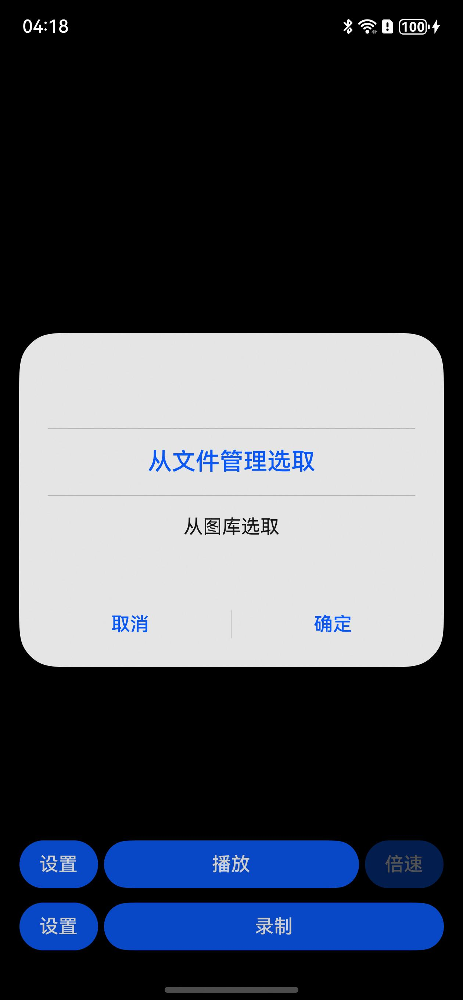 | 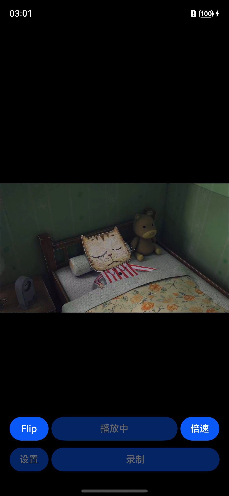 | 

|播放(竖屏)      | 播放（倍速）                    | 播放（变换矩阵）            | 
|-----------------------|----------------------|----------------------------------|
|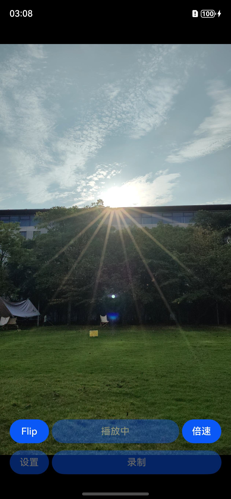 |  | 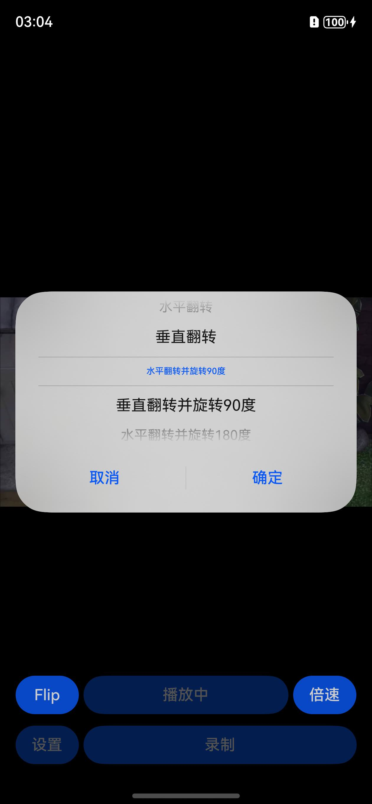 |

|播放（垂直翻转并旋转90度）    | 录制（模式选择）                                  | 录制（开始录制）         | 
|-----------------------|-------------------------------------------|--------------------------------------------|
| 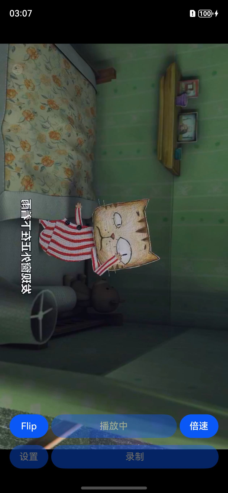 | 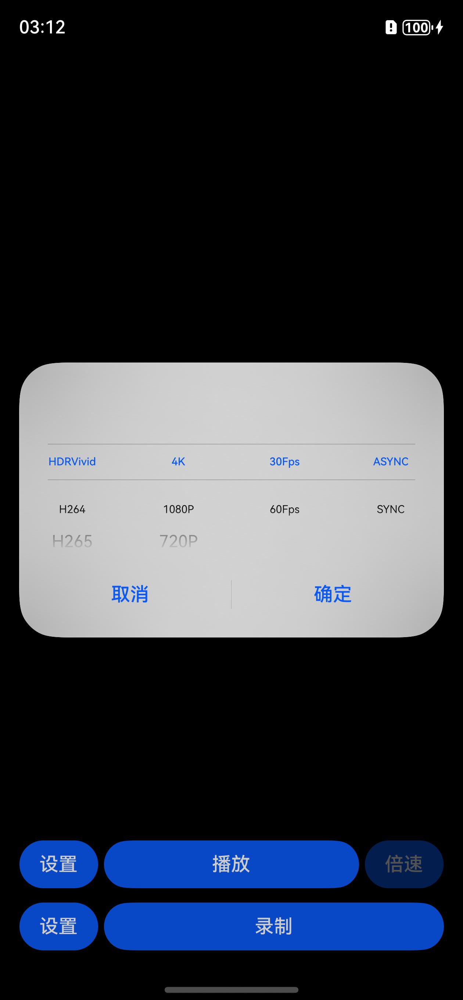 |  |
### 使用说明

播放功能不需要相机和麦克风权限。用户点击 MP4/FLV 录制按钮时，应用会检查并申请相机、麦克风权限；授权成功后才会进入录制流程。

如果用户拒绝授权，系统不会允许应用再次通过普通动态授权接口拉起相同弹窗。应用会调用 `requestPermissionOnSetting()` 拉起权限设置弹窗，引导用户重新授权。相关流程可参考 OpenHarmony 应用权限管理中的用户授权指南。

- 推送视频到文件管理？
  hdc file send xx.xx storage/media/100/local/files/Docs
- 推送视频到图库？
  hdc file send xx.mp4 storage/media/100/local/files
  hdc shell mediatool send /storage/media/100/local/files/xx.mp4

#### 播放

1. 推送文件到本地(可单独音频、单独视频、视频含音频)或点击下方“录制”，录制一个视频文件（含音频）

2. 点击播放按钮，选择从文件管理选取或从图库选取，点击确定，选择文件播放

3. 播放过程中，可长按播放窗口2倍速播放，松开原速播放，或点击播放按钮，选择指定倍速播放

#### 录制

1. （可选）设置-配置相机参数

2. 点击“录制”

3. 点击“保存”

4. 点击“开始录制”

5. 点击“停止录制”

### 测试

自动化测试位于 `entry/src/ohosTest/ets/test`，使用 Hypium 覆盖以下可重复验证的逻辑：

- 时间和录制计时格式化；
- 文件选择索引、索引边界和空文件判断；
- 相机录制参数默认值及编码格式、分辨率更新；
- 播放、录制、封装格式、Dump 和 NativeWindow 变换配置完整性。

可在 DevEco Studio 中选择 `entry > ohosTest` 目标并执行测试。音视频解封装、软硬件编解码、Surface/BufferMode
送显、音频 async/sync 输出、权限弹窗和相机录制依赖真实设备能力，继续通过真机手工测试验证。详细的测试环境、测试素材和操作步骤请参考：
[AVCodecSample 手工测试用例](./ohosTest.md)。

也可以连接设备后通过命令行构建并执行：

```text
hvigorw --mode module -p product=default -p module=entry@ohosTest assembleHap
hdc install -r entry/build/default/outputs/default/entry-default-signed.hap
hdc install -r entry/build/default/outputs/ohosTest/entry-ohosTest-signed.hap
ability_command=$(printf '\141\141')
hdc shell "${ability_command} test -b com.samples.avcodecsample -m entry_test -s unittest OpenHarmonyTestRunner -s timeout 300000"
```

### 目录

与本示例功能相关的主要目录结构如下：

```
AVCodec/
├── README_zh.md                              # 示例说明和实现文档
├── ohosTest.md                               # 真机手工测试用例
└── entry/src/
    ├── main/
    │   ├── cpp                               # Native 层
    │   │   ├── capbilities                   # 媒体能力接口和实现
    │   │   │   ├── include                   # 音视频编解码、封装和解封装接口
    │   │   │   ├── audio_capturer.cpp        # 音频采集实现
    │   │   │   ├── audio_decoder.cpp         # 音频解码实现
    │   │   │   ├── audio_encoder.cpp         # 音频编码实现
    │   │   │   ├── demuxer.cpp               # 解封装实现
    │   │   │   ├── muxer.cpp                 # 封装实现
    │   │   │   ├── video_decoder.cpp         # 视频解码实现
    │   │   │   └── video_encoder.cpp         # 视频编码实现
    │   │   ├── common                        # Native 公共模块
    │   │   │   ├── dfx                       # 日志和错误码
    │   │   │   ├── sample_callback.cpp       # codec 和 AudioRenderer 回调实现
    │   │   │   ├── sample_callback.h         # 公共回调定义
    │   │   │   └── sample_info.h             # 参数、Buffer 队列和回调上下文
    │   │   ├── render                        # XComponent 和 NativeWindow 送显模块
    │   │   │   ├── include                   # 送显模块接口
    │   │   │   ├── plugin_manager.cpp        # XComponent 与窗口管理
    │   │   │   └── plugin_render.cpp         # Surface 生命周期和交互回调
    │   │   ├── sample
    │   │   │   ├── player                    # Native 播放接口和实现
    │   │   │   │   ├── AudioOutputPump.cpp   # 音频 async/sync 公共输出数据泵
    │   │   │   │   ├── AudioOutputPump.h     # 音频输出数据泵接口
    │   │   │   │   ├── BufferRenderer.cpp    # BufferMode 手动拷贝送显实现
    │   │   │   │   ├── BufferRenderer.h      # BufferMode 送显接口
    │   │   │   │   ├── Player.cpp            # 播放、同步和资源释放实现
    │   │   │   │   ├── Player.h              # Player 接口和状态定义
    │   │   │   │   ├── PlayerNative.cpp      # 播放 NAPI 入口
    │   │   │   │   └── PlayerNative.h        # 播放 NAPI 接口
    │   │   │   └── recorder                  # Native 录制接口和实现
    │   │   │       ├── Recorder.cpp          # 录制生命周期和数据流实现
    │   │   │       ├── Recorder.h            # Recorder 接口和状态定义
    │   │   │       ├── RecorderNative.cpp    # 录制 NAPI 入口
    │   │   │       └── RecorderNative.h      # 录制 NAPI 接口
    │   │   ├── types                         # Native 模块对 ArkTS 暴露的类型
    │   │   │   ├── libplayer                 # 播放模块类型声明
    │   │   │   └── librecorder               # 录制模块类型声明
    │   │   └── CMakeLists.txt                # Native 编译入口
    │   ├── ets                               # ArkTS UI 和业务逻辑
    │   │   ├── common
    │   │   │   ├── CommonConstants.ets       # 播放、录制和选择器常量
    │   │   │   └── utils
    │   │   │       ├── CameraCheck.ets       # 相机能力查询
    │   │   │       ├── DateTimeUtils.ets     # 时间格式化
    │   │   │       ├── Logger.ets            # 日志工具
    │   │   │       ├── MediaUtils.ets        # 文件选择和媒体文件校验
    │   │   │       └── PermissionUtil.ets    # 相机、麦克风权限处理
    │   │   ├── entryability/EntryAbility.ets # 应用入口 Ability
    │   │   ├── model/CameraDateModel.ets      # 相机录制参数模型
    │   │   ├── pages/Index.ets                # 首页、播放和录制入口
    │   │   └── recorder/Recorder.ets          # 相机预览和录制页面
    │   ├── resources                         # 主模块资源
    │   │   ├── base                          # 默认语言和公共资源
    │   │   ├── en_US                         # 美式英文资源
    │   │   └── zh_CN                         # 简体中文资源
    │   └── module.json5                      # 主模块配置
    └── ohosTest/                             # Hypium 自动化测试模块
        ├── ets
        │   ├── test
        │   │   ├── CameraDataModel.test.ets  # 相机参数模型测试
        │   │   ├── CommonConstants.test.ets  # 播放和录制常量测试
        │   │   ├── DateTimeUtils.test.ets    # 时间格式化测试
        │   │   ├── List.test.ets             # 测试套件统一入口
        │   │   └── MediaUtils.test.ets       # 文件选择和空文件判断测试
        │   ├── testability
        │   │   ├── TestAbility.ets           # 测试 Ability
        │   │   └── pages/Index.ets            # 测试页面
        │   └── testrunner
        │       └── OpenHarmonyTestRunner.ts   # Hypium 测试运行器
        ├── resources                         # 测试模块资源
        └── module.json5                      # 测试模块配置
```

### 具体实现

#### *整体链路总览*

本示例可以按“UI 选择业务场景 -> ArkTS 侧准备参数/Surface -> Native 侧创建媒体能力对象 -> 多线程搬运输入输出 Buffer -> 图形/音频/文件侧消费”的方式理解。

| 场景 | UI入口 | Native入口 | 主要能力模块 | 数据去向 |
|------|--------|------------|--------------|----------|
| 播放 | `entry/src/main/ets/pages/Index.ets` 中的播放按钮和 `XComponent` | `PlayerNative.cpp`、`Player.cpp` | `Demuxer`、`VideoDecoder`、`AudioDecoder`、`AudioOutputPump`、`BufferRenderer`、`PluginRender` | 视频送到 XComponent 对应的 NativeWindow，音频送到 AudioRenderer |
| 录制 | `Index.ets` 中的录制按钮、`recorder/Recorder.ets` 中的预览页 | `RecorderNative.cpp`、`Recorder.cpp` | `VideoEncoder`、`AudioCapturer`、`AudioEncoder`、`Muxer` | 相机视频流和麦克风音频流封装成 mp4/flv 文件 |
| 图形显示 | 播放页/录制页的 `XComponent` | `PluginManager`、`PluginRender`、`BufferRenderer` | Native XComponent、NativeWindow、NativeBuffer | SurfaceMode 直接由 codec 送显；BufferMode 由应用手动拷贝送显 |
| 解封装 | 播放前打开媒体文件后进入 Native | `Demuxer.cpp` | `OH_AVSource`、`OH_AVDemuxer` | 读取音视频 track 信息并向解码器输入压缩帧 |
| 封装 | 录制前创建媒体库输出文件后进入 Native | `Muxer.cpp` | `OH_AVMuxer` | 写入音视频编码后数据并生成目标媒体文件 |

几个核心对象的分工如下：

- `SampleInfo`：ArkTS 传入 Native 的参数集合，也承载解封装后解析出的音视频格式信息，例如 mime、分辨率、采样率、声道数、codec config、运行模式等。
- `CodecUserData`：codec 回调和工作线程之间共享的上下文，包含输入/输出 Buffer 队列、音频播放/采集缓存、首帧标记、宽高步长等运行期状态。播放侧由 `Player` 使用 `unique_ptr` 独占，传给 C 接口时仅临时使用 `.get()`，避免手工 `new/delete` 造成所有权不清晰。
- `CodecBufferInfo`：对 codec buffer index、`OH_AVBuffer` 指针和 `OH_AVCodecBufferAttr` 的封装，便于在解封装、编解码、送显、封装之间传递。
- `SampleCallback`：异步模式下 codec 的统一回调入口，负责接收 `OnNeedInputBuffer` / `OnNewOutputBuffer` 并放入 `CodecUserData` 的队列。
- `AudioOutputPump`：统一处理音频 async 输出队列和 sync 主动查询，将 PCM 写入 `renderQueue`，并把释放 Buffer、音频时钟统计等动作回调给 `Player`。

#### *UI侧页面与交互*

UI 层使用 ArkUI 声明式范式组织页面，主页面为 `Index.ets`，录制预览页面为 `Recorder.ets`。页面入口在 `entry/src/main/resources/base/profile/main_pages.json` 中声明：

ArkUI 组件、状态和页面构建方式可参考当前 SDK 随附的 ArkUI 开发指南。

```json
{
  "src": [
    "pages/Index",
    "recorder/Recorder"
  ]
}
```

主页面 `Index.ets` 同时承载播放和录制入口：

- 播放区域使用 `XComponent({ id: 'player', type: XComponentType.SURFACE, libraryname: 'player' })`。`libraryname: 'player'` 会加载 `libplayer.so`，Native 侧在模块初始化时通过 `PluginManager::Export()` 取得 XComponent 对象并注册 Surface 回调。
- 播放设置通过 `TextPickerDialog` 选择解码器类型、运行模式、同步模式和是否dump解码帧，对应 `CommonConstants.ets` 中的 `VIDEO_DECODE_TYPE`、`VIDEO_DECODER_RUN_MODE`、`VIDEO_DECODER_SYNC_MODE`、`VIDEO_DUMP_MODE`。dump选项仅在Buffer模式下生效，默认关闭。
- 点击播放后，UI 侧通过文件管理器或图库拿到 uri，再用 `fileIo.openSync()` 获取 fd 和文件大小，最终调用 `player.playNative(fd, offset, size, codecType, runMode, syncMode, smartFluency, enableVideoDump, callback)`。
- 播放过程中，长按播放窗口会临时调用 `player.setPlaybackSpeed(2)`，松手恢复 `player.setPlaybackSpeed(1)`；点击“倍速”按钮可选择 1/2/3 倍速。
- 播放过程中点击 Flip 按钮会调用 `player.setTransform(transformHint)`，Native 侧再通过 `OH_NativeWindow_NativeWindowHandleOpt(..., SET_TRANSFORM, ...)` 作用到当前显示 window。

录制入口也在 `Index.ets` 中：

- 点击“设置”后，通过 `RECORDER_INFO` 选择视频编码格式、分辨率、帧率和同步模式。
- `checkIsProfileSupport()` 使用 `camera.getCameraManager()` 查询当前设备是否支持所选的录像 profile。若不支持，会回退到默认 1080P；如果默认配置也不支持，则取相机能力列表中的第一个 video profile。
- 点击录制 mp4/flv 后，UI 侧通过 `photoAccessHelper.createAsset()` 创建媒体库目标文件，再用 `fileIo.open()` 获取输出 fd。
- UI 调用 `recorder.initNative(...)`。Native 侧创建编码器和封装器后，会通过 `OH_NativeWindow_GetSurfaceId()` 返回编码器输入 Surface 的 `surfaceId`。
- 拿到 `surfaceId` 后，主页面通过 `this.getUIContext().getRouter().pushUrl({ url: 'recorder/Recorder', params: this.cameraData })` 跳转到录制页，并把 `CameraDataModel` 作为路由参数传入。

录制页 `Recorder.ets` 的职责是连接相机和两个输出 Surface：

- 页面加载时，`XComponent` 的 `.onLoad()` 会通过 `xComponentController.getXComponentSurfaceId()` 获取预览 SurfaceId。
- `createRecorder()` 创建 CameraManager、CameraInput、VideoSession、预览输出流和录像输出流。
- 预览输出流使用 XComponent 的 SurfaceId，负责在录制页展示实时预览。
- 录像输出流使用 Native 返回的编码器 SurfaceId，负责把相机帧送到 Native 视频编码器。
- 点击开始录制时，先 `encoderVideoOutput.start()` 打开相机录像输出，再调用 `recorder.startNative()` 启动 Native 侧 muxer、video encoder、audio capturer 和 audio encoder。
- 点击停止录制时，先停止相机录像输出，再调用 `recorder.stopBeginNative()` / `recorder.stopEndNative()` 让 Native 侧发送 EOS、等待编码器输出结束并关闭封装器。

#### *图形侧与XComponent送显*

本示例的图形侧由 ArkUI `XComponent` 和 Native 侧 `PluginManager` / `PluginRender` / `BufferRenderer` 共同完成。

播放页的 XComponent 由 `libraryname: 'player'` 绑定到 `libplayer.so`。模块加载后，`PlayerNative.cpp` 调用 `NativeXComponentSample::PluginManager::GetInstance()->Export(env, exports)`，在 `PluginManager::Export()` 中：

1. 通过 `napi_get_named_property(env, exports, OH_NATIVE_XCOMPONENT_OBJ, ...)` 获取 ArkUI 传入的 XComponent 对象。
2. 通过 `napi_unwrap()` 得到 `OH_NativeXComponent*`。
3. 通过 `OH_NativeXComponent_GetXComponentId()` 获取组件 id。
4. 将 XComponent 保存到 `PluginManager`，并创建/获取对应的 `PluginRender`。
5. 调用 `PluginRender::RegisterCallback()` 注册 Surface 生命周期回调。

`PluginRender` 关注几个 Native XComponent 回调：

- `OnSurfaceCreatedCB()`：XComponent Surface 创建后触发。这里拿到 `void* window`，转换为 `OHNativeWindow*` 保存到 `PluginManager::pluginWindow_`，并设置 `OH_SCALING_MODE_SCALE_FIT_V2`。
- `OnSurfaceChangedCB()`：Surface 尺寸或状态变化时触发，本示例记录 offset、width、height，可用于后续适配布局。
- `OnSurfaceDestroyedCB()`：Surface 销毁时触发，如果当前保存的 `pluginWindow_` 指向该 window，则置空，避免后续使用悬空 window。
- `DispatchTouchEventCB()`：触摸事件回调，本示例读取触摸工具类型和倾角信息，作为 XComponent 交互能力示例。

播放送显分为 SurfaceMode 和 BufferMode 两条路径：

- SurfaceMode：`Player::CreateVideoDecoder()` 将 `sampleInfo_.window` 设置为 XComponent 对应的 `pluginWindow_`。`VideoDecoder::Config()` 发现 `sampleInfo.window != nullptr` 后调用 `OH_VideoDecoder_SetSurface()`。之后应用释放输出帧时调用 `OH_VideoDecoder_RenderOutputBufferAtTime()` 或 `OH_VideoDecoder_RenderOutputBuffer()`，由解码器和图形系统完成送显。
- BufferMode：`Player::CreateVideoDecoder()` 明确将 `sampleInfo_.window = nullptr`，因此不会给解码器配置 surface。应用从 `OH_AVBuffer_GetAddr()` 获取解码后的 YUV/RGBA 数据，再由 `BufferRenderer` 手动送到 XComponent 对应的 NativeWindow。

BufferMode 的手动送显流程如下：

1. `BufferRenderer::Render()` 根据实际解码输出格式，将 `OH_AVPixelFormat` 映射到 `NATIVEBUFFER_PIXEL_FMT_*`。
2. `ConfigureWindow()` 对 XComponent 的 NativeWindow 设置 buffer 几何尺寸、usage、format 和缩放模式。
3. `OH_NativeWindow_NativeWindowRequestBuffer()` 申请一个可写的 `OHNativeWindowBuffer`，同时拿到 fence fd。
4. `OH_NativeBuffer_FromNativeWindowBuffer()` 转成 `OH_NativeBuffer`。
5. 如果有 fence，使用 `OH_NativeBuffer_MapWaitFence()` 等待后 map；否则使用 `OH_NativeBuffer_Map()`。
6. `CopyToWindowBuffer()` 按源 stride、slice height、目标 stride 分平面拷贝 NV12/NV21/YUV420P/RGBA/RGBA1010102 数据。
7. 拷贝完成后 `OH_NativeBuffer_Unmap()`。
8. 使用 `SET_DESIRED_PRESENT_TIMESTAMP` 设置期望显示时间。
9. `OH_NativeWindow_NativeWindowFlushBuffer()` 将 buffer 送回 NativeWindow 显示。
10. 若任一步失败，`NativeWindowBufferGuard` 会调用 `OH_NativeWindow_NativeWindowAbortBuffer()` 归还 buffer。

需要特别注意：BufferMode 不能同时给解码器配置 surface。本示例保持该约束，BufferMode 输出帧处理完后始终调用 `OH_VideoDecoder_FreeOutputBuffer(..., false)` 释放给解码器；图形显示由 `BufferRenderer` 走 NativeWindow 图形接口完成。

#### *解封装*

解封装由 `entry/src/main/cpp/capbilities/demuxer.cpp` 实现，主要用于播放链路。UI 侧把 fd、offset、size 传入 Native 后，`Player::Init()` 创建 `Demuxer`：

```cpp
source_ = OH_AVSource_CreateWithFD(info.inputFd, info.inputFileOffset, info.inputFileSize);
demuxer_ = OH_AVDemuxer_CreateWithSource(source_);
```

创建成功后，`Demuxer` 会通过 `OH_AVSource_GetSourceFormat()` 获取媒体源整体信息，并读取 track 数量：

```cpp
OH_AVFormat_GetIntValue(sourceFormat.get(), OH_MD_KEY_TRACK_COUNT, &trackCount);
```

随后遍历每个 track：

- `OH_AVSource_GetTrackFormat(source_, index)` 获取当前 track 的 `OH_AVFormat`。
- `OH_MD_KEY_TRACK_TYPE` 区分视频轨和音频轨。
- 视频轨调用 `ProcessVideoTrack()`，读取 mime、宽高、帧率、码率、旋转角、profile 等信息，并保存 `videoTrackId_`。
- 音频轨调用 `ProcessAudioTrack()`，读取采样格式、声道数、声道布局、采样率、mime、AAC ADTS 标记等信息，并保存 `audioTrackId_`。
- 如果 track 中存在 `OH_MD_KEY_CODEC_CONFIG`，会拷贝到 `SampleInfo::codecConfig`，后续配置音频解码器时作为 codec config 传给 `OH_AudioCodec_Configure()`。

播放输入线程每次拿到解码器输入 buffer 后，会调用：

```cpp
OH_AVDemuxer_ReadSampleBuffer(demuxer_, trackId, buffer);
OH_AVBuffer_GetBufferAttr(buffer, &attr);
```

`ReadSample()` 的输出就是压缩音视频帧和对应的 `OH_AVCodecBufferAttr`。应用随后调用 `OH_AVBuffer_SetBufferAttr()` 和 `OH_*Decoder_PushInputBuffer()` 将该帧送入对应解码器。读到 EOS 时，attr flags 会带有 `AVCODEC_BUFFER_FLAGS_EOS`，输入线程据此结束或在循环播放场景下 seek 到起点继续读取。

#### *音频解码与播放*

音频解码由 `AudioDecoder`、`AudioOutputPump` 和 `Player` 的音频线程配合完成。整体链路如下：

```text
Demuxer 读取音频压缩帧
        ↓
AudioDecoder 输入 buffer
        ↓
OH_AudioCodec 解码成 PCM
        ↓
AudioOutputPump 将 PCM 放入 renderQueue
        ↓
OH_AudioRenderer_OnWriteData 从 renderQueue 取数据播放
```

`AudioDecoder::Create()` 使用解封装得到的音频 mime 创建解码器：

```cpp
decoder_ = OH_AudioCodec_CreateByMime(codecMime.c_str(), false);
```

`AudioDecoder::Configure()` 根据 `SampleInfo` 配置输出 PCM 格式：

- `OH_MD_KEY_AUDIO_SAMPLE_FORMAT`：本示例设置为 `SAMPLE_S16LE`。
- `OH_MD_KEY_AUD_CHANNEL_COUNT`：声道数。
- `OH_MD_KEY_AUD_SAMPLE_RATE`：采样率。
- `OH_MD_KEY_CHANNEL_LAYOUT`：声道布局。
- `OH_MD_KEY_ENABLE_SYNC_MODE`：同步模式下设置。
- `OH_MD_KEY_CODEC_CONFIG`：如果解封装拿到了 codec config，则写入该字段，AAC 等格式依赖该信息正确解码。

异步模式下，`AudioDecoder::Config()` 注册 `SampleCallback`：

- `OnNeedInputBuffer()` 将输入 buffer index 和 `OH_AVBuffer*` 放入 `inputBufferQueue`。
- `OnNewOutputBuffer()` 将输出 buffer index 和 `OH_AVBuffer*` 放入 `outputBufferQueue`。

同步模式下，不走 codec 回调，线程直接调用 `AudioDecoder::GetInputBuffer()` / `GetOutputBuffer()` 查询 buffer。

播放侧的 `OH_AudioRenderer` 在 `Player::CreateAudioDecoder()` 中创建：

1. `OH_AudioStreamBuilder_Create(&builder_, AUDIOSTREAM_TYPE_RENDERER)`。
2. 设置采样率、声道数、采样格式、编码类型和 usage。
3. 注册 `SampleCallback::OnRenderWriteData`。
4. `OH_AudioStreamBuilder_GenerateRenderer()` 得到 `audioRenderer_`。

音频输出线程创建一个局部 `AudioOutputPump`。异步模式从 `outputBufferQueue` 取回调送来的 Buffer，同步模式调用 `AudioDecoder::GetOutputBuffer()` 主动查询；两条路径随后复用同一个 Buffer 校验、PCM 入队和错误传播流程。`AudioOutputPump` 不拥有线程、解码器、`CodecUserData` 或 AudioRenderer，也不调用 `StartRelease()`，这些生命周期职责仍由 `Player` 管理。

拿到解码后的 PCM 后，`AudioOutputPump` 会把数据逐字节写入 `audioDecContext_->renderQueue`，再通过回调让 `Player` 释放 codec 输出 Buffer、更新已写采样数和音频 PTS。AudioRenderer 真正需要数据时，会触发 `OnRenderWriteData()`：

```cpp
while (!codecUserData->renderQueue.empty() && index < length) {
    dest[index++] = codecUserData->renderQueue.front();
    codecUserData->renderQueue.pop();
}
```

音画同步也依赖 AudioRenderer。视频输出线程调用 `OH_AudioRenderer_GetTimestamp(audioRenderer_, CLOCK_MONOTONIC, &framePosition, &timestamp)` 获取音频实际播放位置，再用视频帧 pts 计算 `waitTimeUs`。视频帧过晚时丢帧，过早时 sleep 等待，以音频播放进度作为主时钟。

#### *播放线程与释放生命周期*

播放侧为存在的音频轨和视频轨分别创建输入、输出线程。输入线程只负责向解码器送入压缩帧，输出线程负责消费解码结果；`isAudioDone` 和 `isVideoDone` 只表示对应输出线程已完成，不再由输入线程修改，避免输入 EOS 早于输出 EOS 时提前释放资源。

`Player::Start()` 在解码线程启动完成后创建独立的 `ReleaseWorker`。该协调线程等待音频和视频输出均完成；媒体不存在某一轨道时，对应完成标志在启动前直接置为 true。完成条件满足后，协调线程执行以下释放顺序：

1. 将播放状态置为停止，并 `join` 音视频输入、输出线程。
2. 将 `CodecUserData::isDestroyed` 置为 true，使迟到的 codec 和 AudioRenderer 回调立即返回。
3. 释放 AudioRenderer、Demuxer、视频/音频 Decoder、BufferRenderer 和 AudioStreamBuilder。
4. 在 Decoder 已停止回调后清空 Buffer 队列并销毁 `CodecUserData`。
5. 解除 `Player` 内部互斥锁后再通知 ArkTS 播放完成，避免完成回调再次进入播放器时产生锁重入问题。

工作线程不再 `detach`，也不会从音频或视频输出线程内部直接释放播放器，因此不存在输出线程 join 自身的问题。下一次 `Init()` 会先回收已经结束的协调线程，确保上一轮资源完整释放后再创建新任务。音频 `renderQueue` 的写入、消费和水位等待统一由 `outputMutex` 保护，避免使用不同互斥锁读取同一队列造成数据竞争。

#### *相机采集与录制*

录制由 ArkTS 相机能力和 Native 编码封装能力共同完成。这里有两个 Surface：

- 预览 Surface：录制页 `Recorder.ets` 中 XComponent 的 surfaceId，用于显示相机预览。
- 编码 Surface：Native 视频编码器通过 `OH_VideoEncoder_GetSurface()` 返回的 `OHNativeWindow`，再由 `OH_NativeWindow_GetSurfaceId()` 转成 surfaceId，传给 CameraKit 的 `createVideoOutput()`，用于把相机帧送入编码器。

主页面创建输出文件并初始化 Native：

```text
Index.ets
  createAsset() 创建媒体库视频资源
  fileIo.open() 获取 output fd
  recorder.initNative(...) 传入编码参数和 fd
  Native 返回 encoder surfaceId
  router.pushUrl('recorder/Recorder', params)
```

录制页 `Recorder.ets` 进入后：

1. `XComponent.onLoad()` 通过 `xComponentController.getXComponentSurfaceId()` 获取预览 surfaceId。
2. `camera.getCameraManager()` 获取 CameraManager。
3. `getSupportedCameras()` 选择相机设备。
4. `getSupportedSceneModes()` 确认支持 `NORMAL_VIDEO`。
5. `encoderProfileCameraCheck()` 从 camera videoProfiles 中选择与用户设置匹配的录像 profile。
6. `previewProfileCameraCheck()` 为 XComponent 预览选择 preview profile。
7. `createVideoOutput(encoderProfile, params.surfaceId)` 创建录像输出流，目标是 Native 编码器 Surface。
8. `createPreviewOutput(xComponentPreviewProfile, this.xComponentSurfaceId)` 创建预览输出流，目标是 UI 预览 XComponent。
9. `createCameraInput()` 创建相机输入，并调用 `cameraInput.open()` 打开相机。
10. `createSession(camera.SceneMode.NORMAL_VIDEO)` 创建 `VideoSession`。
11. `beginConfig()` 后依次 `addInput(cameraInput)`、`addOutput(xComponentPreviewOutput)`、`addOutput(encoderVideoOutput)`。
12. `commitConfig()` 提交配置，再调用 `videoSession.start()` 启动预览。

开始录制时：

```text
encoderVideoOutput.start()
recorder.startNative()
```

其中 `encoderVideoOutput.start()` 让 CameraKit 开始向编码 Surface 输出录像帧，`recorder.startNative()` 启动 Native 侧 muxer、video encoder、audio capturer、audio encoder 和对应输出线程。

停止录制时：

1. UI 调用 `encoderVideoOutput.stop()` 停止相机录像输出。
2. Native `stopBeginNative()` 将 `isStopping_` 置为 true，让音频采集/编码线程停止继续塞新数据。
3. CameraKit 触发 `frameEnd` 后，UI 调用 `stopEndNative()`。
4. Native 向 video encoder 和 audio encoder 发送 EOS。
5. 等待视频 EOS 输出完成后，停止 muxer 并释放 camera、encoder、capturer、muxer 等资源。

录制页还实现了两个图形/相机相关能力：

- HDR Vivid 场景下，根据能力选择 P010 格式，并尝试设置 `BT2020_HLG_LIMIT` 色彩空间。
- 预览页支持双指缩放，通过 `PinchGesture` 调用 `videoSession.setZoomRatio()` 调节相机 zoom。

#### *音频采集与编码*

录制时的音频链路如下：

```text
OH_AudioCapturer 采集 PCM
        ↓
AudioCapturerOnReadData 写入 CodecUserData::cache
        ↓
AudioEncoder 输入线程按 audioMaxInputSize 取 PCM
        ↓
OH_AudioCodec 编码 AAC
        ↓
AudioEncoder 输出线程取编码后 buffer
        ↓
Muxer 写入音频 track
```

`RecorderNative::Init()` 会设置音频默认参数：

- mime：`OH_AVCODEC_MIMETYPE_AUDIO_AAC`
- sample format：`SAMPLE_S16LE`
- sample rate：48000
- channel count：2
- bit rate：32000
- channel layout：`CH_LAYOUT_STEREO`
- `audioMaxInputSize`：按 20ms PCM 数据量计算

`AudioCapturer::AudioCapturerInit()` 创建音频采集器：

1. `OH_AudioStreamBuilder_Create(&builder_, AUDIOSTREAM_TYPE_CAPTURER)`。
2. 设置采样率、声道数、采样格式、latency mode、encoding type。
3. 注册 `AudioCapturerOnReadData`。
4. `OH_AudioStreamBuilder_GenerateCapturer()` 得到 `audioCapturer_`。

采集回调 `AudioCapturerOnReadData()` 将系统给到的 PCM 数据写入 `CodecUserData::cache`，并通过 `inputCond.notify_all()` 唤醒音频编码输入线程。

音频编码器由 `AudioEncoder` 封装：

- `Create()` 使用 `OH_AudioCodec_CreateByMime(codecMime.c_str(), true)` 创建编码器。
- `Configure()` 设置采样格式、声道数、采样率、码率、声道布局、最大输入大小。
- 异步模式注册 `SampleCallback`；同步模式由线程主动 query buffer。
- 输入线程从 cache 中读取 `audioMaxInputSize` 大小的 PCM，调用 `OH_AVBuffer_SetBufferAttr()` 后 `OH_AudioCodec_PushInputBuffer()`。
- 输出线程拿到编码后的 AAC buffer 后调用 `muxer_->WriteSample(muxer_->GetAudioTrackId(), ...)` 写入封装器。

停止录制时，`AudioEncoder::NotifyEndOfStream()` 会获取一个输入 buffer，设置 `AVCODEC_BUFFER_FLAGS_EOS` 后推给编码器，使输出线程能收到 EOS 并退出。

#### *封装*

封装由 `entry/src/main/cpp/capbilities/muxer.cpp` 实现，用于录制链路。`Recorder::Init()` 在创建视频编码器后创建 `Muxer`：

```cpp
muxer_ = OH_AVMuxer_Create(fd, static_cast<OH_AVOutputFormat>(outputFormat));
```

`outputFormat` 来自 UI：

- `2`：MP4。
- `14`：FLV。

`Muxer::Config()` 会先后添加音频轨和视频轨：

- 音频轨通过 `OH_AVFormat_CreateAudioFormat(sampleInfo.audioCodecMime.data(), sampleRate, channelCount)` 创建 format，并设置 `AAC_PROFILE_LC`。
- 视频轨通过 `OH_AVFormat_CreateVideoFormat(videoMime, width, height)` 创建 format，并设置帧率、宽高、mime。
- HDR Vivid 场景下，还会设置 `OH_MD_KEY_VIDEO_IS_HDR_VIVID`、range、color primaries、transfer、matrix 等色彩信息。
- 非 FLV 输出时，调用 `OH_AVMuxer_SetRotation(muxer_, 90)` 写入旋转元数据，使竖屏录像在播放时按预期方向显示。

`Muxer::Start()` 必须在所有 track 添加完成后调用。录制过程中，视频编码输出线程和音频编码输出线程分别调用：

```cpp
muxer_->WriteSample(muxer_->GetVideoTrackId(), buffer, attr);
muxer_->WriteSample(muxer_->GetAudioTrackId(), buffer, attr);
```

`WriteSample()` 内部会先调用 `OH_AVBuffer_SetBufferAttr(buffer, &attr)`，再调用 `OH_AVMuxer_WriteSampleBuffer()`。由于音频和视频输出线程可能并发写入，本示例使用 `writeMutex_` 保护 muxer 写入，避免多线程同时操作封装器。

停止录制时，编码器输出 EOS 后，`Recorder::Release()` 释放 muxer。封装器释放前会停止写入，最终文件由系统媒体库资源对应的 fd 承载，UI 侧已通过 `photoAccessHelper.createAsset()` 创建了该文件资源。

#### *视频播放*

- 应用启动，Xcomponent加载， 触发OnSurfaceCreatedCB()， 此时能拿到一个surface，同时调用OH_NativeWindow_NativeWindowSetScalingModeV2接口给window配置一个自适应等比例拉伸原图像尺寸的Key，后续无论播放横屏视频还是竖屏视频，都不用更改XComponent的尺寸。
- 点击播放，选择文件后，能拿到文件fd，fileSize，根据拿到的fd和fileSize创建解封装器。
- 根据解封装器从文件中拿到的文件属性，创建对应的解码器，若走解码器的Surface模式，则要把之前拿到的surface也配置给解码器。
- 调用解码器Start，开始buffer轮转。buffer轮转时，由于buffer数量有上限，需要各个模块及时消费收到的buffer，否则会影响整体速度。
- 解码器Start调用后，首先会触发4次输入回调，里面会给应用OH_AVBuffer和其对应的index。
- 应用需要把待解码的码流，一帧帧填充到输入回调给到应用的OH_AVBuffer里的buffer地址里，然后调用OH_VideoDecoder_PushInputBuffer，传给解码器。
  ```text
  本示例里使用的是解封装器一键填充配置，若码流直送解码器：
  (1) 需要调用OH_AVBuffer_GetAddr获取OH_AVBuffer内buffer的内存地址，以进行之后的拷贝。
  (2) 可以调用OH_AVBuffer_GetCapacity获取OH_AVBuffer内buffer容量大小，避免拷贝越界。
  (3) 必须调用OH_AVBuffer_SetBufferAttr配置实际拷贝到OH_AVBuffer内buffer的实际size，按照规范，pts，offset，flags最好也配置对。
  (4) 给解码器的输入，要保证以下三点，才能正常解码：
        ①当前仅支持传入annexB格式帧，不支持avcc格式帧。
        ②确保buffer size正确传入。
        ③首帧要传XPS信息。（可以pps、sps和I帧同时传，也可以先传pps、sps，再传I帧）
            仅关键帧(I帧)：AVCODEC_BUFFER_FLAGS_SYNC_FRAME
            仅配置帧(pps，sps)：AVCODEC_BUFFER_FLAGS_CODEC_DATA
            是配置帧又是关键帧：AVCODEC_BUFFER_FLAGS_CODEC_DATA|AVCODEC_BUFFER_FLAGS_SYNC_FRAME
            普通帧(P帧):AVCODEC_BUFFER_FLAGS_NONE
  ```
- 待传给解码器解码完成后，会触发输出回调给应用。
  - 若是Surface模式，则输出侧实际的buffer只会在框架、解码器、surface侧轮转，回调给应用的OH_AVBuffer只是个壳子，里面会带一些flag，size等信息，以及应用在输入时配置的pts信息，但由于实际的buffer不会随着OH_AVBuffer回调给用户，所以Surface模式下调用OH_AVBuffer_GetAddr拿不到buffer的地址，不能直接拷贝解码后的buffer数据，如果有这个需求，则需把surface配置成NativeImage的window，调用NativeImage的接口获取。
  - 若是Buffer模式，实际的buffer会通过回调给到应用。由于Buffer模式不能给解码器同时配置surface，本示例会通过OH_AVBuffer_GetAddr获取解码后的yuv/rgba图像内容，拷贝到XComponent对应的NativeWindowBuffer后调用NativeWindow图形接口送显；同时也可以选择dump到应用的沙箱目录/data/storage/el2/base/haps/entry/files/下，应用可将此文件提取上来检验效果。dump功能默认关闭，可在播放设置中选择是否启用。
    ```text
    Surface里维护着一个surfaceBuffer队列，供生产者、消费者轮换使用，且生产者和消费者往往不在同一个进程。
      - 生产者的逻辑：
          · RequestBuffer：生产者获取一个空闲的、可以往里填数据的buffer，同时获取出这个buffer对应的releaseFence。当fence等到后，生产者可以往这块buffer里生产数据
          · FlushBuffer：生产者生产完后，将该buffer以及该buffer对应的acquireFence送回给surface。
          · CancelBuffer：生产者没有向该buffer里生产数据，仅做归还。
      - 消费者的逻辑：
          · AcquireBuffer: 消费者获取一个已生产好的buffer，同时获取出这个buffer对应的acquireFence。当fence等到后，消费者可以开始读取这块buffer里的内容。
          · ReleaseBuffer：消费者消费完成后将buffer以及该buffer对应的releaseFence归还给surface。
    ```
- 应用收到解码后的OH_AVBuffer后，需要及时释放归还buffer。Surface模式可调用OH_VideoDecoder_RenderOutputBuffer或OH_VideoDecoder_RenderOutputBufferAtTime送显并释放；Buffer模式处理完共享内存数据后调用OH_VideoDecoder_FreeOutputBuffer释放，本示例的Buffer模式送显由NativeWindow图形接口完成。
  ```text
  用RK3568设备播放，由于调用OH_NativeWindow_NativeWindowSetScalingModeV2接口后，实际未生效，最后显示画面可能会有拉伸，应用可以用另一种方法解决：
  在解封装拿到视频的宽高信息后，回调到UI层，UI层根据这个宽高，更改XComponet的尺寸，达到一样的效果，参考如下代码：
    import display from '@ohos.display'
    private display = display.getDefaultDisplaySync()
    @State xcomponentHeight: number | string | Resource = 1
    @State xcomponentWidth: number | string | Resource = 1
    
    if (data.videoWidth / data.videoHeight > this.display.width / this.display.height) {
      this.xcomponentHeight = (this.display.width * data.videoHeight / data.videoWidth) + 'px';
      this.xcomponentWidth = this.display.width + 'px';
    } else {
      this.xcomponent = this.display.height + 'px';
      this.xcompoentWidth = (this.display.height * data.videoWidth / data.videoHeight) + 'px'
    }
  ```


##### Buffer轮转
一、surface的buffer轮转

轮转方最多有四个：
- us ： hcodec/框架自己
- user : hcodec的调用者
- omx : vendor编解码器

surface: 在解码时，surface指消费者；编码时，surface指生产者

以解码器surface模式的某个输出buffer为例：

一开始是hcodec分配出来————owned by us

然后给到vendor(即us->omx)————owned by omx

vendor填好后还给hcodec(即omx->us)————owned by us

hcodec给到应用(即us->user)————owned by user

app等到音画同步后还给hcodec(即user->us)————owned by us

hcodec flushBuffer给surface， 让消费者消费(即us->surface)————owned by surface

消费者消费完后，hcodec去requestBuffer(即surface->us)————owned by us

给vendor(即us->omx)————owned by omx

其他模式不再赘述，直接看图表

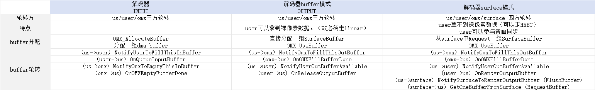

#### *录制*

- 点击“设置”(可选)，设置相应的规格后，本示例会先校验当前的相机是否支持输出该规格的流，不支持则更改为默认的1080P的流，若1080P的流仍不支持，则更改为相机能输出配置流的第一个配置。
- 点击录制后，确定保存后，本示例会根据用户设置选择的配置(未选择则默认1080P)，首先创建一个该配置对应的编码器，同时创建好封装器，Surface模式下，编码器OH_VideoEncoder_GetSurface接口，会给应用一个OHNativeWindow **window，来接收编码输入。
- 使用这个window，调用OH_NativeWindow_GetSurfaceId接口，能拿到window对应的surface的surfaceId，此surfaceId用做相机的录像流的输出surfaceId。
- 把surfaceId回调到UI层，UI层拿到surfaceId后，携带主页配置的参数信息和surfaceId，路由跳转到录制页面。
- 录制页面构建时，XComponent构建时，会触发.onLoad()方法，此时能拿到Xcomonent对应的surface的surfaceId，此surfaceId用做相机的预览流的输出surfaceId。
- 有了两个surfaceId，和想要的相机配置，就能开始创建相机，开始录像了。
- 参考上文的buffer轮转，本示例在XComponent.onLoad()触发后，建立了一个相机生产，XComponent消费相机预览流，编码器消费相机录像流的生产消费模型，但此时编码器还未开始消费。
- 待用户在录像页面点击“开始录制”后，本示例才会调用编码器的OH_VideoEncoder_Start()方法，开始录像编码。
- 编码Surface，由surface生产端(本例是相机)直接往surface内flush SurfaceBuffer，surface内收到buffer后，编码器自动开始编码。
- 待编码完成后，会触发输出回调给应用，里面会带有每帧编码后的OH_AVBuffer和其对应的index。
- 此时应用可以调用OH_AVBuffer_GetAddr获取OH_AVBuffer内buffer的内存地址，OH_AVBuffer_GetBufferAttr获取编码后buffer的size等参数信息，本例是直接通过封装器，将其写入文件帧。
  ```text
  若使用RK3568相机录制，相机输出RGBA格式流到编码器Surface，实际flush到Surface里的buffer画面异常，导致最后的录像文件，播放起来的效果不对。
  ```

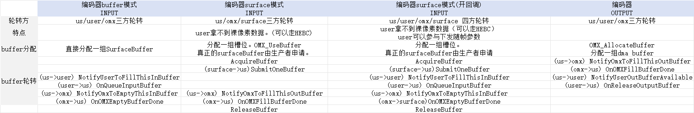

### 音画同步

#### 前言

##### 背景和目的

目前手机播放器在输出设备为蓝牙耳机时会出现严重音视频不同步现象，严重影响用户体验。本文旨在指导第三方视频播放应用正确获取并使用音频相关信息来保证音视频同步。

精确的音视频同步是媒体播放的关键性能指标之一。一般来说，在录音设备上同时录制的音频和视频需要在播放设备（例如手机，电视，媒体播放器）上同时播放。为了实现设备上的音视频同步，可以按如下指南操作。

##### 概念定义

| Abbreviations缩略语 | Full spelling 英文全名      | Chinese explanation 中文解释 |
|------------------|:------------------------|:-------------------------|
| PTS              | Presentation Time Stamp | 送显时间戳                    |
| DTS              | Decoding Time Stamp     | 解码时间戳                    |

- DTS（解码时间戳）
  指音视频数据在解码器中开始解码的时间戳。它表示解码器应该从输入数据流中读取和解码的特定时间点。DTS用于控制解码器的解码顺序，确保音视频数据按照正确的顺序解码。
- PTS（显示时间戳）
  指音视频数据在播放时应该显示给用户的时间戳。它表示解码后的音视频数据在播放时应该出现在屏幕上或传递给音视频输出设备的时间点。PTS用于控制音视频的播放顺序和时序，以确保音视频在正确的时间点进行显示或播放。

##### 音画同步原理

音视频数据的最小处理单元称为帧。音频流和视频流都被分割成帧，所有帧都被标记为需要按特定的时间戳显示。音频和视频可以独立下载和解码，但就具有匹配时间戳的音频和视频帧应同时呈现，达到A/V同步的效果。

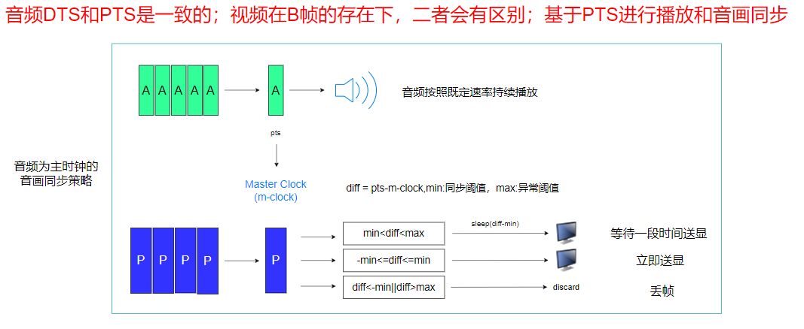

理论上，因为音频通路存在时延，匹配音频和视频处理，有三种A/V同步解决方案可用；

（1）连续播放音频帧：使用音频播放位置作为主时间参考，并将视频播放位置与其匹配。

（2）使用系统时间作为参考：将音频和视频播放与系统时间匹配。

（3）使用视频播放作为参考：让音频匹配视频。


| 策略名称        | 优点                                                  | 缺点                                                                       |
|-------------|:----------------------------------------------------|:-------------------------------------------------------------------------|
| 连续播放音频帧（推荐） | ①用户肉眼的敏感度较弱，不易察觉视频微小的调整。<br/>②容易实现，因为视频刷新时间的调整相对容易。 | ①如果视频帧率不稳定或延迟渲染大，可能导致视频卡顿或跳帧。                                            |
| 使用系统时间作为参考  | 可以最大限度地保证音频和视频都不发生跳帧行为。                             | ①需要额外依赖系统时钟，增加系统复杂性和维护成本。<br/>②系统时钟的准确性对同步效果影响较大，如果系统时钟不准确，可能导致同步效果大打折扣。 |
| 使用视频播放作为参考  | 音频可以根据视频帧进行调整，减少音频跳帧的情况。                            | ①音频播放可能会出现等待或加速的情况，相较于视频，会对用户的影响更为严重和明显。<br/>②如果视频帧率不稳定，可能导致音频同步困难。      |

第一个选项是唯一一个具有连续音频数据流的选项，没有对音频帧的显示时间、播放速度或持续时间进行任何调整。这些参数的任何调整都很容易被人的耳朵注意到，并导致干扰的音频故障，除非音频被重新采样；但是，重新采样也会改变音调。因此，一般的多媒体应用使用音频播放位置作为主时间参考。以下段落将讨论此解决方案。（其它两个选项不在本文档的范围内）

### 效果展示

#### 场景说明

#### 适用范围

适用于应用中视频播放过程中，由于设备渲染延迟、播放链路异常导致的音画不同步的场景

##### 场景体验指标

音画同步标准

① 为了衡量音画同步的性能，用对应音频和视频帧实际播放时间的差值作为数值指标，数值大于0表示声音提前画面，小于0表示声音落后画面。

② 最大卡顿时长，单帧图像停滞时间超过100ms的，定义为卡顿一次。连续测试5分钟，建议设置为100ms。

③ 平均播放帧率，平均每秒播放帧数，不反映每帧显示时长。

测试基准：一倍速场景

|        | 范围             | 主观体验 |
|--------|:---------------|:-----|
| S标（建议） | [-80ms, 25ms]  | 无法察觉 |
| A标     | [-125ms, 45ms] | 能够察觉 |
| B标     | [-185ms, 90ms] | 能够察觉 |

| 描述   | 应用内播放视频，音画同步指标应满足[-125ms, 45ms]。 |
|------|:---------------------------------|
| 类型   | 规则                               |
| 适用设备 | 手机、折叠屏、平板                        |
| 说明   | 无                                |

#### 场景分析

##### 典型场景及优化方案

**典型场景描述**
应用内播放视频，音画同步指标应满足[-80ms, 25ms].
**场景优化方案**
该解决方案使用：

- 视频同步到音频（主流方案）
- 获取音频渲染进度动态调整视频渲染进度

最终实现音画同步[-80ms,25ms]的效果。


**图2 音画同步示意图**


#### 场景实现

##### 场景整体介绍

音频和视频的管道必须同时以相同的时间戳呈现每帧数据。音频播放位置用作主时间参考，而视频管道只输出与最新渲染音频匹配的视频帧。对于所有可能的实现，精确计算最后一次呈现的音频时间戳是至关重要的。OS提供API来查询音频管道各个阶段的音频时间戳和延迟。

音频管道支持查询最新呈现的时间戳，getTimeStamp()
方法提供了一种简单的方法来确定我们要查找的值。如果时间戳可用，则audioTimestamp实例将填充以帧单位表示的位置，以及显示该帧时的估计时间。此信息可用于控制视频管道，使视频帧与音频帧匹配。

##### 接口说明

```cpp
/*
 * Query the the time at which a particular frame was presented.
 *
 * @since 10
 *
 * @param renderer Reference created by OH_AudioStreamBuilder_GenerateRenderer()
 * @param clockId {@link #CLOCK_MONOTONIC}
 * @param framePosition Pointer to a variable to receive the position
 * @param timestamp Pointer to a variable to receive the timestamp
 * @return Function result code:
 *         {@link AUDIOSTREAM_SUCCESS} If the execution is successful.
 *         {@link AUDIOSTREAM_ERROR_INVALID_PARAM}:
 *                                                 1.The param of renderer is nullptr;
 *                                                 2.The param of clockId invalid.
 *         {@link AUDIOSTREAM_ERROR_ILLEGAL_STATE} Execution status exception.
 */
OH_AudioStream_Result OH_AudioRenderer_GetTimestamp(OH_AudioRenderer* renderer,
    clockid_t clockId, int64_t* framePosition, int64_t* timestamp);
```

注意事项：

(1)
OH_AudioRenderer_Start到真正写入硬件有一定延迟，因此该接口在OH_AudioRenderer_Start之后过一会儿才会再拿到有效值，期间音频未发声时建议画面帧先按照正常速度播放，后续再逐步追赶音频位置从而提升用户看到画面的起搏时延。

(2)当framePosition和timeStamp稳定之前，调用可以比较频繁(如100ms)
，当以稳定的速度增长前进后，建议OH_AudioRenderer_GetTimestamp的频率不要太频繁，可以每分钟一次，最好不要低于500ms一次，因为频繁调用可能会带来功耗问题，因此在能保证音画同步效果的情况下，不需要频繁地查询时间戳。

(3)OH_AudioRenderer_Flush接口执行后，framePosition返回值会重新(从0)开始计算。

(4)OH_AudioRenderer_GetFramesWritten 接口在Flush的时候不会清空，该接口和OH_AudioRenderer_GetTimestamp接口并不建议配合使用。

(5)音频设备切换过程中OH_AudioRenderer_GetTimestamp返回的framePosition和timestamp不会倒退，但由于新设备写入有时延，会出现短暂时间内音频进度无增长，建议画面帧保持流程播放不要产生卡顿。

(6)
OH_AudioRenderer_GetTimeStamp获取的是实际写到硬件的采样帧数，不受倍速影响。对AudioRender设置了倍速的场景下，播放进度计算需要特殊处理，系统保证应用设置完倍速播放接口后，新写入AudioRender的采样点才会做倍速处理。

##### 关键代码片段

(1)获取音频渲染的位置

```cpp
int64_t framePosition = 0;
int64_t timestamp = 0;
int32_t ret = OH_AudioRenderer_GetTimestamp(audioRenderer_, CLOCK_MONOTONIC, &framePosition, &timestamp);
AVCODEC_SAMPLE_LOGI("VD framePosition: %{public}li, nowTimeStamp: %{public}li", framePosition, nowTimeStamp);
audioTimeStamp = timestamp;
```

(2)音频启动前暂不做音画同步

- 音频未启动前，timestamp和framePosition返回结果为0，为避免出现卡顿等问题，暂不同步

```cpp
    if (ret != AUDIOSTREAM_SUCCESS || (timestamp == 0) || (framePosition == 0)) {
        if (!PresentAndReleaseVideoBuffer(bufferInfo, true, GetCurrentTime())) {
            return false;
        }
        std::this_thread::sleep_until(lastPushTime + std::chrono::microseconds(sampleInfo_.frameInterval));
        lastPushTime = std::chrono::system_clock::now();
        return true;
    }
```

(3)根据视频帧pts和音频渲染位置计算延迟waitTimeUs

- audioPlayedTime音频帧期望渲染时间
- videoPlayedTime视频帧期望送显时间

```cpp
int64_t latency = (audioDecContext_->frameWrittenForSpeed - framePosition) * 1000 *
                1000 / sampleInfo_.audioSampleRate / speed;
AVCODEC_SAMPLE_LOGI("VD latency: %{public}li writtenSampleCnt: %{public}li", latency, writtenSampleCnt);

nowTimeStamp = GetCurrentTime();
int64_t anchordiff = (nowTimeStamp - audioTimeStamp) / 1000;

int64_t audioPlayedTime = audioDecContext_->currentPosAudioBufferPts - latency + anchorDiff;
int64_t videoPlayedTime = bufferInfo.attr.pts;

int64_t waitTimeUs = videoPlayedTime - audioPlayedTime;
```

(4)根据业务延迟做音画同步策略

- [,-40ms) 视频帧较晚，此帧丢掉
- [-40ms,0ms)视频帧直接送显
- [0ms,)视频帧较早，根据业务需要选择现象追帧

```cpp
if (waitTimeUs < WAIT_TIME_US_THRESHOLD_WARNING) {
    dropFrame = true;
    AVCODEC_SAMPLE_LOGI("VD buffer is too late");
} else {
    AVCODEC_SAMPLE_LOGE("VD buffer is too early waitTimeUs:%{public}ld", waitTimeUs);
    if (waitTimeUs > WAIT_TIME_US_THRESHOLD) {
        waitTimeUs = WAIT_TIME_US_THRESHOLD;
    }
    if (waitTimeUs > sampleInfo_.frameInterval + perSinkTimeThreshold) {
        waitTimeUs = sampleInfo_.frameInterval + perSinkTimeThreshold;
        AVCODEC_SAMPLE_LOGE("VD buffer is too early and reduced, waitTimeUs: %{public}ld", waitTimeUs);
    }
}
```

(5)进行音画同步
若视频帧的时间大于2倍vsync的时间，则需要sleep超过的时间。

```cpp
if (static_cast<double>(waitTimeUs) > VSYNC_TIME * LIP_SYNC_BALANCE_VALUE) {
    std::this_thread::sleep_for(std::chrono::microseconds(
        static_cast<int64_t>(static_cast<double>(waitTimeUs) - VSYNC_TIME * LIP_SYNC_BALANCE_VALUE)));
}
return PresentAndReleaseVideoBuffer(bufferInfo, !dropFrame,
    VSYNC_TIME * LIP_SYNC_BALANCE_VALUE * US_PER_SECOND + GetCurrentTime());
```

### 倍速播放方案

#### 当前问题

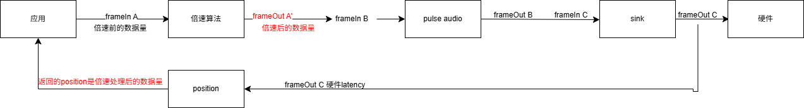

通过Audio GetTimeStamp拿到的Position始终是一倍速参考系下计算的，导致应用写下多倍速的音频帧后不清楚底层实际播放的原始位置。

**比如假设采样率是48k，应用写的frameIn A一共写了48000，2倍速后的frameOut A' 只有24000，
底层播了一半后返回给应用的position是12000 - 硬件latency(假设是100ms)
，也就是倍速后播了150ms，但应用实际播放的pts应该是24000-硬件latency×2 = 300ms**

Position表示的是音频帧，一个音频帧包括左右声道的采样点交织形成的数据包，比如双声道16bit采样点，一帧数据是4个字节，48k采样率的音频，一秒播放48000帧

应用一般音画同步做法：

视频每解码一帧，获取一下音频clock，视频帧永远跟随音频pts

#### **倍速的音频时间戳计算算法(此方法也同样适用于三方自研播放器)**

原理：记录每次setSpeed时的最后position状态作为基准，更新speed之后，按照上一次speed末尾的基准+数据delta×最新speed返回给应用

|     **时间线**     | **应用行为** |       **播放范围(写给AudioRender的数据)**        | **此刻音频服务处理的位置(frameOutC)** |                                            **pulseaudio实际返回的position**                                            | **audiorender矫正后返回给应用的值** |                       **音频PTS(假设起始时间是X)**                        |
|:---------------:|:--------:|:---------------------------------------:|:--------------------------:|:-----------------------------------------------------------------------------------------------------------------:|:-------------------------:|:----------------------------------------------------------------:|
|    **T0时刻**     |   先一倍速   |                 1-1000                  |            800             |                                                        600                                                        |            600            |                          X + 600/48000                           |
|    **T1时刻**     |  倍速调节成2  |                                         |                            |                       记录倍速调节之前写的位置<br/>lastSpeedX = 1000<br/>lastSpeedFramesWritten = 1000                        |                           |                                                                  |
|    **T2时刻**     |   2倍速    | 原始数据1001-2000，倍速后送给Audio服务的是(1001-1500) |            1400            |                                                       1200                                                        |                           |                                                                  |
| **计算T2时刻音频PTS** |          |                                         |                            | 1200如何倒推音源Position?<br/>实际位置=(position-lastSpeedIdx)*speed + lastSpeedFramesWritten<br/>(1200-1000)×2+1000 = 1400 |           1400            | X+1400/48000<br/>记录lastPosition = 1400<br/>lastPositionTime = T2 |
|  **视频出帧T2'时刻**  |          |                                         |                            |                                                                                                                   |                           |        送显delay = 视频PTS - (X + 1400 / 48000 + (T2' - T2)*2        |
|    **T3时刻**     |  倍速调节成3  |                                         |                            |                      记录倍速调节之前写的位置<br/>lastSpeedIdx = 1500<br/>lastSpeedFramesWritten = 2000                       |                           |                                                                  |
|    **T4时刻**     |   3倍速    | 原始数据2001-3500，倍速后送欸Audio服务的是(1501-2000) |            1600            |                                                       1400                                                        |                           |                                                                  |
| **计算T4时刻音频PTS** |          |                                         |                            |                                     1400 < 1500, 说明底层还在播老倍速的数据，复用上一次的音频pts做偏移                                     |      1400+(T4-T2)×2       |                    X+(lastPosition+(T4-T2)×2)                    |
|    **T5时刻**     |   3倍速    |            原始数据2001-3500 播放中            |            1900            |                                                       1700                                                        |                           |                                                                  |
| **计算T5时刻音频PTS** |          |                 Content                 |                            |             实际位置=(position-lastSpeedIdx)*speed + lastSpeedFramesWritten<br/>(1700-1500)×3+2000 = 2600             |           2600            |                           X+2600/48000                           |

### 环境配置
#### OpenHarmony
切换OpenHarmony工程，签名后运行，右下角报错：


通过文件-设置打开OpenHarmonySDK目录：

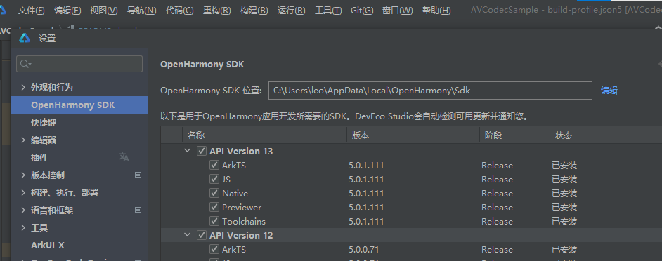

根据SDK version找到Local\OpenHarmony\Sdk\13\ets\api\device-define文件夹(此例为13)的default.json

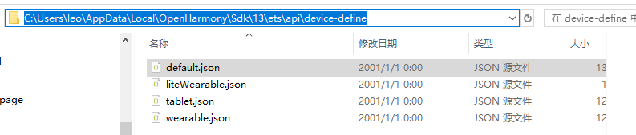

这个就是“default”类型的设备的system capability的要求

此例，缺这两个：

SystemCapability.HiviewDFX.HiDumper,

SystemCapability.Multimedia.AVSession.ExtendedDisplayCast.

那就打开json文件，删掉这个要求，保存再编，就行了

#### HarmonyOS
若切换成HarmonyOS工程，搜索runtimeOS，将OpenHarmony字段改成HarmonyOS，上面的sdkVersion，改成"5.0.0(12)"这样的形式(保留双引号),搜索删除abiFilters字段后的"armeabi-v7a"参数。

### 相关权限

#### [ohos.permission.CAMERA](https://docs.openharmony.cn/pages/v4.1/zh-cn/application-dev/security/AccessToken/permissions-for-all.md#ohospermissioncamera)
#### [ohos.permission.MICROPHONE](https://docs.openharmony.cn/pages/v4.1/zh-cn/application-dev/security/AccessToken/permissions-for-all.md#ohospermissionmicrophone)

### 依赖

XComponent Camera

### 约束与限制

1.本示例仅支持标准系统上运行，支持Phone, RK3568;

2.本示例为Stage模型，仅支持 API26 及以上版本SDK, SDK版本号6.1.0.31及以上版本,镜像版本号支持6.1.0.19及以上版本;

3.本示例需要使用DevEco Studio 6.0 才可编译运行。

### 下载
如需单独下载本工程，执行如下命令：
```text
git init
git config core.sparsecheckout true
echo code/BasicFeature/Media/AVCodec/ > .git/info/sparse-checkout
git remote add origin https://gitcode.com/openharmony/applications_app_samples.git
git pull origin master
```
