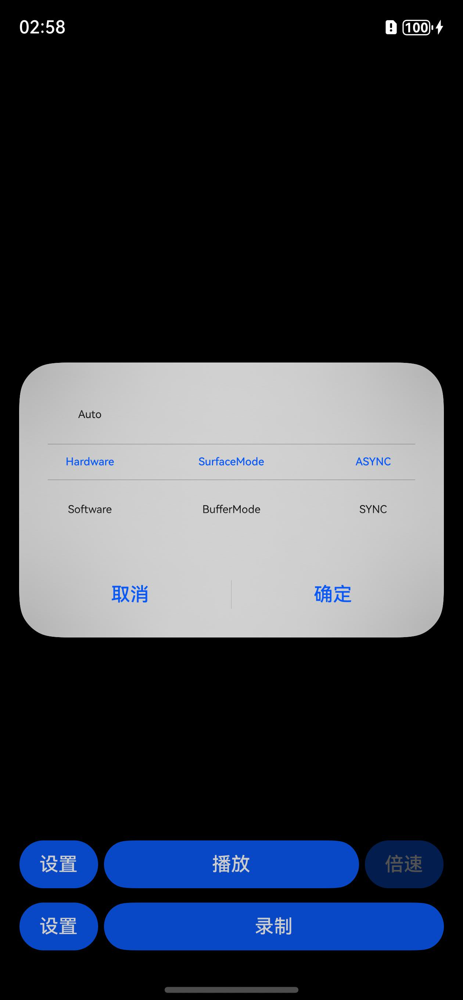
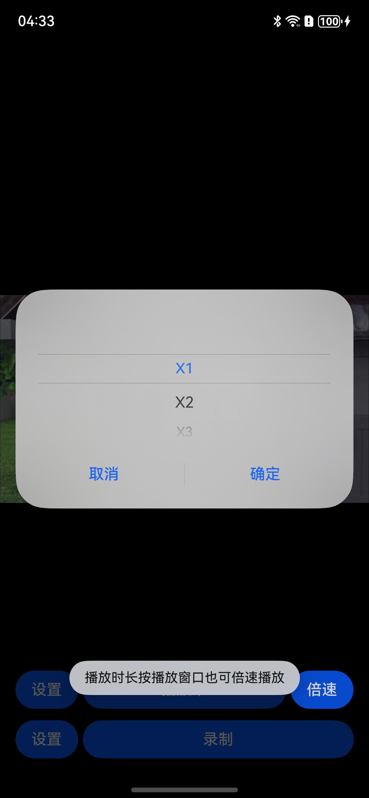
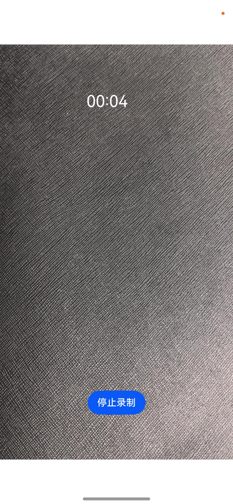
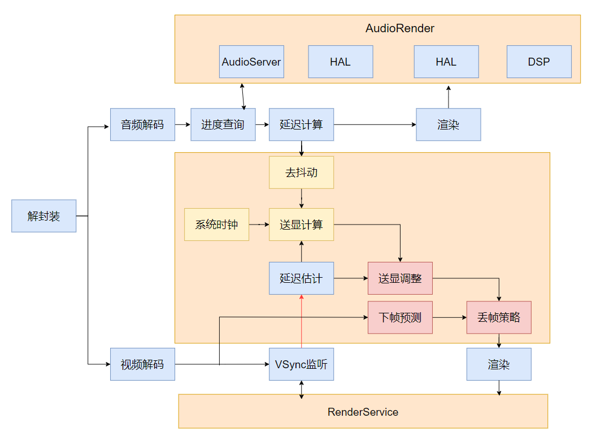
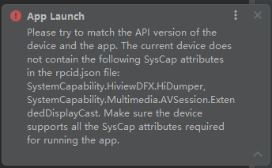

# AVCodecSample

[English](./README.md) | 简体中文

### 介绍

AVCodec 部件示例 Sample，基于 API26 构建，提供视频播放（含音频）和录制的功能。

- 视频播放的主要流程是将媒体文件解封装、解码，再送显和播放音频。
- 视频录制的主要流程是相机和麦克风采集、编码，再封装为 MP4 或 FLV 文件。

### 第一次使用

第一次运行不需要理解所有设置。使用一段 H.264 + AAC 的 MP4 文件，按下面的方式即可验证基础播放：

1. 使用 DevEco Studio 构建并安装应用到 API 26 及以上的真机。
2. 保持播放设置的默认值：**自动选择**、**Surface 模式直接送显**、**异步模式**、关闭“保存解码帧”。
3. 点击“播放”，从文件管理器或图库选择媒体文件。画面和声音正常输出，即表示文件选择、解封装、解码、送显与音频输出链路已经跑通。
4. 需要验证录制时，再点击“录制”并按系统提示授予相机、麦克风权限。默认录制参数是兼容性优先的 MP4、H.264、1080P、30 fps 和 AAC。

播放设置不是越多越好。常用场景可按下表选择：

| 目的 | 推荐设置 | 说明 |
|---|---|---|
| 日常播放 | 自动选择 + Surface 模式直接送显 + 异步模式 | 默认组合，图像不经过应用层拷贝，适合优先保证功耗和流畅度的场景。 |
| 排查硬解兼容性 | 软件解码 + Surface 模式直接送显 | 用于确认问题是否只出现在设备硬解；软件解通常更占 CPU。 |
| 检查像素、色彩或 HDR 元数据 | 自动选择 + Buffer 模式拷贝送显 | 应用可以读取解码输出并透传 HDR 元数据，但会增加一次像素拷贝。 |
| 导出原始解码帧 | Buffer 模式拷贝送显 + 保存解码帧 | Dump 只用于调试，文件会写入应用沙箱，不建议在常规播放中长期开启。 |
| 高帧率倍速 | 自动选择 + 智能流畅可用 | 倍速始终可用；智能流畅是否生效取决于当前设备、SDK 和解码器能力。 |

### 基本概念

| 术语 | 在本示例中的含义 |
|---|---|
| 封装格式 | 文件的组织方式，例如 MP4、MKV、MPEG-TS、FLV。一个封装文件可以包含多个音频、视频或字幕轨道。 |
| 编码格式（码流） | 音视频内容的压缩方式，例如 H.264、H.265、AAC、MP3。播放器需要为每条轨道创建对应的解码器。 |
| 轨道 | 容器内的一路独立数据，例如一路视频、四路音频。音轨切换就是切换容器中的音频轨。 |
| 解封装 | 从文件中读出轨道信息和压缩帧的过程；本示例使用 `OH_AVSource` 和 `OH_AVDemuxer` 完成。 |
| PTS | 内容应播放或显示的媒体时间。进度条、字幕、音画同步和 Seek 都以它为基础。 |
| Surface 模式 | 解码器直接把画面交给 XComponent 对应的 Surface，应用不能读取每帧像素。 |
| Buffer 模式 | 解码器把输出 Buffer 交给应用，应用拷贝到 NativeWindow 后送显，因此可 Dump 图像和处理 HDR 元数据。 |
| 同步/异步模式 | codec Buffer 的获取方式：同步模式由工作线程查询，异步模式由回调入队。它不表示“是否进行音画同步”。 |
| EOS | End Of Stream。输入结束后仍要等待 codec 输出缓存帧，再释放播放器或封装器。 |

<a id="feature-navigation"></a>

### 功能概览与实现导航

本示例不仅演示基础音视频编解码接口，还实现了文件选择、解封装、两种视频送显路径、音画同步、倍速与智能流畅、播放状态管理、媒体信息展示，以及相机录制和音视频封装等完整链路。可通过下表直接跳转到对应实现说明。

#### 播放能力

| 功能 | 示例中的行为 | 实现说明 |
|---|---|---|
| 文件选择与异常校验 | 支持从文件管理器或图库选择媒体；空文件和无效文件给出可识别提示 | [播放入口与结构化配置](#playback-entry) |
| 解封装 | 解析媒体源、音视频轨、时长、码率、分辨率、帧率、Profile、Codec Config 等信息 | [解封装](#demuxer) |
| 解码器选择 | 支持自动选择、硬件解码器和软件解码器；自动选择初始化失败时尝试软件解码回退 | [视频解码](#video-decoding) |
| 同步/异步 Codec 模式 | 异步模式使用回调队列，Sync 模式由工作线程主动查询输入和输出 Buffer | [视频解码](#video-decoding) |
| SurfaceMode 送显 | 解码器直接输出到 XComponent Surface，并按目标时间释放送显 | [SurfaceMode 送显](#surface-output) |
| 停止时最后一帧处理 | 可选择停止/销毁 SurfaceMode 解码器时保留最后一帧或输出黑帧 | [SurfaceMode 送显](#surface-output) |
| BufferMode 送显 | 应用取得解码 Buffer，按 stride 拷贝到 NativeWindowBuffer 后调用图形接口送显 | [BufferMode 送显](#buffer-output) |
| BufferMode HDR Vivid | 透传色彩空间及 HDR 静态/动态元数据，确认后在播放窗口右上角显示水印 | [HDR Vivid 检测与送显](#hdr-vivid-output) |
| 解码帧 Dump | BufferMode 下可选择将原始解码帧写入应用沙箱，默认关闭且不影响正常送显 | [Buffer Dump](#buffer-dump) |
| 音频解码与播放 | 解码压缩音频为 PCM，通过 AudioRenderer 回调持续播放 | [音频解码与播放](#audio-playback) |
| 多音轨选择 | 展示编码、采样率、声道和码率；切换前预检候选轨，成功后实时切换且不重启视频 | [音频解码与播放](#audio-playback) |
| 静音 | 播放中可静音或恢复到应用设置的音量 | [音频解码与播放](#audio-playback) |
| 外挂 SRT 字幕 | 选择 `.srt` 文件，按播放位置解析并显示当前字幕；可调整 0.5 秒同步偏移和字号 | [字幕](#subtitle-playback) |
| 长按倍速 | 播放时长按窗口进入 X2，松开恢复 X1 | [倍速播放](#playback-speed) |
| 倍速菜单 | 支持在播放过程中选择 X1、X2、X3 | [倍速播放](#playback-speed) |
| 智能流畅 | X2/X3 使用 ADAPTIVE 保帧策略，X1 恢复 FULL；温控告警时可切换 UNIFORM | [智能流畅](#smart-fluency) |
| 音画同步 | 以 AudioRenderer 实际播放位置为主时钟，对视频帧执行等待、定时送显或丢帧 | [音画同步](#av-sync) |
| 画面变换 | 播放中支持旋转、水平/垂直翻转及组合变换 | [画面变换](#video-transform) |
| 播放进度与拖动跳转 | 显示当前位置和总时长；从同步帧恢复解码，并丢弃目标时间之前的音视频输出，实现精确 Seek | [播放进度与 Seek](#playback-seek) |
| 播放控制 | 支持暂停/继续播放、上一帧/下一帧、快退 15 秒、快进 15 秒和重播；暂停时操作会立即更新画面 | [播放进度与 Seek](#playback-seek) |
| 播放队列与断点续播 | 支持一次加入多个媒体，当前媒体结束后自动播放下一项，并记录最近播放位置 | [播放队列与断点续播](#playback-queue) |
| 全屏与显示比例 | 播放时切换全屏/退出全屏、横竖屏和适应窗口/铺满窗口 | [全屏与显示比例](#display-mode) |
| 播放性能诊断 | 查看位置、倍速、输出/送显/丢帧、帧率、音频 Buffer、软件回退和 BufferMode 拷贝送显耗时 | [播放性能诊断](#playback-diagnostics) |
| A-B 循环与单帧控制 | 设置 A/B 时间点循环播放，按视频帧率逐帧前进或后退 | [A-B 循环与单帧控制](#ab-frame-control) |
| 画中画与后台播放 | 使用系统 PiP 窗口继续观看，可选择返回桌面时自动进入 PiP | [画中画与后台播放](#pip-background) |
| 播放状态 | 显示状态、目标倍速、音视频轨和智能流畅可用性 | [播放状态与媒体信息](#playback-info) |
| 媒体详情 | 展示媒体源、音视频轨、解码配置和原始 Source/Track Format 信息 | [播放状态与媒体信息](#playback-info) |
| Stop 与资源释放 | 支持主动停止、自然结束和异常结束，并通过统一状态机完成线程和资源回收 | [播放线程与释放生命周期](#player-lifecycle) |

#### 录制能力

| 功能 | 示例中的行为 | 实现说明 |
|---|---|---|
| 相机预览与页面跳转 | 主页面初始化编码 Surface，携带 SurfaceId 和配置跳转录制页；录制页创建预览和录像输出流 | [相机采集与录制](#camera-recording) |
| 视频编码 | 相机直接向编码器 Surface 送帧，支持 H.264/H.265、Sync/Async 输出，并可配置码率、码率模式和关键帧间隔 | [视频编码](#video-encoding) |
| 音频采集与编码 | AudioCapturer 采集 PCM，AudioCodec 编码 AAC 后写入封装器；可配置采样率、声道数与 AAC 码率 | [音频采集与编码](#audio-encoding) |
| HDR Vivid 录制 | 根据设备能力选择 P010 和对应色彩空间，配置 HDR 视频编码参数 | [相机采集与录制](#camera-recording) |
| MP4/FLV 封装 | 将音视频编码输出并发写入 Muxer，MP4 同时写入旋转信息 | [封装](#muxing) |
| 停止与图库落盘 | 等待 CameraKit、编码 EOS、Muxer 释放和文件 fd 关闭后再返回主页面 | [录制停止流程](#recording-stop) |
| 自动化与真机测试 | Hypium 覆盖纯逻辑，真机用例覆盖编解码、送显、同步、录制及异常场景 | [测试](#testing) |

录制编码器配置会先查询设备能力。B 帧属于可选特性，本示例默认不启用，也不查询或下发 `VIDEO_ENCODER_B_FRAME`；这样在未暴露该能力的设备上不会产生无关告警，也不会影响默认录制初始化。

### 播放支持的原子能力规格

| 媒体格式 | 封装格式             | 码流格式                                                                                                                                             |
|------|:-----------------|:-------------------------------------------------------------------------------------------------------------------------------------------------|
| 视频   | mp4、mkv、mpeg-ts等 | 视频码流：<br/>- 硬解：AVC(H.264)、HEVC(H.265)<br/>- 软解：MPEG2、MPEG4、H.263、AVC(H.264)<br/> 音频码流:<br/>AAC、MPEG(MP3)、Flac、Vorbis、AMR(amrnb、amrwb)、G711mu、APE |

更多格式请参考[AVCodec支持的格式](https://gitcode.com/openharmony/docs/blob/master/zh-cn/application-dev/media/avcodec/avcodec-support-formats.md#avcodec%E6%94%AF%E6%8C%81%E7%9A%84%E6%A0%BC%E5%BC%8F)

上表用于说明本示例已覆盖的常见组合，并不表示任意同类文件都能在所有设备上播放。一次播放是否成功还取决于封装格式、编码格式、分辨率、帧率、Profile、像素格式以及设备当前可用的硬件/软件 codec。播放器会先查询能力，再以 codec 的 `Configure()` 结果作为最终判断；不支持时会提示失败或在“自动选择”下尝试一次软件解码回退。

### 录制支持的原子能力规格

| 封装格式 |      视频编解码类型        |      音频编解码类型     |
| :-----: | :-----------------------: | :-------------------: |
|   mp4   | HEVC(H.265)、 AVC(H.264)  |    AAC、MPEG（MP3）    |

更多格式请参考[AVCodec支持的格式](https://gitcode.com/openharmony/docs/blob/master/zh-cn/application-dev/media/avcodec/avcodec-support-formats.md#avcodec%E6%94%AF%E6%8C%81%E7%9A%84%E6%A0%BC%E5%BC%8F)

录制同样以设备能力为准。相机可输出的 profile、编码器可接受的分辨率/帧率/码率组合以及所选封装格式必须同时成立；设置页会先做可查询的校验，Native `Configure()` 继续负责最终校验。

### 效果预览

| 播放设置 | 文件选择 | 倍速播放 | 录制页面 |
|---|---|---|---|
|  |  |  |  |
### 使用说明

播放功能不需要相机和麦克风权限。用户点击“录制”按钮时，应用会检查并申请相机、麦克风权限；授权成功后才会进入录制流程。MP4 或 FLV 由录制设置中的“封装格式”决定，默认 MP4。

如果用户拒绝授权，系统不会允许应用再次通过普通动态授权接口拉起相同弹窗。应用会调用 `requestPermissionOnSetting()` 拉起权限设置弹窗，引导用户重新授权。相关流程可参考 OpenHarmony 应用权限管理中的用户授权指南。

- 推送视频到文件管理？
  hdc file send xx.xx storage/media/100/local/files/Docs
- 推送视频到图库？
  hdc file send xx.mp4 storage/media/100/local/files
  hdc shell mediatool send /storage/media/100/local/files/xx.mp4

#### 播放

1. 推送文件到本地(可单独音频、单独视频、视频含音频)或点击下方“录制”，录制一个视频文件（含音频）

2. 点击播放按钮，选择从文件管理选取或从图库选取，点击确定，选择文件播放

3. 播放过程中，可长按播放窗口2倍速播放，松开原速播放，或点击播放按钮，选择指定倍速播放

#### 录制

1. （可选）在录制区域点击“设置”，配置封装格式、编码格式、分辨率、帧率、同步模式、视频码率、码率模式、关键帧间隔、AAC 音频采样率、声道数和码率

2. 点击“录制”

3. 点击“保存”

4. 点击“开始录制”

5. 点击“停止录制”

#### 建议素材

开始使用时，推荐准备一段 **M01**：MP4、H.264 + AAC、1920×1080、30 fps。它覆盖最常见的音视频播放路径。需要继续验证更多功能时，可按下表准备素材；完整素材表和每项测试步骤见 [手工测试用例](./ohosTest.md)。

| 目的 | 建议素材 |
|---|---|
| 纯音频播放 | M04：AAC、MP3、FLAC 或 M4A 文件 |
| 非 MP4 解封装 | M05：MKV，或 M06：MPEG-TS |
| 竖屏与缩放 | M07：带旋转信息的竖屏视频 |
| 音画同步、倍速 | M08：带时间码和音频报时，或 M11：240 fps 素材 |
| HDR Vivid | M13：带有效动态元数据的 HDR Vivid 视频 |
| 精确 Seek | M16：长 GOP、带连续时间码和音频报时的视频 |

<a id="testing"></a>

### 测试

自动化测试位于 `entry/src/ohosTest/ets/test`，使用 Hypium 覆盖以下可重复验证的逻辑：

- 时间和录制计时格式化；
- 文件选择索引、索引边界和空文件判断；
- 相机录制参数默认值及编码格式、分辨率更新；
- 播放、录制设置的完整解析和非法值拒绝；
- 播放状态、倍速、轨道、媒体时间和 Seek 位置边界的格式化；
- 媒体源、音视频轨、解码配置和原始 Format 信息的面板格式化；
- 播放、录制、封装格式、Dump 和 NativeWindow 变换配置完整性。

可在 DevEco Studio 中选择 `entry > ohosTest` 目标并执行测试。音视频解封装、软硬件编解码、Surface/BufferMode
送显、音频 async/sync 输出、权限弹窗和相机录制依赖真实设备能力，继续通过真机手工测试验证。详细的测试环境、测试素材和操作步骤请参考：
[AVCodecSample 手工测试用例](./ohosTest.md)。

也可以连接设备后通过命令行构建并执行：

```text
hvigorw --mode module -p product=default -p module=entry@ohosTest assembleHap
hdc install -r entry/build/default/outputs/default/entry-default-signed.hap
hdc install -r entry/build/default/outputs/ohosTest/entry-ohosTest-signed.hap
ability_command=$(printf '\141\141')
hdc shell "${ability_command} test -b com.samples.avcodecsample -m entry_test -s unittest OpenHarmonyTestRunner -s timeout 300000"
```

### 目录

与本示例功能相关的主要目录结构如下：

```
AVCodec/
├── README.md                                 # 英文示例说明和实现文档
├── README_zh.md                              # 示例说明和实现文档
├── ohosTest.md                               # 真机手工测试用例
└── entry/src/
    ├── main/
    │   ├── cpp                               # Native 层
    │   │   ├── capabilities                  # 媒体能力接口和实现
    │   │   │   ├── include                   # 音视频编解码、封装和解封装接口
    │   │   │   ├── audio_capturer.cpp        # 音频采集实现
    │   │   │   ├── audio_decoder.cpp         # 音频解码实现
    │   │   │   ├── audio_encoder.cpp         # 音频编码实现
    │   │   │   ├── demuxer.cpp               # 解封装实现
    │   │   │   ├── muxer.cpp                 # 封装实现
    │   │   │   ├── video_decoder.cpp         # 视频解码实现
    │   │   │   └── video_encoder.cpp         # 视频编码实现
    │   │   ├── common                        # Native 公共模块
    │   │   │   ├── dfx                       # 日志和错误码
    │   │   │   ├── codec_buffer.h            # codec Buffer 描述和线程安全队列
    │   │   │   ├── codec_user_data.h         # codec 回调与工作线程的运行时上下文
    │   │   │   ├── sample_callback.cpp       # codec 和 AudioRenderer 回调实现
    │   │   │   ├── sample_callback.h         # 公共回调定义
    │   │   │   ├── sample_config.h           # 输入源、音视频和编解码配置结构
    │   │   │   └── sample_info.h             # 公共媒体类型的兼容聚合入口
    │   │   ├── render                        # XComponent 和 NativeWindow 送显模块
    │   │   │   ├── include                   # 送显模块接口
    │   │   │   ├── plugin_manager.cpp        # XComponent 与窗口管理
    │   │   │   └── plugin_render.cpp         # Surface 生命周期和交互回调
    │   │   ├── sample
    │   │   │   ├── player                    # Native 播放模块
    │   │   │   │   ├── core                  # 播放器控制、生命周期和 Seek 协调
    │   │   │   │   │   ├── Player.cpp/.h     # 对外控制、查询和音轨切换
    │   │   │   │   │   ├── PlayerLifecycle.cpp # 初始化及解码器、工作线程启动
    │   │   │   │   │   ├── PlayerRelease.cpp # 释放线程及原生资源回收
    │   │   │   │   │   └── PlayerSeek.cpp    # 精确 Seek、暂停和资源重建
    │   │   │   │   ├── output                # 音视频输出和送显实现
    │   │   │   │   │   ├── PlayerVideoPresentation.cpp # 视频送显和 BufferMode Dump
    │   │   │   │   │   ├── PlayerVideoOutput.cpp # 视频解码线程和音画同步
    │   │   │   │   │   ├── PlayerAudioOutput.cpp # 音频解码线程和 AudioRenderer 输出
    │   │   │   │   │   ├── AudioOutputPump.cpp/.h # 音频 async/sync 公共输出数据泵
    │   │   │   │   │   ├── AudioPipeline.h   # 音频解码线程生命周期
    │   │   │   │   │   ├── VideoPipeline.cpp/.h # 视频解码线程生命周期
    │   │   │   │   │   ├── VideoSink.h       # Surface/Buffer 视频输出抽象
    │   │   │   │   │   ├── SurfaceVideoSink.h # Surface 直接送显策略
    │   │   │   │   │   ├── BufferVideoSink.h # Buffer 拷贝送显策略
    │   │   │   │   │   ├── BufferRenderer.cpp/.h # BufferMode 手动拷贝送显
    │   │   │   │   │   └── HdrMetadataHelper.cpp/.h # HDR 元数据检测和透传
    │   │   │   │   ├── sync                  # 播放时钟和同步策略
    │   │   │   │   │   ├── PlaybackClock.cpp/.h # 统一音频播放时钟状态
    │   │   │   │   │   ├── AvSyncController.cpp/.h # 音画同步等待和丢帧决策
    │   │   │   │   │   ├── SeekController.cpp/.h # 精确 Seek 帧/PCM 处理策略
    │   │   │   │   │   └── PlayerStateMachine.cpp/.h # 播放状态迁移约束
    │   │   │   │   └── napi                  # ArkTS 与 Native 的接口边界
    │   │   │   │       ├── PlayerNative.cpp/.h # NAPI 注册、回调和业务分发
    │   │   │   │       ├── PlayerNapiParser.cpp/.h # 播放和 Seek 参数解析
    │   │   │   │       └── PlayerNapiSerializer.cpp/.h # 播放状态和媒体信息序列化
    │   │   │   └── recorder                  # Native 录制接口和实现
    │   │   │       ├── Recorder.cpp          # 录制生命周期和数据流实现
    │   │   │       ├── Recorder.h            # Recorder 接口和状态定义
    │   │   │       ├── RecorderNative.cpp    # 录制 NAPI 入口
    │   │   │       └── RecorderNative.h      # 录制 NAPI 接口
    │   │   ├── types                         # Native 模块对 ArkTS 暴露的类型
    │   │   │   ├── libplayer                 # 播放模块类型声明
    │   │   │   └── librecorder               # 录制模块类型声明
    │   │   └── CMakeLists.txt                # Native 编译入口
    │   ├── ets                               # ArkTS UI 和业务逻辑
    │   │   ├── common
    │   │   │   ├── CommonConstants.ets       # 播放、录制和选择器常量
    │   │   │   └── utils
    │   │   │       ├── CameraCheck.ets       # 相机能力查询
    │   │   │       ├── DateTimeUtil.ets      # 时间格式化
    │   │   │       ├── Logger.ets            # 日志工具
    │   │   │       ├── MediaUtils.ets        # 文件选择和媒体文件校验
    │   │   │       └── PermissionUtil.ets    # 相机、麦克风权限处理
    │   │   ├── entryability/EntryAbility.ets # 应用入口 Ability
    │   │   ├── model                         # UI 状态和设置模型
    │   │   │   ├── CameraDataModel.ets       # 相机录制参数模型
    │   │   │   ├── MediaInfoModel.ets        # 解封装媒体信息面板格式化
    │   │   │   ├── PlaybackInfoModel.ets     # 播放信息显示格式化
    │   │   │   ├── PlaybackHistoryModel.ets  # 播放队列和断点续播记录
    │   │   │   ├── PlayerSettingsModel.ets   # 播放设置解析和 NAPI 参数构建
    │   │   │   └── RecorderSettingsModel.ets # 录制设置解析
    │   │   ├── viewmodel
    │   │   │   └── PlaybackViewModel.ets      # 播放状态轮询、进度和 HDR 状态
    │   │   ├── components
    │   │   │   ├── MediaInfoPanel.ets         # 媒体信息滚动面板
    │   │   │   └── PlaybackProgressPanel.ets  # 播放状态、进度条和 Seek 预览
    │   │   ├── pages/Index.ets                # 首页、播放和录制入口
    │   │   └── recorder/pages/Recorder.ets    # 相机预览和录制页面
    │   ├── resources                         # 主模块资源
    │   │   ├── base                          # 默认语言和公共资源
    │   │   ├── en_US                         # 美式英文资源
    │   │   └── zh_CN                         # 简体中文资源
    │   └── module.json5                      # 主模块配置
    └── ohosTest/                             # Hypium 自动化测试模块
        ├── ets
        │   ├── test
        │   │   ├── CameraDataModel.test.ets  # 相机参数模型测试
        │   │   ├── CommonConstants.test.ets  # 播放和录制常量测试
        │   │   ├── DateTimeUtil.test.ets     # 时间格式化测试
        │   │   ├── List.test.ets             # 测试套件统一入口
        │   │   ├── MediaUtils.test.ets       # 文件选择和空文件判断测试
        │   │   ├── MediaInfoModel.test.ets   # 媒体信息面板格式化测试
        │   │   ├── PlaybackInfoModel.test.ets # 播放信息格式化测试
        │   │   ├── PlaybackHistoryModel.test.ets # 播放队列和历史记录辅助测试
        │   │   ├── PlaybackViewModel.test.ets # 播放 ViewModel 初始化和重置测试
        │   │   ├── PlayerSettingsModel.test.ets # 播放设置模型测试
        │   │   ├── SubtitleModel.test.ets       # SRT 字幕解析和时间定位测试
        │   │   ├── RecorderSettingsModel.test.ets # 录制设置模型测试
        │   │   └── TestCaseLogger.ets         # 用例名称、起止和断言日志
        │   ├── testability
        │   │   ├── TestAbility.ets           # 测试 Ability
        │   │   └── pages/Index.ets            # 测试页面
        │   └── testrunner
        │       └── OpenHarmonyTestRunner.ts   # Hypium 测试运行器
        ├── resources                         # 测试模块资源
        └── module.json5                      # 测试模块配置
```

### 具体实现

#### *整体链路总览*

本示例可以按“UI 选择业务场景 -> ArkTS 侧准备参数/Surface -> Native 侧创建媒体能力对象 -> 多线程搬运输入输出 Buffer -> 图形/音频/文件侧消费”的方式理解。

| 场景 | UI入口 | Native入口 | 主要能力模块 | 数据去向 |
|------|--------|------------|--------------|----------|
| 播放 | `entry/src/main/ets/pages/Index.ets` 中的播放按钮和 `XComponent` | `PlayerNative.cpp`、`Player.cpp` | `Demuxer`、`VideoDecoder`、`AudioDecoder`、`AudioOutputPump`、`BufferRenderer`、`PluginRender` | 视频送到 XComponent 对应的 NativeWindow，音频送到 AudioRenderer |
| 录制 | `Index.ets` 中的录制按钮、`recorder/pages/Recorder.ets` 中的预览页 | `RecorderNative.cpp`、`Recorder.cpp` | `VideoEncoder`、`AudioCapturer`、`AudioEncoder`、`Muxer` | 相机视频流和麦克风音频流封装成 mp4/flv 文件 |
| 图形显示 | 播放页/录制页的 `XComponent` | `PluginManager`、`PluginRender`、`BufferRenderer` | Native XComponent、NativeWindow、NativeBuffer | SurfaceMode 直接由 codec 送显；BufferMode 由应用手动拷贝送显 |
| 解封装 | 播放前打开媒体文件后进入 Native | `Demuxer.cpp` | `OH_AVSource`、`OH_AVDemuxer` | 读取音视频 track 信息并向解码器输入压缩帧 |
| 封装 | 录制前创建媒体库输出文件后进入 Native | `Muxer.cpp` | `OH_AVMuxer` | 写入音视频编码后数据并生成目标媒体文件 |

几个核心对象的分工如下：

- `SampleInfo`：Native 媒体任务参数的组合对象，定义在 `sample_config.h`。它按职责组合 `MediaSourceInfo`、`VideoSampleInfo`、`AudioSampleInfo`、`CodecOptions`、`OutputOptions` 和 `PlaybackCallbackInfo`，分别保存输入源、视频、音频、编解码运行选项、输出选项和播放回调。
- `CodecUserData`：定义在 `codec_user_data.h`，是 codec 回调和工作线程之间共享的运行时上下文，包含输入/输出 Buffer 队列、音频播放/采集缓存、首帧标记、宽高步长等状态。播放侧由 `Player` 使用 `unique_ptr` 独占，传给 C 接口时仅临时使用 `.get()`。
- `CodecBufferInfo` / `CodecBufferQueue`：定义在 `codec_buffer.h`，分别封装 codec buffer 信息和线程安全队列，便于在解封装、编解码、送显、封装之间传递数据。`sample_info.h` 保留为兼容聚合入口，让原有调用方无需改变包含方式。
- `SampleCallback`：异步模式下 codec 的统一回调入口，负责接收 `OnNeedInputBuffer` / `OnNewOutputBuffer` 并放入 `CodecUserData` 的队列。
- `AudioOutputPump`：统一处理音频 async 输出队列和 sync 主动查询，将 PCM 写入 `renderQueue`，并把释放 Buffer、音频时钟统计等动作回调给 `Player`。

#### *播放和录制的处理顺序*

后续章节按模块展开接口细节。先从一次操作的过程看起：页面负责准备参数和显示结果，Native 负责创建媒体对象、调度线程并回收资源。出现失败时，页面恢复可操作状态，Native 不保留半初始化的 codec 或线程。

| 功能 | 触发与输入 | 核心处理 | 完成、失败和状态边界 |
|---|---|---|---|
| 打开媒体 | 用户从文件管理器或图库确认文件 | UI 校验文件大小、打开 fd，`PlayerSettingsModel` 将当前设置生成 `PlayOptions`，`PlayerNative` 解析对象并启动 `Player::Init()` | 取消选择只保留当前页面；空文件在 UI 层提示；建源、解封装、能力校验或解码器配置失败都返回 `error`，不会留下半初始化的播放线程 |
| 解封装与媒体信息 | Native 收到 fd、offset、size | `OH_AVSource` 读取源格式，`OH_AVDemuxer` 枚举轨道；常用字段写入结构化快照，原始 Format 文本复制后保存 | 信息面板读取冻结快照，不会在播放中重复读文件；没有可播放视频或音频轨时初始化失败，页面恢复操作按钮 |
| 视频解码 | 选定视频轨和播放设置 | 根据自动/硬件/软件策略创建解码器，写入经过能力校验的格式字段，按 Sync/Async 路径持续推送压缩帧和取回输出帧 | 自动模式在创建、能力或配置失败时仅尝试一次软件回退；显式硬解失败直接反馈，避免用户以为正在使用硬解 |
| 视频送显 | 解码器产生一帧输出 Buffer | `AvSyncController` 先给出等待、立即显示或丢帧决策；`VideoSink` 再按模式调用 Surface 输出或 Buffer 拷贝输出 | 每个 codec 输出 Buffer 无论显示、丢弃或发送失败都必须归还；Surface 销毁后清空非拥有 window 引用，后续帧走安全释放而不访问旧窗口 |
| HDR Vivid 与 Dump | BufferMode 取得输出帧 | `HdrMetadataHelper` 检查动态元数据并透传色彩/HDR 信息；若开启 Dump，按有效行和像素格式写文件，再送显 | 元数据透传属于增强能力，单帧不支持只降级为普通像素显示；Dump 关闭时不创建文件，Dump 或送显均不会延长 codec Buffer 的持有期 |
| 音频与音轨 | 解封装发现音频轨，或用户切换轨道 | AudioDecoder 输出 PCM，`AudioOutputPump` 写入受锁保护的队列，AudioRenderer 回调取数据；切轨前用临时解码器完成 Create + Configure 预检 | 预检失败不拆除旧解码器、Renderer 或时钟，当前声音和 Seek 继续可用；切换成功后只重建音频链路，视频位置与播放任务不从头开始 |
| 字幕 | 用户选择外部 `.srt` 文件 | UI 解析 Cue 的起止时间和多行文本，轮询播放位置后按字幕偏移查找命中项 | 文件读取、格式或时间轴无效只提示，不改变 Native 播放；媒体切换、停止或无 Cue 时清空文本，防止旧字幕残留 |
| 倍速、智能流畅和同步 | 长按窗口或选择 X1/X2/X3 | 页面下发目标倍速；支持时解码器在 X2/X3 使用 ADAPTIVE 保帧；`PlaybackClock` 用 AudioRenderer 时间戳建立音频主时钟 | 保帧策略不改写 PTS，也不等同于音频倍速；带音频时视频等待/丢帧以音频实际进度为准，纯视频改用视频送显 PTS 维护进度 |
| 暂停、单帧和 Seek | 暂停、快进/退、拖动进度条或逐帧按钮 | 暂停保留解码器而暂停 Renderer；Seek 停止旧 worker、从前一同步帧重建，再丢弃目标之前的视频和裁剪目标之前的 PCM | Seek 失败统一进入释放路径；暂停下的单帧临时允许目标帧送显、音频保持暂停，因此画面、进度和诊断在操作后立即更新 |
| 队列、断点和 A-B 循环 | 多文件选择、再次打开历史文件或设置 A/B 点 | 会话队列在自然 EOS 后推进；偏好设置异步保存位置；A-B 到达 B 时调用同一条精确 Seek 回到 A | 主动停止和错误不自动播放下一项；接近结尾的历史位置重置为 0；切换媒体、停止或清除标记会解除 A-B 循环 |
| 显示模式、PiP 和控件隐藏 | 用户切换全屏/比例/画中画，或长时间无操作 | UI 控制窗口布局、方向和控件可见性；PiP 使用同一个 XComponent 控制器，并把系统动作转发给播放器 | 显示模式不改写解码图像和时间戳；PiP 不支持或创建失败只提示，原页面保持正常播放；任何触摸或控件操作均会重置隐藏计时 |
| 诊断、状态机和释放 | 周期查询、自然结束、停止或错误 | Native 原子计数提供只读快照；状态机约束转换；`ReleaseWorker` 按固定顺序停止 worker、释放 renderer/codec 和通知 UI | 诊断不参与调度；重复 Stop 可安全返回；完成回调在 Player 锁外触发，避免 UI 回调反向调用播放器造成死锁 |
| 相机录制和封装 | 用户确认录制配置、获取权限并进入录制页 | UI 创建媒体库 fd；相机预览流和编码 Surface 分流，视频/音频编码输出在 Muxer 中串行写入 | 配置先经相机和 codec 能力检查；停止时先结束输入再等待双路 EOS、停止封装、关闭 fd，确保图库看到完整文件 |

**播放初始化的详细时序。** 文件选择完成后，UI 不会把 URI 字符串直接交给 codec：它先打开为 fd，并将有效范围以 offset/size 一并传入，保证从图库或文件管理器获得的内容都能由同一 Native 输入路径处理。`PlayerNapiParser` 对每个字段做类型和范围校验，再填充按职责拆分的 `SampleInfo`。`Player::Init()` 只允许从 `IDLE` 进入：先建立 Source/Demuxer 和媒体快照，选择有效轨道，再创建视频/音频解码器、AudioRenderer 和输出策略。全部成功才进入 `READY`；任意一步失败都会经过相同的释放路径，并把失败原因传给 ArkTS，而不是让下一轮播放复用残缺对象。

**解码和队列的详细时序。** Async 模式中，系统回调只负责把 buffer 索引和地址写入线程安全队列，避免在 codec 回调线程执行文件 I/O、睡眠或图形调用；Sync 模式由 worker 主动查询 buffer。两种模式最终都会走同一组输入、输出和释放函数。输入 worker 从 Demuxer 读取一个压缩样本，保留它的 PTS、flags 和 EOS 标志后推给 codec；输出 worker 取得解码结果后先识别 EOS、Seek 预滚或普通帧，再进行音画同步与送显。队列结束、错误、Stop 和 Surface 销毁都会唤醒等待者，防止线程永久等待一个不可能到来的 Buffer。

**图形和 Buffer 所有权的详细边界。** SurfaceMode 的图像所有权始终在 decoder 与 Surface 之间，应用仅使用 Render/Free 接口选择是否显示；BufferMode 中应用只在输出回调期间借用 decoder Buffer，不能把其地址保存到下一帧。`BufferRenderer` 申请的是另一个由 NativeWindow 管理的目标 Buffer：等 fence、map、逐行拷贝、unmap、设置期望显示时间、flush 后，目标 Buffer 已交回图形系统，而 decoder Buffer 随即归还 codec。两者没有 attach/detach 或跨帧共享所有权，因此不会因为显示完成时间不确定而阻塞 decoder 复用。

**音频主时钟的详细边界。** PCM 被写入 `renderQueue` 并不代表已经播放。只有 AudioRenderer 的写回调实际从队列取走的完整采样帧才会累计到 `audioFramesWritten`。播放器同时读取 AudioRenderer 的时间戳、硬件已消费帧数和单调时钟锚点，估算真实播放位置；当时间戳刚启动、路由切换或 Flush 后尚不可靠时，临时退回名义视频间隔，避免用无效值大量丢帧。视频 PTS 相对音频落后过多会被丢弃，提前则等待到接近显示时刻；所有墙上等待时间都按目标倍速换算，避免 X2/X3 把媒体时间误当作真实时间。

**控制操作的详细边界。** 滑动条拖动期间，UI 显示独立的预览时间与缩略图，轮询到的真实位置不会覆盖手势；松手才提交一次 Native Seek。缩略图从单独 fd 和 `AVImageGenerator` 获取，与正在播放的 Demuxer/Decoder 完全分离，因此预览不会抢占播放 buffer。快进、快退、重播、上一帧和下一帧全部复用精确 Seek，而不是修改 UI 数字或强行跳过输出队列；这使字幕、A-B、诊断、播放队列和断点记录都观察到同一个真实播放位置。

**录制完成的详细边界。** 相机录像输出停止只意味着不再产生新的视频帧，不代表媒体文件已经完成。Native 继续处理已进入编码器的帧、推送音频 EOS、等待音视频编码输出各自结束，再停止 Muxer 写入索引和尾部信息。最后才关闭由媒体库创建的 fd 并返回页面。这样既避免图库长时间看不到文件，也避免用户在容器尚未封尾时打开不完整的视频。

##### 从界面到 Native 的入口

下面列出阅读代码时最常遇到的入口。除了日志，还可通过“媒体信息”“性能诊断”、播放位置、按钮状态和提示确认当前链路是否按预期运行。

1. **设置的事务式应用。** `Index.ets` 打开播放或录制设置时不会直接修改运行中模型，而是复制临时值给底部面板。Picker、Switch 和 Slider 只改临时值；点击“应用”时 `PlayerSettingsModel` 或 `RecorderSettingsModel` 一次性解析和校验，成功后才写回页面状态。这样取消设置、打开面板后切换媒体，或某一组合参数不合法时，不会把半组配置传到 Native。已经开始播放的音量调用 `setVolume` 立即生效；会改变 codec/AudioRenderer 创建方式的选项在下一次播放时生效。

2. **媒体快照的构建和展示。** `Demuxer::Create()` 先读取 Source Format，再逐个读取 Track Format。结构化字段会填入 `MediaSourceInfo`、`VideoSampleInfo` 和每条音轨快照；原始 `OH_AVFormat_DumpInfo()` 结果立即复制为字符串，不能持有 SDK 返回的临时地址。`PlayerNapiSerializer` 将冻结结果转换为 `MediaInfo`，`MediaInfoModel` 负责把它分成媒体源、视频、音频、解码与输出分区。因而点击“信息”不会与解封装 worker 竞争，也不会把数百字节的原始 Format 文本塞进 250 ms 的实时轮询。

3. **轨道选择和输入推进。** 默认选中的有效视频轨和音频轨记录为容器 track id。视频、音频输入 worker 分别调用 `OH_AVDemuxer_ReadSampleBuffer()`，不能用同一个 track id 交替读取。每个样本的 `pts`、`size`、`offset` 和 `flags` 原样随输入 Buffer 进入对应 decoder；EOS 也作为普通输入 Buffer 的 flag 推入，使输出线程可在 codec 清空内部缓存后再结束。多音轨切换先读取候选轨格式并预检，成功后才切换 Demuxer 的音频选择集，失败时不改变旧选择集。

4. **解码器创建和软件回退。** 自动选择先使用系统推荐 decoder，并用它自己的能力对象校验宽高、帧率和像素格式。创建失败、查询不到能力或 `Configure` 失败时，`Player` 才销毁这次失败实例，按 SOFTWARE 类别重新查询、创建和校验一次。回退结果会写入播放信息和媒体信息；它不是每帧重试，也不会覆盖用户明确选择的硬件/软件策略。低时延、按解码顺序输出、停止黑帧等可选 Key 在其适用模式和能力前提满足时才写入 Format，避免将某机型不支持的增强项变成全局播放失败。

5. **Sync/Async 的统一输出。** Async 回调由 `SampleCallback` 把 `CodecBufferInfo` 放进 `inputBufferQueue` 或 `outputBufferQueue`；Sync worker 以可中断的超时主动查询。`VideoPipeline`、`AudioPipeline` 只封装线程创建、启动回滚和 join，不改变两种 codec 模式的处理策略。无论来源如何，视频帧都会进入 `ProcessVideoWithAudio()` 或 `ProcessVideoWithoutAudio()`，音频帧都会经 `AudioOutputPump`；所有正常、EOS、Seek 预滚和错误分支最终都走同一个输出 Buffer 归还点。

6. **SurfaceMode、BufferMode 和画面变换。** SurfaceMode 在准备 decoder 前取得 `PluginManager` 中当前 XComponent window 并调用 `OH_VideoDecoder_SetSurface()`；输出帧使用 render/free 接口完成交接。BufferMode 故意不设置这个 Surface，`BufferVideoSink` 才能读取 `OH_AVBuffer` 的图像内容并委托 `BufferRenderer` 拷贝到 XComponent window。旋转与镜像不会重新编码或修改 Dump 文件，而是通过当前 window 的 `SET_TRANSFORM` hint 改变合成方式。模式切换只能在下一次播放前应用，避免在运行中改变 decoder 输出所有权。

7. **HDR、色彩和诊断的计数范围。** `HdrMetadataHelper` 只有在一帧同时表明 HDR Vivid 类型且携带非空动态元数据时，才确认本轮 HDR Vivid；容器 Format 的声明仅显示为媒体信息，不单独触发水印。确认后，BufferMode 将可读到的 ColorSpace、静态/动态元数据设置给目标 NativeBuffer；不能设置的元数据只降级，不影响像素 flush。BufferMode 的“送显次数、平均耗时和失败数”只覆盖 `VideoSink::Present()` 的实际拷贝送显，丢帧和 Seek 前滚帧不计入；Stop 或新任务会把原子计数清零。

8. **音频队列、静音和切轨。** 解码后的 PCM 必须先通过 offset/size/capacity 校验，再写入受 `renderQueueMutex` 保护的字节队列。AudioRenderer 请求数据时，`OnRenderWriteData()` 仅复制已存在字节，末尾以静音补齐；被补齐的静音不计入媒体播放采样数。静音改变 renderer 音量而不停止输入或时钟。切轨完成后，新音频在当前播放位置前的 PCM 会被丢弃，可播放片段建立新时钟，视频在这之前不会错误地把旧音频时间戳当作新轨进度。

9. **倍速、智能流畅与温控。** `setPlaybackSpeed()` 向音频输出和视频调度同时更新目标倍速。若本次 decoder 实际支持智能流畅，X2/X3 下发 ADAPTIVE 及速度 Key；普通 X1 回到 FULL。温控回调只在需要降载时使用 UNIFORM 与保帧比例，恢复后还原用户请求的速度策略。应用不会把“实际保留下来的帧数”当成音频速度，也不会为 240 fps 输入人为改写 PTS；渲染服务自己的刷新率限制仍由 `renderAtTime` 处理。

10. **Seek、缩略图、单帧和 A-B。** Native Seek 从目标之前的同步帧开始，保证可解出目标帧所依赖的参考帧；目标前的视频只释放、音频只丢弃或裁剪，不显示也不写 Dump。UI 缩略图调用独立 `AVImageGenerator`，会依据媒体旋转信息调整预览方向和容器比例，生成失败只隐藏预览。上一帧/下一帧利用帧率推导目标并保持暂停态，A-B 到 B 时调用同一接口回到 A，因此诊断、字幕和进度显示不会出现两套位置。

11. **队列、历史、全屏、PiP 与自动隐藏。** `PlaybackHistoryModel` 以 URI 为键保存最近位置、时长和更新时间，并限制写入频率；再次播放时只有初始化成功后才恢复位置。全屏改变窗口布局和方向，但控制按钮仍复用同一套事件；PiP 的播放、暂停、快进和快退回调也映射到这些事件。控件自动隐藏只改变 ArkUI 可见性，不停止 Native worker；触摸 XComponent、长按倍速、拖动进度条和点击任意控制都会重新显示并重置 5 秒计时。

12. **状态机和释放顺序。** `PlayerStateMachine` 拒绝不合法的重复 Start、错误状态下 Seek 等调用；`Player` 用当前状态决定按钮查询的真实结果。`ReleaseWorker` 会先置停止标志并通知所有条件变量，随后 join 视频/音频 worker，标记 `CodecUserData` 已销毁，再释放 AudioRenderer、builder、decoder、BufferRenderer 与 Dump 文件。完成回调在锁外投递到 ArkTS，因此完成后立即选择下一文件、刷新 UI 或销毁页面也不会与 Native 释放锁互相等待。

#### *编解码能力查询与配置反馈*

编解码器在写入 `OH_AVFormat` 前，会先通过 `OH_AVCodec_GetCapability()` 查询系统推荐 codec 的能力；视频用户选择硬件或软件解码时，改用 `OH_AVCodec_GetCapabilityByCategory()` 查询对应类别。`CodecCapability`（`entry/src/main/cpp/capabilities/codec_capability.cpp`）统一检查：

- 视频宽高是否支持，以及宽高与整数帧率的组合是否支持；
- 视频像素格式是否出现在 `OH_AVCapability_GetVideoSupportedPixelFormats()` 返回列表中；
- 视频编码的码率模式、码率范围和 Profile；
- 音频采样率列表和声道数范围。

查询结果由实际创建的 codec 类型决定，不会把编码器能力错误用于解码器。能力对象由系统管理，sample 不释放该指针。查询失败或参数不支持时，配置流程会在创建格式对象前返回错误，并在 HiLog 中打印 MIME、方向、类别和具体参数；UI 收到录制初始化失败结果后提示“当前录制配置不受设备支持”。旋转角度、同步模式、HDR Vivid 元数据、Codec Config 等没有通用 Capability 查询接口，仍由对应 `Configure` 接口返回值兜底并记录错误码。

#### *可选 CodecBase Key 与设置映射*

当前设置面板开放 `OH_MD_KEY_VIDEO_DECODER_BLANK_FRAME_ON_SHUTDOWN`，用于选择 SurfaceMode 停止/销毁时保留最后一帧或输出黑帧；`OH_MD_KEY_ENABLE_SYNC_MODE` 由同步/异步选项控制。智能流畅的保帧模式、目标倍速和温控保留比例由运行时策略动态设置，不放入静态面板。后续可考虑增加低时延解码（`OH_MD_KEY_VIDEO_ENABLE_LOW_LATENCY`）和解码顺序输出（`OH_MD_KEY_VIDEO_DECODER_OUTPUT_IN_DECODING_ORDER`），但必须先做能力检查并单独验证其对缓存、帧顺序和音画同步的影响。

当前版本已将三个高级选项加入播放设置：低时延解码、按解码顺序输出、HDR Vivid 转 BT.709。前两项在配置前通过 `OH_AVCapability_IsFeatureSupported()` 查询，设备或 codec 不支持时拒绝本次配置并记录原因；第三项仅在媒体声明 HDR Vivid 时下发 `OH_MD_KEY_VIDEO_DECODER_OUTPUT_COLOR_SPACE=OH_COLORSPACE_BT709_LIMIT`，普通媒体不会配置该 Key。

Native 构建默认开启以下两个 API 26 能力开关：

- `AVCODEC_SAMPLE_ENABLE_SMART_FLUENCY`：仅作用于 `player`，编译智能流畅解码的帧保留模式、倍速参数和温控参数下发能力。支持该能力的视频在 X1 时使用 FULL；切换到 X2/X3 时，无论是否包含音频轨，都下发 ADAPTIVE 和目标倍速；恢复 X1 时切回 FULL。
- `AVCODEC_SAMPLE_ENABLE_TEMPORAL_LAYER_ID`：仅作用于 `recorder`，从视频编码输出 Buffer 的参数中读取时域层级 ID。

如需使用不包含相应接口的旧版 Native SDK 构建，可在 CMake 参数中分别设置 `-DAVCODEC_SAMPLE_ENABLE_SMART_FLUENCY=OFF` 或 `-DAVCODEC_SAMPLE_ENABLE_TEMPORAL_LAYER_ID=OFF`。

<a id="playback-entry"></a>

#### *播放入口与结构化配置*

UI 层使用 ArkUI 声明式范式组织页面，主页面为 `Index.ets`，录制预览页面为 `Recorder.ets`。页面入口在 `entry/src/main/resources/base/profile/main_pages.json` 中声明：

ArkUI 组件、状态和页面构建方式可参考当前 SDK 随附的 ArkUI 开发指南。

```json
{
  "src": [
    "pages/Index",
    "recorder/pages/Recorder"
  ]
}
```

主页面 `Index.ets` 同时承载播放和录制入口：

- 播放区域使用 `XComponent({ id: 'player', type: XComponentType.SURFACE, libraryname: 'player' })`。`libraryname: 'player'` 会加载 `libplayer.so`，Native 侧在模块初始化时通过 `PluginManager::Export()` 取得 XComponent 对象并注册 Surface 回调。
- 播放设置使用可滚动的 ArkUI `bindSheet` 底部面板展示。解码器类型、送显模式和同步模式分别占一行，点击后打开单列 Picker；保存解码帧使用独立开关。界面使用“自动选择”“硬件解码”“软件解码”“Surface模式直接送显”等易理解的名称，应用时仍按选项索引映射为 Native 层使用的原始配置值，不改变接口协议。页面打开面板时从 `PlayerSettingsModel` 复制一份临时配置，修改期间不影响当前值，只有点击“应用”才把完整配置一次性写回模型；“取消”会放弃临时修改，“恢复默认”只重置面板中的临时值。`PlayerSettingsModel` 继续负责校验文本并构造结构化 `PlayOptions`。保存解码帧仅在 BufferMode 下生效，默认关闭。音量支持 0%～100%，点击应用后通过 `OH_AudioRenderer_SetVolume()` 立即作用于当前音频输出；音频输出时延可选择普通或低时延，在下一次创建 AudioRenderer 时通过 `OH_AudioStreamBuilder_SetLatencyMode()` 生效。低时延可减少输出缓冲，但会提高欠载风险。
- 点击播放后，UI 侧通过文件管理器或图库拿到 uri，再用 `fileIo.openSync()` 获取 fd 和文件大小，最终调用结构化接口 `player.play(options, callback)`。`options` 包含 fd、offset、size、解码器类型、Surface/BufferMode、同步模式、智能流畅能力和 dump 开关，避免位置参数顺序错误。
- 播放完成回调返回 `{ success, reason }`，其中 `reason` 为 `completed`、`stopped` 或 `error`。只有 `error` 会触发文件无效提示，用户主动 Stop 按正常结束处理。
- 播放过程中主按钮切换为“停止”。点击后调用 `player.stop()`，按钮进入“停止中”状态，等待 Native 统一释放资源并触发完成回调后恢复。
- 播放启动成功后，UI 调用 `player.isSmartFluencyAvailable()` 查询本次播放是否可使用智能流畅。设备和 Native SDK 支持该能力，并且当前媒体包含可用视频轨时返回 true，是否包含音频轨不影响该结果。
- 播放期间 UI 每秒调用 `player.getPlaybackInfo()`，在操作区上方显示状态、倍速、当前位置/总时长、音视频轨和智能流畅状态，同时读取 BufferMode 解码输出确认的 HDR Vivid 状态。页面离开或播放完成时会清理定时器和水印状态。
- 状态行右侧提供“信息”入口。点击后调用 `player.getMediaInfo()` 打开可滚动面板，按媒体源、视频轨、音频轨、解码与输出、Source Format 原始信息和各 Track Format 原始信息分区展示，效果类似播放器的详细媒体信息页。视频轨区域会显示 HDR Vivid 相关信息。大段原始字段不会参与每秒轮询，播放完成或开始下一次播放时会清理面板缓存。
- BufferMode 解码输出帧同时携带 `OH_VIDEO_HDR_VIVID` 类型和非空 `OH_HDR_DYNAMIC_METADATA` 后，播放窗口右上角显示浅色半透明 `HDR Vivid` 水印。本轮播放期间确认状态保持有效；普通 SDR、HDR10 或只有封装声明的文件不会触发水印。SurfaceMode 的实际图像 Buffer 由解码器和 Surface 直接轮转，应用侧无法读取其中的逐帧动态元数据，因此当前不显示该水印。
- 播放过程中，长按播放窗口会临时调用 `player.setPlaybackSpeed(2)`，松手恢复 `player.setPlaybackSpeed(1)`；点击“倍速”按钮可选择 1/2/3 倍速。本次播放可使用智能流畅时，X2/X3 提示会额外显示“智能流畅”。
- 播放过程中点击 Flip 按钮会调用 `player.setTransform(transformHint)`，Native 侧再通过 `OH_NativeWindow_NativeWindowHandleOpt(..., SET_TRANSFORM, ...)` 作用到当前显示 window。

播放设置由 `PlayerSettingsModel` 统一解析，最终形成结构化 `PlayOptions`。播放设置还提供“播放控件自动隐藏”开关：开启后普通模式和全屏模式在 5 秒无操作后隐藏进度条及按钮，点击或长按播放画面会重新显示；关闭后控件常驻。

```ts
{
  inputFileFd,
  inputFileOffset,
  inputFileSize,
  videoDecoderType,
  videoDecoderRunMode,
  videoDecoderSyncMode,
  isSmartFluencySupported,
  enableVideoDump,
  retainLastFrame,
  enableLowLatency,
  outputInDecodingOrder,
  convertHdrVividToBt709,
  audioVolume,
  enableAudioLowLatency
}
```

音频播放设置还提供音量（0%～100%）和输出时延模式。音量通过 `OH_AudioRenderer_SetVolume()` 设置，点击“应用”后可立即作用于当前音频输出；输出时延可选择普通或低时延，在下一次创建 `AudioRenderer` 时通过 `OH_AudioStreamBuilder_SetLatencyMode()` 生效。低时延会减少输出缓冲，但可能增加欠载风险。采样率、声道数、声道布局和采样格式仍以解封装轨道为准，不由 UI 覆盖。

`PlayerNapiParser` 按字段读取该对象并填充 `SampleInfo`，`PlayerNative` 只负责 NAPI 注册、完成回调调度以及依次调用 `Player::Init()` / `Player::Start()`。`PlayerNapiSerializer` 负责把播放结果、播放状态和媒体信息转换为 ArkTS 对象。这种结构避免参数解析、对象序列化和播放业务互相混杂，也便于继续增加播放选项。UI 在打开文件后先检查文件大小；Native 初始化失败或播放过程中发生错误时，完成回调返回 `reason: 'error'`，页面恢复按钮并显示媒体文件异常提示。

<a id="recording-entry"></a>

#### *录制入口、页面跳转与交互*

录制入口也在 `Index.ets` 中：

- 点击录制区域的“设置”后，页面打开高度为屏幕 85% 的独立可滚动底部面板。设置按“封装与输出、视频编码、音频编码、编码控制”四组组织；每个参数独占一行，点击后使用单列 Picker 选择。界面可选择 MP4 或 FLV、“H.264 编码”“1080P（1920×1080）”“30 帧/秒”等视频选项，以及 44.1/48 kHz、单/双声道、32/64/128 kbps AAC、普通/低时延音频采集和关闭/自动视频防抖选项，应用时仍按索引映射为编码器和 CameraKit 所需的原始配置值。面板同样提供恢复默认、取消和应用。点击应用后，`RecorderSettingsModel` 才校验全部临时值并统一更新 `CameraDataModel`，随后执行相机 profile 能力检查和结果提示。新增录制选项时只需放入对应分组，不会压缩已有选项的横向空间。
- `checkIsProfileSupport()` 使用 `camera.getCameraManager()` 查询当前设备是否支持所选的录像 profile。若不支持，会回退到默认 1080P；如果默认配置也不支持，则取相机能力列表中的第一个 video profile。
- 点击“录制”后，UI 侧根据当前封装格式通过 `photoAccessHelper.createAsset()` 创建 MP4 或 FLV 媒体库目标文件，再用 `fileIo.open()` 获取输出 fd。
- UI 调用 `recorder.initNative(...)`。Native 侧创建编码器和封装器后，会通过 `OH_NativeWindow_GetSurfaceId()` 返回编码器输入 Surface 的 `surfaceId`。
- 拿到 `surfaceId` 后，主页面通过 `this.getUIContext().getRouter().pushUrl({ url: 'recorder/pages/Recorder', params: this.cameraData })` 跳转到录制页，并把 `CameraDataModel` 作为路由参数传入。

录制页 `Recorder.ets` 的职责是连接相机和两个输出 Surface：

- 页面加载时，`XComponent` 的 `.onLoad()` 会通过 `xComponentController.getXComponentSurfaceId()` 获取预览 SurfaceId。
- `createRecorder()` 创建 CameraManager、CameraInput、VideoSession、预览输出流和录像输出流。
- 预览输出流使用 XComponent 的 SurfaceId，负责在录制页展示实时预览。
- 录像输出流使用 Native 返回的编码器 SurfaceId，负责把相机帧送到 Native 视频编码器。
- 点击开始录制时，先 `encoderVideoOutput.start()` 打开相机录像输出，再调用 `recorder.startNative()` 启动 Native 侧 muxer、video encoder、audio capturer 和 audio encoder。
- 点击停止录制时，页面会等待相机录像输出和 `frameEnd` 完成，再依次等待 `recorder.stopBeginNative()` / `recorder.stopEndNative()` 收尾。Native 侧发送 EOS、等待编码输出结束并释放封装器后，UI 才关闭媒体库输出 fd、释放相机资源并返回主页面，避免文件仍处于写入状态而延迟出现在图库中。

<a id="graphics-output"></a>

#### *图形侧与XComponent送显*

本示例的图形侧由 ArkUI `XComponent` 和 Native 侧 `PluginManager` / `PluginRender` / `BufferRenderer` 共同完成。

播放页的 XComponent 由 `libraryname: 'player'` 绑定到 `libplayer.so`。模块加载后，`PlayerNative.cpp` 调用 `NativeXComponentSample::PluginManager::GetInstance()->Export(env, exports)`，在 `PluginManager::Export()` 中：

1. 通过 `napi_get_named_property(env, exports, OH_NATIVE_XCOMPONENT_OBJ, ...)` 获取 ArkUI 传入的 XComponent 对象。
2. 通过 `napi_unwrap()` 得到 `OH_NativeXComponent*`。
3. 通过 `OH_NativeXComponent_GetXComponentId()` 获取组件 id。
4. 将 XComponent 保存到 `PluginManager`，并创建/获取对应的 `PluginRender`。
5. 调用 `PluginRender::RegisterCallback()` 注册 Surface 生命周期回调。

`PluginRender` 关注几个 Native XComponent 回调：

- `OnSurfaceCreatedCB()`：XComponent Surface 创建后触发。这里拿到 `void* window`，转换为 `OHNativeWindow*`，通过 `PluginManager::SetPluginWindow()` 登记为当前窗口，并设置 `OH_SCALING_MODE_SCALE_FIT_V2`。窗口指针只作为框架拥有的非拥有引用保存，PluginManager 不负责释放它。
- `OnSurfaceChangedCB()`：Surface 尺寸或状态变化时触发，本示例记录 offset、width、height，可用于后续适配布局。
- `OnSurfaceDestroyedCB()`：Surface 销毁时触发，通过 `ClearPluginWindow()` 清除当前窗口引用，并通过 `ReleaseRender()` 释放对应的 `PluginRender`。即使回调没有提供 window，也会清理当前引用，避免后续使用悬空 window。
- `DispatchTouchEventCB()`：触摸事件回调，本示例读取触摸工具类型和倾角信息，作为 XComponent 交互能力示例。

播放送显分为 SurfaceMode 和 BufferMode 两条路径。两种模式共用同一套解封装、解码线程、PTS 调度和音画同步逻辑，区别仅在于解码后的图像 Buffer 由谁持有和如何进入 XComponent 对应的 NativeWindow。

<a id="surface-output"></a>

##### SurfaceMode 送显

`Player::CreateVideoDecoder()` 通过 `PluginManager::GetPluginWindow()` 获取 XComponent 窗口并设置 `sampleInfo_.video.window`。`VideoDecoder::Config()` 发现 window 非空后调用 `OH_VideoDecoder_SetSurface()`，实际图像 Buffer 在解码器和 Surface 之间轮转。应用侧输出回调负责依据音画同步结果决定送显或丢帧，再调用 `OH_VideoDecoder_RenderOutputBufferAtTime()`、`OH_VideoDecoder_RenderOutputBuffer()` 或不送显释放 Buffer。

SurfaceMode 避免了应用层像素拷贝，适合常规播放。由于输出回调不携带实际图像 NativeBuffer，应用不能在这条链路中读取逐帧 HDR 动态元数据或直接 Dump 图像内容；这些能力由 BufferMode 提供。

<a id="buffer-output"></a>

##### BufferMode 送显

`Player::CreateVideoDecoder()` 明确将 `sampleInfo_.video.window = nullptr`，不会给解码器配置 Surface。解码完成后应用通过 `OH_AVBuffer_GetAddr()` 取得 YUV/RGBA 数据，`BufferRenderer` 再把图像送到 XComponent 对应的 NativeWindow。BufferMode 与 SurfaceMode 互斥，不能在配置 BufferMode 的同时把 XComponent window 传给解码器。

BufferMode 的手动送显流程如下：

1. `BufferRenderer::Render()` 根据实际解码输出格式，将 `OH_AVPixelFormat` 映射到 `NATIVEBUFFER_PIXEL_FMT_*`。
2. `ConfigureWindow()` 对 XComponent 的 NativeWindow 设置 buffer 几何尺寸、usage、format 和缩放模式。
3. `OH_NativeWindow_NativeWindowRequestBuffer()` 申请一个可写的 `OHNativeWindowBuffer`，同时拿到 fence fd。
4. `OH_NativeBuffer_FromNativeWindowBuffer()` 转成 `OH_NativeBuffer`。
5. 如果有 fence，使用 `OH_NativeBuffer_MapWaitFence()` 等待后 map；否则使用 `OH_NativeBuffer_Map()`。
6. `CopyToWindowBuffer()` 按源 stride、slice height、目标 stride 分平面拷贝 NV12/NV21/YUV420P/RGBA/RGBA1010102 数据。
7. 拷贝完成后 `OH_NativeBuffer_Unmap()`。
8. `HdrMetadataHelper` 从解码输出 `OH_AVBuffer` 获取源 `OH_NativeBuffer`，把色彩空间、`OH_HDR_METADATA_TYPE`、`OH_HDR_STATIC_METADATA` 和 `OH_HDR_DYNAMIC_METADATA` 复制到目标 NativeWindowBuffer。读取源 NativeBuffer 获得的引用会通过 `OH_NativeBuffer_Unreference()` 归还。
9. 使用 `SET_DESIRED_PRESENT_TIMESTAMP` 设置期望显示时间。
10. `OH_NativeWindow_NativeWindowFlushBuffer()` 将 buffer 送回 NativeWindow 显示。
11. 若像素拷贝或 Flush 失败，`NativeWindowBufferGuard` 会调用 `OH_NativeWindow_NativeWindowAbortBuffer()` 归还 buffer；单帧色彩空间或 HDR 元数据写入不被设备支持时只记录一次告警，仍继续显示像素，避免把可选元数据问题扩大为播放失败。

需要特别注意：BufferMode 不能同时给解码器配置 surface。本示例保持该约束，BufferMode 输出帧处理完后始终调用 `OH_VideoDecoder_FreeOutputBuffer(..., false)` 释放给解码器；图形显示由 `BufferRenderer` 走 NativeWindow 图形接口完成。

下图展示 Surface 输出相关 Buffer 在 codec、应用和图形系统之间的轮转关系。Buffer 一旦归还，应用不能继续读取其地址或保存到下一帧使用。


<a id="hdr-vivid-output"></a>

##### HDR Vivid 检测与送显

BufferMode 能访问解码输出 `OH_AVBuffer` 对应的 `OH_NativeBuffer`，因此可以完成逐帧检测和元数据透传：

1. `HdrMetadataHelper::IsHdrVivid()` 读取 `OH_HDR_METADATA_TYPE`。
2. 类型为 `OH_VIDEO_HDR_VIVID` 时继续读取 `OH_HDR_DYNAMIC_METADATA`，动态元数据非空后把本轮播放标记为已确认。
3. `HdrMetadataHelper::CopyToNativeBuffer()` 将源 Buffer 的 ColorSpace、HDR 类型、静态元数据和动态元数据复制到目标 NativeWindowBuffer。
4. UI 每秒通过 `getPlaybackInfo()` 获取确认状态，在播放窗口右上角显示浅色半透明 `HDR Vivid` 水印；停止、失败、播放完成或页面退出时清理该状态。

水印状态一旦确认会保持到本轮播放结束，避免个别帧暂时不携带动态元数据时频繁闪烁。SurfaceMode 的实际图像 Buffer 由解码器直接交给 Surface，应用无法读取相同的逐帧元数据，所以当前不会显示应用侧确认水印，但不影响系统图形链路正常播放 HDR Vivid 内容。

<a id="buffer-dump"></a>

##### Buffer Dump

Dump 是 BufferMode 的独立可选能力，默认关闭。UI 将 `enableVideoDump` 放入 `PlayOptions`，`Player::DumpOutput()` 仅在 `codecRunMode == BUFFER` 且该开关开启时创建文件，并按解码输出格式写入有效图像区域：

- YUV420P 分别写入 Y、U、V 平面；
- NV12/NV21 写入 Y 平面和交错 UV/VU 平面；
- RGBA/RGBA1010102 按每像素 4 字节写入；
- 每行依据解码器返回的 stride 和 slice height 去除无效填充区域。

文件名包含像素格式、宽高和时间戳，默认保存到 `/data/storage/el2/base/haps/entry/files/`。Dump 和送显消费同一个解码输出 Buffer：应用先按需写文件，再执行 BufferMode 拷贝送显，最后统一调用 `OH_VideoDecoder_FreeOutputBuffer(..., false)` 归还解码 Buffer。关闭 Dump 时不会创建或写入文件。

<a id="demuxer"></a>

#### *解封装*

解封装由 `entry/src/main/cpp/capabilities/demuxer.cpp` 实现，主要用于播放链路。UI 侧把 fd、offset、size 传入 Native 后，`Player::Init()` 创建 `Demuxer`：

```cpp
source_ = OH_AVSource_CreateWithFD(info.source.inputFd,
    info.source.inputFileOffset, info.source.inputFileSize);
demuxer_ = OH_AVDemuxer_CreateWithSource(source_);
```

创建成功后，`Demuxer` 会通过 `OH_AVSource_GetSourceFormat()` 获取媒体源整体信息，并读取 track 数量：

```cpp
OH_AVFormat_GetIntValue(sourceFormat.get(), OH_MD_KEY_TRACK_COUNT, &info.source.trackCount);
```

为完整呈现解封装结果，创建阶段还会调用 `OH_AVFormat_DumpInfo()`，立即复制 Source Format 和每条 Track Format 的键值文本。SDK 返回的字符串生命周期绑定原 `OH_AVFormat`，因此不能直接保存指针；本示例复制到 `MediaSourceInfo` 后再生成只读媒体信息快照。`OH_AVFormat_DumpInfo()` 单次最多返回 1024 字节，面板因此同时提供常用字段的结构化展示，避免关键参数只依赖原始文本。

随后遍历每个 track：

- `OH_AVSource_GetTrackFormat(source_, index)` 获取当前 track 的 `OH_AVFormat`。
- `OH_MD_KEY_TRACK_TYPE` 区分视频轨和音频轨。
- 视频轨调用 `ProcessVideoTrack()`，读取 mime、宽高、帧率、码率、旋转角、profile 和 `OH_MD_KEY_VIDEO_IS_HDR_VIVID` 等信息，并保存 `videoTrackId_`。
- 音频轨调用 `ProcessAudioTrack()`，读取采样格式、声道数、声道布局、采样率、码率、mime、AAC ADTS 标记等信息，并保存 `audioTrackId_`。
- 如果 track 中存在 `OH_MD_KEY_CODEC_CONFIG`，会拷贝到 `SampleInfo::audio.codecConfig`，后续配置音频解码器时作为 codec config 传给 `OH_AudioCodec_Configure()`。

播放输入线程每次拿到解码器输入 buffer 后，会调用：

```cpp
OH_AVDemuxer_ReadSampleBuffer(demuxer_, trackId, buffer);
OH_AVBuffer_GetBufferAttr(buffer, &attr);
```

`ReadSample()` 的输出就是压缩音视频帧和对应的 `OH_AVCodecBufferAttr`。应用随后调用 `OH_AVBuffer_SetBufferAttr()` 和 `OH_*Decoder_PushInputBuffer()` 将该帧送入对应解码器。读到 EOS 时，attr flags 会带有 `AVCODEC_BUFFER_FLAGS_EOS`，输入线程据此结束或在循环播放场景下 seek 到起点继续读取。

<a id="video-decoding"></a>

#### *视频解码*

视频解码由 `VideoDecoder` 封装，创建阶段依据 UI 选择的解码器类型执行不同策略：

- 自动选择：先调用 `OH_VideoDecoder_CreateByMime()`，由系统选择可用解码器；若创建、能力校验或配置失败，则仅在用户选择“自动选择”时重新使用 `SOFTWARE` 类别创建和配置软件解码器。显式选择“硬件解码”时不会静默回退，以便保留明确的失败反馈；
- 硬件解码：通过 `OH_AVCodec_GetCapabilityByCategory(..., HARDWARE)` 查询解码器名称，再调用 `OH_VideoDecoder_CreateByName()`；
- 软件解码：使用 `SOFTWARE` 类别查询并创建软件解码器。

`VideoDecoder::Configure()` 使用解封装结果设置宽高、帧率、像素格式和旋转角。Sync 模式额外配置 `OH_MD_KEY_ENABLE_SYNC_MODE`；SurfaceMode 随后调用 `OH_VideoDecoder_SetSurface()`，BufferMode 则保持 window 为空。配置完成后调用 `OH_VideoDecoder_Prepare()`。

SurfaceMode 还支持“停止时保留最后一帧”设置。开启时下发 `OH_MD_KEY_VIDEO_DECODER_BLANK_FRAME_ON_SHUTDOWN=0`，停止或销毁解码器后窗口保留最后显示内容；关闭时下发 `1`，由解码器输出黑帧。该 Key 仅对 SurfaceMode 生效，BufferMode 不配置它。

输入线程通过 Demuxer 读取压缩帧并调用 `OH_VideoDecoder_PushInputBuffer()`。输出路径根据 Codec 模式分为两种：

- ASYNC：注册 `OnNeedInputBuffer()` 和 `OnNewOutputBuffer()`，回调只把 Buffer 放入线程安全队列，工作线程再执行解封装输入、音画同步和送显；
- SYNC：输入/输出线程调用 `OH_VideoDecoder_QueryInputBuffer()`、`OH_VideoDecoder_QueryOutputBuffer()` 主动查询，再通过 `GetInputBuffer()`、`GetOutputBuffer()` 取得 Buffer。

两种模式在取得输出 Buffer 后都进入 `ProcessVideoWithoutAudio()` 或 `ProcessVideoWithAudio()`，最终由 `PresentAndReleaseVideoBuffer()` 统一完成 Dump、Surface/BufferMode 送显和解码 Buffer 归还，因此功能行为保持一致。

<a id="audio-playback"></a>

#### *音频解码与播放*

音频解码由 `AudioDecoder`、`AudioOutputPump` 和 `Player` 的音频线程配合完成。整体链路如下：

```text
Demuxer 读取音频压缩帧
        ↓
AudioDecoder 输入 buffer
        ↓
OH_AudioCodec 解码成 PCM
        ↓
AudioOutputPump 将 PCM 放入 renderQueue
        ↓
OH_AudioRenderer_OnWriteData 从 renderQueue 取数据播放
```

`AudioDecoder::Create()` 使用解封装得到的音频 mime 创建解码器：

```cpp
decoder_ = OH_AudioCodec_CreateByMime(codecMime.c_str(), false);
```

`AudioDecoder::Configure()` 根据 `SampleInfo` 配置输出 PCM 格式：

- `OH_MD_KEY_AUDIO_SAMPLE_FORMAT`：本示例设置为 `SAMPLE_S16LE`。
- `OH_MD_KEY_AUD_CHANNEL_COUNT`：声道数。
- `OH_MD_KEY_AUD_SAMPLE_RATE`：采样率。
- `OH_MD_KEY_CHANNEL_LAYOUT`：声道布局。
- `OH_MD_KEY_ENABLE_SYNC_MODE`：同步模式下设置。
- `OH_MD_KEY_CODEC_CONFIG`：如果解封装拿到了 codec config，则写入该字段，AAC 等格式依赖该信息正确解码。

异步模式下，`AudioDecoder::Config()` 注册 `SampleCallback`：

- `OnNeedInputBuffer()` 将输入 buffer index 和 `OH_AVBuffer*` 放入 `inputBufferQueue`。
- `OnNewOutputBuffer()` 将输出 buffer index 和 `OH_AVBuffer*` 放入 `outputBufferQueue`。

同步模式下，不走 codec 回调，线程直接调用 `AudioDecoder::GetInputBuffer()` / `GetOutputBuffer()` 查询 buffer。

播放侧的 `OH_AudioRenderer` 在 `Player::CreateAudioDecoder()` 中创建：

1. `OH_AudioStreamBuilder_Create(&builder_, AUDIOSTREAM_TYPE_RENDERER)`。
2. 设置采样率、声道数、采样格式、编码类型和 usage。
3. 注册 `SampleCallback::OnRenderWriteData`。
4. `OH_AudioStreamBuilder_GenerateRenderer()` 得到 `audioRenderer_`。

音频输出线程创建一个局部 `AudioOutputPump`。异步模式从 `outputBufferQueue` 取回调送来的 Buffer，同步模式调用 `AudioDecoder::GetOutputBuffer()` 主动查询；两条路径随后复用同一个 Buffer 校验、PCM 入队和错误传播流程。`AudioOutputPump` 不拥有线程、解码器、`CodecUserData` 或 AudioRenderer，也不调用 `StartRelease()`，这些生命周期职责仍由 `Player` 管理。

拿到解码后的 PCM 后，`AudioOutputPump` 会把数据逐字节写入 `audioDecContext_->renderQueue`，再通过回调让 `Player` 释放 codec 输出 Buffer、更新已写采样数和音频 PTS。AudioRenderer 真正需要数据时，会触发 `OnRenderWriteData()`：

```cpp
while (!codecUserData->renderQueue.empty() && index < length) {
    dest[index] = codecUserData->renderQueue.front();
    ++index;
    codecUserData->renderQueue.pop();
}
std::fill(dest + index, dest + length, 0);
```

当队列中的 PCM 不足一次 AudioRenderer 请求长度时，剩余区域填充静音，避免把未写入的旧内存当作音频输出。时钟统计只累计回调实际取出的 PCM：`audioFramesWritten += index / bytesPerFrame`；不足部分填入的静音不计入媒体帧数。队列剩余字节会按采样率、声道数和 16 bit 采样宽度换算为微秒，用于更新当前音频 PTS。

音画同步也依赖 AudioRenderer。视频输出线程调用倍速感知的 `OH_AudioRenderer_GetAudioTimestampInfo()` 获取音频实际播放位置，再结合已写入帧数、硬件待播帧数、当前倍速和单调时钟锚点计算 `waitTimeUs`。视频帧过晚时丢帧，过早时 sleep 等待，以音频播放进度作为主时钟。

当解封装结果包含多个音频轨时，`Demuxer` 默认选择第一条音频轨，也支持通过 `PlayOptions.audioTrackIndex` 指定容器轨道索引。媒体信息快照会保存每条音频轨的 MIME、采样率、声道数和码率，播放控制区据此生成可识别的轨道标签。用户确认切换前，播放器通过 `GetAudioTrackInfo()` 读取候选轨道而不改动当前 demuxer 选择集，并创建临时 `AudioDecoder` 执行 `Create + Configure` 预检；不支持的轨道会直接提示失败，当前音轨、AudioRenderer、视频和音频时钟均保持不动。预检成功后才重建音频解码器、`AudioRenderer` 和音频工作线程，视频解码、送显与当前播放位置保持连续，不重新开始视频。新音轨启动后会先丢弃早于当前播放位置的音频帧，待音频时钟追上后再恢复音画同步，避免视频因音频时钟落后而连续丢帧。单音轨文件会给出提示。播放控制区的“静音/取消静音”按钮通过 `OH_AudioRenderer_SetVolume()` 即时设置音量，取消静音时恢复设置页中保存的音量。

<a id="subtitle-playback"></a>

#### *外挂 SRT 字幕*

字幕为 UI 侧的可选能力，不修改 Native 解码链路。用户点击“字幕”后通过 `DocumentViewPicker` 选择 `.srt` 文件，`SubtitleModel.parseSrt()` 解析序号、`HH:MM:SS,mmm --> HH:MM:SS,mmm` 时间范围和多行文本；`PlaybackViewModel` 每 250 ms 提供当前播放位置，`findSubtitleText()` 查找命中的 Cue 并更新播放窗口底部文本。更多播放选项中的“字幕同步”可选择提前 0.5 秒、同步或延后 0.5 秒，实际查找位置会叠加该偏移；“字幕样式”可选择小、中、大字号。字幕文件为空、格式无效或读取失败时分别提示，播放停止或切换媒体时清空字幕内容。拖动进度条时字幕跟随预览位置更新，松手后继续按实际播放位置刷新。

智能流畅只改变视频解码器的保帧/丢帧分布，不会修改被保留视频帧的 PTS/DTS，也不会产生一个需要同步给 AudioRenderer 的“动态实际倍速”。AudioRenderer、音频主时钟和视频解码器都使用 UI 下发的同一个目标倍速。初始化时视频解码器使用 FULL；切换到 X2/X3 时，不论媒体是否包含音频轨，都下发 ADAPTIVE 和 `OH_MD_KEY_VIDEO_DECODER_SPEED`；恢复 X1 时切回 FULL。

`OH_MD_KEY_VIDEO_DECODER_FRAME_RETENTION_RATIO` 只在 UNIFORM 模式下生效。本示例仅在温控告警时切换到 UNIFORM 并下发固定保留比例，正常 X2/X3 播放不配置该参数。ADAPTIVE 会根据目标倍速、运动信息和系统状态自行决定保留帧，不应额外叠加固定 ratio。

<a id="playback-speed"></a>

#### *倍速播放*

播放页提供两种倍速交互：长按 XComponent 时调用 `player.setPlaybackSpeed(2)`，松手调用 `player.setPlaybackSpeed(1)`；倍速菜单可以显式选择 X1、X2 或 X3。NAPI 将倍速传给 `Player::SetSpeed()`，该函数只在 `PLAYING` 状态接受正数倍速。

带音频媒体会调用 `OH_AudioRenderer_SetSpeed()` 改变音频播放速度；随后 `speed` 原子变量保存统一的目标倍速。纯视频没有音频主时钟，`ProcessVideoWithoutAudio()` 使用 `frameInterval / speed` 控制送显间隔；带音频媒体则由音频时钟计算媒体时间差，再除以目标倍速换算为实际等待时间，防止 X2/X3 下仍按 X1 的墙钟时间等待。

倍速修改成功后，如果本次播放支持智能流畅，还会调用 `VideoDecoder::OnUserSpeedChanged()` 同步更新视频解码器保帧策略。UI 的倍速提示和状态栏都显示目标倍速，不把智能流畅内部的保帧决策误当成另一个音频倍速。

<a id="smart-fluency"></a>

#### *智能流畅播放*

智能流畅依赖对应 Native SDK 能力和 `AVCODEC_SAMPLE_ENABLE_SMART_FLUENCY` 编译开关。页面根据系统 API 版本调用 `setSmartFluencyEnabled(true)`，播放器完成视频解码器创建后再通过 `isSmartFluencyAvailable()` 返回本次播放是否实际可用。只有可用时，UI 才在 X2/X3 提示中显示“智能流畅”，状态栏同时显示 `SF`。

模式切换由 `VideoDecoder::OnUserSpeedChanged()` 通过 `OH_VideoDecoder_SetParameter()` 实时下发：

| 场景 | 保帧模式 | 下发参数 |
|---|---|---|
| 初始化或 X1 | `OH_FRAME_RETENTION_MODE_FULL` | 全量输出视频帧 |
| X2/X3 | `OH_FRAME_RETENTION_MODE_ADAPTIVE` | 同时设置 `OH_MD_KEY_VIDEO_DECODER_SPEED` 为目标倍速 |
| 温控过热 | `OH_FRAME_RETENTION_MODE_UNIFORM` | 设置固定 `OH_MD_KEY_VIDEO_DECODER_FRAME_RETENTION_RATIO` 降低负载 |
| 温度恢复 | 按当前倍速恢复 FULL 或 ADAPTIVE | 重新调用 `OnUserSpeedChanged()` |

ADAPTIVE 只决定哪些高帧率视频帧值得保留，不修改保留帧的原始 PTS。音频和视频仍使用 UI 下发的同一个 X1/X2/X3 目标倍速，带音频媒体继续以 AudioRenderer 为主时钟，因此智能流畅与音画同步可以同时工作。

<a id="video-transform"></a>

#### *画面变换*

播放中的 Flip 按钮提供旋转、水平翻转、垂直翻转及组合变换。UI 把选择项映射为 NativeWindow transform hint，并通过 `player.setTransform()` 调用 `Player::SetTransform()`。Native 先校验播放器处于 `PLAYING`，再取得当前显示 window：SurfaceMode 使用配置给解码器的 window，BufferMode 从 `PluginManager` 读取 XComponent window，最后调用：

```cpp
OH_NativeWindow_NativeWindowHandleOpt(window, SET_TRANSFORM, transformHint);
```

变换作用于显示层，不修改解码后的像素内容、媒体 PTS 或 Dump 文件。连续选择相同 transform 时会直接返回，避免重复下发。

<a id="playback-seek"></a>

#### *播放进度与 Seek*

播放窗口顶部显示当前位置、总时长和可拖动 `Slider`。页面每 250 ms 调用一次 `getPlaybackInfo()`，将 Native 返回的 `positionUs` 和 `durationUs` 更新到进度条。用户正在拖动时，定时刷新只更新底层状态文本，不覆盖 Slider 的预览位置；UI 使用独立文件描述符和 `AVImageGenerator.fetchFrameByTime()` 提取最新目标位置附近的同步帧缩略图。开始拖动时立即发起取帧，后续请求以不短于 100 ms 的间隔节流；上一轮取帧尚未完成时只记录最新位置，完成后继续处理最新请求，避免持续拖动导致预览请求一直被推迟。松手或点击轨道后，页面才调用一次 `player.seekTo(positionUs)`，不会在移动过程中反复重建正在播放的解码链路。

播放控制区提供暂停/继续播放、快退 15 秒、快进 15 秒和重播。暂停时 Native 状态切换为 `PAUSED`，工作线程在不销毁解码器的情况下等待，`AudioRenderer` 同步暂停；继续播放时恢复渲染器并唤醒工作线程。快退/快进将当前位置加减 15 秒后复用精准 `seekTo()`，并限制在 `[0, durationUs]`；重播保留当前文件选择，重新打开文件并从 0 开始创建播放任务。

`seekTo()` 在 `PLAYING` 或 `PAUSED` 状态接受请求，并将目标位置限制在 `[0, durationUs]` 范围内。播放器进入 `SEEKING` 后按以下顺序切换时间线：

1. 暂停 AudioRenderer，停止音视频工作循环，并唤醒异步 Buffer 队列等待。
2. `join` 原有音视频输入、输出线程，确保不再有线程访问旧 Decoder Buffer。
3. 将旧 `CodecUserData` 标记为销毁态，释放 AudioRenderer、AudioStreamBuilder 和音视频 Decoder。
4. 将 NAPI 使用的微秒位置换算为毫秒，调用 `OH_AVDemuxer_SeekToTime(..., SEEK_MODE_PREVIOUS_SYNC)` 定位到目标时间之前最近的同步帧。压缩码流必须从可独立解码的同步帧恢复，但该同步帧只作为解码起点，不直接作为最终播放位置。选择前一个同步帧可保证解码区间覆盖用户目标，避免“最近同步帧”恰好位于目标之后而直接越过目标。
5. 根据当前媒体轨道重新创建并启动 Decoder、AudioRenderer 和工作线程，重新绑定音频采样参数，清空 PCM 队列并重置音画同步时钟，同时记录用户请求的精确目标时间。
6. 视频解码输出的 PTS 小于目标时间时，直接以“不送显”方式归还 Decoder Buffer；BufferMode 同样不会拷贝送显或写入 Dump。第一个 PTS 大于等于目标时间的视频帧才进入正常的音画同步和送显流程。
7. 音频解码输出完整位于目标时间之前时，直接归还 Buffer，不写入 PCM 播放队列。若目标落在一个 S16LE PCM Buffer 中间，则根据采样率、声道数和每采样 2 字节计算需要跳过的完整采样帧，调整 Buffer 的 `offset`、`size` 和 `pts`，只播放并调试保存目标时间之后的 PCM 数据。
8. 恢复 Seek 前的目标倍速、智能流畅保帧模式和温控策略，然后恢复到 Seek 前的播放或暂停状态。

带音频的视频 Seek 还使用首帧门控：AudioRenderer 在重建后先保持未启动，音频解码数据暂不进入播放队列；视频输出线程送显第一个不早于目标时间的帧后，才启动 AudioRenderer 并恢复目标倍速。这样可以避免 Seek 后声音已经继续播放而画面仍在关键帧预滚阶段的错觉。

本示例选择重建 Decoder，而不是在旧实例上直接 Flush 后继续解码。视频 Flush 可能清除缓存的 SPS/PPS 等参数；重新配置 Decoder 可以再次应用解封装阶段取得的 Codec Config，也能彻底隔离 Seek 前后的异步回调和 Buffer 索引。SurfaceMode 与 BufferMode、SYNC 与 ASYNC 共用同一套精确 Seek 策略，区别仍只存在于解码输出的获取和送显方式。

若 Seek 或解码链路重建失败，播放器进入 `STOPPING`，继续复用统一的 `ReleaseWorker` 释放路径；UI 会显示跳转失败提示。Seek 成功后不会播放从同步帧到目标位置之间的预滚内容：视频从第一个 PTS 大于等于目标时间的可用帧开始显示，音频最多保留目标所在 PCM Buffer 中从目标采样帧开始的数据。进度条随后继续以解码输出的真实 PTS 或 AudioRenderer 实际消费位置推进。

<a id="playback-queue"></a>

#### *播放队列与断点续播*

播放队列面板支持通过文件管理器一次选择多个媒体文件。选中的 URI 保存在当前会话队列中，当前文件自然播放完成后，完成回调将队列索引推进并自动启动下一项；主动停止或播放失败不会自动跳转。面板同时展示最近播放记录。

最近播放记录使用 `@ohos.data.preferences` 保存 URI、显示名称、最近位置、媒体时长和更新时间。播放过程中按位置变化节流写入；下次打开同一 URI 并成功初始化后，UI 在解码器进入播放状态后调用一次精准 `seekTo()` 恢复位置。接近媒体尾部的记录会从 0 秒重新开始，避免恢复后立即结束；重播按钮显式从 0 秒开始。

<a id="display-mode"></a>

#### *全屏与显示比例*

播放控制区提供全屏切换和显示比例选择。全屏时通过主窗口的 `setWindowLayoutFullScreen(true)` 扩展内容区域，并请求横屏方向；退出全屏恢复普通窗口布局和竖屏方向。XComponent 不支持 `objectFit` 属性，视频 Surface 的比例由 NativeWindow 送显链路控制；UI 保留“适应窗口/铺满窗口”模式状态，避免调用仅适用于 Image 的 ArkUI API，不改变解码帧本身。

<a id="playback-diagnostics"></a>

#### *播放性能诊断*

开启“性能诊断”后，播放窗口显示实时统计：当前状态、播放位置/总时长、倍速、解码输出 Buffer 数、实际送显帧数、丢帧数、近似输出帧率、累计丢帧率、音频输出 Buffer 数、音视频轨道、智能流畅/HDR Vivid 状态和软件解码回退状态。BufferMode 额外显示实际拷贝送显次数、累计平均耗时和失败次数：只对需要显示的帧计时，范围严格包围 `VideoSink::Present()`，涵盖申请 NativeWindowBuffer、映射、行拷贝、解除映射和 Flush；被丢弃帧仅归还解码 Buffer，不计入拷贝耗时。统计不参与调度或改变送显顺序。统计值由 Native 播放器原子计数器维护，通过结构化 `getPlaybackInfo()` 每 250 ms 更新到 UI；停止、失败或开始下一轮播放时自动清零。该面板只读统计，不参与送显和音画同步决策。

<a id="ab-frame-control"></a>

#### *A-B 循环与单帧控制*

在“更多播放选项”中点击“设置 A 点”记录当前播放位置，再点击“设置 B 点”启用循环。播放位置到达 B 点后，UI 调用结构化 `seekTo(A)` 回到 A 点；新的媒体、停止播放或清除操作会重置 A/B 点。B 点必须晚于 A 点，避免产生零长度循环。

“上一帧”和“下一帧”按媒体视频帧率计算单帧时间间隔，播放中会先暂停，再调用 `seekTo()` 定位到相邻帧，并保持暂停状态。暂停时 Seek/单帧操作会临时放行视频解码线程，丢弃目标时间之前的帧并立即送显目标帧，音频渲染器仍保持暂停，因此画面和进度会同步更新，诊断中的输出/送显计数也会变化。若媒体没有有效帧率，则使用 30 fps 作为安全回退值。

<a id="pip-background"></a>

#### *画中画与后台播放*

“画中画”按钮使用 `@ohos.PiPWindow` 创建 `VIDEO_PLAY` 类型的系统 PiP 控制器，并复用播放器 XComponent 的 `XComponentController` 作为内容源。PiP 面板支持系统播放/暂停、快进和快退操作，状态变化会同步到 Native 播放器。设备不支持 PiP 或系统创建失败时，页面显示可识别的提示，不影响普通播放。

“后台播放”开关控制 PiP 控制器的 `setAutoStartEnabled()`。开启后，用户返回桌面时系统可自动将当前视频切换到 PiP；Native 播放线程不会因为 UI 页面进入后台而主动停止，音频和视频继续由播放器生命周期管理。关闭后不再自动进入 PiP，但仍可手动点击“画中画”。

<a id="playback-info"></a>

#### *播放状态与媒体信息*

页面每 250 ms 调用一次 `getPlaybackInfo()`，展示播放器状态、目标倍速、当前位置/总时长、当前轨道组合和智能流畅状态。带音频媒体的位置由 AudioRenderer 实际取走的 PCM 更新；纯视频由成功送显的视频 PTS 更新。播放结束、失败或页面退出时停止定时器并清理状态文本、进度条和 HDR Vivid 水印。

点击状态栏右侧“信息”后，UI 调用 `getMediaInfo()` 获取初始化阶段冻结的媒体快照。Native 快照包含文件大小、时长、轨道数、视频编码/宽高/帧率/码率/Profile、音频编码/采样率/声道/码率、解码器模式、Dump 开关、Source Format Dump 和每条 Track Format Dump。`MediaInfoModel` 将常用字段格式化为分区行，同时保留原始 Format 文本，便于查看解封装器返回但 UI 未单独建模的字段。

媒体快照和实时播放信息职责分离：大段 Format 文本不会参与周期轮询；实时查询只读取原子状态，不持有 Codec 回调上下文，也不会影响音画同步和送显线程。

本轮结构拆分后，`Index.ets` 保留页面编排、文件选择、设置和播放器回调，播放状态集中由 `PlaybackViewModel` 管理。ViewModel 负责 250 ms 状态轮询、进度边界归一化、Seek 预览状态、HDR Vivid 标记和智能流畅状态；`MediaInfoPanel` 只负责媒体详情的分区滚动展示，`PlaybackProgressPanel` 只负责状态栏、进度条、拖动回调和缩略图容器。这样新增播放状态或调整布局时，不需要继续扩大页面组件的职责。

Native 播放时钟和策略也按职责拆分：`PlaybackClock` 统一保存 AudioRenderer 时间戳、单调时钟锚点、已写入采样数和音频 Buffer PTS；`AvSyncController` 接收当前音视频时间、待播音频帧数和倍速，计算等待时长及是否丢帧；`SeekController` 负责目标时间之前的视频帧丢弃，以及目标落在 PCM Buffer 中间时的采样帧裁剪。`Player` 只负责协调这些策略与 Decoder、Renderer 的生命周期，原有 Surface/Buffer、SYNC/ASYNC 和倍速行为保持不变。

视频输出通过 `VideoSink` 接口隔离送显方式。`SurfaceVideoSink` 只调用 Decoder 的 Surface 输出接口，将 Buffer 归还给解码器；`BufferVideoSink` 调用 `BufferRenderer` 把解码 Buffer 内容拷贝到 NativeWindow Buffer，透传 HDR/色彩元数据后再归还 Decoder Buffer。两者共享上层 PTS 调度、音画同步、Dump 和 HDR Vivid 码流检测逻辑，因此抽象不会改变 SurfaceMode 与 BufferMode 的业务行为。

`VideoPipeline` 和 `AudioPipeline` 封装对应解码链路的输入/输出线程创建、异常启动回滚、线程是否运行查询和统一 join。Pipeline 不持有 Decoder，也不决定 SYNC/ASYNC 算法；具体线程函数仍由 `Player` 提供，这样可以在不改变现有回调上下文和 ReleaseWorker 顺序的前提下，减少 `Player` 对线程对象的直接管理。

<a id="player-lifecycle"></a>

#### *播放线程与释放生命周期*

播放侧为存在的音频轨和视频轨分别创建输入、输出线程。输入线程只负责向解码器送入压缩帧，输出线程负责消费解码结果；`isAudioDone` 和 `isVideoDone` 只表示对应输出线程已完成，不再由输入线程修改，避免输入 EOS 早于输出 EOS 时提前释放资源。

`Player` 使用显式状态机约束生命周期：

```text
IDLE -> INITIALIZING -> READY -> PLAYING <-> PAUSED -> STOPPING -> IDLE
                                  |                  ^
                                  v                  |
                                SEEKING -------------+
```

- `Init()` 只接受 `IDLE`，初始化期间进入 `INITIALIZING`，成功后进入 `READY`。
- `Start()` 只接受 `READY`，音视频线程启动完成后进入 `PLAYING`。
- `Stop()` 接受 `PLAYING` 或 `PAUSED`；重复 Stop 在 `STOPPING` 状态下按幂等成功处理。
- `pause()` 只接受 `PLAYING`，`resume()` 只接受 `PAUSED`；二者不销毁当前解码资源。
- `seekTo()` 接受 `PLAYING` 或 `PAUSED`，处理期间进入 `SEEKING`；成功后恢复调用前的播放/暂停状态，失败后进入 `STOPPING`。
- 自然结束、主动 Stop 和错误清理都进入同一条 `STOPPING` 释放路径，资源释放完成后回到 `IDLE`。
- `getState()` 向 ArkTS 返回当前 `PlayerState`，非法状态调用会被拒绝，不再只依赖 `isStarted_` 等布尔量推断生命周期。
- `getPlaybackInfo()` 返回状态、目标倍速、媒体总时长、当前位置、音视频轨存在性和智能流畅可用性。带音频媒体的位置由 AudioRenderer 实际消费 PCM 时更新；纯视频由成功送显的视频 PTS 更新。查询读取原子快照，不持有 codec 上下文，也不参与音画同步或帧调度。
- `getMediaInfo()` 返回初始化阶段冻结的只读快照，包括文件大小、总时长、轨道数量、音视频常用参数、当前解码/输出配置、Source Format Dump 和全部 Track Format Dump。快照使用 `Player` 互斥锁保护，不读取 codec 回调上下文；播放器释放后仍保留到本轮完成回调，UI 会在完成回调中清理显示。

结构化 NAPI 包含 `play(options, callback)`、`stop()`、`pause()`、`resume()`、`seekTo(positionUs)`、`getState()`、`getPlaybackInfo()` 和 `getMediaInfo()`。原有九参数 `playNative(...)` 继续保留用于兼容已有调用，但主页面已迁移到结构化接口。

`Player::Start()` 在解码线程启动完成后创建独立的 `ReleaseWorker`。该协调线程等待音频和视频输出均完成；媒体不存在某一轨道时，对应完成标志在启动前直接置为 true。完成条件满足后，协调线程执行以下释放顺序：

1. 将播放状态置为停止，并 `join` 音视频输入、输出线程。
2. 将 `CodecUserData::isDestroyed` 置为 true，使迟到的 codec 和 AudioRenderer 回调立即返回。
3. 释放 AudioRenderer、Demuxer、视频/音频 Decoder、BufferRenderer 和 AudioStreamBuilder。
4. 在 Decoder 已停止回调后清空 Buffer 队列并销毁 `CodecUserData`。
5. 解除 `Player` 内部互斥锁后再通知 ArkTS 播放完成，避免完成回调再次进入播放器时产生锁重入问题。

工作线程不再 `detach`，也不会从音频或视频输出线程内部直接释放播放器，因此不存在输出线程 join 自身的问题。下一次 `Init()` 会先回收已经结束的协调线程，确保上一轮资源完整释放后再创建新任务。音频 `renderQueue` 的写入、消费和水位等待统一由 `outputMutex` 保护，避免使用不同互斥锁读取同一队列造成数据竞争。

主动 Stop 不直接在 NAPI 线程销毁 decoder。`Stop()` 将状态切换为 `STOPPING`、停止工作循环并取消 Buffer 队列等待；各输出线程完成收尾后仍由 `ReleaseWorker` 执行上述释放顺序，避免 Stop 与自然结束并发形成两套资源销毁逻辑。

`PlayerStateMachine` 将 `IDLE -> INITIALIZING -> READY -> PLAYING <-> PAUSED -> STOPPING -> IDLE` 以及 `PLAYING/PAUSED <-> SEEKING` 定义为唯一合法迁移。`Player` 不再暴露全局单例，NAPI 模块通过环境实例数据持有一个独立的 `Player`，环境销毁时自动释放；所有 NAPI 操作先取得当前环境对应的播放器，避免跨环境共享媒体资源。

<a id="camera-recording"></a>

#### *相机采集与录制*

录制由 ArkTS 相机能力和 Native 编码封装能力共同完成。这里有两个 Surface：

- 预览 Surface：录制页 `Recorder.ets` 中 XComponent 的 surfaceId，用于显示相机预览。
- 编码 Surface：Native 视频编码器通过 `OH_VideoEncoder_GetSurface()` 返回的 `OHNativeWindow`，再由 `OH_NativeWindow_GetSurfaceId()` 转成 surfaceId，传给 CameraKit 的 `createVideoOutput()`，用于把相机帧送入编码器。

主页面创建输出文件并初始化 Native：

```text
Index.ets
  createAsset() 创建媒体库视频资源
  fileIo.open() 获取 output fd
  recorder.initNative(...) 传入编码参数和 fd
  Native 返回 encoder surfaceId
  router.pushUrl('recorder/pages/Recorder', params)
```

录制页 `Recorder.ets` 进入后：

1. `XComponent.onLoad()` 通过 `xComponentController.getXComponentSurfaceId()` 获取预览 surfaceId。
2. `camera.getCameraManager()` 获取 CameraManager。
3. `getSupportedCameras()` 选择相机设备。
4. `getSupportedSceneModes()` 确认支持 `NORMAL_VIDEO`。
5. `encoderProfileCameraCheck()` 从 camera videoProfiles 中选择与用户设置匹配的录像 profile。
6. `previewProfileCameraCheck()` 为 XComponent 预览选择 preview profile。
7. `createVideoOutput(encoderProfile, params.surfaceId)` 创建录像输出流，目标是 Native 编码器 Surface。
8. `createPreviewOutput(xComponentPreviewProfile, this.xComponentSurfaceId)` 创建预览输出流，目标是 UI 预览 XComponent。
9. `createCameraInput()` 创建相机输入，并调用 `cameraInput.open()` 打开相机。
10. `createSession(camera.SceneMode.NORMAL_VIDEO)` 创建 `VideoSession`。
11. `beginConfig()` 后依次 `addInput(cameraInput)`、`addOutput(xComponentPreviewOutput)`、`addOutput(encoderVideoOutput)`。
12. `commitConfig()` 提交配置，再调用 `videoSession.start()` 启动预览。

开始录制时：

```text
encoderVideoOutput.start()
recorder.startNative()
```

其中 `encoderVideoOutput.start()` 让 CameraKit 开始向编码 Surface 输出录像帧，`recorder.startNative()` 启动 Native 侧 muxer、video encoder、audio capturer、audio encoder 和对应输出线程。


<a id="recording-stop"></a>

##### 录制停止流程

停止录制时：

1. UI 为 CameraKit 的 `frameEnd` 注册一次停止等待，并调用 `encoderVideoOutput.stop()` 停止相机录像输出。
2. Native `stopBeginNative()` 将 `isStopping_` 置为 true，让音频采集/编码线程停止继续塞新数据。
3. UI 等待 CameraKit 触发 `frameEnd`；如果事件异常缺失，超时保护会继续执行收尾，避免页面和文件长期悬挂。
4. UI 调用并等待 `stopEndNative()`；Native 向 video encoder 和 audio encoder 发送 EOS，等待编码输出线程结束并释放 muxer、encoder 和 capturer。
5. `stopEndNative()` 完成后，UI 关闭媒体库输出 fd，再释放 CameraInput、PreviewOutput、VideoOutput 和 VideoSession。
6. 文件和相机资源全部完成收尾后才返回主页面。停止按钮、系统返回键和页面隐藏共用同一个幂等释放任务，避免重复停止或重复关闭 fd。

录制页还实现了两个图形/相机相关能力：

- HDR Vivid 场景下，根据能力选择 P010 格式，并尝试设置 `BT2020_HLG_LIMIT` 色彩空间。
- “编码控制”分组可选择关闭或自动视频防抖；自动模式先查询 `VideoSession` 是否支持 `AUTO`，仅在支持时设置，设备不支持不会阻断录制。
- 预览页支持双指缩放，通过 `PinchGesture` 调用 `videoSession.setZoomRatio()` 调节相机 zoom。

<a id="video-encoding"></a>

#### *视频编码*

视频编码由 `VideoEncoder` 和 `Recorder` 配合完成。`Recorder::Init()` 根据 UI 选择的 H.264/H.265 mime 创建编码器，`VideoEncoder::Configure()` 再设置宽高、帧率、像素格式、码率模式、码率、关键帧间隔和 Profile。录制设置提供 10/20/30 Mbps、CBR/VBR、100 ms/1 s/2 s 的关键帧间隔选择；码率与码率模式在初始化前通过编码能力查询，关键帧间隔由编码器配置接口校验。HDR Vivid 录制还会配置色彩范围、色彩原色、传输特性和矩阵系数。

本示例使用 Surface 输入模式。完成编码器配置后，`OH_VideoEncoder_GetSurface()` 返回输入 `OHNativeWindow`，Native 把对应 SurfaceId 传到 ArkTS；CameraKit 的 `VideoOutput` 以该 SurfaceId 为目标，直接向编码器输入队列生产图像，不需要应用逐帧拷贝相机数据。

编码启动和输出流程如下：

```text
CameraKit VideoOutput
        ↓ Surface
OH_VideoEncoder 编码 H.264/H.265
        ↓
同步查询或异步 OnNewOutputBuffer
        ↓
以第一个同步帧为基准归一化起始 PTS
        ↓
Muxer::WriteSample(videoTrackId, buffer, attr)
        ↓
OH_VideoEncoder_FreeOutputBuffer
```

ASYNC 模式通过 `SampleCallback` 把编码输出 Buffer 放入队列，`VideoEncOutputAsyncThread()` 消费；SYNC 模式由 `VideoEncOutputSyncThread()` 调用 `OH_VideoEncoder_QueryOutputBuffer()` 和 `OH_VideoEncoder_GetOutputBuffer()` 主动查询。两条路径都从第一个同步帧开始归一化 PTS，写入视频轨后及时归还输出 Buffer。

停止时，CameraKit 先停止继续生产相机帧，随后 Native 调用 `OH_VideoEncoder_NotifyEndOfStream()`。输出线程收到带 `AVCODEC_BUFFER_FLAGS_EOS` 的 Buffer 后通知停止流程，最终等待输出线程退出，再释放编码器 Surface 和 `VideoEncoder`。

<a id="audio-encoding"></a>

#### *音频采集与编码*

录制时的音频链路如下：

```text
OH_AudioCapturer 采集 PCM
        ↓
AudioCapturerOnReadData 写入 CodecUserData::cache
        ↓
AudioEncoder 输入线程按 audioMaxInputSize 取 PCM
        ↓
OH_AudioCodec 编码 AAC
        ↓
AudioEncoder 输出线程取编码后 buffer
        ↓
Muxer 写入音频 track
```

`RecorderNative::Init()` 会设置音频默认参数：

- mime：`OH_AVCODEC_MIMETYPE_AUDIO_AAC`
- sample format：`SAMPLE_S16LE`
- sample rate：48000
- channel count：2
- bit rate：32000
- channel layout：`CH_LAYOUT_STEREO`
- `audioMaxInputSize`：按 20ms PCM 数据量计算

“音频编码”分组提供 44.1/48 kHz、单/双声道、32/64/128 kbps AAC 码率和普通/低时延采集模式，默认值为 48 kHz、双声道、32 kbps、普通时延。采样率和声道数会在初始化前通过 AAC 编码器能力查询；码率及参数组合由编码器配置结果作最终校验。低时延模式通过 `OH_AudioStreamBuilder_SetLatencyMode()` 配置，设备或系统不支持时由音频流创建结果反馈。

`AudioCapturer::AudioCapturerInit()` 创建音频采集器：

1. `OH_AudioStreamBuilder_Create(&builder_, AUDIOSTREAM_TYPE_CAPTURER)`。
2. 设置采样率、声道数、采样格式、latency mode、encoding type。
3. 注册 `AudioCapturerOnReadData`。
4. `OH_AudioStreamBuilder_GenerateCapturer()` 得到 `audioCapturer_`。

采集回调 `AudioCapturerOnReadData()` 将系统给到的 PCM 数据写入 `CodecUserData::cache`，并通过 `inputCond.notify_all()` 唤醒音频编码输入线程。

音频编码器由 `AudioEncoder` 封装：

- `Create()` 使用 `OH_AudioCodec_CreateByMime(codecMime.c_str(), true)` 创建编码器。
- `Configure()` 设置采样格式、声道数、采样率、码率、声道布局、最大输入大小。
- 异步模式注册 `SampleCallback`；同步模式由线程主动 query buffer。
- 输入线程从 cache 中读取 `audioMaxInputSize` 大小的 PCM，调用 `OH_AVBuffer_SetBufferAttr()` 后 `OH_AudioCodec_PushInputBuffer()`。
- 输出线程拿到编码后的 AAC buffer 后调用 `muxer_->WriteSample(muxer_->GetAudioTrackId(), ...)` 写入封装器。

停止录制时，`AudioEncoder::NotifyEndOfStream()` 会获取一个输入 buffer，设置 `AVCODEC_BUFFER_FLAGS_EOS` 后推给编码器，使输出线程能收到 EOS 并退出。

<a id="muxing"></a>

#### *封装*

封装由 `entry/src/main/cpp/capabilities/muxer.cpp` 实现，用于录制链路。`Recorder::Init()` 在创建视频编码器后创建 `Muxer`：

```cpp
muxer_ = OH_AVMuxer_Create(fd, static_cast<OH_AVOutputFormat>(outputFormat));
```

`outputFormat` 来自 UI：

- `2`：MP4。
- `14`：FLV。

`Muxer::Config()` 会先后添加音频轨和视频轨：

- 音频轨通过 `OH_AVFormat_CreateAudioFormat(sampleInfo.audio.audioCodecMime.data(), sampleRate, channelCount)` 创建 format，并设置 `AAC_PROFILE_LC`。
- 视频轨通过 `OH_AVFormat_CreateVideoFormat(videoMime, width, height)` 创建 format，并设置帧率、宽高、mime。
- HDR Vivid 场景下，还会设置 `OH_MD_KEY_VIDEO_IS_HDR_VIVID`、range、color primaries、transfer、matrix 等色彩信息。
- 非 FLV 输出时，调用 `OH_AVMuxer_SetRotation(muxer_, 90)` 写入旋转元数据，使竖屏录像在播放时按预期方向显示。

`Muxer::Start()` 必须在所有 track 添加完成后调用。录制过程中，视频编码输出线程和音频编码输出线程分别调用：

```cpp
muxer_->WriteSample(muxer_->GetVideoTrackId(), buffer, attr);
muxer_->WriteSample(muxer_->GetAudioTrackId(), buffer, attr);
```

`WriteSample()` 内部会先调用 `OH_AVBuffer_SetBufferAttr(buffer, &attr)`，再调用 `OH_AVMuxer_WriteSampleBuffer()`。由于音频和视频输出线程可能并发写入，本示例使用 `writeMutex_` 保护 muxer 写入，避免多线程同时操作封装器。

停止录制时，编码器输出 EOS 后，`Recorder::Release()` 释放 muxer。封装器释放前会停止写入，最终文件由系统媒体库资源对应的 fd 承载，UI 侧已通过 `photoAccessHelper.createAsset()` 创建了该文件资源。UI 必须等 Native 封装收尾完成后再关闭该 fd；关闭成功代表应用不再写入目标资源，媒体库才能及时确认文件完成并在图库中显示。

#### *附录：直送码流和 Buffer 轮转*

前面的播放章节描述的是本示例的文件播放路径：解封装器把容器中的压缩样本直接写入 decoder。下面补充的是绕过解封装器、由应用自行向 decoder 直送 H.264/H.265 码流时需要注意的输入格式和 Buffer 轮转规则；它不是使用本示例播放本地文件的前置步骤。

- 应用启动，Xcomponent加载， 触发OnSurfaceCreatedCB()， 此时能拿到一个surface，同时调用OH_NativeWindow_NativeWindowSetScalingModeV2接口给window配置一个自适应等比例拉伸原图像尺寸的Key，后续无论播放横屏视频还是竖屏视频，都不用更改XComponent的尺寸。
- 点击播放，选择文件后，能拿到文件fd，fileSize，根据拿到的fd和fileSize创建解封装器。
- 根据解封装器从文件中拿到的文件属性，创建对应的解码器，若走解码器的Surface模式，则要把之前拿到的surface也配置给解码器。
- 调用解码器Start，开始buffer轮转。buffer轮转时，由于buffer数量有上限，需要各个模块及时消费收到的buffer，否则会影响整体速度。
- 解码器启动后，Async 模式会在有可用输入 Buffer 时触发输入回调，向应用提供 `OH_AVBuffer` 和对应 index；具体可用数量由 codec 实现和运行状态决定。
- 应用需要把待解码的码流，一帧帧填充到输入回调给到应用的OH_AVBuffer里的buffer地址里，然后调用OH_VideoDecoder_PushInputBuffer，传给解码器。
  ```text
  本示例的文件播放由解封装器填充输入 Buffer。若业务绕过解封装器、直接向 decoder 送 H.264/H.265 码流：
  (1) 需要调用OH_AVBuffer_GetAddr获取OH_AVBuffer内buffer的内存地址，以进行之后的拷贝。
  (2) 可以调用OH_AVBuffer_GetCapacity获取OH_AVBuffer内buffer容量大小，避免拷贝越界。
  (3) 必须调用OH_AVBuffer_SetBufferAttr配置实际拷贝到OH_AVBuffer内buffer的实际size，按照规范，pts，offset，flags最好也配置对。
  (4) 给解码器的输入，要保证以下三点，才能正常解码：
        ①当前仅支持传入annexB格式帧，不支持avcc格式帧。
        ②确保buffer size正确传入。
        ③可解码关键帧前要提供 SPS/PPS 等配置数据。配置数据可与 IDR 帧一起传入，也可先单独传入。
            仅关键帧（IDR/I 帧）：AVCODEC_BUFFER_FLAGS_SYNC_FRAME
            仅配置帧（SPS/PPS）：AVCODEC_BUFFER_FLAGS_CODEC_DATA
            配置帧同时为关键帧：AVCODEC_BUFFER_FLAGS_CODEC_DATA | AVCODEC_BUFFER_FLAGS_SYNC_FRAME
            普通帧（P/B 帧）：AVCODEC_BUFFER_FLAGS_NONE
  ```
- 待传给解码器解码完成后，会触发输出回调给应用。
  - 若是Surface模式，则输出侧实际的buffer只会在框架、解码器、surface侧轮转，回调给应用的OH_AVBuffer只是个壳子，里面会带一些flag，size等信息，以及应用在输入时配置的pts信息，但由于实际的buffer不会随着OH_AVBuffer回调给用户，所以Surface模式下调用OH_AVBuffer_GetAddr拿不到buffer的地址，不能直接拷贝解码后的buffer数据，如果有这个需求，则需把surface配置成NativeImage的window，调用NativeImage的接口获取。
  - 若是Buffer模式，实际的buffer会通过回调给到应用。由于Buffer模式不能给解码器同时配置surface，本示例会通过OH_AVBuffer_GetAddr获取解码后的yuv/rgba图像内容，拷贝到XComponent对应的NativeWindowBuffer，并同步透传色彩空间、HDR类型及静态/动态元数据后调用NativeWindow图形接口送显；同时也可以选择dump到应用的沙箱目录/data/storage/el2/base/haps/entry/files/下，应用可将此文件提取上来检验效果。dump功能默认关闭，可在播放设置中选择是否启用。
    ```text
    Surface里维护着一个surfaceBuffer队列，供生产者、消费者轮换使用，且生产者和消费者往往不在同一个进程。
      - 生产者的逻辑：
          · RequestBuffer：生产者获取一个空闲的、可以往里填数据的buffer，同时获取出这个buffer对应的releaseFence。当fence等到后，生产者可以往这块buffer里生产数据
          · FlushBuffer：生产者生产完后，将该buffer以及该buffer对应的acquireFence送回给surface。
          · CancelBuffer：生产者没有向该buffer里生产数据，仅做归还。
      - 消费者的逻辑：
          · AcquireBuffer: 消费者获取一个已生产好的buffer，同时获取出这个buffer对应的acquireFence。当fence等到后，消费者可以开始读取这块buffer里的内容。
          · ReleaseBuffer：消费者消费完成后将buffer以及该buffer对应的releaseFence归还给surface。
    ```
- 应用收到解码后的OH_AVBuffer后，需要及时释放归还buffer。Surface模式可调用OH_VideoDecoder_RenderOutputBuffer或OH_VideoDecoder_RenderOutputBufferAtTime送显并释放；Buffer模式处理完共享内存数据后调用OH_VideoDecoder_FreeOutputBuffer释放，本示例的Buffer模式送显由NativeWindow图形接口完成。
  ```text
  用RK3568设备播放，由于调用OH_NativeWindow_NativeWindowSetScalingModeV2接口后，实际未生效，最后显示画面可能会有拉伸，应用可以用另一种方法解决：
  在解封装拿到视频的宽高信息后，回调到UI层，UI层根据这个宽高，更改XComponet的尺寸，达到一样的效果，参考如下代码：
    import display from '@ohos.display'
    private display = display.getDefaultDisplaySync()
    @State xcomponentHeight: number | string | Resource = 1
    @State xcomponentWidth: number | string | Resource = 1
    
    if (data.videoWidth / data.videoHeight > this.display.width / this.display.height) {
      this.xcomponentHeight = (this.display.width * data.videoHeight / data.videoWidth) + 'px';
      this.xcomponentWidth = this.display.width + 'px';
    } else {
      this.xcomponent = this.display.height + 'px';
      this.xcompoentWidth = (this.display.height * data.videoWidth / data.videoHeight) + 'px'
    }
  ```


##### Buffer 轮转

解码过程有两组独立的 Buffer：应用负责填充的**输入 Buffer**，以及解码完成后需要及时处理的**输出 Buffer**。Surface 在解码场景中是图形消费者，在编码场景中才是图形生产者。

输入路径如下：

1. Async 模式下，codec 通过 `OnNeedInputBuffer()` 把空闲输入 Buffer 和 index 通知应用；Sync 模式下，应用通过 `OH_VideoDecoder_QueryInputBuffer()` 查询并取得输入 Buffer。
2. 应用从 Demuxer 读取一个压缩样本，或自行拷贝 Annex-B 码流，设置 `size`、`offset`、`pts` 和 `flags` 后调用 `OH_VideoDecoder_PushInputBuffer()` 提交给 codec。
3. codec 服务将输入交给底层解码实现。应用提交后不再访问该输入 Buffer；待 codec 可以复用它时，下一次输入回调或查询会再次提供空闲 Buffer。

输出路径如下：

1. 底层解码实现将解码完成的图像交回 codec 服务。
2. Async 模式下，codec 通过 `OnNewOutputBuffer()` 通知应用输出 Buffer 已就绪；Sync 模式下，应用通过 `OH_VideoDecoder_QueryOutputBuffer()` 查询输出。输出的 `pts`、`flags` 等属性用于 EOS 判断、Seek 预滚过滤和音画同步。
3. SurfaceMode 的输出回调不提供可直接读取的图像地址。应用根据调度结果调用 `OH_VideoDecoder_RenderOutputBufferAtTime()` 送到 Surface，或调用 `OH_VideoDecoder_FreeOutputBuffer()` 丢弃该帧；这两个调用都会把输出 Buffer 归还给 codec。
4. BufferMode 的输出 Buffer 包含可访问的图像内容。应用完成 HDR 元数据处理、可选 Dump 和 NativeWindow 拷贝后，立即调用 `OH_VideoDecoder_FreeOutputBuffer()`；图形系统消费的是复制后的目标 Buffer，不会等待 decoder 的源 Buffer。

前文 BufferMode 送显章节中的图示说明的是输出 Buffer 与 NativeWindow 目标 Buffer 的边界；它不替代应用向 decoder 提交压缩输入的步骤。回调、查询、Push、Render 和 Free 的接口语义以 VideoDecoder C API 文档为准。

#### *附录：相机预览与编码 Surface*

录制主流程已在“相机采集与录制”章节说明。本节保留两条 Surface 的对应关系，便于排查相机预览正常而编码文件异常，或编码已启动但相机未向编码 Surface 输出的问题。

- 点击“设置”(可选)，设置相应的规格后，本示例会先校验当前的相机是否支持输出该规格的流，不支持则更改为默认的1080P的流，若1080P的流仍不支持，则更改为相机能输出配置流的第一个配置。
- 点击录制后，确定保存后，本示例会根据用户设置选择的配置(未选择则默认1080P)，首先创建一个该配置对应的编码器，同时创建好封装器，Surface模式下，编码器OH_VideoEncoder_GetSurface接口，会给应用一个OHNativeWindow **window，来接收编码输入。
- 使用这个window，调用OH_NativeWindow_GetSurfaceId接口，能拿到window对应的surface的surfaceId，此surfaceId用做相机的录像流的输出surfaceId。
- 把surfaceId回调到UI层，UI层拿到surfaceId后，携带主页配置的参数信息和surfaceId，路由跳转到录制页面。
- 录制页面构建时，XComponent构建时，会触发.onLoad()方法，此时能拿到Xcomonent对应的surface的surfaceId，此surfaceId用做相机的预览流的输出surfaceId。
- 有了两个surfaceId，和想要的相机配置，就能开始创建相机，开始录像了。
- 参考上文的buffer轮转，本示例在XComponent.onLoad()触发后，建立了一个相机生产，XComponent消费相机预览流，编码器消费相机录像流的生产消费模型，但此时编码器还未开始消费。
- 待用户在录像页面点击“开始录制”后，本示例才会调用编码器的OH_VideoEncoder_Start()方法，开始录像编码。
- 编码Surface，由surface生产端(本例是相机)直接往surface内flush SurfaceBuffer，surface内收到buffer后，编码器自动开始编码。
- 待编码完成后，会触发输出回调给应用，里面会带有每帧编码后的OH_AVBuffer和其对应的index。
- 此时应用可以调用OH_AVBuffer_GetAddr获取OH_AVBuffer内buffer的内存地址，OH_AVBuffer_GetBufferAttr获取编码后buffer的size等参数信息，本例是直接通过封装器，将其写入文件帧。
  ```text
  若使用RK3568相机录制，相机输出RGBA格式流到编码器Surface，实际flush到Surface里的buffer画面异常，导致最后的录像文件，播放起来的效果不对。
  ```
<a id="av-sync"></a>

### 深入：音画同步

#### 为什么以音频为主时钟

目前手机播放器在输出设备为蓝牙耳机时会出现严重音视频不同步现象，严重影响用户体验。本文旨在指导第三方视频播放应用正确获取并使用音频相关信息来保证音视频同步。

精确的音视频同步是媒体播放的关键性能指标之一。一般来说，在录音设备上同时录制的音频和视频需要在播放设备（例如手机，电视，媒体播放器）上同时播放。为了实现设备上的音视频同步，可以按如下指南操作。

#### PTS 和 DTS

| Abbreviations缩略语 | Full spelling 英文全名      | Chinese explanation 中文解释 |
|------------------|:------------------------|:-------------------------|
| PTS              | Presentation Time Stamp | 送显时间戳                    |
| DTS              | Decoding Time Stamp     | 解码时间戳                    |

- DTS（解码时间戳）
  指音视频数据在解码器中开始解码的时间戳。它表示解码器应该从输入数据流中读取和解码的特定时间点。DTS用于控制解码器的解码顺序，确保音视频数据按照正确的顺序解码。
- PTS（显示时间戳）
  指音视频数据在播放时应该显示给用户的时间戳。它表示解码后的音视频数据在播放时应该出现在屏幕上或传递给音视频输出设备的时间点。PTS用于控制音视频的播放顺序和时序，以确保音视频在正确的时间点进行显示或播放。

#### 同步策略

音视频数据的最小处理单元称为帧。音频流和视频流都被分割成帧，所有帧都被标记为需要按特定的时间戳显示。音频和视频可以独立下载和解码，但就具有匹配时间戳的音频和视频帧应同时呈现，达到A/V同步的效果。


理论上，因为音频通路存在时延，匹配音频和视频处理，有三种A/V同步解决方案可用；

（1）连续播放音频帧：使用音频播放位置作为主时间参考，并将视频播放位置与其匹配。

（2）使用系统时间作为参考：将音频和视频播放与系统时间匹配。

（3）使用视频播放作为参考：让音频匹配视频。


| 策略名称        | 优点                                                  | 缺点                                                                       |
|-------------|:----------------------------------------------------|:-------------------------------------------------------------------------|
| 连续播放音频帧（推荐） | ①用户肉眼的敏感度较弱，不易察觉视频微小的调整。<br/>②容易实现，因为视频刷新时间的调整相对容易。 | ①如果视频帧率不稳定或延迟渲染大，可能导致视频卡顿或跳帧。                                            |
| 使用系统时间作为参考  | 可以最大限度地保证音频和视频都不发生跳帧行为。                             | ①需要额外依赖系统时钟，增加系统复杂性和维护成本。<br/>②系统时钟的准确性对同步效果影响较大，如果系统时钟不准确，可能导致同步效果大打折扣。 |
| 使用视频播放作为参考  | 音频可以根据视频帧进行调整，减少音频跳帧的情况。                            | ①音频播放可能会出现等待或加速的情况，相较于视频，会对用户的影响更为严重和明显。<br/>②如果视频帧率不稳定，可能导致音频同步困难。      |

本示例选择“音频为主时钟”。音频一旦出现停顿、重采样或不自然的倍速变化，用户通常比轻微的视频丢帧更容易察觉。播放器因此保持音频连续输出，再根据音频的实际播放位置调整视频的等待、定时送显或丢帧。

#### 目标与验证

本策略用于处理设备渲染延迟、音频输出时延变化和播放链路抖动造成的音画偏差。下表指标用于一倍速播放的主观体验评估，不作为跨设备性能承诺。

音画同步标准

① 为了衡量音画同步的性能，用对应音频和视频帧实际播放时间的差值作为数值指标，数值大于0表示声音提前画面，小于0表示声音落后画面。

② 最大卡顿时长，单帧图像停滞时间超过100ms的，定义为卡顿一次。连续测试5分钟，建议设置为100ms。

③ 平均播放帧率，平均每秒播放帧数，不反映每帧显示时长。

测试基准：一倍速场景

|        | 范围             | 主观体验 |
|--------|:---------------|:-----|
| S标（建议） | [-80ms, 25ms]  | 无法察觉 |
| A标     | [-125ms, 45ms] | 能够察觉 |
| B标     | [-185ms, 90ms] | 能够察觉 |

| 描述   | 应用内播放视频，音画同步指标应满足[-125ms, 45ms]。 |
|------|:---------------------------------|
| 类型   | 规则                               |
| 适用设备 | 手机、折叠屏、平板                        |
| 说明   | 无                                |

#### 选择该策略的原因

**典型场景描述**
应用内播放视频，音画同步指标应满足[-80ms, 25ms].
**场景优化方案**
该解决方案使用：

- 视频同步到音频（主流方案）
- 获取音频渲染进度动态调整视频渲染进度

最终实现音画同步[-80ms,25ms]的效果。


**图2 音画同步示意图**



#### 本示例的实现

音频和视频的管道必须同时以相同的时间戳呈现每帧数据。音频播放位置用作主时间参考，而视频管道只输出与最新渲染音频匹配的视频帧。对于所有可能的实现，精确计算最后一次呈现的音频时间戳是至关重要的。OS提供API来查询音频管道各个阶段的音频时间戳和延迟。

音频管道通过 `OH_AudioRenderer_GetAudioTimestampInfo()` 查询最新提交到硬件的媒体采样帧位置和对应单调时钟时间。该接口能够适配倍速变化，例如 X2 播放时 `framePosition` 的增长速度约为 X1 的两倍，因此应用不再自行反推跨倍速区间的硬件位置。

#### 音频时间戳接口

```cpp
/*
 * Query the time at which a particular frame was presented.
 *
 * @param renderer Reference created by OH_AudioStreamBuilder_GenerateRenderer()
 * @param framePosition Pointer to a variable to receive the position
 * @param timestamp Pointer to a variable to receive the timestamp
 * @return Function result code:
 *         {@link AUDIOSTREAM_SUCCESS} If the execution is successful.
 *         {@link AUDIOSTREAM_ERROR_INVALID_PARAM} Invalid renderer or output pointer.
 *         {@link AUDIOSTREAM_ERROR_ILLEGAL_STATE} Execution status exception.
 */
OH_AudioStream_Result OH_AudioRenderer_GetAudioTimestampInfo(OH_AudioRenderer* renderer,
    int64_t* framePosition, int64_t* timestamp);
```

注意事项：

(1)
`OH_AudioRenderer_Start` 到真正写入硬件有一定延迟，因此启动后需要一段时间才能拿到有效值。音频未发声期间，画面先按当前帧间隔播放，时间戳稳定后再切换为音频主时钟。

(2)`OH_AudioRenderer_GetAudioTimestampInfo` 的 `framePosition` 已适配播放倍速，表示媒体时间线上的硬件提交位置。应用累计的 `audioFramesWritten` 同样使用未除以倍速的媒体采样帧单位，两者可以直接相减。

(3)OH_AudioRenderer_Flush接口执行后，framePosition返回值会重新(从0)开始计算。

(4)`OH_AudioRenderer_GetFramesWritten` 接口在 Flush 时不会清空，不应与 `OH_AudioRenderer_GetAudioTimestampInfo` 的位置混合计算。

(5)音频设备切换时 `framePosition` 可能被重置，而 `timestamp` 仍单调递增。切换后的时间戳恢复稳定之前，视频按现有帧间隔继续送显，避免画面卡住。

(6)系统保证设置倍速后，新写入 AudioRenderer 的采样点按新倍速处理。应用侧以当前目标倍速外推 `timestamp` 到当前单调时钟的媒体时间，但不把解码器 ADAPTIVE 的动态保帧比例当作音频倍速。

#### 关键处理步骤

(1)获取音频渲染的位置

```cpp
int64_t framePosition = 0;
int64_t timestamp = 0;
int32_t ret = OH_AudioRenderer_GetAudioTimestampInfo(audioRenderer_, &framePosition, &timestamp);
AVCODEC_SAMPLE_LOGI("VD framePosition: %{public}li, audioTimestamp: %{public}li", framePosition, timestamp);
audioTimeStamp = timestamp;
```

(2)音频启动前暂不做音画同步

- 音频未启动前，timestamp和framePosition返回结果为0，为避免出现卡顿等问题，暂不同步

```cpp
    if (ret != AUDIOSTREAM_SUCCESS || (timestamp == 0) || (framePosition == 0)) {
        if (!PresentAndReleaseVideoBuffer(bufferInfo, true, GetCurrentTime())) {
            return false;
        }
        std::this_thread::sleep_until(lastPushTime + std::chrono::microseconds(sampleInfo_.video.frameInterval));
        lastPushTime = std::chrono::system_clock::now();
        return true;
    }
```

(3)根据视频帧pts和音频渲染位置计算延迟waitTimeUs

- audioPlayedTime音频帧期望渲染时间
- videoPlayedTime视频帧期望送显时间

```cpp
int64_t pendingFrames = std::max(audioFramesWritten - framePosition, int64_t { 0 });
int64_t latency = pendingFrames * 1000 * 1000 / sampleInfo_.audio.audioSampleRate;

nowTimeStamp = GetCurrentTime();
int64_t anchorDiff = (nowTimeStamp - audioTimeStamp) / 1000;

int64_t audioPlayedTime = currentAudioPts - latency + anchorDiff * speed;
int64_t videoPlayedTime = bufferInfo.attr.pts;

int64_t mediaWaitTimeUs = videoPlayedTime - audioPlayedTime;
int64_t waitTimeUs = mediaWaitTimeUs / speed;
```

`videoPlayedTime - audioPlayedTime` 是媒体时间差，而线程 sleep 和 `renderAtTime` 使用的是墙钟时间，因此倍速播放时还需要除以当前目标倍速。例如视频在媒体时间线上领先音频 60ms，X3 时真实只需等待约 20ms。

对于 240fps 等超过 RS 最大消费帧率的视频，X1 使用 FULL；带音频或纯视频进入 X2/X3 时都可切到 ADAPTIVE，并同步下发目标倍速。智能流畅可能使相邻输出帧的 PTS 间隔变大，但保留帧的 PTS/DTS 不变，因此应用必须直接按音频主时钟和当前视频 PTS 计算等待时间，不能再把等待时间截断为一个或两个源视频帧间隔。RS 的实际显示帧数和 ADAPTIVE 的动态保帧结果都不参与音频倍速计算。

(4)根据业务延迟做音画同步策略

- [,-40ms) 视频帧较晚，此帧丢掉
- [-40ms,0ms)视频帧直接送显
- [0ms,)视频帧较早，根据业务需要选择现象追帧

```cpp
if (waitTimeUs < AvSyncController::waitTimeUsThresholdWarning) {
    dropFrame = true;
    AVCODEC_SAMPLE_LOGI("VD buffer is too late");
} else {
    AVCODEC_SAMPLE_LOGE("VD buffer is too early waitTimeUs:%{public}ld", waitTimeUs);
    if (waitTimeUs > AvSyncController::waitTimeUsThreshold) {
        waitTimeUs = AvSyncController::waitTimeUsThreshold;
    }
}
```

(5)进行音画同步
若视频帧需要等待较长时间，先 sleep 到送显时间附近，再最多提前两个 60Hz VSync 周期调用 `renderAtTime`。这样既不会一次压入过多未来帧，也不会破坏 ADAPTIVE 输出帧的真实 PTS 间隔。

```cpp
const int64_t renderLeadUs = std::clamp(waitTimeUs, int64_t { 0 }, AvSyncController::renderAheadUs);
if (waitTimeUs > AvSyncController::renderAheadUs) {
    std::this_thread::sleep_for(std::chrono::microseconds(waitTimeUs - AvSyncController::renderAheadUs));
}
return PresentAndReleaseVideoBuffer(bufferInfo, !dropFrame,
    renderLeadUs * NS_PER_US + GetCurrentTime());
```

### 深入：倍速与智能流畅

#### 时钟换算和保帧策略


Position 表示媒体时间线中的音频帧，一个音频帧由同一采样时刻的各声道采样点组成。例如双声道 S16 数据每帧为 4 字节，48kHz 音频每秒包含 48000 帧。

应用在 AudioRenderer 写回调中累计实际取出的 PCM 帧数 `audioFramesWritten`，并从最新 PCM PTS 中扣除队列剩余时长，得到已提交数据末端的媒体位置。`OH_AudioRenderer_GetAudioTimestampInfo()` 返回倍速感知的 `framePosition` 和单调时钟锚点，两者计算如下：

```text
pendingFrames = max(audioFramesWritten - framePosition, 0)
latencyUs = pendingFrames * 1000000 / sampleRate
anchorDiffUs = (nowNs - timestampNs) / 1000
audioPlayedTimeUs = currentAudioPts - latencyUs + anchorDiffUs * targetSpeed
```

长按窗口和倍速菜单下发的是明确的目标倍速，当前长按为 X2，菜单可选择 X1/X2/X3。智能流畅中的 ADAPTIVE 只按目标倍速、运动信息和系统状态动态选择保留哪些视频帧，并不改变媒体时间线。带音频和纯视频使用同一套模式切换：初始化和 X1 使用 FULL，进入 X2/X3 时更新 `OH_MD_KEY_VIDEO_DECODER_SPEED` 并启用 ADAPTIVE，恢复 X1 时切回 FULL。带音频视频额外以 AudioRenderer 为主时钟，并把媒体时间差除以目标倍速后再调度送显；UI 通过 Native 查询本次播放是否支持该能力，仅在实际可用时显示“X2/X3（智能流畅）”。固定的 `OH_MD_KEY_VIDEO_DECODER_FRAME_RETENTION_RATIO` 不参与正常倍速播放，只用于 UNIFORM 温控降载。

### 常见问题

**第一次播放应该改哪些设置？** 不需要改。先使用“自动选择 + Surface 模式直接送显 + 异步模式”，确认 M01 一类的常规文件可以播放。只有排查兼容性、Dump 或 HDR 元数据时才切换到软件解码或 BufferMode。

**选择文件后没有开始播放。** 从文件管理器或图库返回而未选择文件时，页面会提示“未选择媒体文件，请重新选择”。选择文件后仍失败时，先确认该文件不是 0 字节，并尝试在系统播放器中打开；再查看“媒体信息”和日志，确认是建源、解封装、能力检查还是 decoder 配置失败。

**为什么格式表中列出的媒体仍可能不能播放？** 格式表只列出常见能力。实际结果取决于文件的封装、码流、分辨率、帧率、Profile 和设备 codec 能力。选择“自动选择”时，系统 decoder 初始化失败会尝试一次软件解码；手动选择硬件解码时不会静默切换，便于定位设备能力问题。

**为什么 BufferMode 比 SurfaceMode 更耗性能？** SurfaceMode 把输出 Buffer 直接交给图形系统。BufferMode 需要申请 NativeWindowBuffer、等待 fence、映射、按 stride 拷贝像素、解除映射并 Flush，因而更适合调试、Dump 和 HDR 元数据透传。性能诊断中的 BufferMode 拷贝耗时只统计这段实际送显工作。

**为什么 HDR Vivid 文件没有水印？** 水印只在 BufferMode 下确认到解码输出同时包含 HDR Vivid 类型和有效动态元数据后显示。封装信息声明 HDR Vivid、普通 HDR10、SurfaceMode 直接送显，或设备没有输出可读的动态元数据，都不会显示该应用侧水印。

**切换音轨时提示不支持。** 播放器会先用临时 AudioDecoder 对候选轨执行 Create + Configure 预检。预检失败时不会拆除当前音轨、AudioRenderer 或视频解码链路，当前媒体可以继续播放。候选轨的 MIME、采样率、声道数和码率可在“媒体信息”中查看。

**编译时找不到智能流畅或时域层级相关 Key。** 这通常表示本机 Native SDK 版本不包含对应 API。可升级到满足工程要求的 SDK；若需要兼容旧 SDK，可关闭 CMake 中的 `AVCODEC_SAMPLE_ENABLE_SMART_FLUENCY` 或 `AVCODEC_SAMPLE_ENABLE_TEMPORAL_LAYER_ID` 开关。关闭后仅移除可选增强能力，不影响基础播放和录制。

### 环境配置
#### OpenHarmony
切换OpenHarmony工程，签名后运行，右下角报错：



将对应字段填入 entry/src/main/syscap.json 中即可

#### HarmonyOS
若切换成HarmonyOS工程，搜索runtimeOS，将OpenHarmony字段改成HarmonyOS，上面的sdkVersion，改成"5.0.0(12)"这样的形式(保留双引号),搜索删除abiFilters字段后的"armeabi-v7a"参数。

### 相关权限

#### [ohos.permission.CAMERA](https://docs.openharmony.cn/pages/v4.1/zh-cn/application-dev/security/AccessToken/permissions-for-all.md#ohospermissioncamera)
#### [ohos.permission.MICROPHONE](https://docs.openharmony.cn/pages/v4.1/zh-cn/application-dev/security/AccessToken/permissions-for-all.md#ohospermissionmicrophone)

### 依赖

XComponent Camera

### 约束与限制

1.本示例仅支持标准系统上运行，支持Phone, RK3568;

2.本示例为Stage模型，仅支持 API26 及以上版本SDK, SDK版本号6.1.0.31及以上版本,镜像版本号支持6.1.0.19及以上版本;

3.本示例需要使用DevEco Studio 6.0 才可编译运行。

### 下载
如需单独下载本工程，执行如下命令：
```text
git init
git config core.sparsecheckout true
echo code/BasicFeature/Media/AVCodec/ > .git/info/sparse-checkout
git remote add origin https://gitcode.com/openharmony/applications_app_samples.git
git pull origin master
```
