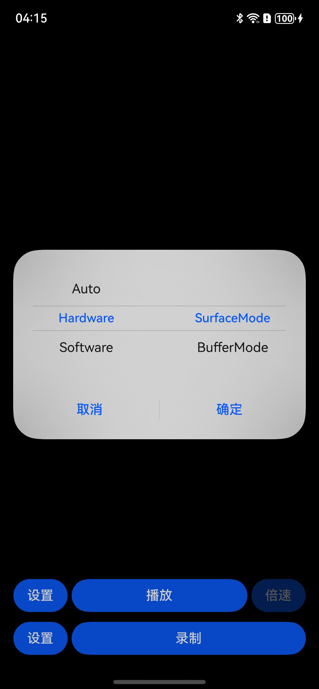
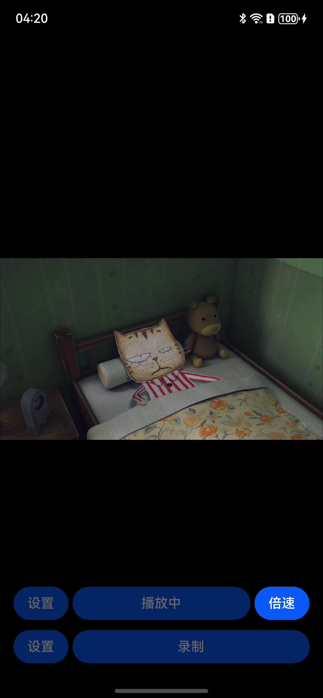
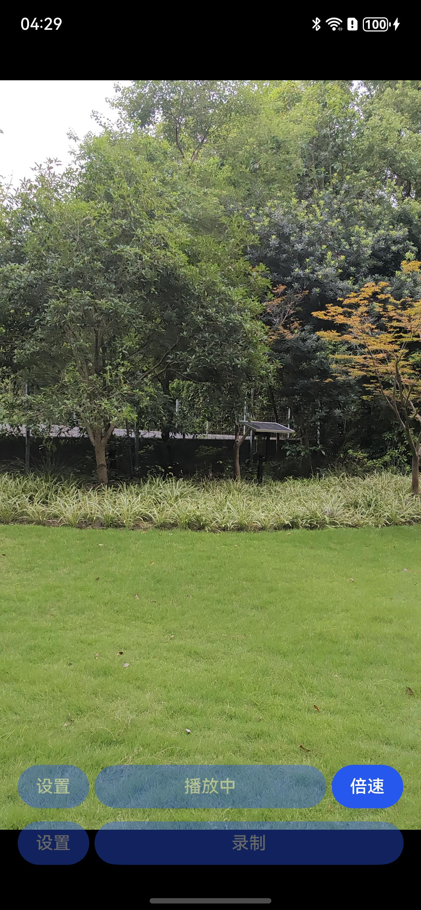

# AVCodecSample

### 介绍

AVCodec 部件示例 Sample，基于 API12 构建，提供视频播放（含音频）和录制的功能。

- 视频播放的主要流程是将视频文件通过解封装->解码->送显/播放。
- 视频录制的主要流程是相机采集->编码->封装成mp4文件。

### 播放支持的原子能力规格

| 媒体格式 | 封装格式             | 码流格式                                                                                                                                             |
|------|:-----------------|:-------------------------------------------------------------------------------------------------------------------------------------------------|
| 视频   | mp4、mkv、mpeg-ts等 | 视频码流：<br/>- 硬解：AVC(H.264)、HEVC(H.265)<br/>- 软解：MPEG2、MPEG4、H.263、AVC(H.264)<br/> 音频码流:<br/>AAC、MPEG(MP3)、Flac、Vorbis、AMR(amrnb、amrwb)、G711mu、APE |

更多格式[参考](https://gitee.com/openharmony/docs/blob/master/zh-cn/application-dev/media/avcodec/avcodec-support-formats.md#avcodec%E6%94%AF%E6%8C%81%E7%9A%84%E6%A0%BC%E5%BC%8F)

### 录制支持的原子能力规格

| 封装格式 | 视频编解码类型                 |
|------|-------------------------|
| mp4  | HEVC(H.265)、 AVC(H.264) |

更多格式[参考](https://gitee.com/openharmony/docs/blob/master/zh-cn/application-dev/media/avcodec/avcodec-support-formats.md#avcodec%E6%94%AF%E6%8C%81%E7%9A%84%E6%A0%BC%E5%BC%8F)

### 效果预览

| 播放（模式选择）                                  | 播放（选择播放路径）                                    | 播放（横屏）                                | 播放(竖屏)                                |
|-------------------------------------------|-----------------------------------------------|---------------------------------------|---------------------------------------|
|  |  |  |  |

| 播放（倍速）                                | 录制（选择相机分辨率）                                     | 录制（开始录制）                                  |
|---------------------------------------|-------------------------------------------------|-------------------------------------------|
|  |  |  |

### 使用说明

弹出是否允许“AVCodec”使用相机？点击“允许”

- 推送视频到文件管理？
  hdc file send xx.xx storage/media/100/local/files/Docs
- 推送视频到图库？
  hdc file send xx.mp4 storage/media/100/local/files
  hdc shell mediatool send /storage/media/100/local/files/xx.mp4

#### 播放

1. 推送文件到本地(可单独音频、单独视频、视频含音频)或点击下方“录制”，录制一个视频文件（无音频）

2. 点击播放按钮，选择从文件管理选取或从图库选取，点击确定，选择文件播放

3. 播放过程中，可长按播放窗口2倍速播放，松开原速播放，或点击播放按钮，选择指定倍速播放

#### 录制

1. （可选）设置-配置相机参数

2. 点击“录制”

3. 点击“保存”

4. 点击“开始录制”

5. 点击“停止录制”

### 目录

仓目录结构如下：

```
video-codec-sample/entry/src/main/          
├── cpp                                # Native层
│   ├── capbilities                    # 能力接口和实现
│   │   ├── include                    # 能力接口
│   │   ├── audio_capturer.cpp         # 音频采集实现
│   │   ├── audio_decoder.cpp          # 音频解码实现
│   │   ├── audio_encoder.cpp          # 音频编码实现
│   │   ├── demuxer.cpp                # 解封装实现
│   │   ├── muxer.cpp                  # 封装实现
│   │   ├── video_decoder.cpp          # 视频解码实现
│   │   └── video_encoder.cpp          # 视频编码实现
│   ├── common                         # 公共模块
│   │   ├── dfx                        # 日志
│   │   ├── sample_callback.cpp        # 编解码回调实现   
│   │   ├── sample_callback.h          # 编解码回调定义
│   │   └── sample_info.h              # 功能实现公共类  
│   ├── render                         # 送显模块接口和实现
│   │   ├── include                    # 送显模块接口
│   │   ├── plugin_manager.cpp         # 送显模块管理实现
│   │   └── plugin_render.cpp          # 送显逻辑实现
│   ├── sample                         # Native层
│   │   ├── player                     # Native层播放接口和实现
│   │   │   ├── Player.cpp             # Native层播放功能调用逻辑的实现
│   │   │   ├── Player.h               # Native层播放功能调用逻辑的接口
│   │   │   ├── PlayerNative.cpp       # Native层 播放的入口
│   │   │   └── PlayerNative.h         # 
│   │   └── recorder                   # Native层录制接口和实现
│   │       ├── Recorder.cpp           # Native层录制功能调用逻辑的实现
│   │       ├── Recorder.h             # Native层录制功能调用逻辑的接口
│   │       ├── RecorderNative.cpp     # Native层 录制的入口
│   │       └── RecorderNative.h       # 
│   ├── types                          # Native层暴露上来的接口
│   │   ├── libplayer                  # 播放模块暴露给UI层的接口
│   │   └── librecorder                # 录制模块暴露给UI层的接口
│   └── CMakeLists.txt                 # 编译入口       
├── ets                                # UI层
│   ├── common                         # 公共模块
│   │   └──utils                       # 共用的工具类
│   │       ├── CameraCheck.ets        # 相机能力查询
│   │       ├── DateTimeUtils.ets      # 获取当前时间
│   │       └── Logger.ts              # 日志工具
│   ├── CommonConstants.ets            # 参数常量
│   ├── entryability                   # 应用的入口
│   │   └── EntryAbility.ts            # 申请权限弹窗实现
│   ├── pages                          # EntryAbility 包含的页面
│   │   └── Index.ets                  # 首页/播放页面
│   └── sample                         # sample
│       └── recorder                   # 录制
│           └── Recorder.ets           # 录制页面
├── resources                          # 用于存放应用所用到的资源文件
│   ├── base                           # 该目录下的资源文件会被赋予唯一的ID
│   │   ├── element                    # 用于存放字体和颜色 
│   │   ├── media                      # 用于存放图片
│   │   └── profile                    # 应用入口首页
│   ├── en_US                          # 设备语言是美式英文时，优先匹配此目录下资源
│   └── zh_CN                          # 设备语言是简体中文时，优先匹配此目录下资源
└── module.json5                       # 模块配置信息
```

### 具体实现

#### *视频播放*

- 应用启动，Xcomponent加载， 触发OnSurfaceCreatedCB()， 此时能拿到一个surface，同时调用OH_NativeWindow_NativeWindowSetScalingModeV2接口给window配置一个自适应等比例拉伸原图像尺寸的Key，后续无论播放横屏视频还是竖屏视频，都不用更改XComponent的尺寸。
- 点击播放，选择文件后，能拿到文件fd，fileSize，根据拿到的fd和fileSize创建解封装器。
- 根据解封装器从文件中拿到的文件属性，创建对应的解码器，若走解码器的Surface模式，则要把之前拿到的surface也配置给解码器。
- 调用解码器Start，开始buffer轮转。buffer轮转时，由于buffer数量有上限，需要各个模块及时消费收到的buffer，否则会影响整体速度。
- 解码器Start调用后，首先会触发4次输入回调，里面会给应用OH_AVBuffer和其对应的index。
- 应用需要把待解码的码流，一帧帧填充到输入回调给到应用的OH_AVBuffer里的buffer地址里，然后调用OH_VideoDecoder_PushInputBuffer，传给解码器。
  ```text
  本示例里使用的是解封装器一键填充配置，若码流直送解码器：
  (1) 需要调用OH_AVBuffer_GetAddr获取OH_AVBuffer内buffer的内存地址，以进行之后的拷贝。
  (2) 可以调用OH_AVBuffer_GetCapacity获取OH_AVBuffer内buffer容量大小，避免拷贝越界。
  (3) 必须调用OH_AVBuffer_SetBufferAttr配置实际拷贝到OH_AVBuffer内buffer的实际size，按照规范，pts，offset，flags最好也配置对。
  (4) 给解码器的输入，要保证以下三点，才能正常解码：
        ①当前仅支持传入annexB格式帧，不支持avcc格式帧。
        ②确保buffer size正确传入。
        ③首帧要传XPS信息。（可以pps、sps和I帧同时传，也可以先传pps、sps，再传I帧）
            仅关键帧(I帧)：AVCODEC_BUFFER_FLAGS_SYNC_FRAME
            仅配置帧(pps，sps)：AVCODEC_BUFFER_FLAGS_CODEC_DATA
            是配置帧又是关键帧：AVCODEC_BUFFER_FLAGS_CODEC_DATA|AVCODEC_BUFFER_FLAGS_SYNC_FRAME
            普通帧(P帧):AVCODEC_BUFFER_FLAGS_NONE
  ```
- 待传给解码器解码完成后，会触发输出回调给应用。
  - 若是Surface模式，则输出侧实际的buffer只会在框架、解码器、surface侧轮转，回调给应用的OH_AVBuffer只是个壳子，里面会带一些flag，size等信息，以及应用在输入时配置的pts信息，但由于实际的buffer不会随着OH_AVBuffer回调给用户，所以Surface模式下调用OH_AVBuffer_GetAddr拿不到buffer的地址，不能直接拷贝解码后的buffer数据，如果有这个需求，则需把surface配置成NativeImage的window，调用NativeImage的接口获取。
  - 若是Buffer模式，实际的buffer会通过回调给到应用。由于buffer模式没法通过解码直接送显，本示例会将解码后的yuv/rgba图像dump到应用的沙箱目录/data/app/el2/100/base/com.samples.avcodecsample/haps/entry/files/haps/entry/files/下，应用可将此文件提取上来检验效果。
    ```text
    Surface里维护着一个surfaceBuffer队列，供生产者、消费者轮换使用，且生产者和消费者往往不在同一个进程。
      - 生产者的逻辑：
          · RequestBuffer：生产者获取一个空闲的、可以往里填数据的buffer，同时获取出这个buffer对应的releaseFence。当fence等到后，生产者可以往这块buffer里生产数据
          · FlushBuffer：生产者生产完后，将该buffer以及该buffer对应的acquireFence送回给surface。
          · CancelBuffer：生产者没有向该buffer里生产数据，仅做归还。
      - 消费者的逻辑：
          · AcquireBuffer: 消费者获取一个已生产好的buffer，同时获取出这个buffer对应的acquireFence。当fence等到后，消费者可以开始读取这块buffer里的内容。
          · ReleaseBuffer：消费者消费完成后将buffer以及该buffer对应的releaseFence归还给surface。
    ```
- 应用收到解码后的OH_AVBuffer后，需要及时调用OH_VideoDecoder_FreeOutputBuffer或OH_VideoDecoder_RenderOutputBuffer或OH_VideoDecoder_RenderOutputBufferAtTime释放归还buffer。
  ```text
  用RK3568设备播放，由于调用OH_NativeWindow_NativeWindowSetScalingModeV2接口后，实际未生效，最后显示画面可能会有拉伸，应用可以用另一种方法解决：
  在解封装拿到视频的宽高信息后，回调到UI层，UI层根据这个宽高，更改XComponet的尺寸，达到一样的效果，参考如下代码：
    import display from '@ohos.display'
    private display = display.getDefaultDisplaySync()
    @State xcomponentHeight: number | string | Resource = 1
    @State xcomponentWidth: number | string | Resource = 1
    
    if (data.videoWidth / data.videoHeight > this.display.width / this.display.height) {
      this.xcomponentHeight = (this.display.width * data.videoHeight / data.videoWidth) + 'px';
      this.xcomponentWidth = this.display.width + 'px';
    } else {
      this.xcomponent = this.display.height + 'px';
      this.xcompoentWidth = (this.display.height * data.videoWidth / data.videoHeight) + 'px'
    }
  ```


##### Buffer轮转
一、surface的buffer轮转

轮转方最多有四个：
- us ： hcodec/框架自己
- user : hcodec的调用者
- omx : vendor编解码器

surface: 在解码时，surface指消费者；编码时，surface指生产者

以解码器surface模式的某个输出buffer为例：

一开始是hcodec分配出来————owned by us

然后给到vendor(即us->omx)————owned by omx

vendor填好后还给hcodec(即omx->us)————owned by us

hcodec给到应用(即us->user)————owned by user

app等到音画同步后还给hcodec(即user->us)————owned by us

hcodec flushBuffer给surface， 让消费者消费(即us->surface)————owned by surface

消费者消费完后，hcodec去requestBuffer(即surface->us)————owned by us

给vendor(即us->omx)————owned by omx

其他模式不再赘述，直接看图表


#### *录制*

- 点击“设置”(可选)，设置相应的规格后，本示例会先校验当前的相机是否支持输出该规格的流，不支持则更改为默认的1080P的流，若1080P的流仍不支持，则更改为相机能输出配置流的第一个配置。
- 点击录制后，确定保存后，本示例会根据用户设置选择的配置(未选择则默认1080P)，首先创建一个该配置对应的编码器，同时创建好封装器，Surface模式下，编码器OH_VideoEncoder_GetSurface接口，会给应用一个OHNativeWindow **window，来接收编码输入。
- 使用这个window，调用OH_NativeWindow_GetSurfaceId接口，能拿到window对应的surface的surfaceId，此surfaceId用做相机的录像流的输出surfaceId。
- 把surfaceId回调到UI层，UI层拿到surfaceId后，携带主页配置的参数信息和surfaceId，路由跳转到录制页面。
- 录制页面构建时，XComponent构建时，会触发.onLoad()方法，此时能拿到Xcomonent对应的surface的surfaceId，此surfaceId用做相机的预览流的输出surfaceId。
- 有了两个surfaceId，和想要的相机配置，就能开始创建相机，开始录像了。
- 参考上文的buffer轮转，本示例在XComponent.onLoad()触发后，建立了一个相机生产，XComponent消费相机预览流，编码器消费相机录像流的生产消费模型，但此时编码器还未开始消费。
- 待用户在录像页面点击“开始录制”后，本示例才会调用编码器的OH_VideoEncoder_Start()方法，开始录像编码。
- 编码Surface，由surface生产端(本例是相机)直接往surface内flush SurfaceBuffer，surface内收到buffer后，编码器自动开始编码。
- 待编码完成后，会触发输出回调给应用，里面会带有每帧编码后的OH_AVBuffer和其对应的index。
- 此时应用可以调用OH_AVBuffer_GetAddr获取OH_AVBuffer内buffer的内存地址，OH_AVBuffer_GetBufferAttr获取编码后buffer的size等参数信息，本例是直接通过封装器，将其写入文件帧。
  ```text
  若使用RK3568相机录制，相机输出RGBA格式流到编码器Surface，实际flush到Surface里的buffer画面异常，导致最后的录像文件，播放起来的效果不对。
  ```


### 音画同步

#### 前言

##### 背景和目的

目前手机播放器在输出设备为蓝牙耳机时会出现严重音视频不同步现象， 严重影响用户体验。本文旨在指导第三方视频播放应用正确获取并使用音频相关信息来保证音视频同步。

精确的音视频同步是媒体播放的关键性能指标之一。一般来说，在录音设备上同时录制的音频和视频需要在播放设备（例如手机，电视，媒体播放器）上同时播放。为了实现设备上的音视频同步，可以按如下指南操作。

##### 概念定义

| Abbreviations缩略语 | Full spelling 英文全名      | Chinese explanation 中文解释 |
|------------------|:------------------------|:-------------------------|
| PTS              | Presentation Time Stamp | 送显时间戳                    |
| DTS              | Decoding Time Stamp     | 解码时间戳                    |

- DTS（解码时间戳）
  指音视频数据在解码器中开始解码的时间戳。它表示解码器应该从输入数据流中读取和解码的特定时间点。DTS用于控制解码器的解码顺序，确保音视频数据按照正确的顺序解码。
- PTS（显示时间戳）
  指音视频数据在播放时应该显示给用户的时间戳。它表示解码后的音视频数据在播放时应该出现在屏幕上或传递给音视频输出设备的时间点。PTS用于控制音视频的播放顺序和时序，以确保音视频在正确的时间点进行显示或播放。

##### 音画同步原理

音视频数据的最小处理单元称为帧。音频流和视频流都被分割成帧，所有帧都被标记为需要按特定的时间戳显示。音频和视频可以独立下载和解码，但就具有匹配时间戳的音频和视频帧应同时呈现，达到A/V同步的效果。


理论上，因为音频通路存在时延，匹配音频和视频处理，有三种A/V同步解决方案可用；

（1）连续播放音频帧：使用音频播放位置作为主时间参考，并将视频播放位置与其匹配。

（2）使用系统时间作为参考：将音频和视频播放与系统时间匹配。

（3）使用视频播放作为参考：让音频匹配视频。


| 策略名称        | 优点                                                  | 缺点                                                                       |
|-------------|:----------------------------------------------------|:-------------------------------------------------------------------------|
| 连续播放音频帧（推荐） | ①用户肉眼的敏感度较弱，不易察觉视频微小的调整。<br/>②容易实现，因为视频刷新时间的调整相对容易。 | ①如果视频帧率不稳定或延迟渲染大，可能导致视频卡顿或跳帧。                                            |
| 使用系统时间作为参考  | 可以最大限度地保证音频和视频都不发生跳帧行为。                             | ①需要额外依赖系统时钟，增加系统复杂性和维护成本。<br/>②系统时钟的准确性对同步效果影响较大，如果系统时钟不准确，可能导致同步效果大打折扣。 |
| 使用视频播放作为参考  | 音频可以根据视频帧进行调整，减少音频跳帧的情况。                            | ①音频播放可能会出现等待或加速的情况，相较于视频，会对用户的影响更为严重和明显。<br/>②如果视频帧率不稳定，可能导致音频同步困难。      |

第一个选项是唯一一个具有连续音频数据流的选项，没有对音频帧的显示时间、播放速度或持续时间进行任何调整。这些参数的任何调整都很容易被人的耳朵注意到，并导致干扰的音频故障，除非音频被重新采样；但是，重新采样也会改变音调。因此，一般的多媒体应用使用音频播放位置作为主时间参考。以下段落将讨论此解决方案。（其它两个选项不在本文档的范围内）

### 效果展示

#### 场景说明

#### 适用范围

适用于应用中视频播放过程中，由于设备渲染延迟、播放链路异常导致的音画不同步的场景

##### 场景体验指标

音画同步标准

① 为了衡量音画同步的性能，用对应音频和视频帧实际播放时间的差值作为数值指标，数值大于0表示声音提前画面，小于0表示声音落后画面。

② 最大卡顿时长，单帧图像停滞时间超过100ms的，定义为卡顿一次。连续测试5分钟，建议设置为100ms。

③ 平均播放帧率，平均每秒播放帧数，不反映每帧显示时长。

测试基准：一倍速场景

|        | 范围             | 主观体验 |
|--------|:---------------|:-----|
| S标（建议） | [-80ms, 25ms]  | 无法察觉 |
| A标     | [-125ms, 45ms] | 能够察觉 |
| B标     | [-185ms, 90ms] | 能够察觉 |

| 描述   | 应用内播放视频，音画同步指标应满足[-125ms, 45ms]。 |
|------|:---------------------------------|
| 类型   | 规则                               |
| 适用设备 | 手机、折叠屏、平板                        |
| 说明   | 无                                |

#### 场景分析

##### 典型场景及优化方案

**典型场景描述**
应用内播放视频，音画同步指标应满足[-80ms, 25ms].
**场景优化方案**
该解决方案使用：

- 视频同步到音频（主流方案）
- 获取音频渲染进度动态调整视频渲染进度

最终实现音画同步[-80ms,25ms]的效果。


**图2 音画同步示意图**


#### 场景实现

##### 场景整体介绍

音频和视频的管道必须同时以相同的时间戳呈现每帧数据。音频播放位置用作主时间参考，而视频管道只输出与最新渲染音频匹配的视频帧。对于所有可能的实现，精确计算最后一次呈现的音频时间戳是至关重要的。OS提供API来查询音频管道各个阶段的音频时间戳和延迟。

音频管道支持查询最新呈现的时间戳，getTimeStamp()
方法提供了一种简单的方法来确定我们要查找的值。如果时间戳可用，则audioTimestamp实例将填充以帧单位表示的位置，以及显示该帧时的估计时间。此信息可用于控制视频管道，使视频帧与音频帧匹配。

##### 接口说明

```cpp
/*
 * Query the the time at which a particular frame was presented.
 *
 * @since 10
 *
 * @param renderer Reference created by OH_AudioStreamBuilder_GenerateRenderer()
 * @param clockId {@link #CLOCK_MONOTONIC}
 * @param framePosition Pointer to a variable to receive the position
 * @param timestamp Pointer to a variable to receive the timestamp
 * @return Function result code:
 *         {@link AUDIOSTREAM_SUCCESS} If the execution is successful.
 *         {@link AUDIOSTREAM_ERROR_INVALID_PARAM}:
 *                                                 1.The param of renderer is nullptr;
 *                                                 2.The param of clockId invalid.
 *         {@link AUDIOSTREAM_ERROR_ILLEGAL_STATE} Execution status exception.
 */
OH_AudioStream_Result OH_AudioRenderer_GetTimestamp(OH_AudioRenderer* renderer,
    clockid_t clockId, int64_t* framePosition, int64_t* timestamp);
```

注意事项：

(1)
OH_AudioRenderer_Start到真正写入硬件有一定延迟，因此该接口在OH_AudioRenderer_Start之后过一会儿才会再拿到有效值，期间音频未发声时建议画面帧先按照正常速度播放，后续再逐步追赶音频位置从而提升用户看到画面的起搏时延。

(2)当framePosition和timeStamp稳定之前，调用可以比较频繁(如100ms)
，当以稳定的速度增长前进后，建议OH_AudioRenderer_GetTimestamp的频率不要太频繁，可以每分钟一次，最好不要低于500ms一次，因为频繁调用可能会带来功耗问题，因此在能保证音画同步效果的情况下，不需要频繁地查询时间戳。

(3)OH_AudioRenderer_Flush接口执行后，framePosition返回值会重新(从0)开始计算。

(4)OH_AudioRenderer_GetFramesWritten 接口在Flush的时候不会清空，该接口和OH_AudioRenderer_GetTimestamp接口并不建议配合使用。

(5)音频设备切换过程中OH_AudioRenderer_GetTimestamp返回的framePosition和timestamp不会倒退，但由于新设备写入有时延，会出现短暂时间内音频进度无增长，建议画面帧保持流程播放不要产生卡顿。

(6)
OH_AudioRenderer_GetTimeStamp获取的是实际写到硬件的采样帧数，不受倍速影响。对AudioRender设置了倍速的场景下，播放进度计算需要特殊处理，系统保证应用设置完倍速播放接口后，新写入AudioRender的采样点才会做倍速处理。

##### 关键代码片段

(1)获取音频渲染的位置

```cpp
// get audio render position
int64_t framePosition = 0;
int64_t timestamp = 0;
int32_t ret = OH_AudioRenderer_GetTimestamp(audioRenderer_, CLOCK_MONOTONIC, &framePosition, &timestamp);
AVCODEC_SAMPLE_LOGI("VD framePosition: %{public}li, nowTimeStamp: %{public}li", framePosition, nowTimeStamp);
audioTimeStamp = timestamp; // ns
```

(2)音频启动前暂不做音画同步

- 音频未启动前，timestamp和framePosition返回结果为0，为避免出现卡顿等问题，暂不同步

```cpp
// audio render getTimeStamp error, render it
    if (ret != AUDIOSTREAM_SUCCESS || (timestamp == 0) || (framePosition == 0)) {
        DumpOutput(bufferInfo);
        // first frame, render without wait
        ret = videoDecoder_->FreeOutputBuffer(bufferInfo.bufferIndex, sampleInfo_.codecRunMode ? false : true,
                                              GetCurrentTime());
        if (ret != AVCODEC_SAMPLE_ERR_OK) {
            AVCODEC_SAMPLE_LOGW("FreeOutputBuffer failed: %{public}d", ret);
            return false;
        }
        std::this_thread::sleep_until(lastPushTime + std::chrono::microseconds(sampleInfo_.frameInterval));
        lastPushTime = std::chrono::system_clock::now();
        return true;
    }
```

(3)根据视频帧pts和音频渲染位置计算延迟waitTimeUs

- audioPlayedTime音频帧期望渲染时间
- videoPlayedTime视频帧期望送显时间

```cpp
// after seek, audio render flush, framePosition = 0, then writtenSampleCnt = 0
int64_t latency = (audioDecContext_->frameWrittenForSpeed - framePosition) * 1000 *
                1000 / sampleInfo_.audioSampleRate / speed;
AVCODEC_SAMPLE_LOGI("VD latency: %{public}li writtenSampleCnt: %{public}li", latency, writtenSampleCnt);

nowTimeStamp = GetCurrentTime();
int64_t anchordiff = (nowTimeStamp - audioTimeStamp) / 1000;

// us, audio buffer accelerate render time
int64_t audioPlayedTime = audioDecContext_->currentPosAudioBufferPts - latency + anchorDiff;
// us, video buffer expected render time
int64_t videoPlayedTime = bufferInfo.attr.pts;

// audio render timestamp and now timestamp diff
int64_t waitTimeUs = videoPlayedTime - audioPlayedTime; // us
```

(4)根据业务延迟做音画同步策略

- [,-40ms) 视频帧较晚，此帧丢掉
- [-40ms,0ms)视频帧直接送显
- [0ms,)视频帧较早，根据业务需要选择现象追帧

```cpp
// video buffer is too late, drop it
if (waitTimeUs < WAIT_TIME_US_THRESHOLD_WARNING) {
    dropFrame = true;
    AVCODEC_SAMPLE_LOGI("VD buffer is too late");
} else {
    AVCODEC_SAMPLE_LOGE("VD buffer is too early waitTimeUs:%{public}ld", waitTimeUs);
    // [0, ), render it wait waitTimeUs, max 1s
    // [-40, 0), render it
    if (waitTimeUs > WAIT_TIME_US_THRESHOLD) {
        waitTimeUs = WAIT_TIME_US_THRESHOLD;
    }
    // per frame render time reduced by frame interval
    if (waitTimeUs > sampleInfo_.frameInterval + perSinkTimeThreshold) {
        waitTimeUs = sampleInfo_.frameInterval + perSinkTimeThreshold;
        AVCODEC_SAMPLE_LOGE("VD buffer is too early and reduced, waitTimeUs: %{public}ld", waitTimeUs);
    }
}
```

(5)进行音画同步
若视频帧的时间大于2倍vsync的时间，则需要sleep超过的时间。

```cpp
if (static_cast<double>(waitTimeUs) > VSYNC_TIME * LIP_SYNC_BALANCE_VALUE) {
    std::this_thread::sleep_for(std::chrono::microseconds(
        static_cast<int64_t>(static_cast<double>(waitTimeUs) - VSYNC_TIME * LIP_SYNC_BALANCE_VALUE)));
}
DumpOutput(bufferInfo);
int32_t ret = videoDecoder_->FreeOutputBuffer(bufferInfo.bufferIndex,
    sampleInfo_.codecRunMode ? false : !dropFrame,
    VSYNC_TIME * LIP_SYNC_BALANCE_VALUE * MS_TO_S + GetCurrentTime());
if (ret != AVCODEC_SAMPLE_ERR_OK) {
    AVCODEC_SAMPLE_LOGE("FreeOutputBuffer failed: %{public}d", ret);
    return false;
}
return true;
```

### 倍速播放方案

#### 当前问题


通过Audio GetTimeStamp拿到的Position始终是一倍速参考系下计算的，导致应用写下多倍速的音频帧后不清楚底层实际播放的原始位置。

**比如假设采样率是48k，应用写的frameIn A一共写了48000，2倍速后的frameOut A' 只有24000，
底层播了一半后返回给应用的position是12000 - 硬件latency(假设是100ms)
，也就是倍速后播了150ms，但应用实际播放的pts应该是24000-硬件latency×2 = 300ms**

Position表示的是音频帧，一个音频帧包括左右声道的采样点交织形成的数据包，比如双声道16bit采样点，一帧数据是4个字节，48k采样率的音频，一秒播放48000帧

应用一般音画同步做法：

视频每解码一帧，获取一下音频clock，视频帧永远跟随音频pts

#### **倍速的音频时间戳计算算法(此方法也同样适用于三方自研播放器)**

原理：记录每次setSpeed时的最后position状态作为基准，更新speed之后，按照上一次speed末尾的基准+数据delta×最新speed返回给应用

|     **时间线**     | **应用行为** |       **播放范围(写给AudioRender的数据)**        | **此刻音频服务处理的位置(frameOutC)** |                                            **pulseaudio实际返回的position**                                            | **audiorender矫正后返回给应用的值** |                       **音频PTS(假设起始时间是X)**                        |
|:---------------:|:--------:|:---------------------------------------:|:--------------------------:|:-----------------------------------------------------------------------------------------------------------------:|:-------------------------:|:----------------------------------------------------------------:|
|    **T0时刻**     |   先一倍速   |                 1-1000                  |            800             |                                                        600                                                        |            600            |                          X + 600/48000                           |
|    **T1时刻**     |  倍速调节成2  |                                         |                            |                       记录倍速调节之前写的位置<br/>lastSpeedX = 1000<br/>lastSpeedFramesWritten = 1000                        |                           |                                                                  |
|    **T2时刻**     |   2倍速    | 原始数据1001-2000，倍速后送给Audio服务的是(1001-1500) |            1400            |                                                       1200                                                        |                           |                                                                  |
| **计算T2时刻音频PTS** |          |                                         |                            | 1200如何倒推音源Position?<br/>实际位置=(position-lastSpeedIdx)*speed + lastSpeedFramesWritten<br/>(1200-1000)×2+1000 = 1400 |           1400            | X+1400/48000<br/>记录lastPosition = 1400<br/>lastPositionTime = T2 |
|  **视频出帧T2'时刻**  |          |                                         |                            |                                                                                                                   |                           |        送显delay = 视频PTS - (X + 1400 / 48000 + (T2' - T2)*2        |
|    **T3时刻**     |  倍速调节成3  |                                         |                            |                      记录倍速调节之前写的位置<br/>lastSpeedIdx = 1500<br/>lastSpeedFramesWritten = 2000                       |                           |                                                                  |
|    **T4时刻**     |   3倍速    | 原始数据2001-3500，倍速后送欸Audio服务的是(1501-2000) |            1600            |                                                       1400                                                        |                           |                                                                  |
| **计算T4时刻音频PTS** |          |                                         |                            |                                     1400 < 1500, 说明底层还在播老倍速的数据，复用上一次的音频pts做偏移                                     |      1400+(T4-T2)×2       |                    X+(lastPosition+(T4-T2)×2)                    |
|    **T5时刻**     |   3倍速    |            原始数据2001-3500 播放中            |            1900            |                                                       1700                                                        |                           |                                                                  |
| **计算T5时刻音频PTS** |          |                 Content                 |                            |             实际位置=(position-lastSpeedIdx)*speed + lastSpeedFramesWritten<br/>(1700-1500)×3+2000 = 2600             |           2600            |                           X+2600/48000                           |

### 环境配置
#### OpenHarmony
切换OpenHarmony工程，签名后运行，右下角报错：


通过文件-设置打开OpenHarmonySDK目录：


根据你的SDK version找到Local\OpenHarmony\Sdk\13\ets\api\device-define文件夹(此例为13)的default.json


这个就是你“default”类型的设备的system capability的要求

此例，缺这两个：

SystemCapability.HiviewDFX.HiDumper,

SystemCapability.Multimedia.AVSession.ExtendedDisplayCast.

那就打开json文件，删掉这个要求，保存再编，就行了

#### HarmonyOS
若切换成HarmonyOS工程，搜索runtimeOS，将OpenHarmony字段改成HarmonyOS，上面的sdkVersion，改成"5.0.0(12)"这样的形式(保留双引号),搜索删除abiFilters字段后的"armeabi-v7a"参数。

### 相关权限

#### [ohos.permission.CAMERA](https://docs.openharmony.cn/pages/v4.1/zh-cn/application-dev/security/AccessToken/permissions-for-all.md#ohospermissioncamera)
#### [ohos.permission.MICROPHONE](https://docs.openharmony.cn/pages/v4.1/zh-cn/application-dev/security/AccessToken/permissions-for-all.md#ohospermissionmicrophone)

### 依赖

XComponent Camera

### 约束与限制

1.本示例仅支持标准系统上运行，支持Phone, RK3568;

2.本示例为Stage模型，仅支持 API12 及以上版本SDK, SDK版本号5.0.0.19及以上版本,镜像版本号支持5.0.0.19及以上版本;

3.本示例需要使用DevEco Studio 5.0 才可编译运行。

### 下载
如需单独下载本工程，执行如下命令：
```text
git init
git config core.sparsecheckout true
echo code/BasicFeature/Media/AVCodec/ > .git/info/sparse-checkout
git remote add origin https://gitee.com/openharmony/applications_app_samples.git
git pull origin master
```
