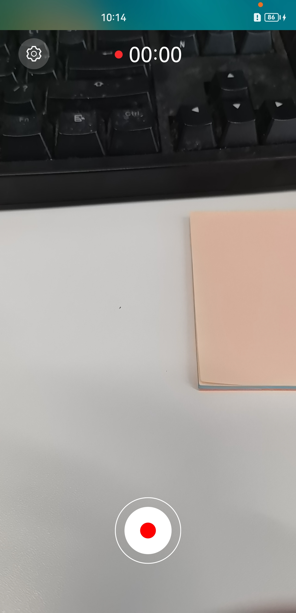

# 音视频录制

### 介绍

音视频录制应用是基于AVRecorder接口开发的实现音频录制和视频录制功能的应用，音视频录制的主要工作是捕获音频信号，接收视频信号，完成音视频编码并保存到文件中，帮助开发者轻松实现音视频录制功能，包括开始录制、暂停录制、恢复录制、停止录制、释放资源等功能控制。它允许调用者指定录制的图像size、音频采样频率等参数。

本示例主要使用@ohos.multimedia.media中的AVRecorder接口实现了录制功能；通过@ohos.file.fs接口支持，完成录制文件的创建，接口使用以及权限获取详见[文件管理](https://gitcode.com/openharmony/docs/blob/master/zh-cn/application-dev/reference/apis-core-file-kit/Readme-CN.md)。使用@ohos.multimedia.camera接口，实现了相机预览及出流功能，接口使用以及权限获取详见[相机管理](https://gitcode.com/openharmony/docs/blob/master/zh-cn/application-dev/reference/apis-camera-kit/arkts-apis-camera.md)。

### 效果预览

| 主页                                                         | 视频录制                                                     | 音频录制                                                     |
| ------------------------------------------------------------ | ------------------------------------------------------------ | ------------------------------------------------------------ |
|  |  |  |

使用说明

1. 在主界面，可以点击视频录制、音频录制进入对应功能界面。
2. 点击视频录制页面，进入页面呈现摄像头预览画面，用户可以通过点击左上角的设置图标进行视频分辨率参数设置，点击”开始“”暂停“”恢复“”停止“等对应图标按钮进行视频录控相关操作。
3. 点击音频录制页面，用户可以通过点击左上角的设置图标进行音频采样率参数设置，点击”开始“”暂停“”恢复“”停止“等对应图标按钮进行音频录控相关操作。
4. 在RK板硬件平台上，录制功能的性能可能受限，请在多种设备上进行测试以确保兼容性。

### 工程目录

```
entry/src/main/ets/
|---entryability
|   |---EntryAbility.ets                   // 能力生命周期管理
|---pages
|   |---AudioRecorder.ets                  // 音频录制页面
|   |---Index.ets                          // 首页，选择音频录制或者视频录制
|   |---VideoRecorder.ets                  // 视频录制页面
|---services
|   |---AVRecorderService.ets              // 音视频录制相关接口调用
|   |---CameraService.ets                  // 相机相关接口调用
|   |---CommonTypes.ets                    // 公共类型定义
|---utils
|   |---DateTimeUtil                       // 录制显示时间转换函数
|   |---Logger.ts                          // 封装的日志打印函数
|   |---RecorderFileUtil.ets               // 创建录制文件相关函数
```

### 具体实现

* 录控功能接口调用实现参考工程目录中的音频录制页面和视频录制页面
  * 调用create()、prepare()、getInputSurface()、start()、pause()、resume()、stop()、reset()、release()接口实现录制器的创建、准备、录控操作、重置、销毁实例等功能；
  * 视频录制[VideoRecorder.ets](entry/src/main/ets/pages/VideoRecorder.ets)调用Camera接口实现相机出流配合视频录制功能，相机的实现方法参考自相机接口[@ohos.multimedia.camera](https://gitcode.com/openharmony/docs/blob/master/zh-cn/application-dev/reference/apis-camera-kit/arkts-apis-camera.md)
* 调用文件基础服务接口实现创建录制文件代码在[RecorderFileUtil.ets](entry/src/main/ets/utils/RecorderFileUtil.ets)，实现方法参考[@ohos.file.fs](https://gitcode.com/openharmony/docs/blob/master/zh-cn/application-dev/reference/apis-core-file-kit/Readme-CN.md)接口说明

### 相关权限

开发者在进行录制功能开发前，需要先对所开发的应用配置相应权限，应用权限列表参考：[应用权限列表](https://gitcode.com/openharmony/docs/blob/master/zh-cn/application-dev/security/AccessToken/permissions-for-all-user.md)。

音视频录制涉及的权限包括：

1.允许应用使用麦克风：[ohos.permission.MICROPHONE](https://gitcode.com/openharmony/docs/blob/master/zh-cn/application-dev/security/AccessToken/permissions-for-all-user.md#ohospermissionmicrophone)

2.允许应用使用相机拍照和录制视频：[ohos.permission.CAMERA](https://gitcode.com/openharmony/docs/blob/master/zh-cn/application-dev/security/AccessToken/permissions-for-all-user.md#ohospermissioncamera)

3.允许应用读取用户外部存储中的媒体文件信息：[ohos.permission.READ_MEDIA](https://gitcode.com/openharmony/docs/blob/master/zh-cn/application-dev/security/AccessToken/permissions-for-all-user.md#ohospermissionread_media)

4.允许应用读写用户外部存储中的媒体文件信息：[ohos.permission.WRITE_MEDIA](https://gitcode.com/openharmony/docs/blob/master/zh-cn/application-dev/security/AccessToken/permissions-for-all-user.md#ohospermissionwrite_media)

5.允许应用获取设备位置信息：[ohos.permission.LOCATION](https://gitcode.com/openharmony/docs/blob/master/zh-cn/application-dev/security/AccessToken/permissions-for-all-user.md#ohospermissionlocation)

### 依赖

不涉及

### 约束与限制

1.本示例仅支持在标准系统上运行，支持设备：Phone。

2.本示例推荐使用当前最新版本的API和SDK编译运行。

3.本示例推荐使用当前最新版本的DevEco Studio。

4.相机、媒体库为系统接口，需要配置高权限签名，相关权限级别可查阅权限列表，需要配置系统应用签名，可以参考[特殊权限配置方法](https://gitcode.com/openharmony/docs/blob/master/zh-cn/application-dev/security/hapsigntool-overview.md)。

### 下载

如需单独下载本工程，执行如下命令：

```
git init
git config core.sparsecheckout true
echo code/BasicFeature/Media/AVRecorder-sta/ > .git/info/sparse-checkout
git remote add origin https://gitcode.com/openharmony/applications_app_samples.git
git pull origin master
```
