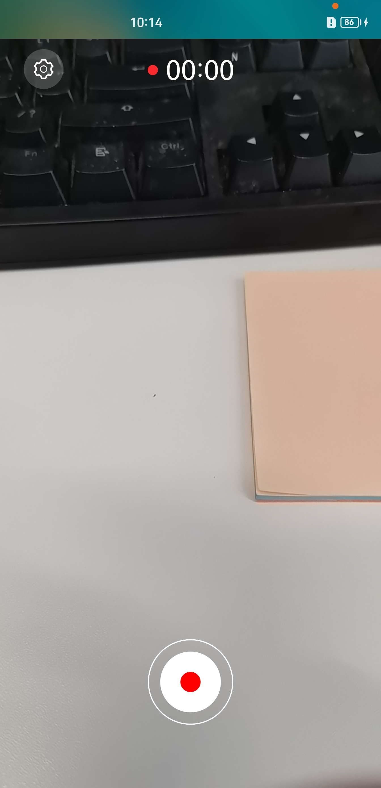

# AVRecorder

## 介绍

音视频录制应用是基于AVRecorder接口开发的实现音频录制和视频录制功能的应用，音视频录制的主要工作是捕获音频信号，接收视频信号，完成音视频编码并保存到文件中，帮助开发者轻松实现音视频录制功能，包括开始录制、暂停录制、恢复录制、停止录制、释放资源等功能控制。它允许调用者指定录制的编码格式、封装格式、文件路径等参数。

本示例主要使用@ohos.multimedia.media中的AVRecorder接口实现了录制功能；另外辅助使用@ohos.multimedia.medialibrary接口，实现了创建录制文件功能，接口使用以及权限获取详见[媒体库管理](https://gitee.com/openharmony/docs/blob/master/zh-cn/application-dev/reference/apis/js-apis-medialibrary.md)。使用@ohos.multimedia.camera接口，实现了相机预览及出流功能，接口使用以及权限获取详见[相机管理](https://gitee.com/openharmony/docs/blob/master/zh-cn/application-dev/reference/apis/js-apis-camera.md)。

### 效果预览

| 主页                                                         | 视频录制                                                     | 音频录制                                                     |
| ------------------------------------------------------------ | ------------------------------------------------------------ | ------------------------------------------------------------ |
|  |  |  |

使用说明

1. 在主界面，可以点击视频录制、音频录制进入对应功能界面；
2. 点击视频录制页面，进入页面呈现摄像头预览画面，用户可以通过点击左上角的设置图标进行视频分辨率参数设置，点击”开始“”暂停“”恢复“”停止“等对应图标按钮进行视频录控相关操作。
3. 点击音频录制页面，用户可以通过点击左上角的设置图标进行音频采样率参数设置，点击”开始“”暂停“”恢复“”停止“等对应图标按钮进行音频录控相关操作。

### 工程目录

```
entry/src/main/ets/
|---entryability
|   |---data                               // 能力生命周期管理
|---pages
|   |---ListPage.ets                       // 首页，选择音频录制或者视频录制
|---recorder
|   |---ARecorder.ets                      // 音频录制页面
|   |---VRecorder.ets                      // 视频录制页面
|---utils
|   |---DateTimeUtils                      // 录制显示时间转换函数
|   |---SaveCameraAsset.ets                // 创建录制文件相关函数
|   |---Logger.ets                         // 封装的日志打印函数
```

### 具体实现

* 录控功能接口调用实现在ARecorder.ets和VRecorder.ets
  * 调用create()、prepare()、getInputSurface()、start()、pause()、resume()、stop()、reset()、release()接口实现录制器的创建、准备、录控操作、重置、销毁实例等功能；
  * 视频录制VRecorder.ets调用Camera接口实现相机出流功能配合视频录制功能，相机的实现方法参考自相机接口@ohos.multimedia.camera
* 调用MediaLibrary实现创建录制文件代码在SaveCameraAsset.ets，实现方法参考@ohos.multimedia.medialibrary接口说明

### 相关权限

开发者在进行录制功能开发前，需要先对所开发的应用配置相应权限，应用权限列表参考：[ 应用权限列表]([zh-cn/application-dev/security/permission-list.md · OpenHarmony/docs - Gitee.com](https://gitee.com/openharmony/docs/blob/master/zh-cn/application-dev/security/permission-list.md))。权限配置相关内容可参考：[访问控制权限申请指导](https://gitee.com/openharmony/docs/blob/master/zh-cn/application-dev/security/accesstoken-guidelines.md)。

音视频录制涉及的权限包括：

ohos.permission.MICROPHONE

ohos.permission.CAMERA

ohos.permission.READ_MEDIA

ohos.permission.WRITE_MEDIA

ohos.permission.LOCATION

### 约束与限制

1.本示例仅支持在标准系统上运行，支持设备：Phone。

2.本示例仅支持API9版本SDK，版本号：3.2.10.8。本示例需要使用相机系统权限的系统接口，使用Full SDK时需要手动从镜像站点获取，并在DevEco Studio中替换，具体操作可参考[替换指南](https://gitee.com/openharmony/docs/blob/master/zh-cn/application-dev/quick-start/full-sdk-switch-guide.md)。

3.本示例需要使用DevEco Studio 3.1 (Build Version:3.1.0.200, built on Feburary 16, 2023)才可编译运行。

4.相机、媒体库为系统接口，需要配置高权限签名，相关权限级别可查阅权限列表，需要配置系统应用签名，可以参考[特殊权限配置方法](https://gitee.com/link?target=https%3A%2F%2Fdocs.openharmony.cn%2Fpages%2Fv3.2Beta%2Fzh-cn%2Fapplication-dev%2Fsecurity%2Fhapsigntool-overview.md%2F)。

### 下载

如需单独下载本工程，执行如下命令：

```
git init
git config core.sparsecheckout true
echo code/BasicFeature/Media/AVRecorder/ > .git/info/sparse-checkout
git remote add origin https://gitee.com/openharmony/applications_app_samples.git
git pull origin master
```
