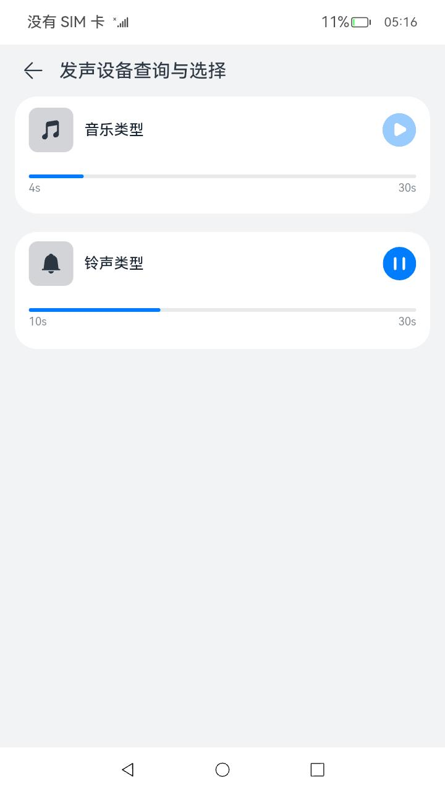

# 音频管理

### 介绍

本示例主要展示了音频的相关功能，使用[@ohos.multimedia.audio](https://gitee.com/openharmony/docs/blob/master/zh-cn/application-dev/reference/apis/js-apis-audio.md)等接口实现音频的发声设备的切换与查询和音频焦点功能

### 效果预览

|主页|发声设备查询与选择页面|音频焦点页面|
|--------------------------------|--------------------------------|--------------------------------|
|||||

使用说明

注意：6，7，8是连续的串行操作，不是并行的

1. 在主界面点击“发声设备查询与选择”按钮，进入发声设备查询与选择页面
2. 在发声设备查询与选择页面界面，展示当前发声设备类型名称
3. 在发声设备查询与选择页面界面，当设备存在“插入耳机”、“拔掉耳机”、“连接蓝牙”、“断开蓝牙”等操作行为时，当前发声设备类型名称会随之切换
4. 在发声设备查询与选择页面界面，点击“返回”按钮，回到主页
5. 在主界面点击“音频焦点”按钮，进入音频焦点页面
6. 在音频焦点页面，点击音乐播放器，音乐开始播放
7. 在音频焦点页面，点击铃声播放器，铃声开始播放，同时音乐被暂停
8. 在音频焦点页面，点击铃声播放器，停止铃声播放，音乐恢复播放
9. 在音频焦点页面，点击“返回”按钮，回到主页

### 工程目录

给出项目中关键的目录结构并描述它们的作用，示例如下：

```
entry/src/main/ets/
|---pages
|---|---Index.ets                           //首页
|---|---PreferOutputDevice.ets              //发声设备的查询与选择页面
|---|---Focus.ets                           //音频焦点页面
library/
|---Logger.ts                               //日志打印封装
```

### 具体实现

* 发声设备查询与切换功能都封装在PreferOutputDevice,源码参考：[PreferOutputDevice.ets](entry/src/main/ets/pages/PreferOutputDevice.ets)
    * 使用audioRenderer对象来播放一个通话类型的音频，只要进入发声设备查询与选择页面就进行播放，直到退出当前页面
    * 使用audio.getAudioManager()来获取音频管理对象audioManager，再通过audioManager.getRoutingManager()对象获取audioRoutingManager对象
    * 使用audioRoutingManager.getPreferOutputDeviceForRendererInfo()获取当前发声设备
    * 使用audioRoutingManager.on('deviceChange',audio.DeviceFlag.OUTPUT_DEVICES_FLAG)来监听设备上下线
    * 当收到监听消息后，重新调用audioRoutingManager.getPreferOutputDeviceForRendererInfo()接口来查询当前发声设备
* 音频焦点功能都封装Focus，源码参考：[Focus.ets](entry/src/main/ets/pages/Focus.ets)
    * 使用audio.createAudioRenderer()接口分别创建音乐类型和铃声类型的audioRenderer对象
    * 对每个render对象都调用audioRenderer.setInterruptMode(audio.InterruptMode.INDEPENDENT_MODE),完成独立焦点的设置
    * 对每个render对象都监听audioRenderer.on('audioInterrupt'),收到回调时，说明上前renderer对象被暂停或者恢复播放，据此更新UI状态，如果是恢复，则需要再次调用audioRenderer.start()和wirte()进行恢复播放
    * 对每个render对象都监听audioRenderer.on('stateChange'),收到回调时，说明上前renderer对象的状态被改变，据此更新UI状态
    * 使用audioRenderer.start()方法和audioRenderer.write()进行音频的播放处理，写入字节的长度由audioRenderer.getBufferSize()接口来决定
    * 使用audioRenderer.stop()进行音频的停止播放处理
    * 使用resourceManager.getRawFd()接口加载工程里面的resources\rawfile下面的音频文件资源获取对应的文件描述对象fileDescriptor,接口参考：[@ohos.resourceManager](https://gitee.com/openharmony/docs/blob/master/zh-cn/application-dev/reference/apis/js-apis-resource-manager.md#getrawfd9)
    * 根据文件描述对象，使用fs.read()接口进行音频数据读取，读取到的结果用于audioRenderer.write()的写入,接口参考：[@ohos.file.fs](https://gitee.com/openharmony/docs/blob/master/zh-cn/application-dev/reference/apis/js-apis-file-fs.md)

### 相关权限

不涉及。

### 依赖

不涉及。

### 约束与限制

1. 本示例仅支持标准系统上运行，支持设备：RK3568；
2. 本示例仅支持API10版本SDK，版本号：4.0.6.3；
3. 本示例需要使用DevEco Studio 3.1 Beta2 (Build Version: 3.1.0.400, built on April 7, 2023)才可编译运行；

### 下载

如需单独下载本工程，执行如下命令：

```
git init
git config core.sparsecheckout true
echo Audio/Audio/ > .git/info/sparse-checkout
git remote add origin https://gitee.com/openharmony/applications_app_samples.git
git pull origin master
```