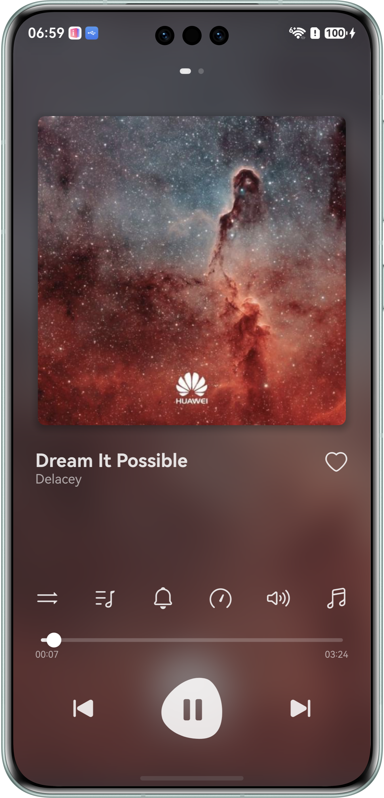
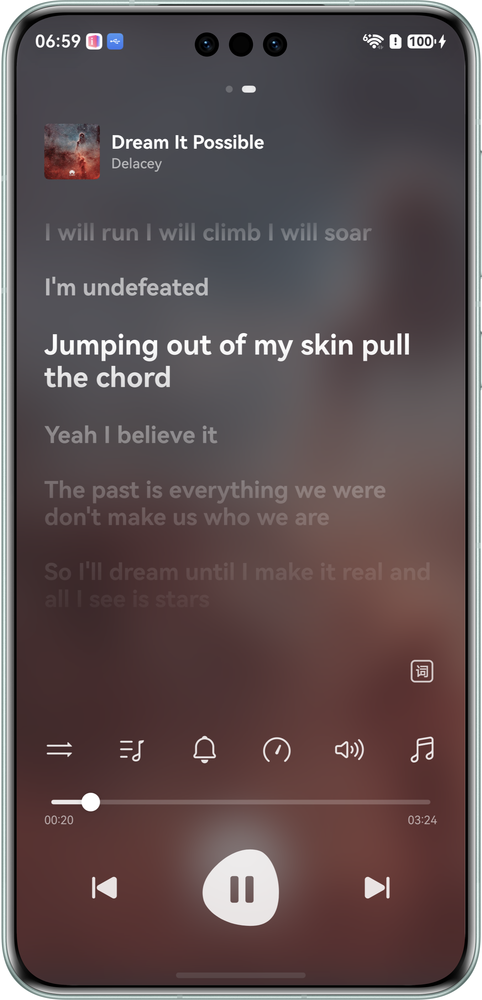
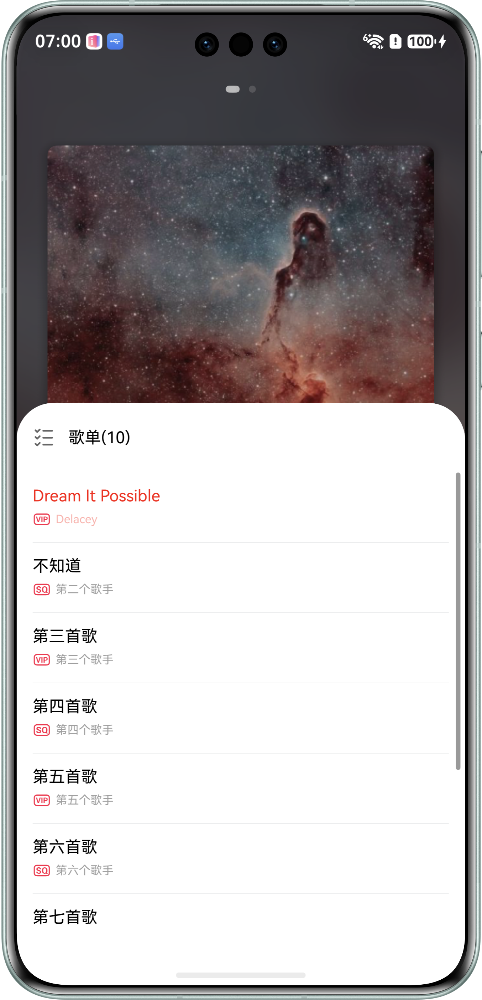
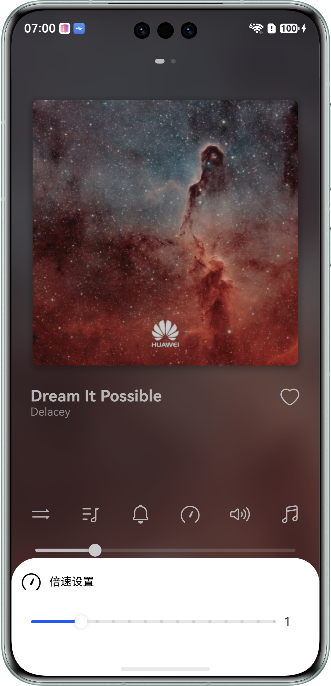

# 基于OHAudio播放PCM音频

## 项目简介

本场景解决方案主要面向前台音频开发人员。指导开发者基于OHAudio开发音频播放功能，OHAudio用于播放PCM（Pulse Code Modulation）音频数据，播放其他格式的音频文件会产生杂音。功能包括后台播放、和播控中心的交互、适配不同类型的焦点打断策略、切换输出设备、倍数播放、音量调节等基础音频常见功能。

## 使用说明

1. 播放功能：运行工程，进入首页后，点击底部播放按钮，可播放音乐。
2. 切歌功能：播放按钮两侧有切歌按钮，点击切换上一首下一首。
3. 进度跳转功能：推动播放按钮上面的播放条，可以调整歌曲进度。
4. 循环模式：点击进度条上部，左侧第一个图标，可以切换不同播放模式，支持的模式有“顺序播放”、“单曲循环”、“随机播放”。
5. 歌单列表：点击进度条上部，左侧第二个图标，可以打开歌曲列表，点击歌曲名称，可以切换播放歌曲。
6. 静音播放：点击进度条上部，左侧第三个图标，可以打开静音播放功能。
7. 倍数设置：点击进度条上部，左侧第四个图标，可以调整歌曲播放速度。
8. 音量设置：点击进度条上部，左侧第五个图标，可以调整歌曲播放音量。
9. 自定义音效设置：点击进度条上部，左侧第六个图标，可以打开自定义音效功能。
10. 收藏：点击页面“爱心”图标，将歌曲变成已收藏状态，可以同步至播控中心。

## 效果预览

| 主页面                                                | 歌词页                                                | 歌单列表                                                  | 倍数设置                                               |
|----------------------------------------------------|----------------------------------------------------|-------------------------------------------------------|----------------------------------------------------|
|  |  |  |  |

## 工程目录

```
├──entry/src/main/ets/                                     // ArkTS代码目录
│  ├──common                                               // 公共模块
│  │  ├──constants                                         // 常量
│  │  │  ├──BreakpointConstants.ets                        // 断点常量
│  │  │  ├──ContentConstants.ets                           // 内容常量
│  │  │  ├──LyricConst.ets                                 // 歌词常量
│  │  │  ├──PlayerConstants.ets                            // 播放常量
│  │  │  └──StyleConstants.ets                             // 样式常量
│  │  └──utils                                             // 工具函数
│  │     ├──mediautils                                     // 媒体方法
│  │     │  ├──AVSessionController.ets                     // 播控中心控制类
│  │     │  ├──MediaControlCenter.ets                      // 媒体控制中心类
│  │     │  ├──MediaControlCenterCallbackAction.ets        // 媒体控制中心回调函数响应类
│  │     │  ├──MediaControlCenterHandle.ets                // 媒体控制中心句柄类
│  │     │  └──MediaTools.ets                              // 媒体工具处理类
│  │     ├──BackgroundUtil.ets                             // 后台任务类
│  │     ├──BreakpointSystem.ets                           // 断点系统类
│  │     ├──ColorConversion.ets                            // 颜色转换类
│  │     ├──Logger.ets                                     // 日志类
│  │     ├──LrcUtils.ets                                   // 歌词工具类
│  │     ├──PreferencesUtil.ets                            // 首选项工具类
│  │     └──ResourceConversion.ets                         // 资源工具类
│  ├──component                                            // 组件
│  │  └──CustomButton.ets                                  // 公共按钮组件
│  ├──entryability                                         // Ability入口
│  │  ├──EntryAbility.ets                                  // Ability的生命周期回调内容
│  │  └──InsightIntentExecutorImpl.ets                     // 意图框架回调内容
│  ├──entrybackupability                                   // 备份Ability
│  │  └──EntryBackupAbility.ets                            // EntryBackupAbility的生命周期回调内容
│  ├──model                                                // 数据模型
│  │  └──SongListData.ets                                  // 歌单列表数据
│  ├──pages                                                // 页面
│  │  └──Index.ets                                         // 首页
│  ├──view                                                 // 视图组件
│  │  ├──ControlAreaComponent.ets                          // 控制区域组件
│  │  ├──LrcView.ets                                       // 歌词显示组件
│  │  ├──LyricsComponent.ets                               // 歌词组件
│  │  ├──MusicInfoComponent.ets                            // 音乐详情组件
│  │  └──PlayerInfoComponent.ets                           // 播放详情组件
│  └──viewmodel                                            // 视图模型
│     ├──LrcEntry.ets                                      // 歌词数据类型
│     ├──SongData.ets                                      // 歌曲基础数据类型
│     ├──SongDataSource.ets                                // 歌曲列表数据源
│     └──SongItemBuilder.ets                               // 歌曲列表数据构造
├──entry/src/main/cpp/                                     // C++代码目录
│  ├──CMakeLists.txt                                       // CMake构建配置
│  ├──oh_audio_playing_ndk.cpp                             // NAPI接口封装
│  ├──player                                               // 播放器实现
│  │  ├──audio_buffer_queue.cpp                            // 音频缓冲队列实现
│  │  ├──audio_buffer_queue.h                              // 音频缓冲队列头文件
│  │  ├──oh_audio_playing.cpp                              // OHAudio播放实现
│  │  └──oh_audio_playing.h                                // OHAudio播放头文件
│  └──types                                                // 类型定义
│     └──libentry                                          // NAPI类型
│        ├──Index.d.ts                                     // 类型声明文件
│        └──oh-package.json5                               // 包配置文件
├──entry/src/main/resources/                               // 资源目录
│  ├──base                                                 // 基础资源
│  │  ├──element                                           // 元素资源
│  │  ├──media                                             // 媒体资源
│  │  └──profile                                           // 配置文件
│  ├──dark                                                 // 深色模式资源
│  │  └──element                                           // 深色模式元素
│  ├──en_US                                                // 英文资源
│  │  └──element                                           // 英文元素
│  ├──zh_CN                                                // 中文资源
│  │  └──element                                           // 中文元素
│  └──rawfile                                              // 原始文件
│     └──lrcfiles                                          // 歌词文件目录
├──entry/src/mock/                                         // Mock目录
│  └──mock-config.json5                                    // Mock配置文件
├──entry/src/ohosTest/                                     // 测试目录
└──ohosTest.md                                             // 测试用例文档
```

## 具体实现

1. 播放功能：本文使用OHAudio接口实现音频播放功能。从rawfile目录下获取pcm文件后，通过OHAudio接口实现播放功能。
2. 倍速、音量、静音模式功能调用的是OHAudio自身的接口，详细接口使用可见具体代码。
3. 循环模式和收藏模式的状态切换，依赖本地数据和AVSession交互，达到应用内界面和播控中心状态的同步。

## 相关权限

1. 后台任务权限：ohos.permission.KEEP_BACKGROUND_RUNNING。

## 依赖

不涉及

## 约束与限制

1. 本示例仅支持标准系统上运行，支持设备：直板机。
2. HarmonyOS系统：HarmonyOS 6.0.2 Release及以上。
3. DevEco Studio版本：DevEco Studio 6.0.2 Release及以上。
4. HarmonyOS SDK版本：HarmonyOS 6.0.2 Release SDK及以上。

## 下载

如需单独下载本工程，执行如下命令：

```
git init
git config core.sparsecheckout true
echo code/BasicFeature/Media/AudioMusicPlayer > .git/info/sparse-checkout
git remote add origin https://gitee.com/openharmony/applications_app_samples.git
git pull origin master
```