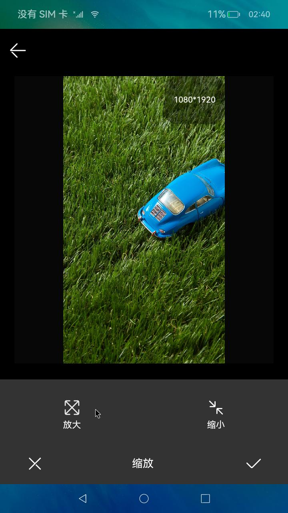
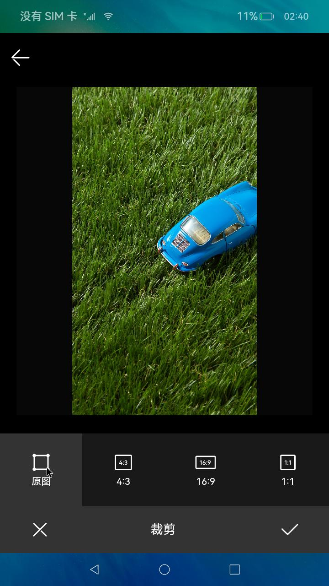
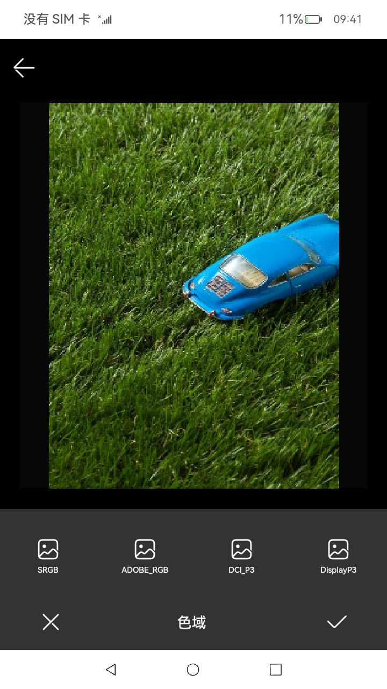

# Image Processing

### Introduction

This sample demonstrates the image processing function.

In this sample, [\<TextArea>](https://gitee.com/openharmony/docs/blob/master/en/application-dev/reference/apis-arkui/arkui-ts/ts-basic-components-textarea.md) is used to implement multi-line text input, [@ohos.app.ability.common](https://gitee.com/openharmony/docs/blob/master/en/application-dev/reference/apis-ability-kit/js-apis-app-ability-common.md) is used to obtain images from albums, [@ohos.multimedia.image](https://gitee.com/openharmony/docs/blob/master/en/application-dev/reference/apis-image-kit/js-apis-image.md) is used to generate pixel maps, and **scale()**, **crop()**, and **rotate()** of the **pixelMap** class are used to scale, crop, and rotate images.

### Usage

1. Touch **Add image** on the offering review page. The page for selecting images is displayed.

2. Select the images to be displayed. You can select six images at most.

3. Select an image and touch **Next**. The image editing page is displayed. To scale an image, touch **scale** and then touch **narrow** or **amplification**. To crop the image, touch **crop** and select a crop ratio. To rotate the image, touch **rotate**.To decode the image, touch **update hdr setting**.

4. After finishing editing the image, touch **OK**. The page for posting comments is displayed, with the images shown. You can touch **Add image** to add more images.

5. Select an image and touch **Next**. The image editing page is displayed.

6. Touch the back button to exit the app.

### Preview

  

### Required Permissions

[ohos.permission.READ_IMAGEVIDEO](https://gitee.com/openharmony/docs/blob/master/en/application-dev/security/AccessToken/restricted-permissions.md)

[ohos.permission.WRITE_IMAGEVIDEO](https://gitee.com/openharmony/docs/blob/master/en/application-dev/security/AccessToken/restricted-permissions.md)

[ohos.permission.MEDIA_LOCATION](https://gitee.com/openharmony/docs/blob/master/en/application-dev/security/AccessToken/permissions-for-all.md#ohospermissionmedia_location)

### Dependency

N/A

### Constraints

1. This sample can only be run on standard-system devices that use the Rockchip RK3568 chip.

2. This sample is based on the stage model, which is supported from API version 12 (API Version 12 5.0.0.26). 

3. DevEco Studio (4.1.3.500) must be used.
