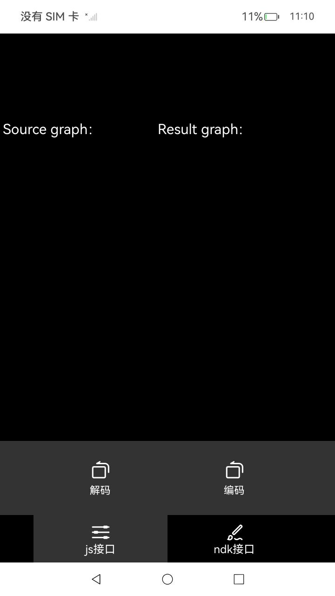
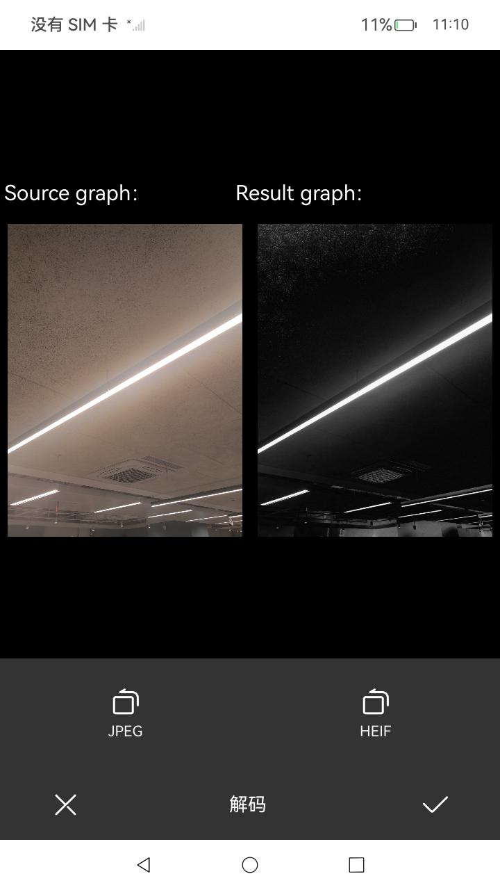
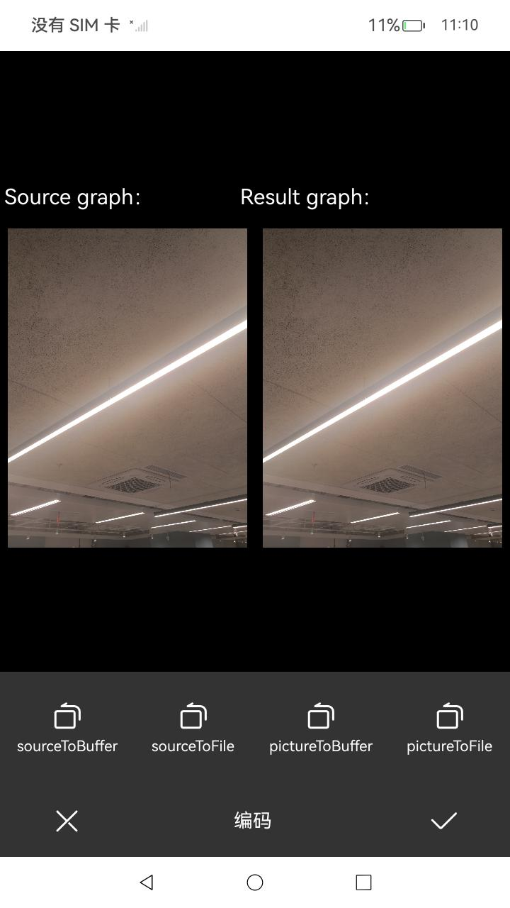

# 图片编辑

### 介绍

本示例使用 [TextArea](https://gitee.com/openharmony/docs/blob/master/zh-cn/application-dev/reference/apis-arkui/arkui-ts/ts-basic-components-textarea.md)
实现多文本输入，使用 [@ohos.app.ability.common](https://gitee.com/openharmony/docs/blob/master/zh-cn/application-dev/reference/apis-ability-kit/js-apis-app-ability-common.md)
依赖系统的图库引用，实现在相册中获取图片，使用 [@ohos.multimedia.image](https://gitee.com/openharmony/docs/blob/master/zh-cn/application-dev/reference/apis-image-kit/js-apis-image.md)
生成pixelMap，使用pixelMap的scale()，crop()，rotate()接口实现对图片的缩放，裁剪，旋转功能。
使用[@ohos.effectKit](https://gitee.com/openharmony/docs/blob/master/zh-cn/application-dev/reference/apis-arkgraphics2d/js-apis-effectKit.md)
生成effectKit,使用effectKit.getHighestSaturationColor()
接口实现对图片的高亮调节。添加文字/贴纸，利用组件的组合编辑素材大小和位置，再使用OffscreenCanvasRenderingContext2D进行离屏绘制保存。
接口实现对图片编解码功能。可以通过uri\fd\data\rawFile将图片资源解码为ImageSource或pixelMap或多图对象。可通过ImageSource/pixelMap/多图对象编码为file/data。

### 效果预览

| 编辑删除                                            | 图片调整                                                | 图片标记                                            | 
|-------------------------------------------------|-----------------------------------------------------|-------------------------------------------------|
|  |  |  |

| 图片裁剪                                            | 图片缩放                                              | 图片旋转                                                | 
|-------------------------------------------------|---------------------------------------------------|-----------------------------------------------------|
|  |  |  |

| 图片亮度调节                                              | 图片添加贴纸                                                | 图片添加文字                                          | 图片色域调节                                                      | 修改hdr设置                                               |
|-----------------------------------------------------|-------------------------------------------------------|-------------------------------------------------|-------------------------------------------------------------|-------------------------------------------------------|
|  |  |  |  |  |

| 主界面                                           | 多图操作                                                | 多图解码                                              | 多图编码                                              |
|-----------------------------------------------|-----------------------------------------------------|---------------------------------------------------|---------------------------------------------------|
|  |  |  |  |

使用说明：

1. 发表评价页面点击添加图片/照片，页面跳转到图片选择页面；
2. 进入图片选择页面后，选择需要显示的图片；
3. 选中图片后，页面会跳转到发表评价页面，点击图片跳转到图片编辑删除页面，点击编辑进入到编辑功能页；
4. 调整菜单有裁剪、缩放、旋转、调色、修改hdr设置功能(因为有些机型设备不支持，所以HDR解码后显示效果看不出来)；
5. 标记菜单有添加文字、添加贴纸功能；
6. 编辑完成后，点击撤回按钮图片会还原到上一个编辑状态；
7. 图片编辑完成后，点击保存，页面会跳转到发表评价页面，显示相关照片；
8. 点击返回按钮，退出应用。
9. 进入应用主页面点击多图操作按钮，跳转到多图操作界面；
10. 多图操作分为js流和native流，点击js接口，选择解码操作，再选择解码图片类型JPEG或HEIF(rk3568开发板不支持HEIF解码)，点击后会出现被解码的图片和解码后的图片，两张图片一致；
11. 点击js/native接口，选择编码操作，再选择编码图片的类型，比如sourceToBuffer表示编码入参是ImageSource，出参是buffer；

### 工程目录

```
entry/src/main/ets/
|---pages
|   |---EditImages.ets                       // 图片编辑
|   |---GetPictrues.ets                      // 图片选择
|   |---Index.ets                            // 首页
|   |---PicturePages.ets                     // 多图操作
|   |---UpadatePages.ets                     // 编辑删除界面
photomodify/src/main/ets/components
|---featrue
|   |---ComputeFeature.ets                   // 计算功能
|   |---PixelMapQueue.ets                    // PixelMap队列
|---model
|   |---AdjustData.ets                       // 功能数据
|   |---AdjustModels.ets                     // 功能模型
|   |---MaterialData.ets                     // 素材数据
|   |---MaterialModels.ets                   // 素材模型
|---pages
|   |---EditImage.ets                        // 图片编辑
|   |---InputTextDialog.ets                  // 输入框弹窗
|   |---MaterialEdit.ets                     // 素材编辑组件
|   |---ScalePhotoPage.ets                   // 图片缩放
|   |---ColorSpacePage.ets                   // 色域修改
|   |---PictureOptions.ets                   // 多图操作
|   |---UpdatePage.ets                       // 编辑删除界面
|---util     
|   |---CoordinatesUtil.ets                  // 转换坐标系    
|   |---CopyObj.ets                          // 对象克隆     
|   |---ImageUtil.ets                        // 图片宽高处理               
|   |---PictureUtil.ets                      // 多图编解码操作帮助类  
|   |---Logger.ets                           // 日志工具
|   |---MediaUtil.ts                         // 媒体帮助类
|   |---SvgUtil.ts                           // svg操作帮助类
|   |---FileUtil.ets                         // 多图、图片编解码操作帮助类
```

### 具体实现

+ 图片选择功能在GetPictures中实现，源码参考[GetPictures.ets](entry%2Fsrc%2Fmain%2Fets%2Fpages%2FGetPictures.ets):
    + 图片选择：首先使用[@ohos.file.photoAccessHelper](https://gitee.com/openharmony/docs/blob/master/zh-cn/application-dev/reference/apis-media-library-kit/js-apis-photoAccessHelper.md)拉起图库选择图片，然后将选择的图片用select数组保存路径，展示到页面便于选择，选择完跳转到首页，点击一张图片，进入到编辑删除界面。
    
+ 图片编辑功能在EditImage中实现，源码参考[EditImage.ets](photomodify%2Fsrc%2Fmain%2Fets%2Fcomponents%2Fpages%2FEditImage.ets):
    + 图片编辑：图片编辑权限需要使用[requestPermissionsFromUser](https://gitee.com/openharmony/docs/blob/master/zh-cn/application-dev/reference/apis-ability-kit/js-apis-abilityAccessCtrl.md#requestpermissionsfromuser9)
    申请，源码参考[MainAbility.ets](entry/src/main/ets/MainAbility/MainAbility.ets)
    ，首先根据选择图片获取到的uri打开图片文件，fileAsset.open选择‘rw'读写模式，然后使用image.createImageSource创建图片源实例，接下来使用createPixelMap创建PixelMap对象，便于处理图片，最后使用crop对图像进行裁剪处理，使用scale对图像进行缩放处理，rotate进行旋转处理。亮度调节使用effectKit.getHighestSaturationColor()
    接口实现对图片的高亮调节。图片解码通过createPixelMap(DecodingOptions)，并根据DecodingOptions构造参数里面的设定值(0: auto;1: SDR;2 HDR)，对应创建不同的PixelMap对象。其中设置值为AUTO时，会根据图片本身结构来判断是否解码为HDR内容。添加文字/贴纸，编辑模式下，使用组件组合（Image、Shape、Text）进行交互完成素材大小和位置选择；编辑确认后，再使用OffscreenCanvasRenderingContext2D进行离屏绘制，保存为新的pixelMap。
    
+ 图片编解码功能在Image中实现，源码参考[Image.cpp](photomodify/src/main/cpp/Image.cpp):

    + 图片解码：调用OH_ImageSourceNative_CreateFromUri，OH_ImageSourceNative_CreateFromFd，
        OH_ImageSourceNative_CreateFromData，OH_ImageSourceNative_CreateFromRawFile等接口，根据接收不同的参数调用不同的接口来创建ImageSource对象。
        再通过OH_ImageSourceNative_CreatePixelmap接口将ImageSource转换为新的pixelMap。
    + 图片编码：通过调用OH_ImagePackerNative_PackToFileFromPixelmap，OH_ImagePackerNative_PackToFileFromImageSource，
        OH_ImagePackerNative_PackToDataFromPixelmap，OH_ImagePackerNative_PackToDataFromImageSource等接口，可以将ImageSource或pixelMap编码为file/data。

+ JS多图解码、编码操作在PictureOptions中实现，源码参考[PictureOptions.ets](photomodify/src/main/ets/components/pages/PictureOptions.ets):

    + 前置条件： 存放多图图片路径[uri](photomodify/src/main/resources/rawfile/HdrVivid.jpg)包括(JPEG、HEIF)，调用context.resourceManager.getRawFileContent(uri)、image.createImageSource(buffer)等接口创建ImageSource对象.

    + 多图解码： 通过imageSource.createPicture(DecodingOptionsForPicture)接口并根据DecodingOptionsForPicture构造参数里面的设定值(1: GAINMAP)解码图片中对应的辅助图，并生成多图对象.

    + 多图编码:  通过Image.createImagePacker()构建一个ImagePacker实例.其次，通过imagePacker.packToFile(ImageSource, fd, PackingOption)、imagePacker.packing(ImageSource, PackingOption)、imagePacker.packToFile(Picture, fd, PackingOption)、imagePacker.packing(Picture, PackingOption)可以将ImageSource或多图对象编码为buffer/图片文件。

    + 多图显示： 调用Picture.getAuxiliaryPicture(AuxiliaryPictureType并根据AuxiliaryPictureType构造参数里面的设定值(1: GAINMAP))获取多图对象中的辅助图对象.再调用AuxiliaryPicture.readPixelsToBuffer()、image.createPixelMapSync()接口将辅助图对象转成pixelmap显示到屏幕上.
  
+ Native多图解码、编码操作在Image中实现，源码参考[Image.cpp](photomodify/src/main/cpp/Image.cpp):

  + 前置条件： 存放多图图片路径[uri](photomodify/src/main/resources/rawfile/HdrVivid.jpg)包括(JPEG、HEIF)，调用context.resourceManager.getRawFileContent接口创建ImageSource对象.

  + 多图解码： 通过OH_DecodingOptionsForPicture_Create接口并根据OH_DecodingOptionsForPicture_SetDesiredAuxiliaryPictures构造参数里面的设定值(1: GAINMAP)解码图片中对应的辅助图，并生成多图对象.

  + 多图编码： 通过OH_ImagePackerNative_Create构建一个ImagePacker实例，通过OH_PackingOptions_Create创建编码参数.其次，通过OH_ImagePackerNative_PackToDataFromPicture，OH_ImagePackerNative_PackToFileFromPicture，OH_ImagePackerNative_PackToDataFromImageSource，OH_ImagePackerNative_PackToFileFromImageSource可以将ImageSource或多图对象编码为buffer/图片文件。

  + 多图显示： 调用OH_PictureNative_GetGainmapPixelmap获取多图对象中的GAINMAP辅助图对象.再调用AuxiliaryPicture.readPixelsToBuffer()、image.createPixelMapSync()接口将辅助图对象转成pixelmap显示到屏幕上.

### 相关权限

[ohos.permission.READ_IMAGEVIDEO](https://gitee.com/openharmony/docs/blob/master/zh-cn/application-dev/security/AccessToken/permissions-for-system-apps.md#ohospermissionread_imagevideo)

[ohos.permission.WRITE_IMAGEVIDEO](https://gitee.com/openharmony/docs/blob/master/zh-cn/application-dev/security/AccessToken/permissions-for-system-apps.md#ohospermissionread_imagevideo)

[ohos.permission.MEDIA_LOCATION](https://gitee.com/openharmony/docs/blob/master/zh-cn/application-dev/security/AccessToken/permissions-for-all.md#ohospermissionmedia_location)

### 依赖

不涉及。

### 约束与限制

1. 本示例仅支持标准系统上运行，支持设备：RK3568;
2. 本示例为Stage模型，已适配API version 14版本SDK，SDK版本号(API Version 14 5.0.2.43),镜像版本号(5.0.2.43);
3. 本示例需要使用DevEco Studio NEXT Release(Build Version: 5.0.3.900, built on October 8, 2024)版本才可编译运行;

### 下载

如需单独下载本工程，执行如下命令：

```
git init
git config core.sparsecheckout true
echo code/BasicFeature/Media/Image/ > .git/info/sparse-checkout
git remote add origin https://gitee.com/openharmony/applications_app_samples.git
git pull origin master
```
