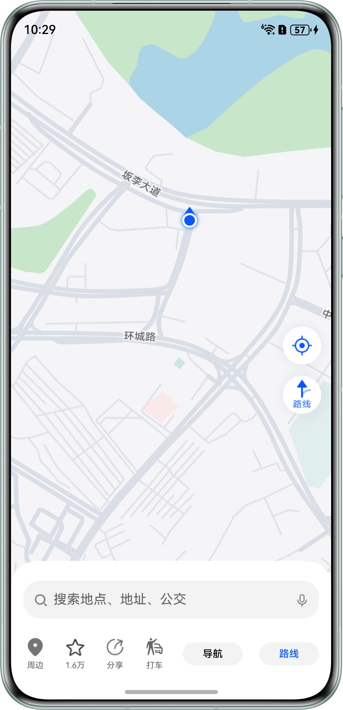
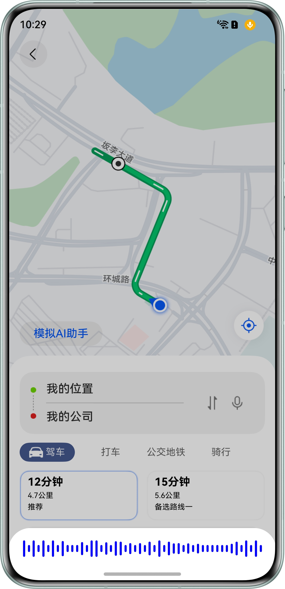
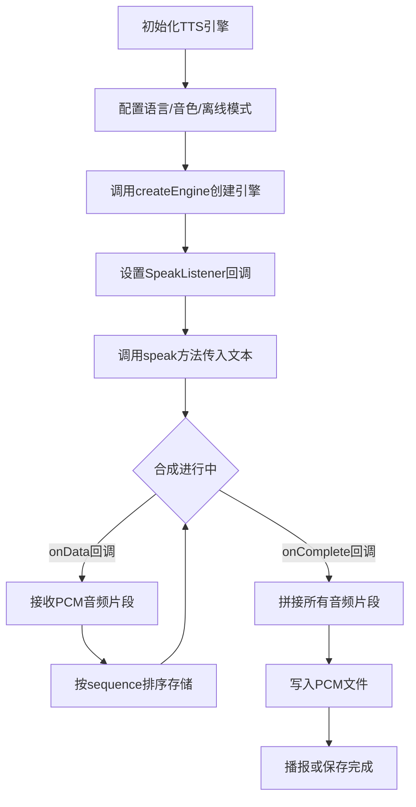
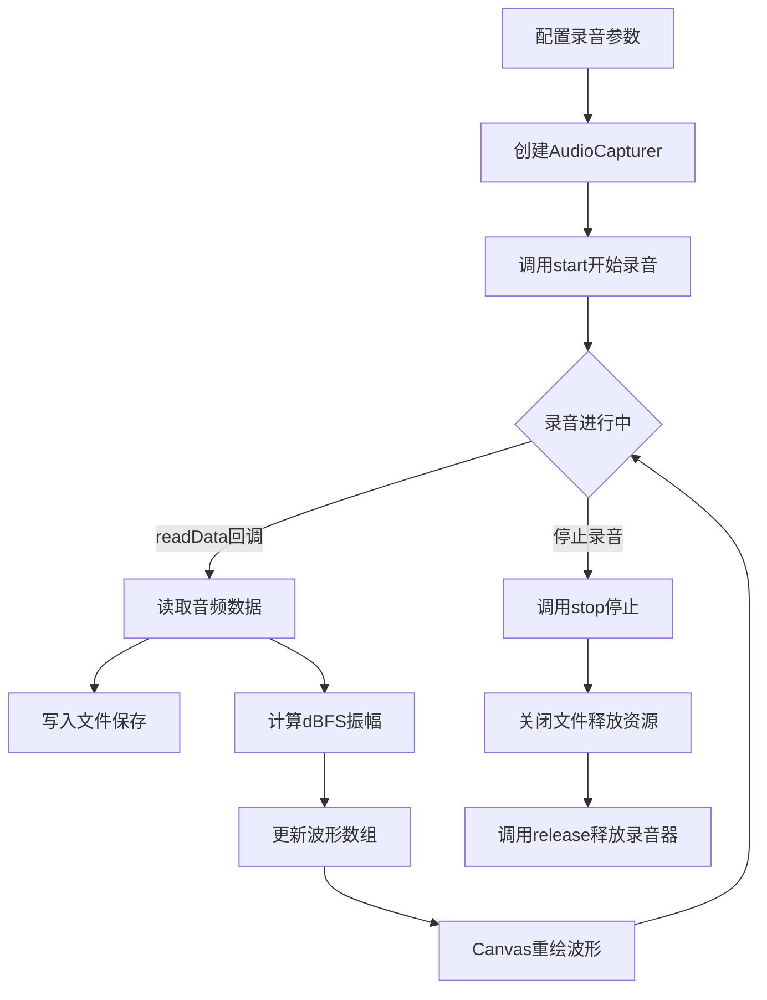
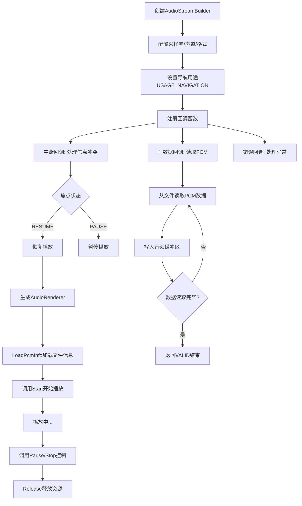
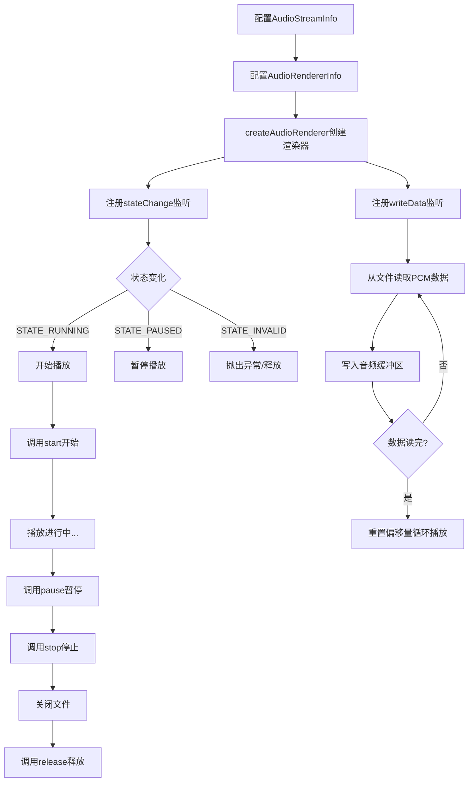

# 导航应用

## 概述

在车载导航和步行导航场景中，语音交互是核心体验之一。本项目模拟了一个完整的导航语音交互闭环，用户通过AI助手进行语音交互，系统将路线文本信息合成为语音进行导航播报，同时支持音频录制与波形实时展示。
本项目围绕导航场景的语音交互需求，实现了以下四个核心功能：

1. **文本转语音 (TTS)** — 将导航路线文本通过离线TTS引擎合成为PCM音频数据，支持语速/音量/音调调节
2. **音频录制** — 录制用户语音指令，实时计算音频振幅并驱动Canvas动态波形渲染
3. **语音播报 (Native层)** — 基于OH_Audio C++ API实现低延迟PCM音频播放，自动处理音频焦点冲突
4. **音频播放管理器 (ArkTS层)** — 使用ArkTS AudioRenderer API实现PCM播放与状态机管理

## 效果预览

| 应用主界面                                                      | 导航页                                                        |           
|------------------------------------------------------------|------------------------------------------------------------|
|  |  |

## 使用说明

1. **权限授权**: 启动应用，自动弹出麦克风授权弹窗，点击允许。
2. **进入导航**: 点击「路线」按钮，进入导航详情页。
3. **AI助手**: 点击「模拟AI助手」按钮，弹出录音弹窗。
4. **录音结束**: 等待5秒后录制自动结束，开始TTS语音播报。
5. **开始导航**: 点击「开始导航」按钮，播放TTS语音。

## 实现原理

### 1. 文本转语音 (TTS) 实现原理

**核心原理**: 通过TTS引擎将文本转换为PCM音频数据，采用回调机制分段接收合成的音频流，最终拼接为完整的PCM文件。

**技术要点**:

- 使用`textToSpeech.createEngine()`创建离线TTS引擎，配置语言、音色、播报风格等参数
- 通过`SpeakListener`回调接口异步接收合成数据：`onData()`接收分段音频，`onComplete()`标记合成完成
- 采用`sequence`序列号保证音频片段按序拼接，避免数据乱序
- 合成的PCM数据通过文件流写入应用沙箱或rawfile目录

**流程图**:



---

### 2. 音频录制 实现原理

**核心原理**: 通过AudioCapturer从麦克风采集原始音频数据，实时计算音频振幅(dBFS)用于波形展示，同时将PCM数据写入文件保存。

**技术要点**:

- 配置AudioStreamInfo(采样率48kHz、单声道、S16LE格式)和AudioCapturerInfo(麦克风音源)
- 使用`createAudioCapturer`创建录音器实例，通过`on('readData')`监听音频数据
- 实时计算dBFS值：`dBFS = 20 * log10(RMS / 32768)`，用于动态波形渲染
- 录音数据通过`fileIo.writeSync`直接写入文件，支持长时间录音
- 通过setInterval定时更新波形索引数组，驱动Canvas重绘波形

**流程图**:



---

### 3. 语音播报 (Native层) 实现原理

**核心原理**: 基于Native层OH_Audio C++ API实现低延迟音频播放，通过回调机制从PCM文件读取数据并推送到音频渲染器，同时处理音频焦点冲突。

**技术要点**:

- 使用`OH_AudioStreamBuilder`构建音频流，配置采样率16kHz、单声道、S16LE格式、导航用途
- 设置三个关键回调：中断回调(处理焦点)、错误回调、写数据回调(推送PCM数据)
- 写数据回调中通过`lseek`和`read`从文件描述符读取PCM数据到音频缓冲区
- 音频焦点冲突时，中断回调根据`OH_AudioInterrupt_Hint`自动暂停/恢复播放
- 将C++接口导出为ArkTS可调用的函数(如`PlayPcmNDK`)

**流程图**:



---

### 4. 音频播放管理器 (ArkTS层) 实现原理

**核心原理**: 使用ArkTS层的AudioRenderer API实现PCM音频播放，通过状态机和写数据回调机制实现音频流式播放，内置音频焦点管理。

**技术要点**:

- 配置AudioStreamInfo(48kHz、单声道、S16LE)和AudioRendererInfo(音乐用途STREAM_USAGE_MUSIC)
- 通过`createAudioRenderer`创建渲染器，监听`stateChange`和`writeData`事件
- `writeData`回调中根据当前偏移量从文件读取PCM数据到缓冲区，支持循环播放
- 状态机自动处理音频焦点：无效状态抛出异常，焦点丢失时自动暂停
- 通过`start/pause/stop/release`方法管理播放生命周期

**流程图**:



---

## 工程目录

```
├──entry/src/main/
│  ├──cpp                                             // Native层音频播放
│  │  ├──player
│  │  │  ├──oh_audio_playing.cpp                      // 音频播放实现
│  │  │  └──oh_audio_playing.h                        // 音频播放头文件
│  │  ├──types/libentry                               // Native层接口定义
│  │  │  └──Index.d.ts
│  │  ├──CMakeLists.txt                               // 编译配置
│  │  └──oh_audio_playing_ndk.cpp
│  └──ets
│     ├──common
│     │  └──Constants.ets                             // 常量定义
│     ├──components
│     │  └──RecordDialog.ets                          // 录音半模态弹窗组件
│     ├──controller                                   // 业务控制器
│     │  ├──AudioCapturerManager.ets                  // 音频录制管理器
│     │  ├──AudioRendererManager.ets                  // 音频播放管理器
│     │  ├──AVSessionController.ets                   // 音频会话控制器
│     │  ├──MediaControlCenter.ets                    // 媒体控制中心(单例)
│     │  ├──MediaControlCenterCallbackAction.ets      // 媒体回调处理
│     │  ├──MediaControlCenterHandle.ets              // 媒体播放句柄
│     │  ├──MediaTools.ets                            // 媒体工具类
│     │  └──TextToSpeechController.ets                // TTS控制器
│     ├──entryability
│     │  └──EntryAbility.ets                          // UIAbility生命周期
│     ├──entrybackupability
│     │  └──EntryBackupAbility.ets                    // 备份恢复能力
│     ├──model
│     │  └──PcmListData.ets                           // pcm列表数据
│     ├──pages
│     │  ├──Index.ets                                 // 应用首页
│     │  └──NavigationPage.ets                        // 导航详情页
│     ├──utils
│     │  ├──BackgroundUtil.ets                        // 后台任务工具
│     │  ├──Logger.ets                                // 日志工具
│     │  └──StringUtil.ets                            // 字符串工具
│     └──viewmodel
│        ├──PcmData.ets                               // pcm数据模型
│        ├──PcmDataSource.ets                         // pcm数据源
│        └──PcmItemBuilder.ets                        // pcm数据构建器
└──entry/src/main/resources                           // 资源文件
```

## 功能开发

### 1. 文本转语音 (TTS)

**场景描述**: 将导航路线文本通过TTS引擎合成语音进行播报，支持离线模式，生成的PCM音频数据可保存或直接播放。

**开发步骤**:

1. **创建TTS引擎**: 配置语言、音色、离线模式、播报风格、区域信息、引擎名称、后台播报等参数，并使用`textToSpeech.createEngine()`
   创建引擎实例。

   **实现文件**: `entry/src/main/ets/controller/TextToSpeechController.ets`。

   ```
   let extraParam: Record<string, Object> = {
     'style': 'interaction-broadcast',
     'locate': 'CN',
     'name': 'EngineName',
     'isBackStage': 'true'
   };
   let initParamsInfo: textToSpeech.CreateEngineParams = {
     language: 'zh-CN',
     person: 0,
     online: 1,
     extraParams: extraParam
   };
   textToSpeech.createEngine(initParamsInfo, (err, data) => {
     this.ttsEngine = data;
   });
   ```

2. **设置播报回调**: 通过`SpeakListener`监听合成状态，在 `onData()` 回调中拼接音频流，在 `onComplete()` 中写入文件，保存PCM数据，调用
   `ttsEngine.setListener()` 设置合成播报回调。

   **实现文件**: `entry/src/main/ets/controller/TextToSpeechController.ets`。

   ```
   public onData = (requestId: string, audio: ArrayBuffer, response: textToSpeech.SynthesisResponse) => {
     let uint8Array: Uint8Array = new Uint8Array(audio);
     // ...
     this.pcmData.set(response.sequence, uint8Array);
   }
   
   public onComplete = (requestId: string, response: textToSpeech.CompleteResponse) => {
     let buffers: ArrayBuffer[] = [];
     // ...
     this.pcmData.forEach((value) => {
       buffers.push(value.buffer.slice(0));
     });
     
     let audioData = this.concatenateArrayBuffers(buffers);
     let fileDir = context.filesDir + '/audioExample.pcm';
     fileIo.createStream(fileDir, 'w+')
       .then(stream => {
         stream.write(audioData)
           // ...
       });
   }
   
   let speakListener: textToSpeech.SpeakListener = {
     onStart(requestId: string, response: textToSpeech.StartResponse) {
       // ...
     },
     onComplete: this.onComplete,
     onStop(requestId: string, response: textToSpeech.StopResponse) {
       // ...
     },
     onData: this.onData,
     onError(requestId: string, errorCode: number, errorMessage: string) {
       // ...
     }
   };
   this.ttsEngine.setListener(speakListener);
   ```

3. **执行语音合成**: 调用 `ttsEngine.speak()` 方法，设置合成播报ID、语速、音量、音调、音频格式、合成类型等参数，合成播报文本。

   **实现文件**: `entry/src/main/ets/controller/TextToSpeechController.ets`。

   ```
   let speakParams: textToSpeech.SpeakParams = {
     requestId: '123456' + Date.now(),
     extraParams: {
       'speed': 1, 
       'volume': 2, 
       'pitch': 1,
       'audioType': 'pcm', 
       'playType': 0
     }
   };
   // ...
   this.ttsEngine.speak(speechStr, speakParams);
   ```

说明：通过上述方法生成的pcm文件会保存在沙箱路径下，但本示例使用的pcm文件是存放在rawfile文件下的audioExample.pcm。如果要使用沙箱路径下的pcm文件，获取pcm文件的方式会有所区别。

---

### 2. 音频录制

**场景描述**: 实现麦克风录音功能，支持实时音频振幅计算，用于显示动态波形效果，录制完成后自动保存音频文件。

**开发步骤**:

1. **配置录音参数**: 设置 `AudioStreamInfo`(单声道、48KHz采样、S16LE格式)和 `AudioCapturerInfo`(麦克风源)。

   **实现文件**: `entry/src/main/ets/controller/AudioCapturerManager.ets`。

   ```
   let audioStreamInfo: audio.AudioStreamInfo = {
     channels: audio.AudioChannel.CHANNEL_1,
     samplingRate: audio.AudioSamplingRate.SAMPLE_RATE_48000,
     sampleFormat: audio.AudioSampleFormat.SAMPLE_FORMAT_S16LE,
     encodingType: audio.AudioEncodingType.ENCODING_TYPE_RAW,
   };
   let audioCapturerInfo: audio.AudioCapturerInfo = {
     capturerFlags: 0,
     source: audio.SourceType.SOURCE_TYPE_MIC,
   };
   ```

2. **创建录音器**: 使用 `audio.createAudioCapturer` 创建 `AudioCapturer` 实例。

   **实现文件**: `entry/src/main/ets/controller/AudioCapturerManager.ets`。

   ```
   let audioCapturerOptions: audio.AudioCapturerOptions = {
     streamInfo: audioStreamInfo,
     capturerInfo: audioCapturerInfo,
   };
   this.capturer = await audio.createAudioCapturer(audioCapturerOptions);
   ```

3. **监听录音数据**: 通过 `on('readData')` 实时获取音频数据，计算dBFS值用于波形展示。

   **实现文件**: `entry/src/main/ets/controller/AudioCapturerManager.ets`。

   ```
   this.capturer.on('readData', (buffer: ArrayBuffer) => {
     // 写入文件
     let options: WriteOptions = { offset: this.writeOffset, length: buffer.byteLength };
     fileIo.writeSync(this.recordFile?.fd, buffer, options);
     // 计算振幅
     let samples = new Int16Array(buffer);
     for (let i = 0; i < samples.length; i++) {
       let val = samples[i] / Constants.VOLUME_MAX;
       this.sampleValSum += val * val;
       this.sampleValCnt += 1;
     }
   });
   ```

4. **波形渲染**: 使用Canvas绘制动态波形图，根据实时计算的dBFS值更新波形振幅，展示录音过程中的音频波形效果。

   **实现文件**: `entry/src/main/ets/pages/NavigationPage.ets`。

   ```
   @State waveIndex: number[] = new Array(50);
   
   // 定时更新波形数据
   this.timeIdOne = setInterval(() => {
     const dBFS: number = this.audioCapturerMgr.calculateDecibel();
     this.waveIndex[this.index] = Math.round(dBFS * 20 + 10);
     this.index = this.index === 49 ? 0 : this.index + 1;
   }, 10)
   
   // 渲染波形
   Row({ space: 16 }) {
     Row({ space: 4 }) {
       ForEach(this.waveIndex, (value: number, index: number) => {
         Column()
           .width(3)
           .height(value)
           .backgroundColor(Color.Blue)
           .borderRadius(1.5)
       })
     }
   }
   ```

5. **启动/停止/释放**: 调用 `start()`、`stop()`、`release()` 管理录音生命周期。

   **实现文件**: `entry/src/main/ets/controller/AudioCapturerManager.ets`。

   ```
   // 启动录音
   await this.capturer.start();
   // 停止录音并保存
   await this.capturer.stop();
   fileIo.closeSync(this.recordFile?.fd);
   // 释放资源
   this.capturer.off('readData');
   await this.capturer.release();
   ```

---

### 3. 语音播报

**场景描述**: 使用Native层C++实现音频播放功能，基于OH_Audio接口实现PCM音频数据播放，支持播放/暂停/停止控制及播放状态回调。

**开发步骤**:

1. **配置播放参数**: 使用`OH_AudioStreamBuilder`创建流构建器，设置采样率(16kHz)、单声道、S16LE格式、导航用途。

   **实现文件**: `entry/src/main/cpp/player/oh_audio_playing.cpp`。

   ```
   OH_AudioStream_Type streamType = AUDIOSTREAM_TYPE_RENDERER;
   auto ret = OH_AudioStreamBuilder_Create(&rendererBuilder, streamType);
   (void)OH_AudioStreamBuilder_SetSamplingRate(rendererBuilder, 16000);
   (void)OH_AudioStreamBuilder_SetChannelCount(rendererBuilder, 1);
   (void)OH_AudioStreamBuilder_SetSampleFormat(rendererBuilder, AUDIOSTREAM_SAMPLE_S16LE);
   (void)OH_AudioStreamBuilder_SetEncodingType(rendererBuilder, AUDIOSTREAM_ENCODING_TYPE_RAW);
   (void)OH_AudioStreamBuilder_SetRendererInfo(rendererBuilder, AUDIOSTREAM_USAGE_NAVIGATION);
   ```

2. **设置回调函数**: 配置音频中断回调、错误回调、写数据回调，实现PCM数据推送和焦点冲突处理。

   **实现文件**: `entry/src/main/cpp/player/oh_audio_playing.cpp`。

   ```
   // 音频中断回调，处理焦点冲突
   static void OnAudioInterruptEvent(OH_AudioRenderer *audioRenderer, void *userData,
                                     OH_AudioInterrupt_ForceType type, OH_AudioInterrupt_Hint hint) {
       if ((type == AUDIOSTREAM_INTERRUPT_SHARE) && (hint == AUDIOSTREAM_INTERRUPT_HINT_RESUME)) {
           OHAudioPlayer::GetInstance().PlayStatusCallback(..., PlayStatus::PLAY);
       } else if (hint == AUDIOSTREAM_INTERRUPT_HINT_PAUSE) {
           OHAudioPlayer::GetInstance().PlayStatusCallback(..., PlayStatus::PAUSE);
       }
   }

   // 写数据回调，从文件读取PCM数据
   static OH_AudioData_Callback_Result OnAudioRendererWriteDataEvent(
       OH_AudioRenderer *audioRenderer, void *userData, void *audioData, int32_t audioDataSize) {
       auto audioFileOprInfo = reinterpret_cast<AudioFileOprInfo *>(userData);
       // 从文件读取音频数据...
       return AUDIO_DATA_CALLBACK_RESULT_VALID;
   }

   (void)OH_AudioStreamBuilder_SetRendererInterruptCallback(rendererBuilder, OnAudioInterruptEvent, nullptr);
   (void)OH_AudioStreamBuilder_SetRendererErrorCallback(rendererBuilder, OnAudioErrorEvent, nullptr);
   (void)OH_AudioStreamBuilder_SetRendererWriteDataCallback(rendererBuilder, OnAudioRendererWriteDataEvent, ...);
   ```

3. **创建渲染器**: 调用`OH_AudioStreamBuilder_GenerateRenderer`生成`OH_AudioRenderer`实例。

   **实现文件**: `entry/src/main/cpp/player/oh_audio_playing.cpp`。

   ```
   ret = OH_AudioStreamBuilder_GenerateRenderer(rendererBuilder, &audioRenderer);
   if (ret != AUDIOSTREAM_SUCCESS) {
       OH_LOG_ERROR(LOG_APP, "Create audio renderer failed, ret: %{public}d", ret);
       return;
   }
   ```

4. **加载音频信息**: 通过`LoadPcmInfo`传入文件描述符、文件大小、时长、偏移量，初始化文件操作结构体。

   **实现文件**: `entry/src/main/cpp/player/oh_audio_playing.cpp`。

   ```
   void OHAudioPlayer::LoadPcmInfo(uint32_t pcmFd, uint32_t pcmFileSize, uint32_t pcmDuration,
                                    uint32_t pcmFileOffset) {
       audioFileOprInfo->pcmFd = pcmFd;
       audioFileOprInfo->pcmFileSize = pcmFileSize;
       audioFileOprInfo->pcmDuration = pcmDuration;
       audioFileOprInfo->pcmFileOffset = pcmFileOffset;
       audioFileOprInfo->pcmCurrentOffset = 0;
       (void)lseek(audioFileOprInfo->pcmFd, pcmFileOffset, SEEK_SET);
   }
   ```

5. **控制播放**: 实现播放、暂停、停止功能。

   **实现文件**: `entry/src/main/cpp/player/oh_audio_playing.cpp` 和 `entry/src/main/cpp/oh_audio_playing_ndk.cpp`。

   ```
   // 播放
   auto ret = OH_AudioRenderer_Start(audioRenderer);
   // 暂停
   auto ret = OH_AudioRenderer_Pause(audioRenderer);
   // 停止
   auto ret = OH_AudioRenderer_Stop(audioRenderer);
   auto ret = OH_AudioRenderer_Flush(audioRenderer);

   static napi_value PlayPcmNDK(napi_env env, napi_callback_info info) {
       OHAudioPlayer::GetInstance().PlayPcm();
       return nullptr;
   }
   ```

6. **释放资源**: 销毁构建器、释放渲染器、删除文件操作结构体。

   **实现文件**: `entry/src/main/cpp/player/oh_audio_playing.cpp`。

   ```
   void OHAudioPlayer::ReleasePlayer() {
       if (rendererBuilder != nullptr) {
           OH_AudioStreamBuilder_Destroy(rendererBuilder);
       }
       if (audioRenderer != nullptr) {
           OH_AudioRenderer_Release(audioRenderer);
       }
       if (audioFileOprInfo != nullptr) {
           delete audioFileOprInfo;
       }
   }
   ```

---

### 4. 音频播放管理器 (ArkTS)

**场景描述**: 使用ArkTS API实现PCM音频数据播放，支持播放/暂停/停止控制及状态回调，集成音频焦点管理。

**开发步骤**:

1. **AudioSession初始化与创建**: 通过 `audio.getAudioManager()` 获取音频管理器，调用 `getSessionManager()` 创建
   `AudioSessionManager` 实例，并使用 `activateAudioSession()` 激活会话，配置并发模式为 `CONCURRENCY_PAUSE_OTHERS`。

   **实现文件**: `entry/src/main/ets/controller/MediaControlCenter.ets`。

   ```
   private async initAudioManager() {
     let audioManger = audio.getAudioManager();
     this.audioSessionManager = audioManger.getSessionManager();
     await this.activateAudioSession();
   }

   private async activateAudioSession(concurrencyMode: audio.AudioConcurrencyMode = audio.AudioConcurrencyMode.CONCURRENCY_PAUSE_OTHERS) {
     if (!this.audioSessionManager) {
       return;
     }
     let strategy: audio.AudioSessionStrategy = {
       concurrencyMode: concurrencyMode
     };
     try {
       await this.audioSessionManager.activateAudioSession(strategy);
     } catch (error) {
       Logger.info(TAG, 'activateAudioSession Failed');
     }
     Logger.info(TAG, 'activateAudioSession SUCCESS');
   }
   ```

2. **配置播放参数**: 设置 `AudioStreamInfo`(单声道、48KHz采样、S16LE格式)和 `AudioRendererInfo`(音乐用途)。

   **实现文件**: `entry/src/main/ets/controller/AudioRendererManager.ets`。

   ```
   let audioStreamInfo: audio.AudioStreamInfo = {
     channels: audio.AudioChannel.CHANNEL_1,
     samplingRate: audio.AudioSamplingRate.SAMPLE_RATE_48000,
     sampleFormat: audio.AudioSampleFormat.SAMPLE_FORMAT_S16LE,
     encodingType: audio.AudioEncodingType.ENCODING_TYPE_RAW,
   };
   let audioRendererInfo: audio.AudioRendererInfo = {
     rendererFlags: 0,
     usage: audio.StreamUsage.STREAM_USAGE_MUSIC,
   };
   ```

3. **创建渲染器**: 使用 `audio.createAudioRenderer` 创建 `AudioRenderer` 实例。

   **实现文件**: `entry/src/main/ets/controller/AudioRendererManager.ets`。

   ```
   let audioRendererOptions: audio.AudioRendererOptions = {
     streamInfo: audioStreamInfo,
     rendererInfo: audioRendererInfo,
   };
   this.renderer = await audio.createAudioRenderer(audioRendererOptions);
   ```

4. **监听状态和数据**: 通过 `on('stateChange')` 监听状态变化，`on('writeData')` 写入PCM数据。

   **实现文件**: `entry/src/main/ets/controller/AudioRendererManager.ets`。

   ```
   this.renderer.on('writeData', (buffer: ArrayBuffer) => {
     let lastLen: number = this.fileSize - this.readOffset;
     let readLen: number = lastLen >= buffer.byteLength ? buffer.byteLength : lastLen;
     fileIo.readSync(this.playFile?.fd, buffer, { offset: this.readOffset, length: readLen });
     this.readOffset += readLen;
     if (this.readOffset >= this.fileSize) {
       this.readOffset = 0;
     }
   });
   ```

5. **启动/暂停/停止/释放**: 调用 `start()`、`pause()`、`stop()`、`release()` 管理播放生命周期。

   **实现文件**: `entry/src/main/ets/controller/AudioRendererManager.ets`。

   ```
   // 开始播放
   await this.renderer.start();
   // 暂停播放
   await this.renderer.pause();
   // 停止播放
   await this.renderer.stop();
   fileIo.closeSync(this.playFile?.fd);
   // 释放资源
   await this.renderer.release();
   ```

6. **音频焦点处理**: 通过 `AudioRenderer` 的状态机自动处理焦点冲突，当焦点丢失时自动暂停，恢复后继续播放。

   **实现文件**: `entry/src/main/ets/controller/AudioRendererManager.ets`。

---

## 相关权限

1. 麦克风使用权限：ohos.permission.MICROPHONE

## 技术依赖

- textToSpeech: 文本转语音。
- audio: 音频管理。
- PermissionRequestResult: 权限申请。
- resourceManager: 资源管理。
- fileIo: 文件管理。

## 约束与限制

- **设备**: 直板机
- **系统**: 6.0.1 Release 及以上
- **IDE**: DevEco Studio 6.0.1 Release 及以上
- **SDK**: 6.0.1 Release SDK

## 常见问题

### 1. PCM音频播放无声或杂音

**问题描述**: 调用`playPcm()`后无声音输出，或出现明显杂音/爆音。

**可能原因**:

- PCM数据采样率与初始化时设置的采样率不匹配（如数据为48kHz但代码配置为16kHz）
- 音频数据位深不一致（如数据为32位浮点但配置为16位整型）
- 声道数不匹配（单声道/双声道配置错误）
- 缓冲区未填满时未正确清零导致残留噪音

**解决方案**:
检查TTS生成的PCM数据参数，确保与`InitPlayer()`中的配置一致：

```
// 确保采样率匹配
(void)OH_AudioStreamBuilder_SetSamplingRate(rendererBuilder, 16000); // 与PCM数据采样率一致
// 确保声道数匹配  
(void)OH_AudioStreamBuilder_SetChannelCount(rendererBuilder, 1);    // 与PCM数据声道数一致
// 确保采样格式匹配
(void)OH_AudioStreamBuilder_SetSampleFormat(rendererBuilder, AUDIOSTREAM_SAMPLE_S16LE);
```

同时检查`OnAudioRendererWriteDataEvent`回调中是否对未填满的缓冲区进行了清零处理。

---

### 2. 音频焦点冲突导致播放自动暂停

**问题描述**: 播放过程中被其它应用（如导航语音、闹钟）中断，自动暂停。

**解决方案**: 已在`OnAudioInterruptEvent`回调中处理焦点冲突，通过`PlayStatusCallback`通知ETS层更新播放状态UI。如需更精细的焦点策略，可调用
`OH_AudioStreamBuilder_SetAudioConcurrencyMode`配置`CONCURRENCY_PAUSE_OTHERS`或`CONCURRENCY_MUTE_OTHERS`模式。

---

### 3. 接口调用失败

**问题描述**: 调用`initPlayer`、`playPcm`等接口返回失败或无响应。

**可能原因**:

- 未在`module.json5`中正确配置native依赖
- CMakeLists.txt中链接库路径错误
- 异步调用时播放器未完成初始化

**解决方案**: 确保CMakeLists.txt正确链接`ohaudio`库，并在ETS层等待`initPlayer`异步完成后再调用接口。