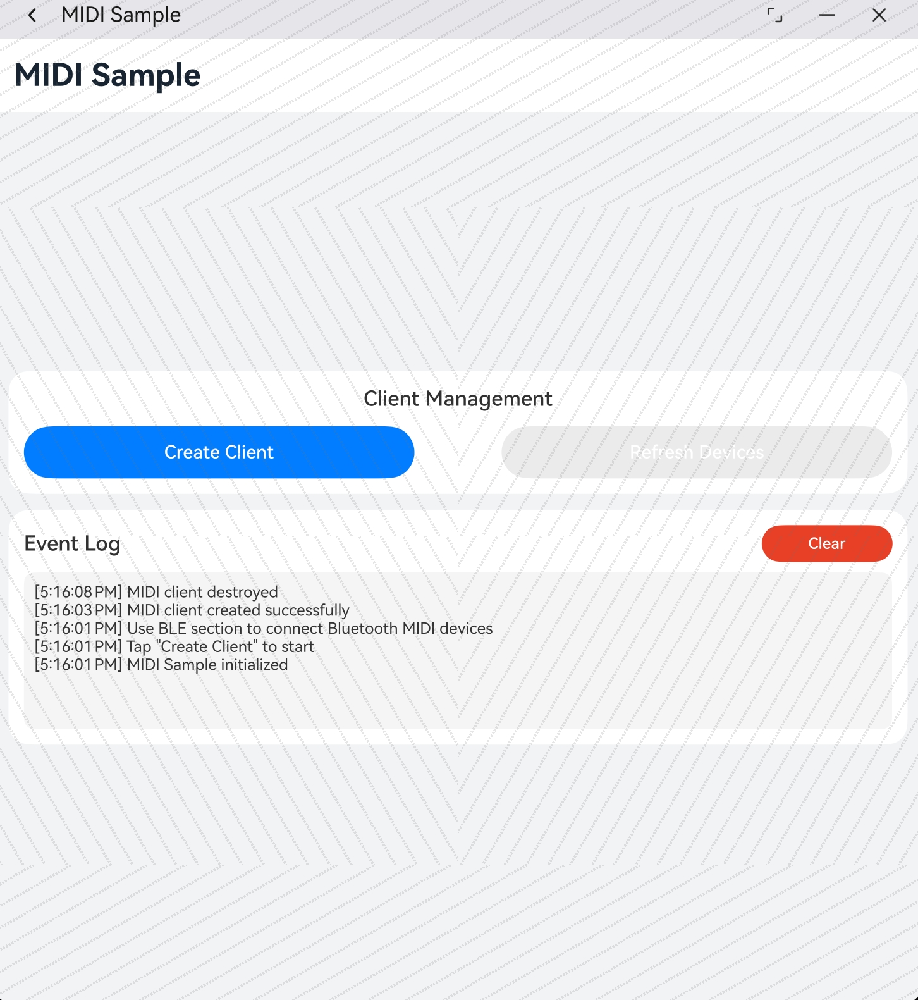
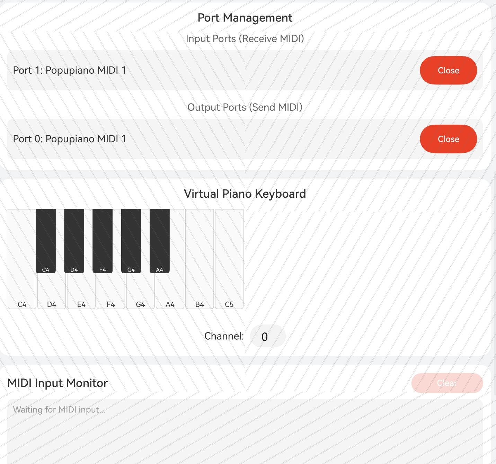
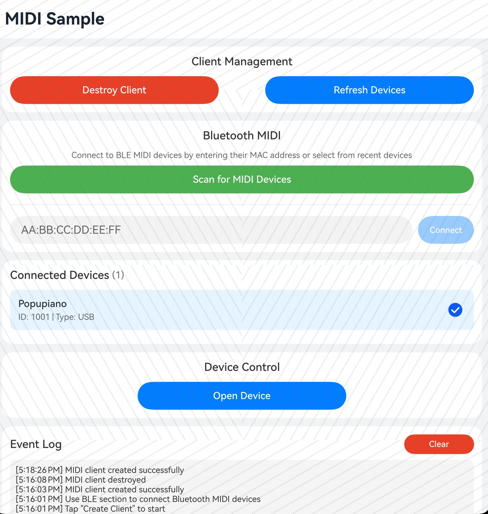

# MIDI示例

### 介绍

本示例主要展示了MIDI（Musical Instrument Digital Interface）的相关功能，使用[@ohos.multimedia.midi](https://docs.openharmony.cn/pages/v4.1/zh-cn/application-dev/reference/apis-audio-kit/native_midi.md)等接口实现MIDI设备的连接与管理、端口操作、MIDI消息的发送与接收、虚拟钢琴键盘以及蓝牙MIDI设备的连接等功能。

### 效果预览

| 主页                                      | 蓝牙                                     |
|-----------------------------------------|----------------------------------------|
|   |    |
| 设备管理                                    | 端口及虚拟钢琴键盘                              |
| --------------------------------------  | -------------------------------------- |
|  |  |
### 使用说明

#### 基本操作

1. 启动应用后，点击"Create Client"按钮创建MIDI客户端
2. 客户端创建成功后，将自动扫描并列出当前连接的MIDI设备
3. 点击"Refresh Devices"按钮可手动刷新设备列表

#### 设备管理

4. 在设备列表中选择一个MIDI设备（USB或BLE）
5. 选择设备后，"Device Control"区域将显示
6. 点击"Open Device"按钮打开选中的设备
7. 设备打开成功后，将显示该设备的输入/输出端口列表

#### 端口操作

8. 对于输入端口：点击"Open"按钮打开端口，开始接收MIDI数据
9. 对于输出端口：点击"Open"按钮打开端口，准备发送MIDI数据
10. 打开的端口可通过"Close"按钮关闭

#### 虚拟钢琴键盘

11. 设备打开后，虚拟钢琴键盘区域将显示
12. 打开输出端口后，虚拟钢琴键盘将激活（否则显示提示"Open an output port to play"）
13. 挌下白键或黑键发送Note On消息
14. 释放按键发送Note Off消息
15. 可通过"Channel"输入框设置MIDI通道（0-15）

#### 蓝牙MIDI

16. 客户端创建后，蓝牙MIDI区域将显示
17. 在蓝牙MIDI区域输入BLE设备的MAC地址（格式：XX:XX:XX:XX:XX:XX）
18. 点击"Connect"按钮开始连接蓝牙MIDI设备
19. 连接成功后，设备将自动添加到设备列表中
20. 已连接的BLE设备显示在"Connected BLE Devices"列表中

#### MIDI输入监控

21. 打开输入端口后，"MIDI Input Monitor"区域将显示
22. 收到的MIDI消息将实时显示在该区域
23. 支持显示Note On、Note Off、Control Change等消息类型

### 工程目录

```
entry/src/main/
|---cpp/
|---|---napi_init.cpp                       // Native层MIDI API封装
|---|---CMakeLists.txt                      // CMake配置
|---|---types/libentry/
|---|---|---Index.d.ts                       // TypeScript类型定义
|---ets/
|---|---pages/
|---|---|---Index.ets                        // 主页面
|---|---entryability/
|---|---|---EntryAbility.ets                 // 应用入口
|---resources/
|---|---base/
|---|---|---element/
|---|---|---|---string.json                  // 字符串资源
|---|---|---|---color.json                   // 颜色资源
|---module.json5                              // 模块配置
```

### 具体实现

* **MIDI客户端管理**：源码参考[napi_init.cpp](entry/src/main/cpp/napi_init.cpp)
    * 使用`OH_MIDIClient_Create()`创建MIDI客户端实例
    * 通过回调函数监听设备热插拔事件
    * 使用`OH_MIDIClient_Destroy()`销毁客户端并释放资源

* **设备管理功能**：源码参考[Index.ets](entry/src/main/ets/pages/Index.ets)
    * 使用`OH_MIDIClient_GetDeviceCount()`获取已连接设备数量
    * 使用`OH_MIDIClient_GetDeviceInfos()`获取设备详细信息
    * 使用`OH_MIDIClient_OpenDevice()`打开指定设备
    * 使用`OH_MIDIClient_CloseDevice()`关闭设备

* **端口管理功能**：
    * 使用`OH_MIDIClient_GetPortCount()`获取设备端口数量
    * 使用`OH_MIDIClient_GetPortInfos()`获取端口详细信息
    * 使用`OH_MIDIDevice_OpenInputPort()`打开输入端口并注册数据接收回调
    * 使用`OH_MIDIDevice_OpenOutputPort()`打开输出端口
    * 使用`OH_MIDIDevice_CloseInputPort()`和`OH_MIDIDevice_CloseOutputPort()`关闭端口

* **MIDI消息发送**：
    * 使用`OH_MIDIDevice_Send()`发送MIDI事件
    * 支持发送Note On、Note Off等MIDI消息
    * 使用UMP（Universal MIDI Packet）格式封装消息

* **MIDI消息接收**：
    * 通过`OH_MIDIDevice_OpenInputPort()`注册回调函数
    * 回调函数接收MIDI事件数组
    * 支持解析Note On、Note Off、Control Change等消息类型

* **虚拟钢琴键盘**：
    * 实现一个八度的钢琴键盘（C4-C5）
    * 包含8个白键和5个黑键
    * 触摸按下发送Note On消息，触摸抬起发送Note Off消息
    * 按键状态实时反馈（按下时变色显示）

* **蓝牙MIDI功能**：
    * 使用`OH_MIDIClient_OpenBLEDevice()`异步打开BLE MIDI设备
    * 通过回调函数获取连接结果
    * 支持通过MAC地址直接连接BLE MIDI设备
    * 设备连接成功后自动添加到设备列表

### 相关权限

本示例涉及以下权限：

1. 允许应用使用蓝牙：[ohos.permission.ACCESS_BLUETOOTH](https://gitcode.com/openharmony/docs/blob/master/zh-cn/application-dev/security/AccessToken/permissions-for-all.md)

2. 允许应用发现蓝牙设备：[ohos.permission.DISCOVER_BLUETOOTH](https://gitcode.com/openharmony/docs/blob/master/zh-cn/application-dev/security/AccessToken/permissions-for-all.md)

### 依赖

不涉及。

### 约束与限制

1. 本示例仅支持标准系统上运行，支持设备：RK3568、手机、平板、2in1设备；
2. 本示例仅支持API 24版本SDK，SDK版本号(API Version 24 Release)，镜像版本号(6.1 Release)；
3. 本示例需要使用DevEco Studio 版本号(6.1 Release)才可编译运行；
4. 使用蓝牙MIDI功能需要设备支持蓝牙BLE；
5. MIDI消息使用UMP（Universal MIDI Packet）格式；

### 自动化测试

本示例包含完整的自动化测试用例，用于验证MIDI功能的正确性。

#### 测试文件位置

测试用例位于：`entry/src/ohosTest/ets/test/Ability.test.ets`

#### 测试用例概览

| 测试类型 | 用例数量 | 覆盖功能 |
|---------|---------|---------|
| 基础功能测试 | 10 | 应用启动、客户端管理、设备列表、UI显示 |
| BLE相关测试 | 2 | MAC地址格式验证、BLE连接按钮状态 |
| 设备管理测试 | 3 | 设备列表选择、未选设备操作、设备信息显示 |
| 客户端管理测试 | 2 | 重复创建测试、未创建时操作测试 |
| UI组件测试 | 4 | 通道输入、Event Log滚动、Clear Log功能、钢琴键盘渲染 |
| 触摸交互测试 | 2 | 钢琴键盘触摸响应、无输出端口时触摸测试 |

#### 运行测试

1. 在DevEco Studio中打开项目
2. 右键点击 `ohosTest` 目录
3. 选择 `Run 'ohosTest'` 执行测试
4. 查看测试报告确认测试结果

#### 测试用例详细说明

详细的测试用例说明请参考 [ohosTest.md](ohosTest.md)。

### 下载

如需单独下载本工程，执行如下命令：

```
git init
git config core.sparsecheckout true
echo code/BasicFeature/Media/Midi > .git/info/sparse-checkout
git remote add origin https://gitee.com/openharmony/applications_app_samples.git
git pull origin master
```
