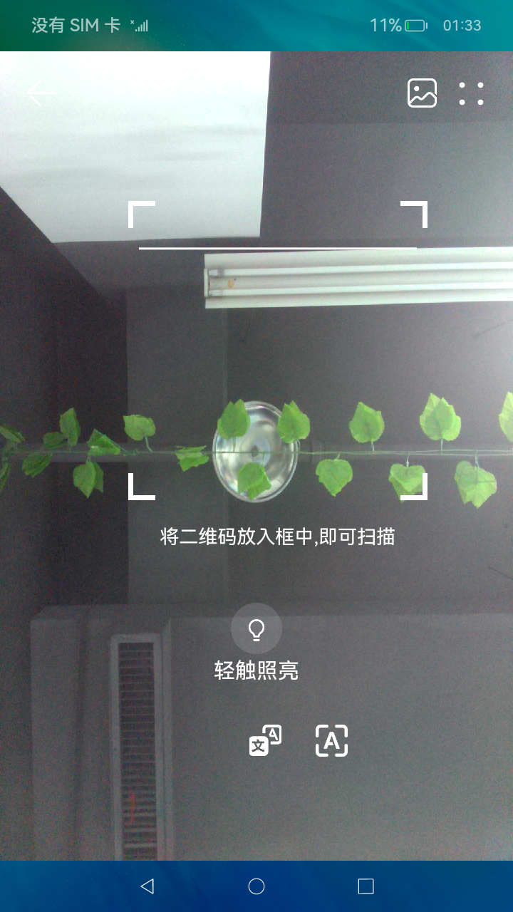
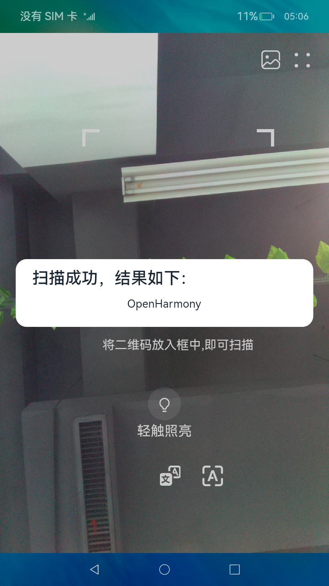

# 二维码扫描

### 介绍

本示例使用[媒体库管理](https://docs.openharmony.cn/pages/v4.1/zh-cn/application-dev/reference/apis-arkui/js-apis-mediaquery.md)、[相机管理](https://gitee.com/openharmony/docs/blob/master/zh-cn/application-dev/reference/apis-camera-kit/js-apis-camera.md)、[图片处理](https://gitee.com/openharmony/docs/blob/master/zh-cn/application-dev/reference/apis-image-kit/js-apis-image.md)、[文件管理](https://gitee.com/openharmony/docs/blob/master/zh-cn/application-dev/reference/apis-core-file-kit/js-apis-fileio.md)展示二维码扫描功能，包括相机扫描解析二维码和从相册中选择二维码图片解析。

### 效果预览

|首页                                    |选择图片                                           |结果展示                                      |
|---------------------------------------|--------------------------------------------------|--------------------------------------------|
| |||

使用说明

1. 启动应用，授予权限。
2. 自动识别二维码图片。
3. 点击右上角图片图标，在相册中选择对应的二维码图片，会返回首页展示结果。

### 目录结构

```
Feature/src/main/ets/
|---qrcodescan
|   |---components
|   |   |---QRCodeScanComponent                 // 组件
|   |---CameraService.ets                       // 相机服务
|   |---QRCodeParse.ets                         // 二维码解析
|   |---QRCodeScanConst.ets                     // 二维码扫描常量集
|---utils
|   |---DateTimeUtil.ets                        // 时间工具
|   |---Logger.ts                               // 日志
```

### 具体实现

+ 相机功能在CameraServices中，源码参考[CameraServices.ets](Feature/src/main/ets/qrcodescan/CameraService.ets)
    + 获取相机实例：首先使用getCameraManager方法获取相机管理器，然后使用getSupportedCameras方法得到设备列表；
    + 打开相机：使用createCameraInput方法创建CameraInput实例，调用open方法打开相机；
    + 获取相机输出流：使用getSupportedOutputCapability查询相机设备在模式下支持的输出能力，然后使用createPreviewOutput创建相机输出流，使用[@ohos.multimedia.image](https://gitee.com/openharmony/docs/blob/master/zh-cn/application-dev/reference/apis-image-kit/js-apis-image.md)接口的createPhotoOutput方法创建相片输出流；
    + 获取相片输出：首先使用createCaptureSession方法创建**捕获会话**的实例，然后使用beginConfig方法配置会话，接下来使用addInput方法添加一个摄像头输入流，使用addOutput添加一个摄像头和相机照片的输出流，使用commitConfig方法提交会话配置后，调用start方法开始捕获相片输出。
+ 二维码解析功能在QRCodeParser中，源码参考[QRCodeParser](Feature/src/main/ets/qrcodescan/QRCodeParser.ets)
    + 拍照获取图片：使用[cameraService.imageReceiver.on](https://gitee.com/openharmony/docs/blob/master/zh-cn/application-dev/reference/apis-image-kit/js-apis-image.md#on9)接收图片时注册回调，然后调用readNextImage获取处理图片的操作，然后使用getComponent方法根据图像的组件类型从图像中获取组件缓存，然后将获取到的ArrayBuffer写入指定文件中，返回文件uri，然后通过[ImageBitmap](https://gitee.com/openharmony/docs/blob/master/zh-cn/application-dev/reference/apis-arkui/arkui-ts/ts-components-canvas-imagebitmap.md)将uri转化为ImageBitMap格式，具体文件写入方式参考[@ohos.file.fs](https://gitee.com/openharmony/docs/blob/master/zh-cn/application-dev/reference/apis/js-apis-file-fs.md)。
    + 打开相册选取图片：首先需要使用[startAbilityForResult](https://docs.openharmony.cn/pages/v4.0/zh-cn/application-dev/reference/apis/js-apis-inner-application-uiAbilityContext.md#uiabilitycontextstartabilityforresult)启动相册，具体参数及源码参考[QRCodeParser.ets](
    Feature/src/main/ets/qrcodescan/components/QRCodeScanComponent.ets)，将选到的图片通过ImageBitmap转化为ImageBitmap格式。
    + 图片解析：使用[CanvasRenderingContext2D](https://docs.openharmony.cn/pages/v4.1/zh-cn/application-dev/reference/apis-arkui/arkui-ts/ts-canvasrenderingcontext2d.md)的getImageData方法创建ImageData对象将相册中获取到的图片转化为util8格式的图片，然后调用jsQR库解析图片中的二维码。

### 相关权限

[ohos.permission.READ_MEDIA](https://gitee.com/openharmony/docs/blob/master/zh-cn/application-dev/security/AccessToken/permissions-for-all.md#ohospermissionread_media)

[ohos.permission.CAMERA](https://gitee.com/openharmony/docs/blob/master/zh-cn/application-dev/reference/apis-camera-kit/js-apis-camera.md)

[ohos.permission.MEDIA_LOCATION](https://gitee.com/openharmony/docs/blob/master/zh-cn/application-dev/security/AccessToken/permissions-for-all.md#ohospermissionmedia_location)

### 依赖

不涉及。

### 约束与限制

1. 本示例仅支持标准系统上运行，支持设备：RK3568。
2. 本示例为Stage模型，支持API10版本SDK，SDK版本号(API Version 10 Release),镜像版本号(4.0 Release)，需要手动替换Full
SDK（4.0 Release）才能编译通过，具体操作可参考[替换指南](https://gitee.com/openharmony/docs/blob/master/zh-cn/application-dev/faqs/full-sdk-switch-guide.md)。
3. 本示例需要使用DevEco Studio 版本号(4.0 Release)及以上版本才可编译运行。
4. 本示例所配置的权限为system_core级别(相关权限级别可通过[权限定义列表](https://gitee.com/openharmony/docs/blob/master/zh-cn/application-dev/security/AccessToken/permissions-for-all.md)查看)，需要手动配置对应级别的权限签名(具体操作可查看[自动化签名方案]( https://docs.openharmony.cn/pages/v3.2/zh-cn/application-dev/security/hapsigntool-overview.md/ ))。
5. 本示例类型为系统应用，需要手动配置对应级别的应用类型("app-feature": "hos_system_app")。具体可参考profile配置文件[bundle-info对象内部结构]( https://gitee.com/openharmony/docs/blob/eb73c9e9dcdd421131f33bb8ed6ddc030881d06f/zh-cn/application-dev/security/app-provision-structure.md#bundle-info%E5%AF%B9%E8%B1%A1%E5%86%85%E9%83%A8%E7%BB%93%E6%9E%84 )

### 下载

如需单独下载本工程，执行如下命令：

```
git init
git config core.sparsecheckout true
echo code/BasicFeature/Media/QRCodeScan/ > .git/info/sparse-checkout
git remote add origin https://gitee.com/openharmony/applications_app_samples.git
git pull origin master
```
