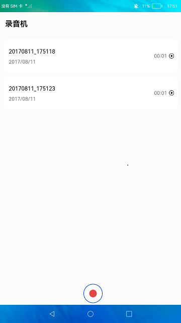
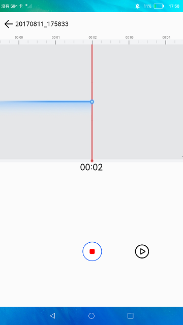

# 录音机

### 介绍

本示例使用[audio](https://gitee.com/openharmony/docs/blob/master/zh-cn/application-dev/reference/apis/js-apis-audio.md)相关接口实现音频录制和播放的功能，使用[mediaLibrary](https://gitee.com/openharmony/docs/blob/master/zh-cn/application-dev/reference/apis/js-apis-medialibrary.md)实现音频文件的管理。

相关概念：

AudioRecorder：音频录制的主要工作是捕获音频信号，完成音频编码并保存到文件中，帮助开发者轻松实现音频录制功能。它允许调用者指定音频录制的采样率、声道数、编码格式、封装格式、文件路径等参数。

AudioPlayer：音频播放的主要工作是将音频数据转码为可听见的音频模拟信号并通过输出设备进行播放，同时对播放任务进行管理。

### 效果预览

|首页|录制界面|
|--------------------------------|--------------------------------|
|| |

使用说明：

1.启动应用，点击首页底部**录制**按钮跳转到录制界面开始录制音频，录制过程中可以点击右下角的**暂停**按钮暂停录制，点击顶部**返回键**或红色的**停止**按钮停止录音并返回首页，首页中展示录制好的音频文件。

2.点击**音频文件**可以播放该文件，播放界面可以点击按钮进行暂停和继续播放。

3.长按音频文件进入多选状态，可以选择音频文件，选择后可以点击底部的按钮进行重命名和删除操作。

4.左滑音频文件，可以滑出重命名和删除按钮，点击可以对该音频文件进行重命名和删除操作。

### 工程目录
```
entry/src/main/ets/
|---common
|   |---AnimateView.ets                    // 录音动画组件
|   |---AudioItem.ets                      // 每项录音组件
|   |---BasicDataSource.ets                // 计时组件 
|   |---CheckTitle.ets                     // 是否选择标题
|   |---HomeView.ets                       // 主页     
|   |---PlayView.ets                       // 播放组件 
|   |---RenameDialog.ets                   // 重命名弹窗组件
|   |---TitleBar.ets                       // 首页标题组件
|   |---TitleWithBack.ets                  // 详情页面标题组件
|---entryAbility
|   |---EntryAbility
|---model
|   |---AudioModel.ts                  
|   |---DateTimeUtil.ts                    // 日期工具
|   |---Logger.ts                          // 日志工具
|   |---MediaManager.ts                   
|   |---Record.ets                         // 计时工具
|   |---RecordModel.ts                         
|   |---Utils.ts                         
|---pages
|   |---Index.ets                          // 首页
|   |---Play.ets                           // 播放页面
|   |---RecordPage.ets                     // 录音页面
```

### 具体实现

* 本示例分为三个模块：
    * 录音页面模块
        * 使用FileAsset提供封装文件属性的方法，createAudioPlayer同步方式创建音频播放实例实现录音，暂停录音功能
        * 源码链接：[RecordModel.ts](entry/src/main/ets/model/RecordModel.ts)，[RecordModel.ts](entry/src/main/ets/model/RecordModel.ts)，[AudioModel.ts](entry/src/main/ets/model/AudioModel.ts)，[MediaManager.ts](entry/src/main/ets/model/MediaManager.ts)，[Utils.ts](entry/src/main/ets/model/Utils.ts)，[DateTimeUtil.ts](entry/src/main/ets/model/DateTimeUtil.ts)，[EntryAbility.ts](entry/src/main/ets/entryability/EntryAbility.ts)
        * 参考接口：[audio](https://gitee.com/openharmony/docs/blob/master/zh-cn/application-dev/reference/apis/js-apis-audio.md)，[@ohos.router](https://gitee.com/openharmony/docs/blob/master/zh-cn/application-dev/reference/apis/js-apis-router.md)，[@ohos.multimedia.mediaLibrary](https://gitee.com/openharmony/docs/blob/master/zh-cn/application-dev/reference/apis/js-apis-medialibrary.md)，[@ohos.multimedia.media](https://gitee.com/openharmony/docs/blob/master/zh-cn/application-dev/reference/apis/js-apis-media.md)，[@ohos.app.ability.common](https://gitee.com/openharmony/docs/blob/master/zh-cn/application-dev/reference/apis/js-apis-app-ability-common.md)，[@ohos.window](https://gitee.com/openharmony/docs/blob/master/zh-cn/application-dev/reference/apis/js-apis-window.md)，[@ohos.promptAction](https://gitee.com/openharmony/docs/blob/master/zh-cn/application-dev/reference/apis/js-apis-promptAction.md)，[@ohos.abilityAccessCtrl](https://gitee.com/openharmony/docs/blob/master/zh-cn/application-dev/reference/apis/js-apis-abilityAccessCtrl.md)，[@ohos.data.preferences](https://gitee.com/openharmony/docs/blob/master/zh-cn/application-dev/reference/apis/js-apis-data-preferences.md)

    * 录音列表模块
        * getMediaLibraryAPI访问媒体数据信息，renameCallBack，renameDialogController方法对录音进行重命名，deleteFile，deleteDialogShow方法删除某条录音。
        * 源码链接：[RenameDialog.ets](entry/src/main/ets/common/RenameDialog.ets)，[MediaManager.ts](entry/src/main/ets/model/MediaManager.ts)，[AudioModel.ts](entry/src/main/ets/model/AudioModel.ts)，[Record.ets](entry/src/main/ets/model/Record.ets)
        * 参考接口：[@ohos.router](https://gitee.com/openharmony/docs/blob/master/zh-cn/application-dev/reference/apis/js-apis-router.md)，[@ohos.multimedia.mediaLibrary](https://gitee.com/openharmony/docs/blob/master/zh-cn/application-dev/reference/apis/js-apis-medialibrary.md)，[@ohos.multimedia.media](https://gitee.com/openharmony/docs/blob/master/zh-cn/application-dev/reference/apis/js-apis-media.md)，[@ohos.app.ability.common](https://gitee.com/openharmony/docs/blob/master/zh-cn/application-dev/reference/apis/js-apis-app-ability-common.md)，[@ohos.window](https://gitee.com/openharmony/docs/blob/master/zh-cn/application-dev/reference/apis/js-apis-window.md)，[@ohos.promptAction](https://gitee.com/openharmony/docs/blob/master/zh-cn/application-dev/reference/apis/js-apis-promptAction.md)，[@ohos.abilityAccessCtrl](https://gitee.com/openharmony/docs/blob/master/zh-cn/application-dev/reference/apis/js-apis-abilityAccessCtrl.md)，[@ohos.data.preferences](https://gitee.com/openharmony/docs/blob/master/zh-cn/application-dev/reference/apis/js-apis-data-preferences.md)

    * 播放模块
        * createAudioPlayer方法创建音频播放实例，onPageShow方法播放音频，onPageHide方法暂停播放音频。
        * [DateTimeUtil.ts](entry/src/main/ets/model/DateTimeUtil.ts)，[AudioModel.ts](entry/src/main/ets/model/AudioModel.ts)，[Record.ets](entry/src/main/ets/model/Record.ets)，[MediaManager.ts](entry/src/main/ets/model/MediaManager.ts)
        * 参考接口：[@ohos.router](https://gitee.com/openharmony/docs/blob/master/zh-cn/application-dev/reference/apis/js-apis-router.md)，[@ohos.multimedia.mediaLibrary](https://gitee.com/openharmony/docs/blob/master/zh-cn/application-dev/reference/apis/js-apis-medialibrary.md)，[@ohos.multimedia.media](https://gitee.com/openharmony/docs/blob/master/zh-cn/application-dev/reference/apis/js-apis-media.md)，[@ohos.app.ability.common](https://gitee.com/openharmony/docs/blob/master/zh-cn/application-dev/reference/apis/js-apis-app-ability-common.md)

### 相关权限

权限一：用户授权，访问媒体和文件 

[ohos.permission.WRITE_MEDIA](https://gitee.com/openharmony/docs/blob/master/zh-cn/application-dev/security/permission-list.md#ohospermissionwrite_media)

[ohos.permission.READ_MEDIA](https://gitee.com/openharmony/docs/blob/master/zh-cn/application-dev/security/permission-list.md#ohospermissionread_media)

权限二：用户授权，使用麦克风

 [ohos.permission.MICROPHONE](https://gitee.com/openharmony/docs/blob/master/zh-cn/application-dev/security/permission-list.md#ohospermissionmicrophone)

### 依赖

不涉及。

### 约束与限制

1.本示例仅支持标准系统上运行。

2.本示例已适配API version 9版本SDK，版本号：3.2.14.5。

3.本示例需要使用DevEco Studio 3.1.1 Release (Build Version: 3.1.0.501, built on June 20, 2023)及以上版本才可编译运行；

4.本示例需要使用@ohos.process系统权限的系统接口。使用Full SDK时需要手动从镜像站点获取，并在DevEco Studio中替换，具体操作可参考[替换指南](https://docs.openharmony.cn/pages/v3.2/zh-cn/application-dev/quick-start/full-sdk-switch-guide.md/)。

### 下载

如需单独下载本工程，执行如下命令：
```
git init
git config core.sparsecheckout true
echo code/BasicFeature/Media/Recorder/ > .git/info/sparse-checkout
git remote add origin https://gitee.com/openharmony/applications_app_samples.git
git pull origin master

```