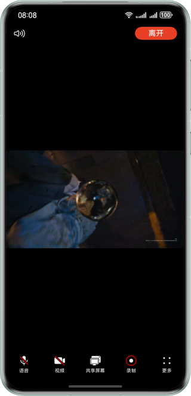

# 视频会议应用

## 概述

本示例应用展示了视频会议场景下的核心媒体能力集成方案，基于 AVScreenCapture 和 AVCastPicker 等原生能力，实现了音频录制、麦克风静音控制、音频输出设备切换以及屏幕录制等功能。在视频会议场景中，用户需要录制会议内容（包括屏幕画面和系统音频），并在不同环境下灵活切换音频输出设备（如扬声器、听筒、蓝牙耳机等），同时还需要后台保活以确保录屏任务持续运行。

为解决多音频流播放冲突问题，系统采用了音频焦点机制，只有获得音频焦点的音频流可以正常播放，失去音频焦点的音频流则不能播放。本示例在音频焦点管理上采用了特定策略：由于当前系统限制，AVScreenCapture 无法录制 VOIP 类型的音频，因此将音频流类型配置为 STREAM_USAGE_MUSIC，这可能被其它音乐应用打断。如果是实际的 VoIP 会议应用，建议使用 STREAM_USAGE_VOICE_COMMUNICATION 以获得更好的音频焦点保护。该示例适用于视频会议录制与回放、在线教育课程录制、远程协作演示记录等场景，为开发者提供了完整的技术参考实现。

## 效果预览


## 代码结构

```text
├── entry/src/main
│   ├── ets
│   │   ├── common
│   │   │   ├── Constants.ets                        // 常量/配置
│   │   │   ├── SubWindowManager.ets                 // 子窗口管理
│   │   │   └── utils
│   │   │       ├── AVScreenCaptureUtil.ets          // 录屏/采集相关封装
│   │   │       ├── BackgroundUtil.ets               // 背景处理
│   │   │       ├── Logger.ets                       // 日志
│   │   │       └── PermissionUtil.ets               // 权限申请
│   │   ├── entryability
│   │   │   └── EntryAbility.ets                     // 应用主入口
│   │   ├── entrybackupability
│   │   │   └── EntryBackupAbility.ets               // 备份能力入口
│   │   ├── components
│   │   │   ├── AudioDevice.ets                      // 音频设备切换/控制
│   │   │   ├── ConferenceVideo.ets                  // 会议视频展示
│   │   │   ├── CustomToolBar.ets                    // 工具栏容器
│   │   │   ├── CustomToolBarItem.ets                // 工具栏条目
│   │   │   └── VolumeIndicator.ets                  // 音量指示器
│   │   └── pages
│   │       ├── Index.ets                            // 主页面
│   │       └── SubWindow.ets                        // 子窗口页面
│   └──cpp
│       ├── napi_init.cpp                            // 原生 N-API 初始化
│       ├── CMakeLists.txt                           // 原生构建
│       ├── capabilities
│       │   ├── AVScreenCapture.cpp                  // 录屏采集实现
│       │   └── AVScreenCapture.h                    // 录屏能力头文件
│       ├── types/libentry
│       │   ├── index.d.ts                           // 类型声明
│       │   └── oh-package.json5                     // 原生模块包配置
│       └── libboundscheck/                          // 第三方依赖
└──entry/src/main/resources                          // 资源文件
```

## 实现原理

### 1. 整体架构设计

本应用采用 ArkTS + Native C++ 的双层架构设计，通过 NAPI 实现两层间的高效通信。ArkTS 层负责 UI 展示、业务逻辑封装和系统 API 调用，Native C++ 层负责 AVScreenCapture 录屏实例的生命周期管理和状态回调处理。


### 2. 核心模块协作流程

#### 录屏功能实现流程

用户点击工具栏录制按钮后，CustomToolBar 组件调用 AVScreenCaptureUtil.startCapture() 方法，创建文件描述符并启动后台长时任务，然后通过 NAPI 调用 Native 层的 StartScreenCaptureToFile() 方法。Native 层创建 AVScreenCapture 实例后，配置音频参数（采样率 48kHz、双声道、AAC-LC 编码、96kbps 码率）、视频参数（H.264 编码、2Mbps 码率、30fps 帧率），设置麦克风开关状态和回调监听器，最后调用 OH_AVScreenCapture_StartScreenRecording() 启动录制。录屏状态变化时，Native 层通过线程安全函数（napi_threadsafe_function）将状态回调到 ArkTS 层，更新 UI 状态。

#### 音频设备切换流程

AudioDevice 组件基于 AVCastPicker 实现，在组件初始化时通过 AudioRoutingManager.getPreferredOutputDeviceForRendererInfoSync() 获取当前推荐输出设备，并监听 preferOutputDeviceChangeForRendererInfo 事件。用户点击组件后弹出系统设备选择面板，选择设备后触发回调，AudioDevice 组件根据设备类型（听筒/扬声器/蓝牙）更新图标并显示 Toast 提示。音频焦点策略配置为 STREAM_USAGE_MUSIC，以支持 AVScreenCapture 录制系统音频。

### 3. 关键技术实现

#### NAPI 线程安全回调机制

Native 层录屏状态回调运行在非主线程，需要使用 NAPI 线程安全函数实现跨线程通信。在 SetStopCallbackToFile() 方法中，通过 napi_create_threadsafe_function() 注册回调函数，状态变化时调用 napi_call_threadsafe_function() 通知 ArkTS 层，确保线程安全。

#### 后台任务保活机制

录屏任务需要长时间运行，使用 backgroundTaskManager 申请 audioRecording 类型的后台长时任务。启动录屏时通过 startBackgroundRunning() 申请任务，传入 WantAgent 参数；停止录屏时通过 stopBackgroundRunning() 取消任务，避免应用进入后台后录屏中断。

#### 音频焦点管理策略

系统采用音频焦点机制协调多音频流播放，只有获得焦点的音频流可以正常播放。本示例将音频流类型配置为 STREAM_USAGE_MUSIC（而非 STREAM_USAGE_VOICE_COMMUNICATION），原因是 AVScreenCapture 当前无法录制 VOIP 类型音频。STREAM_USAGE_MUSIC 类型的音频流会被其它音乐应用打断，但可以录制系统音频。实际 VoIP 会议应用建议使用 STREAM_USAGE_VOICE_COMMUNICATION 类型，获得更高优先级和更好的焦点保护。

#### 状态回调处理机制

Native 层监听 OH_AVScreenCapture_StateCallback 回调，处理多种状态：OH_SCREEN_CAPTURE_STATE_STARTED（录制开始）、OH_SCREEN_CAPTURE_STATE_STOPPED_BY_USER（用户停止）、OH_SCREEN_CAPTURE_STATE_CANCELED（取消录制）、OH_SCREEN_CAPTURE_STATE_STOPPED_BY_CALL（被电话中断）、OH_SCREEN_CAPTURE_STATE_MIC_UNAVAILABLE（麦克风不可用）等。通过线程安全函数将状态同步到 UI 层，实现 UI 状态更新。

### 4. 数据持久化

录制文件保存到应用沙箱目录 {context.filesDir}/example.m4a，文件格式采用 MPEG-4 AAC (CFT_MPEG_4A)，音频编码为 AAC-LC，码率 96kbps，采样率 48kHz，双声道。视频编码采用 H.264，码率 2Mbps，帧率 30fps，采集模式为 OH_CAPTURE_HOME_SCREEN（录屏到家）。

## 功能开发

### 基于AVScreenCapture实现音频录制

**场景描述**

在视频会议场景下，用户需要录制会议内容，包括屏幕画面和会议音频。本功能基于AVScreenCapture能力实现屏幕录制，支持同时录制系统声音和麦克风声音，满足会议纪要录制、远程协作等场景需求。

**开发步骤**


**1. 创建录屏工具类封装**

在 `entry/src/main/ets/common/utils/AVScreenCaptureUtil.ets` 文件中，定义录屏功能的封装方法。该文件封装了startCapture和stopCapture两个核心方法，分别用于启动和停止录屏。

```typescript
import { fileIo as fs } from '@kit.CoreFileKit';
import { Logger } from './Logger';
import capture from 'libentry.so'
import { startContinuousTask, stopContinuousTask } from './BackgroundUtil';

export function startCapture(context: Context, isMicrophone: boolean) {
  try {
    let filePath: string = context.filesDir + '/example.m4a';
    try {
      let audioFile: fs.File = fs.openSync(filePath, fs.OpenMode.READ_WRITE | fs.OpenMode.CREATE);
      let fileFd = audioFile?.fd as number;
      capture.startScreenCaptureToFile(fileFd, isMicrophone);
    } catch (error) {
      let err: BusinessError = error as BusinessError;
      Logger.error(`Failed to open file, error code: ${err.code}, message: ${err.message}`);
    }
    startContinuousTask(context);
  } catch (error) {
    Logger.error('TAG', `getDefaultDisplaySync error. message:${(error as BusinessError).message}`);
  }
}

export function stopCapture(context: Context) {
  capture.stopScreenCaptureToFile();
  stopContinuousTask(context);
}
```

**2. 实现原生录屏能力**

在 `entry/src/main/cpp/capabilities/AVScreenCapture.cpp` 文件中，实现C++层面的录屏能力封装。该文件包含OH_AVScreenCapture_Create创建录屏实例、OH_AVScreenCapture_Init初始化配置、OH_AVScreenCapture_StartScreenRecording启动录制等核心方法。

```cpp
// 配置录屏参数
void AVScreenCapture::SetConfig(OH_AVScreenCaptureConfig &config) {
    OH_RecorderInfo recorderInfo;
    recorderInfo.fileFormat = OH_ContainerFormatType::CFT_MPEG_4A;
    
    // 配置视频采集信息
    OH_VideoCaptureInfo videoCapInfo = {
        .videoFrameWidth = 0, .videoFrameHeight = 0, .videoSource = OH_VIDEO_SOURCE_SURFACE_RGBA};
    OH_VideoEncInfo videoEncInfo = {
        .videoCodec = OH_VideoCodecFormat::OH_H264, .videoBitrate = 2000000, .videoFrameRate = 30};
    OH_VideoInfo videoInfo = {.videoCapInfo = videoCapInfo, .videoEncInfo = videoEncInfo};
    
    // 配置麦克风采集信息
    OH_AudioCaptureInfo micCapInfo = {.audioSampleRate = 48000, .audioChannels = 2, .audioSource = OH_MIC};
    // 配置系统声音采集信息
    OH_AudioCaptureInfo innerCapInfo = {.audioSampleRate = 48000, .audioChannels = 2, .audioSource = OH_ALL_PLAYBACK};
    OH_AudioEncInfo audioEncInfo = {.audioBitrate = 96000, .audioCodecformat = OH_AudioCodecFormat::OH_AAC_LC};
    OH_AudioInfo audioInfo = {.micCapInfo = micCapInfo, .innerCapInfo = innerCapInfo, .audioEncInfo = audioEncInfo};
    
    config.captureMode = OH_CAPTURE_HOME_SCREEN;
    config.dataType = OH_CAPTURE_FILE;
    config.audioInfo = audioInfo;
    config.videoInfo = videoInfo;
    config.recorderInfo = recorderInfo;
}

// 启动录屏到文件
OH_AVSCREEN_CAPTURE_ErrCode AVScreenCapture::StartScreenCaptureToFile(int32_t outputFd, bool isMicrophone) {
    avScreenCapture = OH_AVScreenCapture_Create();
    OH_AVScreenCaptureConfig config_;
    SetConfig(config_);
    std::string fileUrl = "fd://" + std::to_string(outputFd);
    config_.recorderInfo.url = const_cast<char *>(fileUrl.c_str());
    
    OH_AVScreenCapture_SetMicrophoneEnabled(avScreenCapture, isMicrophone);
    OH_AVScreenCapture_SetErrorCallback(avScreenCapture, OnErrorSaveFile, nullptr);
    OH_AVScreenCapture_SetStateCallback(avScreenCapture, OnStateChangeSaveFile, nullptr);
    
    OH_AVScreenCapture_Init(avScreenCapture, config_);
    OH_AVScreenCapture_StartScreenRecording(avScreenCapture);
    isRunning = true;
    return result;
}
```

**3. 配置原生模块导出**

在 `entry/src/main/cpp/napi_init.cpp` 文件中，将原生录屏能力导出给ArkTS层使用，定义startScreenCaptureToFile、stopScreenCaptureToFile、setMicrophoneEnabled等接口。

**4. 在工具栏中集成录屏功能**

在 `entry/src/main/ets/components/CustomToolBar.ets` 文件中，将录屏功能集成到工具栏。在toolBarItems数组中定义"录制"按钮，绑定onClick事件处理函数，点击时调用startCapture或stopCapture方法。

```typescript
new ToolBarItem({
  id: '4',
  label: '录制',
  iconActive: $r('sys.symbol.record_circle'),
  iconActiveColors: [Color.Red, Color.Red],
  iconInActiveColors: [Color.White, Color.Red],
  isActive: false,
  onClick: (isActive: boolean) => {
    if (!this.context) {
      return;
    }
    capture.setStopCallbackToFile(this.stopCallback.bind(this));
    if (isActive) {
      startCapture(this.context, this.isMicrophone);
    } else {
      stopCapture(this.context);
    }
  }
})
```

**5. 添加后台任务保活**

在 `entry/src/main/ets/common/utils/BackgroundUtil.ets` 文件中，实现startContinuousTask和stopContinuousTask方法，确保录屏任务在后台持续运行，避免录屏过程中因应用进入后台而中断。

---

### 基于AVCastPicker实现音频输出控制

**场景描述**

在视频会议场景下，用户需要灵活切换音频输出设备（如扬声器、听筒、蓝牙耳机等），以适应不同的使用环境。本功能基于AVCastPicker组件实现音频输出设备的可视化管理，提供直观的设备切换界面。

**开发步骤**


**1. 创建音频设备组件**

在 `entry/src/main/ets/components/AudioDevice.ets` 文件中，创建AudioDevice组件，封装音频设备切换功能。该组件使用AVCastPicker组件提供设备选择UI。

```typescript
@Component
export struct AudioDevice {
  @State audioOutputIcon: Resource = $r('sys.symbol.speaker_wave_3');
  private context: common.UIAbilityContext = this.getUIContext().getHostContext() as common.UIAbilityContext;
  private avSession: avSession.AVSession | undefined = undefined;
  private audioManager: audio.AudioManager = audio.getAudioManager();
  private audioRoutingManager: audio.AudioRoutingManager = this.audioManager.getRoutingManager();
  private outDeviceType: audio.DeviceType = audio.DeviceType.EARPIECE;

  @Builder
  customPickerBuilder() {
    SymbolGlyph(this.audioOutputIcon)
      .fontSize(24)
      .fontColor([Color.White])
  }

  aboutToAppear(): void {
    this.initOutputDevice();
    this.initAVSession();
    this.watchPreferredOutputDeviceChange();
  }

  build() {
    AVCastPicker({
      onStateChange: (state: AVCastPickerState) => {
        Logger.info(TAG, `change avcastpicker: ${state}`);
      },
      customPicker: this.customPickerBuilder()
    })
      .width(24)
      .height(24)
  }
}
```

**2. 初始化AVSession会话**

在AudioDevice组件的initAVSession方法中，创建AVSession会话用于音频设备管理。

```typescript
private async initAVSession() {
  try {
    this.avSession = await avSession.createAVSession(this.context, 'voip', 'video_call');
    Logger.info(TAG, `session create successed : sessionId : ${this.avSession.sessionId}`);
  } catch (error) {
    Logger.error(TAG, `avSession.createAVSession failed, code: ${error.code}, message: ${error.message}`);
  }
}
```

**3. 监听推荐输出设备变化**

在AudioDevice组件的watchPreferredOutputDeviceChange方法中，监听推荐输出设备的变化，实时更新UI图标和提示信息。

```typescript
watchPreferredOutputDeviceChange() {
  try {
    this.audioRoutingManager.on('preferOutputDeviceChangeForRendererInfo', Constants.RENDERER_INFO,
      (audioDeviceDescriptors: audio.AudioDeviceDescriptors) => {
        this.handleOutputDeviceChange(audioDeviceDescriptors[0].deviceType);
      });
  } catch (err) {
    let error = err as BusinessError;
    Logger.error(TAG, `preferOutputDeviceChangeForRendererInfo failed, code: ${error.code}, message: ${error.message}`);
  }
}
```

**4. 处理设备类型切换**

在handleOutputDeviceChange方法中，根据设备类型更新图标和显示相应的提示信息。

```typescript
handleOutputDeviceChange(deviceType: audio.DeviceType) {
  if (this.outDeviceType === deviceType) {
    return;
  }
  this.outDeviceType = deviceType;

  switch (this.outDeviceType) {
    case audio.DeviceType.EARPIECE:
      this.audioOutputIcon = $r('sys.symbol.ear')
      Logger.info(TAG, `声音将通过听筒播放`);
      break;
    case audio.DeviceType.SPEAKER:
      this.audioOutputIcon = $r('sys.symbol.speaker_wave_3')
      Logger.info(TAG, `声音将通过扬声器播放`);
      break;
    case audio.DeviceType.BLUETOOTH_SCO:
      this.audioOutputIcon = $r('sys.symbol.earphone_bluetooth_fill')
      Logger.info(TAG, `声音将通过耳机播放`);
      break;
    default:
      break;
  }
}
```

**5. 定义渲染器信息常量**

在 `entry/src/main/ets/common/Constants.ets` 文件中，定义RENDERER_INFO常量，用于音频路由管理器的设备查询条件。
> 注：由于当前系统限制，无法使用AVScreenCapture录制VOIP类型的音频，因此usage改为了可以录制的STREAM_USAGE_MUSIC类型。

**音频焦点策略说明**

在视频会议场景中，音频焦点管理至关重要。系统采用音频焦点策略来协调多个应用的音频播放：

- **STREAM_USAGE_MUSIC 类型音频**：普通音乐类音频流，当其它音乐类应用播放时会互相打断。例如，正在播放音乐时打开另一个音乐应用，前一个应用会被暂停。
- **STREAM_USAGE_VOICE_COMMUNICATION 类型音频**：VoIP 通话类音频流，具有更高的优先级。音乐类应用无法打断 VoIP 通话，但 VoIP 通话可以打断音乐播放。
- 本示例中，为了支持 AVScreenCapture 录制系统音频，将 usage 设置为 STREAM_USAGE_MUSIC，因此可能会被其它音乐应用打断。如果是实际的 VoIP 会议应用，建议使用 STREAM_USAGE_VOICE_COMMUNICATION 以获得更好的音频焦点保护。

更多音频焦点策略详情请参考音频焦点介绍。

```typescript
export default class Constants {
  public static readonly RENDERER_INFO: audio.AudioRendererInfo = {
    usage: audio.StreamUsage.STREAM_USAGE_MUSIC,
    rendererFlags: 0
  };
}
```

**6. 在主页面集成音频设备控制**

在 `entry/src/main/ets/pages/Index.ets` 文件中，将AudioDevice组件添加到页面布局中，用户可通过点击该组件打开设备选择面板进行切换。

```typescript
Row() {
  AudioDevice()

  Button('离开', { buttonStyle: ButtonStyleMode.EMPHASIZED, role: ButtonRole.ERROR })
    .width(88)
    .height(28)
    .onClick(() => {
      this.context.terminateSelf();
    })
}
```


## 使用说明

1. **权限授权**: 初次进入会议，应用会自动请求麦克风权限弹窗，点击允许。
3. **音频录制**: 点击工具栏中的"录制"按钮开始录屏，再次点击停止录制。
4. **切换音频设备**: 点击音频设备图标按钮，弹出发送设备选择面板，切换扬声器/听筒/蓝牙耳机。
5. **离开会议**: 点击"离开"按钮退出会议。

## 相关权限

1. 麦克风使用权限：ohos.permission.MICROPHONE
2. 后台任务保活权限：ohos.permission.KEEP_BACKGROUND_RUNNING

## 技术依赖

- **@kit.AudioKit**: 音频管理
- **@kit.AVSessionKit**: 会话管理
- **@kit.MediaKit**: 媒体处理

## 运行要求

- **设备**: 直板机
- **系统**: 6.0.1 Release 及以上
- **IDE**: DevEco Studio 6.0.1 Release 及以上
- **SDK**: 6.0.1 Release SDK