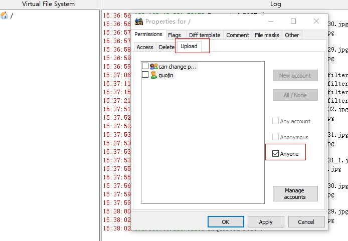
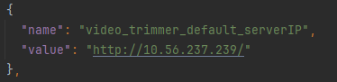

## 上传下载应用服务器使用说明

### 服务器配置：

1.测试设备和电脑连接同一个局域网。

2.电脑打开本目录下`hfs.exe`可执行文件。

3.hfs客户端配置：

| 电脑端创建一个文件夹，hfs客户端点击you are in Easy mode出现黑色区域后，在根节点右键点击bind root to real-folder，绑定到创建的文件夹 | 根节点右键点击Properties | 点击upload选项，勾选anyone后，点击ok |
|-------------------------------------------------------------------------------------------| ------------------------ | ------------------------------------ |
|                                                                      |     |           |

4.在工程中配置服务器地址。

|         获取服务器url          | 在string.json中将video_trimmer_default_serverIP节点的值配置为服务器地址 |
|:-------------------------:|:--------------------------------------------------------:|
|  |                                   |

5、按照顺序操作1-4步骤后，即可运行测试上传下载任务。