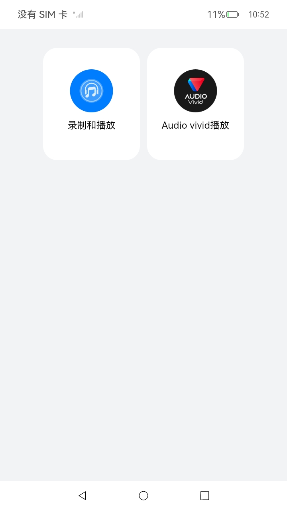
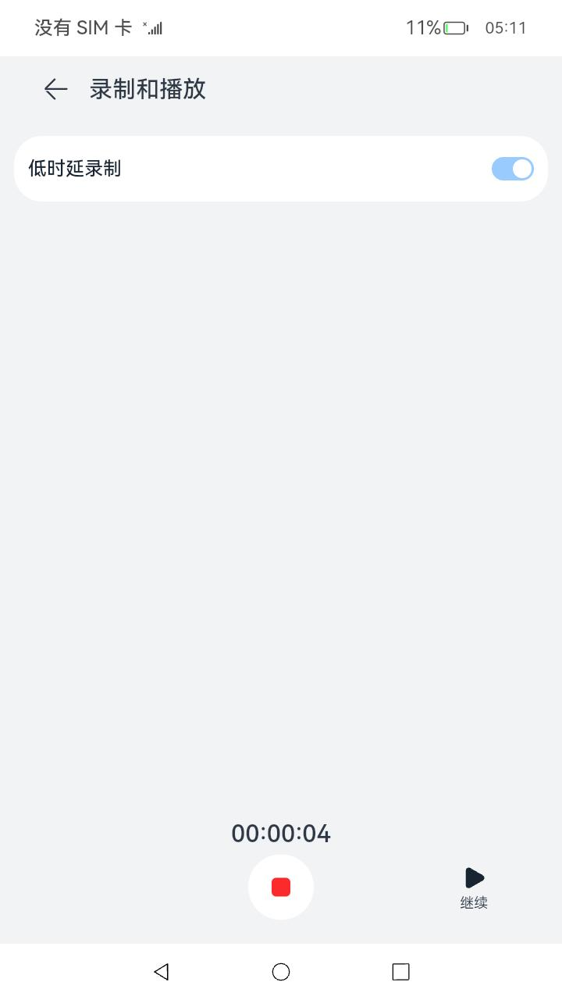
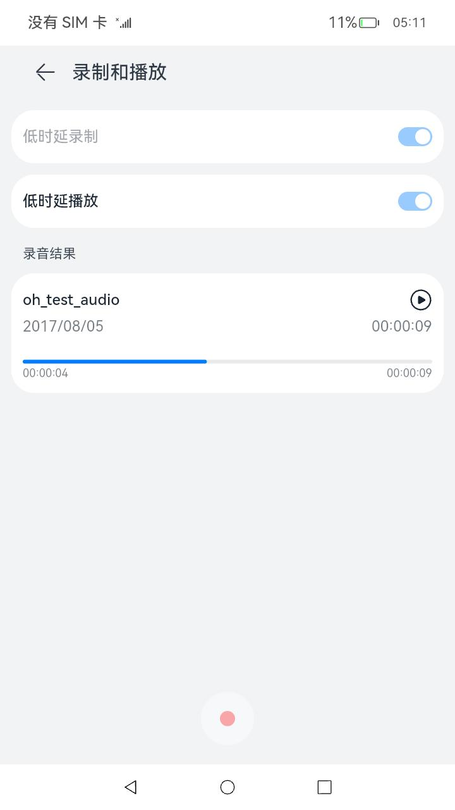
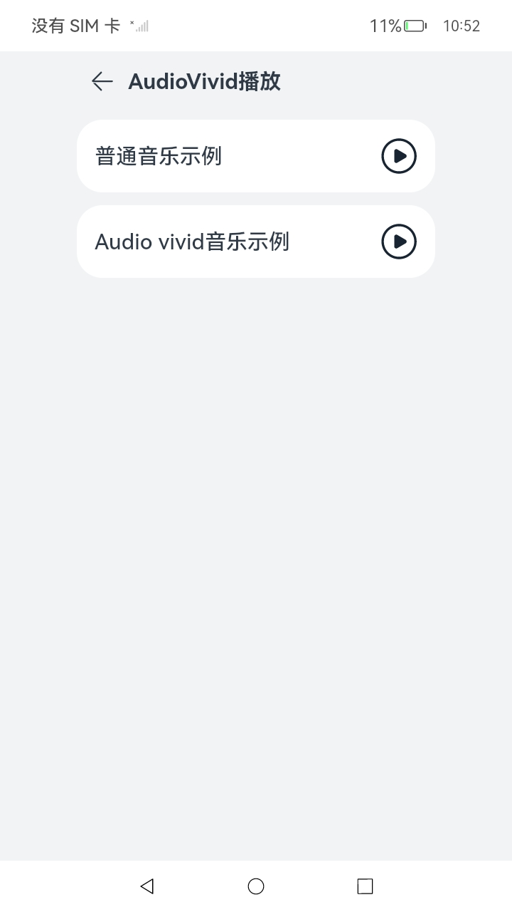

# 音频管理

### 介绍

本示例主要展示了音频低时延录制和播放，AudioVivid音乐播放的相关功能：<br>
    1. [低时延录制](https://gitee.com/openharmony/docs/blob/OpenHarmony-4.0-Release/zh-cn/application-dev/media/using-ohaudio-for-recording.md)。<br>
    2. [低时延播放](https://gitee.com/openharmony/docs/blob/OpenHarmony-4.0-Release/zh-cn/application-dev/media/using-ohaudio-for-playback.md)。<br>
    3. [AudioVivid播放](https://gitee.com/openharmony/docs/blob/master/zh-cn/application-dev/media/audio/using-ohaudio-for-playback.md).

### 效果预览

| 主页                                       | 录制页面                                                  |
|------------------------------------------|-------------------------------------------------------|
|    |  |
| 播放页面                                     | AudioVivid播放页|
|  ||

使用说明

1. 弹出麦克风权限访问提示框，点击“允许”，如果点击"禁止"则不可进行录制，需要用户去设置页面给应用授权后方可正常录制
2. 在主界面点击“录制和播放”，进入音频录制界面，音频录制界面默认是普通录制界面，打开低时延录制开关可进行低时延录制
3. 点击录制按钮，开始录制，开始录制后低时延录制开关变为不可点击状态，录音时间开始计时，5s内不允许结束，30s后会自动结束录制
4. 点击暂停按钮，暂停录制，录音时间也停止计时
5. 点击继续按钮，继续录制，录音时间继续计时
6. 停止录制后，会生成录制结果，界面上有一个低时延播放开关和录制成功的音频播放器，点击低时延播放开关可打开低时延播放功能，点击播放可听到录制的音频，播放未结束之前低时延播放开关为不可点击状态
7. 点击返回按按钮回到主页
8. 点击AudioVivid播放卡片进入页面
9. 点击普通播放按钮，播放普通格式音乐
10. 点击普通暂停按钮，暂停普通格式音乐
11. 点击AudioVivid播放按钮，播放AudioVivid格式音乐
12. 点击AudioVivid暂停按钮，暂停AudioVivid格式音乐
13. 点击返回按按钮回到主页

### 工程目录

```
entry/src/main/
|---main
|   |---cpp
|   |   |---types
|   |   |   |---libentry
|   |   |   |   |---index.d.ts                     // 接口导出
|   |   |   |   |---oh-package.json5
|   |   |---audio.cpp                     // 调用native接口
|   |   |---CMakeLists.txt                         // 编译脚本
|   |---ets
|   |   |---entryability
|   |   |   |---EntryAbility.ets
|   |   |---pages
|   |   |   |---Index.ets                          // 首页
|   |   |   |---AudioRecording.ets                 // 录制和播放页面
|   |   |   |---AudioVividPlayback.ets                 // AudioVivid播放页面
|   |---resources                                  // 静态资源
|---ohosTest               
|   |---ets
|   |   |---tests
|   |   |   |---Ability.test.ets                   // 自动化测试用例
```

### 具体实现
* 音频录制和播放-源码参考：[audioRecording.cpp](entry/src/main/cpp/audioRecording.cpp)
    * [低时延录制开发指导文档](https://gitee.com/openharmony/docs/blob/OpenHarmony-4.0-Release/zh-cn/application-dev/media/using-ohaudio-for-recording.md)
    * [低时延播放开发指导文档](https://gitee.com/openharmony/docs/blob/OpenHarmony-4.0-Release/zh-cn/application-dev/media/using-ohaudio-for-playback.md)
    * [低时延录制开发示例](https://gitee.com/openharmony/multimedia_audio_framework/blob/OpenHarmony-4.0-Release/frameworks/native/ohaudio/test/example/oh_audio_capturer_test.cpp)
    * [低时延播放开发示例](https://gitee.com/openharmony/multimedia_audio_framework/blob/OpenHarmony-4.0-Release/frameworks/native/ohaudio/test/example/oh_audio_renderer_test.cpp)
    * [AudioVivid播放开发示例](https://gitee.com/openharmony/docs/blob/master/zh-cn/application-dev/media/audio/using-ohaudio-for-playback.md)

### 相关权限

音频录制涉及的权限包括：

1.允许应用使用麦克风：[ohos.permission.MICROPHONE](https://gitee.com/openharmony/docs/blob/OpenHarmony-4.0-Release/zh-cn/application-dev/security/permission-list.md#ohospermissionmicrophone)

### 依赖

不涉及。

### 约束与限制

1. 本示例仅支持标准系统上运行，支持设备：RK3568（不支持低时延功能）；
2. 本示例仅支持API12版本SDK，镜像版本号：OpenHarmony 5.0.0.20及之后的版本；
3. 本示例需要使用DevEco Studio 3.1.1 release (Build Version: 3.1.0.501)才可编译运行；

### 下载

如需单独下载本工程，执行如下命令：

```
git init
git config core.sparsecheckout true
echo code/BasicFeature/Native/Audio/ > .git/info/sparse-checkout
git remote add origin https://gitee.com/openharmony/applications_app_samples.git
git pull origin ***(分支名)
```