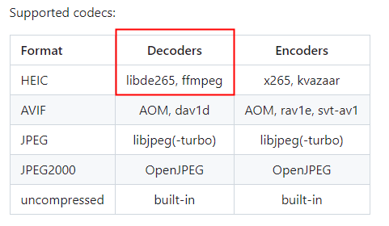
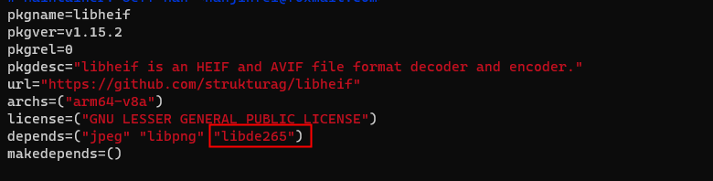
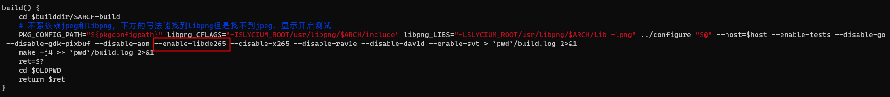
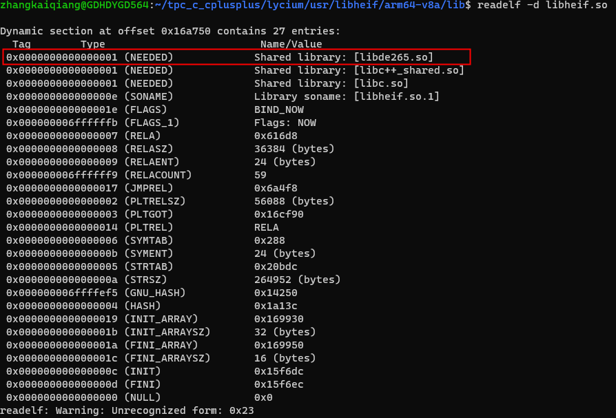

# HEIF软解码器案例

### 介绍

高效图像文件格式HEIF（High Efficiency Image File Format）具有更高的图像质量，更高效的压缩算法，在应用中大量使用，有些应用静态图90%以上都是HEIF图片（.heic后缀）。本示例介绍将[libheif](https://github.com/strukturag/libheif)编译移植到鸿蒙平台，通过网络库[curl](https://curl.se/)请求HEIF图片资源、libheif软解码HEIF图片，最后在瀑布流中加载解码后的HEIF图片的过程。本案例HEIF软解码方案可供开发者调试，硬解码不支持的设备也可以使用软解码方案。

### 效果图预览


进入本案例首页，开始加载HEIF网络图片的过程：在Taskpool子线程中，通过libcurl网络请求HEIF图片资源，然后通过libheif软解码出HEIF图片数据，调用OH_PixelMap_CreatePixelMap将HEIF图片数据转为PixelMap，主线程获取图片软解码结果后在WaterFlow中加载所有HEIF图片。
### 实现思路

对于jpg、png和jpeg等系统支持硬解码的图片格式，开发者使用imageSource即可直接解码，创建PixelMap对象后，可以给上层UI组件展示。理论上，对于.heic这类系统暂不支持的图片格式，需要移植自定义解码器（二方库或者三四方库）到鸿蒙平台，然后调用解码器接口解码出原始像素数据，进行字节对齐、颜色变换等操作后，调用NDK的OH_PixelMap_CreatePixelMap函数即可创建PixelMap，给上层UI组件展示。

### 实现方案

#### 1.libheif移植

本文在Linux平台上编译libheif，下载sdk-linux并配置好环境变量，然后按照文档[libheif 集成到应用hap](https://gitee.com/openharmony-sig/tpc_c_cplusplus/blob/master/thirdparty/libheif/docs/hap_integrate.md#libheif-%E9%9B%86%E6%88%90%E5%88%B0%E5%BA%94%E7%94%A8hap)的流程进行即可。

**注意事项**

根据[libheif github源工程](https://github.com/strukturag/libheif)，libheif解码依赖libde265/ffmpeg，所以还需要集成libd265/ffmpeg。



libd265移植参考[ libde265 集成到应用hap](https://gitee.com/openharmony-sig/tpc_c_cplusplus/blob/master/thirdparty/libde265/docs/hap_integrate.md)， libde265文件夹与libheif保持同级目录。

修改thirdparty/libheif/HPKBUILD构建脚本，添加libde265依赖，libde265的编译选项由disable改为enable，这样就可以在libheif编译时链接到libde265。





最后编译成功的产物可在/lycium/usr下获取，可以看到thirdparty/libheif/HPKBUILD依赖的库都成功编译了，并且查看libheif.so的属性，运行时会依赖libde265.so。




#### 2.使用curl网络请求HEIF图片

本案例将[网络库curl集成到hap](https://gitee.com/openharmony-sig/tpc_c_cplusplus/blob/master/thirdparty/curl/docs/hap_integrate.md)，这样在Native侧就可以直接请求到HEIF图片，并在Native侧解码，减少跨语言调用开销。

#### 3.读取HEIF图片

libheif允许开发者从不同的来源（磁盘文件、内存、自定义Reader）读取HEIF图片文件，并将其加载到heif_context中，以便后续操作和处理HEIF内容。

本案例以`heif_context_read_from_memory_without_copy`读取网络请求到的HEIF图片（已在内存中）为例。

```c++
// 创建HEIF上下文指针
heif_context *ctx = heif_context_alloc();

/**
功能：从指定的磁盘文件中读取HEIF文件。
参数：
struct heif_context*：指向HEIF上下文的指针，用于存储和管理HEIF文件的解码和处理信息。
const char* filename：指向包含HEIF文件名的字符串的指针。
const struct heif_reading_options*：指向读取选项的指针。目前应该设置为NULL，表示没有特殊的读取选项。
*/
struct heif_error heif_context_read_from_file(struct heif_context*, const char* filename,
                                              const struct heif_reading_options*);

/**
功能：从内存中读取HEIF文件，但提供的内存不会被复制。这意味着，只要使用heif_context，就必须保持内存区域有效。
参数：
struct heif_context*：同上。
const void* mem：指向存储HEIF文件数据的内存块的指针。
size_t size：内存块的大小，以字节为单位。
const struct heif_reading_options*：读取选项，同上。
*/
struct heif_error heif_context_read_from_memory_without_copy(struct heif_context*,
                                                             const void* mem, size_t size,
                                                             const struct heif_reading_options*);
/**
功能：从自定义的struct heif_reader（如网络流、加密文件等）中读取HEIF文件。
参数：
struct heif_context*：同上。
const struct heif_reader* reader：指向实现了特定读取函数的heif_reader结构的指针。
void* userdata：传递给reader回调的用户定义数据。
const struct heif_reading_options*：读取选项，同上
*/
struct heif_error heif_context_read_from_reader(struct heif_context*,
                                                const struct heif_reader* reader,
                                                void* userdata,
                                                const struct heif_reading_options*);
```

#### 4.解码HEIF图片

解码函数（heif_decode_image）的主要作用是将HEIF图片处理句柄（heif_image_handle）解码为实际的像素图像，并可以设置colorspace和chroma参数来指定输出图像的色彩空间和色度采样方式，如果不需要更改，可以保持为默认值，解码选项参数option可以设置解码后的质量、缩放等。

目前OH_PixelMap_CreatePixelMap颜色编码格式只支持BGRA_8888，但是heif_decode_image不支持该颜色编码格式，所以本案例指定HEIF图片的编码格式为BGRA。

```cpp
// 获取主图像句柄
heif_image_handle *handle;
heif_context_get_primary_image_handle(ctx, &handle);
// 从句柄中解码图像
heif_image *heif_img;
heif_decode_image(handle, &heif_img, heif_colorspace_RGB, heif_chroma_interleaved_RGBA, nullptr);
```

#### 5.创建PixelMap

##### 访问heif图像

```cpp
// 获取图像数据
int stride;
uint8_t *data = heif_image_get_plane_readonly(heif_img, heif_channel_interleaved, &stride);
```

>在访问heif图像数据时，需要考虑stride，表示图像中每行像素数据在内存中所占的字节数。通常，图像数据在内存中是连续存储的，但是由于内存对齐等因素，每行的字节数可能会大于实际图像的实际宽度，即stride > width * bpp，width是图片的宽度，bpp（bytes per pixel）是每像素的字节数。

##### 字节对齐

RGBA格式下，如果stride > width * bpp，即每行的字节数可能会大于图像的实际宽度，此时需要字节对齐，参考如下代码。

```c++
const size_t bpp = 4; // 颜色格式为BGRA，每个像素4个字节
const size_t pixel_count = width * height; // 像素总数
const size_t row_bytes = width * bpp;        // 每一行的字节数，每个像素4个字节
const size_t total_size = pixel_count * bpp; // 计算平面的总数据大小

uint8_t *new_data = data;                 // 默认指向原数据
bool needAlignment = stride != row_bytes; // 是否需要字节对齐
if (needAlignment) {
    new_data = new uint8_t[total_size];
    // 字节对齐
    for (int row = 0; row < height; row++) {
        memcpy(new_data + row * row_bytes, data + row * stride, row_bytes);
    }
}
```

##### 颜色编码格式变换

目前OH_PixelMap_CreatePixelMap颜色编码格式只支持BGRA（API12开始会新增），而HEIF的颜色格式为RGBA，所以需要将RGBA转换为BGRA。

```c++
// 定义颜色编码格式转换函数
void swapRBChannels(uint8_t *pixels, int pixelCount) {
    for (int i = 0; i < pixelCount; i++) {
        std::swap(pixels[i * 4], pixels[i * 4 + 2]);
    }
}
```

##### 创建PixelMap

定义HEIF的宽高、颜色编码格式，调用NDK的OH_PixelMap_CreatePixelMap函数即可创建PixelMap。

```c++
struct OhosPixelMapCreateOps createOps;
createOps.width = width;
createOps.height = height;
createOps.pixelFormat = 4; // BGRA
createOps.alphaType = 0;

int32_t res = OH_PixelMap_CreatePixelMap(env, createOps, (void *)new_data, total_size, &pixel_map);
if (res != IMAGE_RESULT_SUCCESS || pixel_map == nullptr) {
    OH_LOG_ERROR(LOG_APP, "创建pixelMap错误");
    return nullptr;
}
```

### 高性能知识点

1. 本示例使用了LazyForEach进行数据懒加载，WaterFlow布局时会根据可视区域按需创建FlowItem组件，并在FlowItem滑出可视区域外时销毁以降低内存占用。
2. 本案例的图片软解码使用Taskpool来实现多线程并发能力，提升系统资源利用率，减少主线程负载，加快应用的启动速度和响应速度。

### 工程结构&模块类型

```txt
​```
decodeheifimage                               // har类型
|---libs\
|   |---arm64-v8a\libde265.so                 // arm64-v8a类型libde265库
|   |---arm64-v8a\libheif.so.1                // arm64-v8a类型libheif库
|   |---arm64-v8a\libnativedownloadheif.so    // arm64-v8a类型基于libcurl的网络请求so
|   |---arm64-v8a\libnativedecodeheif.so      // arm64-v8a类型基于libheif的HEIF解码so
|---src\main\ets\components\
|   |---ReusableFlowItem.ets                  // 公共组件-瀑布流FlowItem组件
|---src\main\ets\model\                       // 模型层
|   |---WaterFlowData.ets                     // 瀑布流数据和操作类
|   |---TaskPool.ets                          // TaskPool子线程加载so库
|---src\main\ets\
|   |---DecodeHEIFImageView.ets               // 主页面
|---src\main\cpp\
|   |--- CMakeLists.txt                       // C++编译和链接配置成
|   |--- decode_heif_image.cpp                // 基于libheif的HEIF软解码实现
|   |--- download_heif_image.cpp              // 基于libcurl的网络请求实现
|   |--- napi_init.cpp                        // native层HEIF软解码实现
​```
```

### 模块依赖

1. 依赖公共libs库中的[libcurl.so](./decodeheifimage/libs/arm64-v8a/libcurl.so)，进行Native侧的网络请求HEIF图片资源。

### 参考资料

[高效并发编程](https://gitee.com/openharmony/docs/blob/master/zh-cn/application-dev/performance/efficient-concurrent-programming.md#/openharmony/docs/blob/master/zh-cn/application-dev/arkts-utils/cpu-intensive-task-development.md)

[WaterFlow+LazyForEach详细用法可参考性能范例](https://gitee.com/openharmony/docs/blob/master/zh-cn/application-dev/performance/waterflow_optimization.md)

[libheif github源工程](https://github.com/strukturag/libheif)

[libheif 集成到应用hap](https://gitee.com/openharmony-sig/tpc_c_cplusplus/blob/master/thirdparty/libheif/docs/hap_integrate.md#libheif-%E9%9B%86%E6%88%90%E5%88%B0%E5%BA%94%E7%94%A8hap)

[libde265 集成到应用hap](https://gitee.com/openharmony-sig/tpc_c_cplusplus/blob/master/thirdparty/libde265/docs/hap_integrate.md)

[网络库curl集成到hap](https://gitee.com/openharmony-sig/tpc_c_cplusplus/blob/master/thirdparty/curl/docs/hap_integrate.md)

### 相关权限

不涉及

### 约束与限制

1.本示例仅支持在标准系统上运行，支持设备：Phone。

2.本示例为Stage模型，支持API12版本SDK，SDK版本号（API Version 12 Release）。

3.本示例需要使用DevEco Studio 5.0.0 Release 才可编译运行。

### 下载

如需单独下载本工程，执行如下命令：
```javascript
git init
git config core.sparsecheckout true
echo code/BasicFeature/Native/DecodeHEIFImage/ > .git/info/sparse-checkout
git remote add origin https://gitee.com/openharmony/applications_app_samples.git
git pull origin master
```