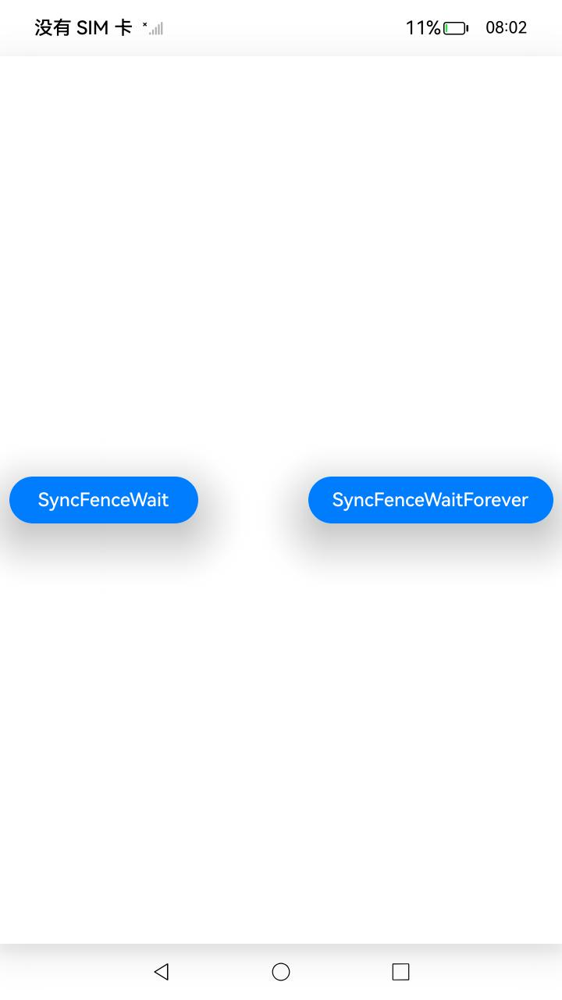

# 基于NdkNativeFence的接口调用示例

### 介绍

本示例主要演示如何在 OpenHarmony 系统中，使用 Native C++ 代码，通过 `OH_NativeFence_IsValid`、`OH_NativeFence_Wait` 、`OH_NativeFence_WaitForever`和 `OH_NativeFence_Close` API，实现接口功能调用。示例展示了如何对fenceFd进行 `OH_NativeFence_Wait`和`OH_NativeFence_WaitForever`操作。

## 效果预览

|      主页面                     |
|   |

### 使用说明

1. **编译安装**：使用 DevEco Studio 编译生成应用的 hap 包，并将其安装到设备上。

2. **运行应用**：打开应用后，您将看到屏幕上显示SyncFenceWait和SyncFenceWaitForever按钮。

3. **测试功能**：点击SyncFenceWait按钮，查找“SyncFenceWait”关键字，观察日志输出；然后点击SyncFenceWaitForever按钮，查找“SyncFenceWaitForever”关键字，再次观察日志输出。

### 工程目录
```
├──entry/src/main
│  ├──cpp                           // C++代码区
│  │  ├──CMakeLists.txt             // CMake配置文件
│  │  ├──napi_init.cpp              // Napi模块注册
│  │  ├──common
│  │  │  └──log_common.h            // 日志封装定义文件
│  ├──ets                           // ets代码区
│  │  ├──entryability
│  │  │  ├──EntryAbility.ts         // 程序入口类
|  |  |  └──EntryAbility.ets
│  │  └──pages                      // 页面文件
│  │     └──Index.ets               // 主界面
|  ├──resources                     // 资源文件目录
```
### 具体实现

本示例通过在 DevEco Studio 中创建 Native C++ 工程，通过 `OH_NativeFence_IsValid`、`OH_NativeFence_Wait` 、`OH_NativeFence_WaitForever`和 `OH_NativeFence_Close` API，实现接口功能调用。

主要步骤如下：

1. **调用SyncFenceWait接口**：(1)在接口SyncFenceWait中，调用OH_NativeFence_Wait接口，传入非法fenceFd。（2）利用signalfd函数创建信号，在waitThread线程中调用OH_NativeFence_Wait接口阻塞fenceFd。（3）3s后在主线程中使用kill函数模拟信号触发。（4）观察OH_NativeFence_Wait接口是否解除阻塞。

1. **调用SyncFenceWaitForever接口**：(1)在接口SyncFenceWaitForever中，调用OH_NativeFence_WaitForever接口，传入非法fenceFd。（2）利用signalfd函数创建信号，在waitThread线程中调用OH_NativeFence_WaitForever接口阻塞fenceFd。（3）2s后在主线程中使用kill函数模拟信号触发。（4）观察OH_NativeFence_WaitForever接口是否解除阻塞。

| 接口名 | 描述 |
| -------- | -------- |
| `OH_NativeFence_IsValid(int fenceFd)` | 检查fenceFd是否有效。 |
| `OH_NativeFence_Wait(int fenceFd, uint32_t timeout)` |阻塞传入的fenceFd。最大阻塞时间由超时参数决定。 |
| `OH_NativeFence_WaitForever(int fenceFd)` | 永久阻塞传入的fenceFd。 |
| `OH_NativeFence_Close(int fenceFd)` | 关闭fenceFd。如果传入的是无效的fenceFd，则该函数会直接返回。 |

### 相关权限

本示例不涉及特殊权限。

### 依赖
本示例不涉及特殊依赖。

### 约束与限制

1. **运行环境**：本示例仅支持标准系统上运行，支持设备：RK3568。

2. **SDK 版本**：本示例已适配 API Version 20 版本 SDK，适用于 SDK 版本号（API Version 20 Release）、镜像版本号（5.0.0 Release）。

3. **开发工具**：本示例需要使用 DevEco Studio 版本号（5.0.0 Release）及以上版本进行编译和运行。

### 下载

如需单独下载本工程，执行如下命令：

```bash
git init
git config core.sparsecheckout true
echo code/BasicFeature/Native/NdkNativeFence > .git/info/sparse-checkout
git remote add origin https://gitee.com/openharmony/applications_app_samples.git
git pull origin master
```