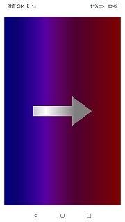

# NdkNativeImage

### 介绍

本示例主要演示如何在 OpenHarmony 系统中，使用 Native C++ 代码，通过 `OH_NativeImage`、`OH_NativeWindow` 和 `OH_NativeVSync` API，实现一个从左到右循环渐变的动态动画效果。示例展示了如何创建 `OH_NativeWindow` 实例、使用 `OH_NativeImage` 处理图像数据、接收 VSync 信号、映射缓冲区内存、逐像素绘制动态渐变动画，以及在屏幕上呈现该动画。

### 使用说明

1. **编译安装**：使用 DevEco Studio 编译生成应用的 hap 包，并将其安装到设备上。

2. **运行应用**：打开应用后，您将看到屏幕上显示一个从左到右循环渐变的平滑动画效果。

### 效果预览

| 动态渐变效果                          |
| -------------------------------------- |
|  |

### 工程目录
```
├──entry/src/main
│  ├──cpp                           // C++代码区
│  │  ├──CMakeLists.txt             // CMake配置文件
│  │  ├──napi_init.cpp              // Napi模块注册
│  │  ├──common
│  │  │  └──common.h                // 日志封装定义文件
│  │  ├──render                     // 画面渲染模块
│  │  │  ├──image_render.cpp        // 消费者
│  │  │  ├──image_render.h
│  │  │  ├──native_render.cpp       // 生产者
│  │  │  ├──native_render.h
│  │  │  ├──render_engine.cpp       // 渲染引擎
│  │  │  └──render_engine.h
│  ├──ets                           // ets代码区
│  │  ├──entryability
│  │  │  ├──EntryAbility.ts         // 程序入口类
|  |  |  └──EntryAbility.ets
│  │  └──pages                      // 页面文件
│  │     └──Index.ets               // 主界面
|  ├──resources         			// 资源文件目录
```
### 具体实现

本示例通过在 DevEco Studio 中创建 Native C++ 工程，利用 `OH_NativeWindow`、`OH_NativeImage` 和 `OH_NativeVSync` API 直接操作像素数据，实现动态渐变动画。

主要步骤如下：

1. **创建 RenderEngine**：`RenderEngine` 类负责渲染逻辑的管理，包括渲染线程的启动和停止，以及调用具体的渲染函数。

2. **创建 OH_NativeWindow 实例**：在 C++ 代码中，通过 Surface ID 获取 `OH_NativeWindow` 实例，用于与窗口系统交互。

3. **设置缓冲区属性**：使用 `OH_NativeWindow_NativeWindowHandleOpt` 函数设置缓冲区的大小、像素格式等属性，确保缓冲区满足渲染需求。

4. **创建 OH_NativeImage 实例**：使用 `OH_NativeImage_Create` 函数创建 `OH_NativeImage` 对象，用于处理图像数据。

5. **初始化 VSync**：使用 `OH_NativeVSync_Create` 函数创建 `OH_NativeVSync` 实例，接收 VSync 信号。

6. **请求缓冲区并映射内存**：使用 `OH_NativeWindow_NativeWindowRequestBuffer` 函数请求一个可写的缓冲区，然后使用 `mmap` 函数将缓冲区内存映射到虚拟地址空间，获取像素数据指针。

7. **渲染动态渐变**：在 `DrawGradient` 函数中，利用 `OH_NativeImage` 对象，对像素数据进行操作，使用余弦函数计算每个像素的颜色强度，实现从左到右的平滑渐变，并通过时间变量实现动画效果，使渐变循环移动。

8. **提交缓冲区**：渲染完成后，解除内存映射，并使用 `OH_NativeWindow_NativeWindowFlushBuffer` 函数将缓冲区提交给消费者，刷新显示内容。

9. **启动渲染线程**：`RenderEngine` 类在后台启动一个渲染线程，持续调用 `RenderFrame` 函数，以固定的帧率（例如 120 FPS）更新动画。

### RenderEngine 介绍

`RenderEngine` 类是NdkNativeImage sample渲染系统的核心组件，主要负责以下功能：

- **渲染管理**：控制渲染线程的启动和停止，确保渲染过程的顺序和线程安全。

- **帧渲染循环**：在渲染线程中，不断调用渲染函数，生成新的帧，以实现动画效果。

- **资源管理**：初始化和释放渲染过程中需要的资源，例如 `OH_NativeWindow`、`OH_NativeImage` 和 `OH_NativeVSync` 实例。

`RenderEngine` 的使用步骤：

1. **初始化**：创建 `RenderEngine` 实例，传入必要的参数（如 Surface ID、宽度和高度）。

2. **启动渲染**：调用 `Start` 方法，启动渲染线程，开始渲染循环。

3. **停止渲染**：在不需要渲染时，调用 `Stop` 方法，停止渲染线程，释放资源。

### 涉及到的相关接口

| 接口名 | 描述 |
| -------- | -------- |
| `OH_NativeWindow_CreateNativeWindowFromSurfaceId(uint64_t surfaceId, OHNativeWindow **window)` | 通过 Surface ID 创建 `OH_NativeWindow` 实例。 |
| `OH_NativeWindow_NativeWindowHandleOpt(OH_NativeWindow *window, int cmd, ...)` | 设置 `OH_NativeWindow` 的属性，例如缓冲区大小、像素格式等。 |
| `OH_NativeWindow_NativeWindowRequestBuffer(OH_NativeWindow *window, OH_NativeWindow_Buffer **buffer, int *fenceFd)` | 请求一个可写的缓冲区，用于渲染内容。 |
| `OH_NativeWindow_GetBufferHandleFromNative(OH_NativeWindow_Buffer *buffer)` | 从 `OH_NativeWindow_Buffer` 获取 `BufferHandle`，以便进行内存映射。 |
| `OH_NativeWindow_NativeWindowFlushBuffer(OH_NativeWindow *window, OH_NativeWindow_Buffer *buffer, int fenceFd, Region region)` | 将渲染完成的缓冲区提交给消费者，刷新显示内容。 |
| `OH_NativeImage_Create(GLuint texId, GLenum target)` | 创建一个 `OH_NativeImage` 实例，绑定到指定的 OpenGL 纹理。 |
| `OH_NativeImage_Destroy(OH_NativeImage **nativeImage)` | 销毁 `OH_NativeImage` 实例，释放资源。 |
| `OH_NativeImage_GetSurfaceId(OH_NativeImage *nativeImage, uint64_t *surfaceId)` | 获取 `OH_NativeImage` 的 Surface ID。 |
| `OH_NativeImage_SetOnFrameAvailableListener(OH_NativeImage *nativeImage, OH_NativeImage_OnFrameAvailableListener listener)` | 设置帧可用监听器，当新帧可用时触发回调。 |
| `OH_NativeImage_UnsetOnFrameAvailableListener(OH_NativeImage *nativeImage)` | 移除帧可用监听器。 |
| `OH_NativeImage_UpdateSurfaceImage(OH_NativeImage *nativeImage)` | 更新 `OH_NativeImage` 对象的图像内容。 |
| `OH_NativeImage_GetTransformMatrixV2(OH_NativeImage *nativeImage, float *matrix)` | 获取 `OH_NativeImage` 的纹理变换矩阵。 |
| `OH_NativeVSync_Create(const char *name, size_t len)` | 创建一个 `OH_NativeVSync` 实例，用于接收 VSync 信号。 |
| `OH_NativeVSync_Destroy(OH_NativeVSync *vsync)` | 销毁 `OH_NativeVSync` 实例，释放资源。 |
| `OH_NativeVSync_RequestFrame(OH_NativeVSync *vsync, OH_NativeVSync_OnVSync callback, void *data)` | 请求下一帧的 VSync 信号，注册回调函数。 |

### 相关权限

本示例不涉及特殊权限。

### 依赖

- **OH_NativeWindow API**：用于创建窗口、请求缓冲区、提交缓冲区等操作。

- **OH_NativeImage API**：用于创建和操作图像对象。

- **OH_NativeVSync API**：用于接收 VSync 信号，控制帧刷新。

- **C/C++ 标准库**：包括内存映射、数学计算等功能。

### 约束与限制

1. **运行环境**：本示例仅支持在 OpenHarmony 标准系统上运行。

2. **SDK 版本**：本示例已适配 API Version 10 版本 SDK，适用于 SDK 版本号（API Version 10 Release）、镜像版本号（4.0 Release）。

3. **开发工具**：本示例需要使用 DevEco Studio 版本号（3.1 Release）及以上版本进行编译和运行。

### 下载

如需单独下载本工程，执行如下命令：

```bash
git init
git config core.sparsecheckout true
echo code/NativeFeature/Native/NdkNativeImage/ > .git/info/sparse-checkout
git remote add origin https://gitee.com/openharmony/applications_app_samples.git
git pull origin master
```