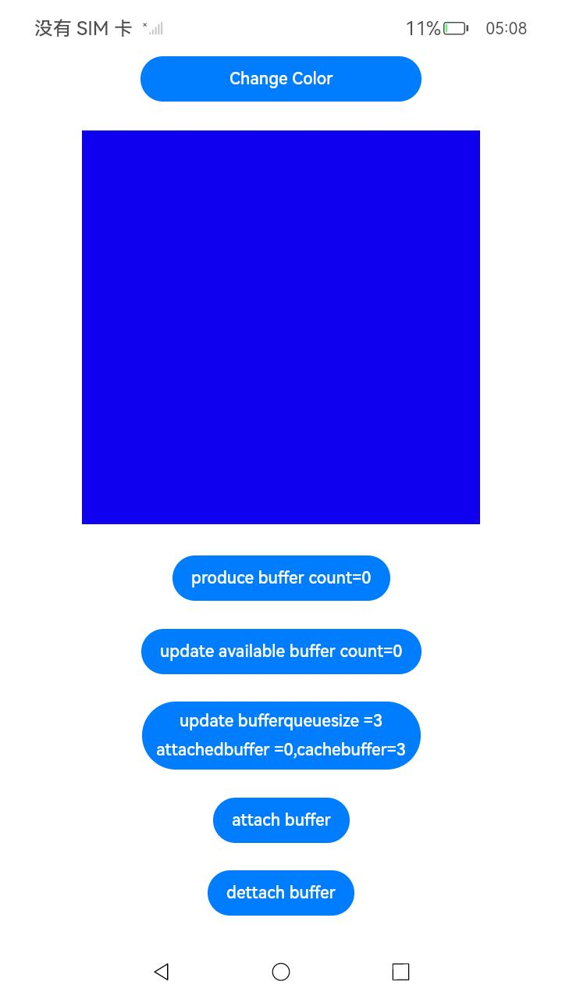
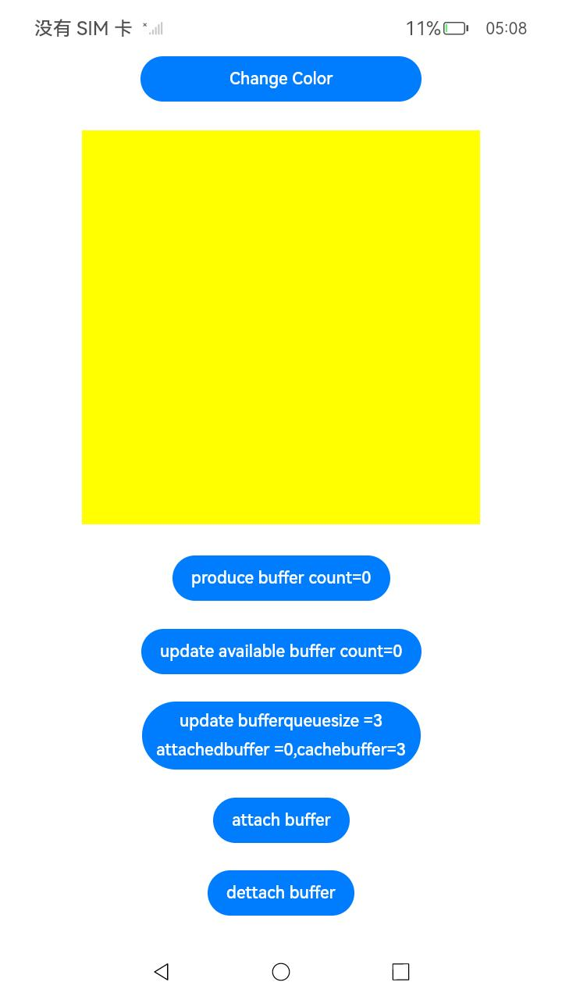
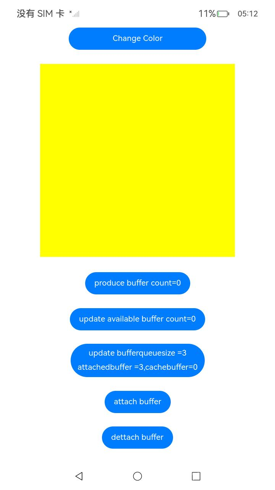
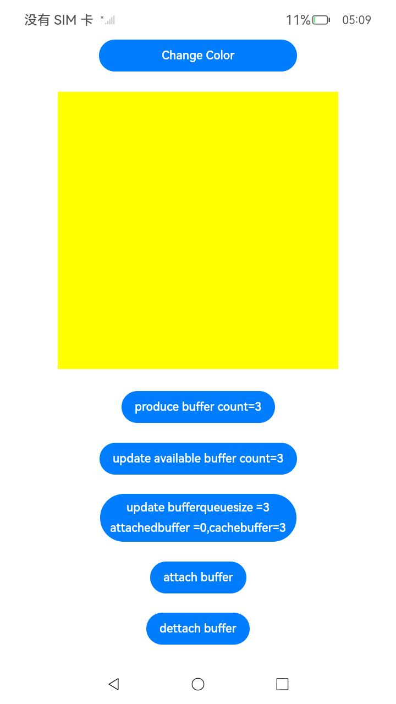

# Native Window

### 介绍

本示例中主要介绍开发者在利用[Native XComponent](https://gitee.com/openharmony/docs/blob/master/zh-cn/application-dev/reference/native-apis/native__interface__xcomponent_8h.md)来获取[NativeWindow](https://gitee.com/openharmony/docs/blob/master/zh-cn/application-dev/reference/native-apis/_native_window.md)实例，通过数据填充改变矩形框颜色。并提供从[NativeImage](https://gitee.com/openharmony/docs/blob/master/zh-cn/application-dev/reference/native-apis/_o_h___native_image.md)中获取NativeWindow进行buffer轮转的案例，通过NativeWindow生产buffer来触发NativeImage的可用帧回调。

### 效果预览

| 主页                                           | 改变矩形框颜色                                           | 生产buffer | 获取可用帧回调次数                                         |
|----------------------------------------------|---------------------------------------------------| --------------------------------------------------------- | --------------------------------------------------------- |
|          |   |  ||
| attachbuffer                                 | detachbuffer                                      |
|  |  |


使用说明

1. 安装编译生成的hap包，并打开应用；
2. 点击页面底部“Chaneg Color”按钮，矩形框填充区域将改变颜色，黄蓝切换；
3. 点击页面底部“produce buffer”按钮，NativeWindow将生产数据并发送给NativeImage，页面展示了生产buffer的次数；
4. 点击页面底部“update available buffer count”按钮，将展示NativeImage收到的可用帧回调次数。
5. 点击页面底部“update bufferqueuesize, attachedbuffer, cachebuffer"按钮，将更新三项数值，分别是NativeWindow的buffer队列容量，attach到NativeWindow的buffer数量，缓存区buffer数量。 
6. 点击页面底部”attachbuffer“, 在cachebuffer大于0时将buffer添加到nativewindow中，attachedbuffer数值加1，cachebuffer数值减1；cachebuffer为0时不做处理。(需要点第五步按钮更新数值)
7. 点击页面底部”detachbuffer", 在attachedbuffer大于0时将buffer添加到缓存区cachebuffer中，attachedbuffer数值减1，cachebuffer数值加1； attachedbuffer为0时不做处理。(需要点第五步按钮更新数值)
8. 点击页面顶部"Change ScalingMode"按钮，在支持fit模式的设备可以切换色块居中显示或平铺显示。

### 工程目录

```
├──entry/src/main
│  ├──cpp                           // C++代码区
│  │  ├──CMakeLists.txt             // CMake配置文件
│  │  ├──logger_common.h   			// 日志封装定义文件  
│  │  ├──NativeImageAdaptor.cpp     // NativeImage功能适配模块
│  │  ├──NativeRender.cpp           // NativeWindow和XComponentContext联合显示模块
│  ├──ets                           // ets代码区
│  │  ├──entryability
│  │  │  ├──EntryAbility.ts         // 程序入口类
|  |  ├──interface
│  │  │  └──NativeWindowContext.ts  // NativeWindowContext
│  │  └──pages                      // 页面文件
│  │     └──Index.ets               // 主界面
|  ├──resources         			// 资源文件目录
```

### 具体实现

1.通过在IDE中创建Native c++ 工程，在c++代码中定义对外接口为DrawColor，在js侧调用该接口可改变窗口颜色；
2.从NativeImage中创建NativeWindow，在c++代码中定义对外接口为ProduceBuffer，js调用该接口后，NativeWindow会生产buffer并将该buffer flush给NativeImage，之后NativeImage将收到可用帧的回调;
3.js侧调用GetAvailableCount接口，可以获取回调触发次数，并展示在界面上，正常情况下FlushBuffer的次数和可用帧回调触发次数一致;
4.在c++代码中定义对外接口AttachBuffer，js侧调用该接口后，当缓存区cachebuffer数量大于0时，会添加1个cachebuffer到NativeWindow中，cachebuffer数量为0时不操作；
5.js侧调用DetachBuffer接口，当NativeWindow的attachedbuffer数量大于0时，会将NativeWindow中的buffer移除，放置到缓存区中，当attachedbuffer为0时不操作；
6.js侧调用GetBufferQueueSize、GetAttachBufferCount、GetCacheBufferCount接口时，将获取当前NativeWindow的bufferqueue容量、已经attach到nativewindow的buffer数量，缓存区buffer数量
7.js侧调用ChangeScalingMode接口，c++代码中会切换DrawColor的scalingmode，切换显示模式

源码参考：[cpp目录](entry/src/main/cpp)下的文件。

涉及到的相关接口：


| 接口名 | 描述 |
| -------- | -------- |
| OH_NativeWindow_CreateNativeWindow (void *pSurface) | 创建OHNativeWindow实例，每次调用都会产生一个新的OHNativeWindow实例 |
| OH_NativeWindow_DestroyNativeWindow (OHNativeWindow *window) | 将OHNativeWindow对象的引用计数减1，当引用计数为0的时候，该OHNativeWindow对象会被析构掉 |
| OH_NativeWindow_CreateNativeWindowBufferFromNativeBuffer (OH_NativeBuffer *nativeBuffer) | 创建OHNativeWindowBuffer实例，每次调用都会产生一个新的OHNativeWindowBuffer实例 |
| OH_NativeWindow_DestroyNativeWindowBuffer (OHNativeWindowBuffer *buffer) | 将OHNativeWindowBuffer对象的引用计数减1，当引用计数为0的时候，该OHNativeWindowBuffer对象会被析构掉 |
| OH_NativeWindow_NativeWindowRequestBuffer (OHNativeWindow *window, OHNativeWindowBuffer **buffer, int *fenceFd) | 通过OHNativeWindow对象申请一块OHNativeWindowBuffer，用以内容生产 |
| OH_NativeWindow_NativeWindowFlushBuffer (OHNativeWindow *window, OHNativeWindowBuffer *buffer, int fenceFd, Region region) | 通过OHNativeWindow将生产好内容的OHNativeWindowBuffer放回到Buffer队列中，用以内容消费 |
| OH_NativeWindow_GetLastFlushedBuffer (OHNativeWindow *window, OHNativeWindowBuffer **buffer) | 从OHNativeWindow获取上次送回到buffer队列中的OHNativeWindowBuffer |
| OH_NativeWindow_NativeWindowHandleOpt (OHNativeWindow *window, int code,...) | 设置/获取OHNativeWindow的属性，包括设置/获取宽高、内容格式等 |
| OH_NativeWindow_GetBufferHandleFromNative (OHNativeWindowBuffer *buffer) | 通过OHNativeWindowBuffer获取该buffer的BufferHandle指针       |
| OH_NativeBuffer_SetColorSpace (OH_NativeBuffer *buffer, OH_NativeBuffer_ColorSpace colorSpace) | 为OH_NativeBuffer设置颜色空间属性                            |
| OH_NativeImage_SetOnFrameAvailableListener (OH_NativeImage *image, OH_OnFrameAvailableListener listener) | 设置帧可用回调                                               |
| OH_NativeImage_UnsetOnFrameAvailableListener (OH_NativeImage *image) | 取消设置帧可用回调                                           |
| OH_NativeImage_AcquireNativeWindow (OH_NativeImage *image)   | 获取与OH_NativeImage相关联的OHNativeWindow指针。 该OHNativeWindow后续不再需要时需要调用OH_NativeWindow_DestroyNativeWindow释放 |
| OH_NativeWindow_GetSurfaceId (OHNativeWindow *window, uint64_t *surfaceId) | 获取surfaceId |
| OH_NativeWindow_CreateNativeWindowFromSurfaceId (uint64_t surfaceId, OHNativeWindow **window) | 通过surfaceId获取对应的OHNativeWindow |
| OH_NativeBuffer_MapPlanes (OH_NativeBuffer *buffer, void **virAddr, OH_NativeBuffer_Planes *outPlanes) | 将OH_NativeBuffer对应的多通道ION内存映射到进程空间 |
| OH_NativeBuffer_FromNativeWindowBuffer (OHNativeWindowBuffer *nativeWindowBuffer, OH_NativeBuffer **buffer) | 将OHNativeWindowBuffer实例转换为OH_NativeBuffer实例 |
| OH_NativeWindow_NativeWindowAttachBuffer(OHNativeWindow *window, OHNativeWindowBuffer *buffer) | 将缓存区OHNativeWindowBuffer添加到OHNativeWindow中 |
| OH_NativeWindow_NativeWindowDetachBuffer(OHNativeWindow *window, OHNativeWindowBuffer *buffer) | 将OHNativeWindow中的buffer移除，放置到缓存区中 |

详细的接口说明请参考[NativeWindow](https://gitee.com/openharmony/docs/blob/master/zh-cn/application-dev/reference/native-apis/_native_window.md)，[NativeImage](https://gitee.com/openharmony/docs/blob/master/zh-cn/application-dev/reference/native-apis/_o_h___native_image.md)，[NativeBuffer](https://gitee.com/openharmony/docs/blob/master/zh-cn/application-dev/reference/native-apis/_o_h___native_buffer.md)。

### 相关权限

不涉及。

### 依赖

XComponent NativeWindow NativeImage EGL。

### 约束与限制

1. 本示例仅支持标准系统上运行；
2. 本示例为Stage模型，已适配API version 12版本SDK，SDK版本号5.0.0.19及以上版本,镜像版本号支持5.0.0.19及以上版本;
3. 本示例需要使用DevEco Studio 4.0 Beta2 版本号(4.1.3.400)及以上版本才可编译运行。
### 下载

如需单独下载本工程，执行如下命令：

```
git init
git config core.sparsecheckout true
echo code/BasicFeature/Native/NdkNativeWindow/ > .git/info/sparse-checkout
git remote add origin https://gitee.com/openharmony/applications_app_samples.git
git pull origin master
```
