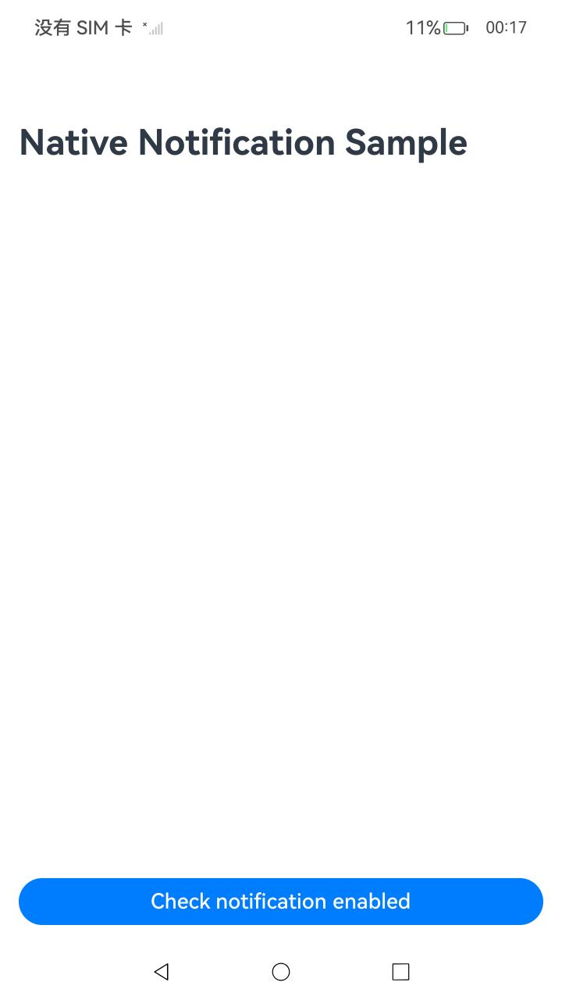
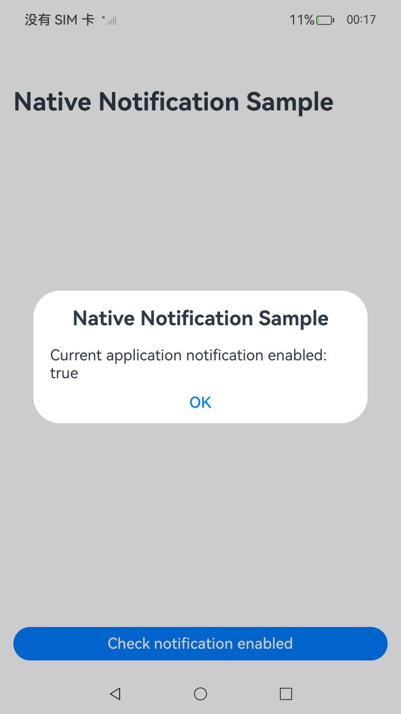

# 通知服务

### 介绍

本示例主要介绍开发者如何调用Native Notification接口使用通知服务。当前功能包含查询当前应用通知使能状态。

### 效果预览

| 主页                                 | 弹窗显示关闭通知使能状态                                    | 弹窗显示开启通知使能状态                                            |
| ------------------------------------ | --------------------------------------------- | --------------------------------------------------- |
|  |  |  |

使用说明

1. 安装编译生成的Hap包，并打开应用。
2. 点击页面中的"Check notification enabled"按钮，页面将弹窗显示该应用的通知使能状态。
3. 点击弹窗中的"OK"按钮则返回主页面。
4. 通过下拉通知中心页面，点击设置按钮进入通知管理页面，修改当前应用的通知使能状态后，可以再次点击按钮查询。

### 工程目录

```
entry/src/main/
|---main
|   |---cpp
|   |   |---types
|   |   |   |---libentry
|   |   |   |   |---index.d.ts                     // 接口导出
|   |   |   |   |---oh-package.json5
|   |   |---NativeNotificationAdaptor.cpp          // 调用native接口
|   |   |---CMakeLists.txt                         // 编译脚本
|   |---ets
|   |   |---entryability
|   |   |   |---EntryAbility.ets
|   |   |---pages
|   |   |   |---Index.ets                          // 首页
|   |---resources                                  // 静态资源
|---ohosTest
|   |---ets
|   |   |---tests
|   |   |   |---Ability.test.ets                   // 自动化测试用例
```

### 具体实现

通过在IDE中创建Native C++工程，在C++代码中定义对外接口为isNotificationEnabled，映射C++接口IsNotificationEnabled。通过获取JS的资源对象，并转化为Native的资源对象，即可调用对外开放的Native接口。在JS侧导入"libentry.so",调用src/main/cpp/type/libentry/index.d.ts中声明的接口。源代码参考：[NativeNotificationAdaptor.cpp](entry/src/main/cpp/NativeNotificationAdaptor.cpp)。其中涉及的相关接口：

| 接口名                            | 描述                                                                                                     |
|:-------------------------------|:-------------------------------------------------------------------------------------------------------|
| bool OH_Notification_IsNotificationEnabled(void);    | 查询当前应用通知使能状态。 |

### 相关权限

不涉及

### 依赖

不涉及。

### 约束与限制

1. 本示例仅支持标准系统上运行，支持设备：RK3568；
2. 本示例为Stage模型，支持API14版本SDK，版本号：5.0.2.43；
3. 本示例需要使用DevEco Studio NEXT Release(5.0.3.900)及以上版本才可编译运行；

### 下载

如需单独下载本工程，执行如下命令：

```
git init
git config core.sparsecheckout true
echo code/BasicFeature/Native/NdkNotification/ > .git/info/sparse-checkout
git remote add origin https://gitee.com/openharmony/applications_app_samples.git
git pull origin master
```
