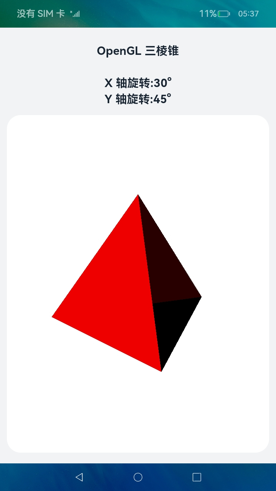

# OpenGL三棱椎

### 介绍

XComponent控件常用于相机预览流的显示和游戏画面的绘制,在OpenHarmony上，可以配合Native Window创建OpenGL开发环境，并最终将OpenGL绘制的图形显示到XComponent控件。本示例基于"Native C++"模板，调用OpenGL(OpenGL ES)图形库相关API绘制3D图形（三棱锥），并将结果渲染到页面的XComponent控件中进行展示。同时，还可以在屏幕上通过触摸滑动手势对三棱锥进行旋转，最终得到不同角度的图形并显示到页面。

> **说明**
> 本示例XComponent接口使用方法已停止演进，推荐使用方法请参考[ArkTSXComponent示例](../ArkTSXComponent/README_zh.md)。
### 效果预览

| 首页                                     | 滑动屏幕旋转变换                                 |
| -------------------------------------- | ---------------------------------------- |
|  |  |

使用说明

应用界面中展示了XComponent相关控件的使用，及采用OpenGL (OpenGL ES)相关标准API绘制3D图形（三棱锥，3D渲染的光源用的是简单的线性光源）。此外，可在屏幕触摸滑动，以使三棱锥进行旋转，其中主要采用了napi接口来更新3D图形的旋转角度。

### 工程目录

```
entry/src/main/
|---cpp
|   |---CMakeLists.txt                       // cmake编译配置
|   |---app_napi.cpp                         // 调用native接口
|   |---include
|   |   |---app_napi.h
|   |   |---tetrahedron.h
|   |   |---util
|   |       |---log.h
|   |       |---napi_manager.h
|   |       |---napi_util.h
|   |       |---native_common.h
|   |       |---native_interface_xcomponent.h
|   |---module.cpp                           // napi模块注册
|   |---napi_manager.cpp
|   |---napi_util.cpp
|   |---tetrahedron.cpp                      // OpenGL (ES) 三棱锥实现
|   |---type
|       |---libentry
|           |---oh-package.json5
|           |---tetrahedron_napi.d.ts        // 接口导出
|---ets
|   |---entryability
|   |   |---EntryAbility.ts
|   |---pages
|   |   |---Index.ets                        // 首页
|   |---utils
|       |---Logger.ets                       // 日志工具
|
```

### 具体实现

通过在IDE中创建Native C++工程，在C++代码中定义接口为Init和Update用于3D图形绘制环境的初始化和图形渲染更新，并映射NAPI相关接口UpdateAngle。ArkTS侧主要利用XComponent控件实现Index.ets，C++侧主要采用OpenGL ES相关标准API实现三棱锥的绘制流程相关代码，并可与ArkTS进行交互。

应用启动时，NAPI模块也相应进行初始化，此时可通过C++侧的OH_NativeXComponent_GetXComponentId()接口，获取到当前XComponent控件的控件指针，并给到C++侧三棱锥绘制相关的Init和Update函数，实现3D图形显示。同时，为实现三棱锥的触摸屏滑动旋转效果，在C++代码中映射的NAPI接口UpdateAngle给到ArkTS侧调用。ArkTS侧需在导入NAPI模块"libtetrahedron_napi.so"正确的前提下，通过调用src/main/cpp/type/libentry/tetrahedron_napi.d.ts中声明的UpdateAngle接口更新三棱锥旋转角度。
主要源码参考：[napi_manager.cpp](entry/src/main/cpp/napi_manager.cpp)、[app_napi.cpp](entry/src/main/cpp/app_napi.cpp)和[tetrahedron.cpp](entry/src/main/cpp/tetrahedron.cpp)。

Native XComponent相关函数如下：

| 函数名称                                                                                                                                             | 描述                               |
| ------------------------------------------------------------------------------------------------------------------------------------------------ | -------------------------------- |
| OH_NativeXComponent_GetXComponentId(OH_NativeXComponent *component, char *id, uint64_t *size)                                                    | 获取ArkUI XComponent的id            |
| OH_NativeXComponent_GetXComponentSize(OH_NativeXComponent *component, const void *window, uint64_t *width, uint64_t *height)                     | 获取ArkUI XComponent持有的surface的大小  |
| OH_NativeXComponent_GetXComponentOffset(OH_NativeXComponent *component, const void *window, double *x, double *y)                                | 获取ArkUI XComponent组件相对屏幕左上顶点的偏移量 |
| OH_NativeXComponent_GetTouchEvent(OH_NativeXComponent *component, const void *window, OH_NativeXComponent_TouchEvent *touchEvent)                | 获取ArkUI XComponent调度的触摸事件        |
| OH_NativeXComponent_GetTouchPointToolType(OH_NativeXComponent *component, uint32_t pointIndex, OH_NativeXComponent_TouchPointToolType *toolType) | 获取ArkUI XComponent触摸点工具类型        |
| OH_NativeXComponent_GetTouchPointTiltX(OH_NativeXComponent *component, uint32_t pointIndex, float *tiltX)                                       | 获取ArkUI XComponent触摸点倾斜与X轴角度     |
| OH_NativeXComponent_GetTouchPointTiltY(OH_NativeXComponent *component, uint32_t pointIndex, float *tiltY)                                        | 获取ArkUI XComponent触摸点倾斜与Y轴角度     |
| OH_NativeXComponent_GetMouseEvent(OH_NativeXComponent *component, const void *window, OH_NativeXComponent_MouseEvent *mouseEvent)                | 获取ArkUI XComponent调度的鼠标事件        |
| OH_NativeXComponent_RegisterCallback(OH_NativeXComponent *component, OH_NativeXComponent_Callback *callback)                                     | 实例注册回调                           |
| OH_NativeXComponent_RegisterMouseEventCallback(OH_NativeXComponent *component, OH_NativeXComponent_MouseEvent_Callback *callback)                | 实例注册鼠标事件回调                       |

### 相关权限

不涉及。

### 依赖

不涉及。

### 约束与限制

1. 本示例仅支持标准系统上运行。

2. 本示例已适配API version 10版本SDK，SDK版本号(API Version 10 Release),镜像版本号(4.0Release) 。

3. 本示例需要使用DevEco Studio 版本号(4.0Release)及以上版本才可编译运行。

### 下载

如需单独下载本工程，执行如下命令：

```
git init
git config core.sparsecheckout true
echo code/BasicFeature/Native/NdkOpenGL/ > .git/info/sparse-checkout
git remote add origin https://gitee.com/openharmony/applications_app_samples.git
git pull origin master
```