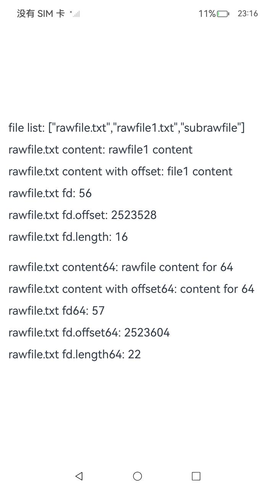

# 获取Rawfile资源

### 介绍

本示例中主要介绍开发者如何使用Native Rawfile接口操作Rawfile目录和文件。功能包括文件列表遍历、文件打开、搜索、读取和关闭Rawfile。

### 效果预览

| 主页                                   |
|--------------------------------------|
|  |

使用说明

应用界面中展示了Rawfile相关的接口调用，包括获取resources/rawfile目录下的文件及目录结构、对应的rawfile文件内容、对应rawfile文件的descriptor。其中使用到的功能包括文件列表遍历、文件打开、搜索、读取和关闭Rawfile。


### 工程目录

```
entry/src/main/
|---cpp
|   |---types
|   |   |---libentry
|   |   |   |---index.d.ts                     // 接口导出
|   |   |   |---oh-package.json5
|   |---CMakeLists.txt                         // 编译脚本
|   |---rawfile_demo.cpp                       // 调用native接口
|---ets
|   |---entryability
|   |   |---EntryAbility.ets
|   |---pages
|   |   |---Index.ets                          // 首页
|   |---utils
|   |   |---Logger.ets                         // 日志工具
|---resources
|   |---rawfile                                // rawfile资源
|   |   |---subrawfile
|   |   |   |---rawfile2.txt
|   |   |---rawfile.txt
|   |   |---rawfile1.txt

```

### 具体实现

通过在IDE中创建Native c++ 工程，在c++代码中定义对外接口为getFileList、getRawFileContent、getRawFileDescriptor，映射C++接口分别为GetFileList、GetRawFileContent、GetRawFileDescriptor。
通过获取Js的资源对象，并转为Native的资源对象，即可调用资源的Native接口，获取rawfile列表、rawfile文件内容以及rawfile描述符{fd, offset, length}。
在Js侧导入"libentry.so"，通过getContext().resourceManager获取资源管理对象。调用src/main/cpp/types/libentry/index.d.ts中声明的接口，传入js的资源对象和相关参数获取对于rawfile相关资源信息。
源码参考：[rawfile_demo.cpp](entry/src/main/cpp/rawfile_demo.cpp)
。 涉及到的相关接口：

| 接口名                            | 描述                                                                                                     |
|:-------------------------------|:-------------------------------------------------------------------------------------------------------|
| 初始化native resource manager。    | NativeResourceManager *OH_ResourceManager_InitNativeResourceManager(napi_env env, napi_value jsResMgr) |
| 打开指定rawfile目录。                 | RawDir *OH_ResourceManager_OpenRawDir(const NativeResourceManager *mgr, const char *dirName)           |
| 获取指定rawfile目录下的rawfile文件数量。    | int OH_ResourceManager_GetRawFileCount(RawDir *rawDir)                                                 |
| 获取rawfile名字。                   | const char *OH_ResourceManager_GetRawFileName(RawDir *rawDir, int index)                               |
| 打开指定rawfile文件。                 | RawFile *OH_ResourceManager_OpenRawFile(const NativeResourceManager *mgr, const char *fileName)        |
| 获取rawfile文件大小。                 | long OH_ResourceManager_GetRawFileSize(RawFile *rawFile)                                               |
| 读取rawfile文件内容。                 | int OH_ResourceManager_ReadRawFile(const RawFile *rawFile, void *buf, size_t length)                   |
| 释放rawfile文件相关资源。               | void OH_ResourceManager_CloseRawFile(RawFile *rawFile)                                                 |
| 释放rawfile目录相关资源。               | void OH_ResourceManager_CloseRawDir(RawDir *rawDir)                                                    |
| 获取rawfile的fd。                  | bool OH_ResourceManager_GetRawFileDescriptor(const RawFile *rawFile, RawFileDescriptor &descriptor)    |
| 释放native resource manager相关资源。 | void OH_ResourceManager_ReleaseNativeResourceManager(NativeResourceManager *resMgr)                    |


### 相关权限

不涉及。

### 依赖

不涉及。

### 约束与限制

1. 本示例仅支持标准系统上运行，支持设备：RK3568。

2. 本示例为Stage模型，支持API10版本SDK，SDK版本号(API Version 10 Release),镜像版本号(4.0 Release)

3. 本示例需要使用DevEco Studio 版本号(4.0 Release)及以上版本才可编译运行。

### 下载

如需单独下载本工程，执行如下命令：

```
git init
git config core.sparsecheckout true
echo code/BasicFeature/Native/NdkRawfile/ > .git/info/sparse-checkout
git remote add origin https://gitee.com/openharmony/applications_app_samples.git
git pull origin master
```

