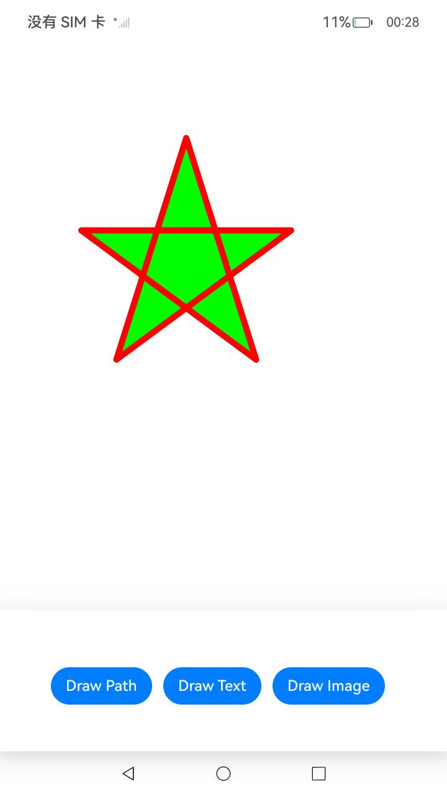
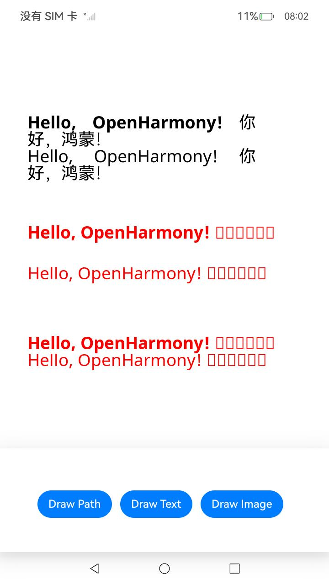
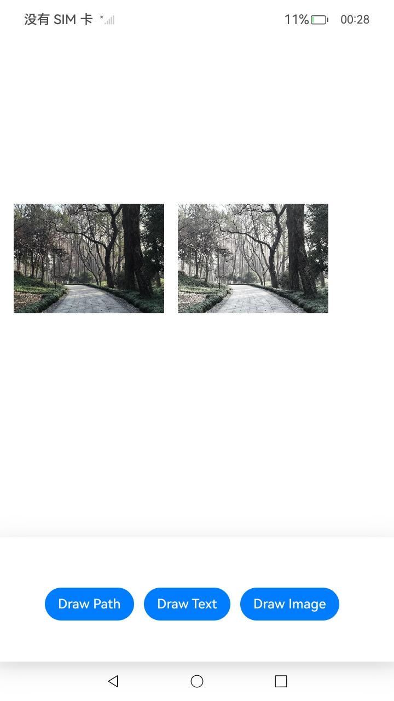

# Native RenderNode Drawing

### 介绍

本示例中主要介绍开发者在利用自绘制渲染节点RenderNode，通过Drawing API实现在页面上完成自定义绘制需求。功能主要包括点击按钮绘制五角星，文字和图片。

使用说明

1. 安装编译生成的hap包，并打开应用。

2. 点击页面底部“Draw Path”按钮，页面将绘制一个五角星；

3. 点击页面底部“Draw Text”按钮，页面将绘制文字；

4. 点击页面底部“Draw Image”按钮，页面将绘制图片。

### 效果预览

| 主页                                 | 绘制五角星                                         | 绘制文字                                            |绘制图片                                            |
| ------------------------------------ |------------------------------------| ------------------------------------ | ------------------------------------ |
|  |  |  |  |

### 工程目录

```
├──entry/src/main
│  ├──cpp                           // C++代码区
│  │  ├──CMakeLists.txt             // CMake配置文件
│  │  ├──hello.cpp                  // Napi模块注册
│  │  ├──native_bridge.cpp          // C自定义绘制接口实现
│  │  ├──common
│  │  │  └──log_common.h            // 日志封装定义文件
│  │  ├──types/libentry             
│  │  │  └──index.d.ts              // native侧暴露给ArkTS侧接口的声明
│  ├──ets                           // ets代码区
│  │  ├──entryability
│  │  │  └──EntryAbility.ts         // 程序入口类
│  │  └──pages                      // 页面文件
│  │     └──Index.ets               // 主界面
|  ├──resources         	    // 资源文件目录
```

### 具体实现

通过在IDE中创建Native c++ 工程，在c++代码中定义对外接口为nativeOnDraw，在js侧调用该接口并传入相应绘制参数可在页面上绘制五角星，文字和图片。

RenderNode提供自绘制渲染节点，在c++代码侧通过Drawing接口完成绘制代码编写并定义相关对外接口，ts侧即可通过RenderNode和NodeController调用自定义绘制接口，进而调用Drawing相关的绘制接口绘制五角星，文字和图片。

源码参考：[cpp目录](entry/src/main/cpp)下的文件。

涉及到的相关接口：


| 接口名 | 描述 | 
| -------- | -------- |
| OH_Drawing_CanvasAttachBrush (OH_Drawing_Canvas *, const OH_Drawing_Brush *) | 设置画刷给画布，画布将会使用设置的画刷样式和颜色去填充绘制的图形形状。 |
| OH_Drawing_CanvasAttachPen (OH_Drawing_Canvas *, const OH_Drawing_Pen *) | 设置画笔给画布，画布将会使用设置画笔的样式和颜色去绘制图形形状的轮廓。 |
| OH_Drawing_CanvasDetachBrush (const const OH_Drawing_Brush *) | 清空画布上已设置的画刷效果。 |
| OH_Drawing_CanvasDetachPen (const const OH_Drawing_Pen *) | 清空画布上已设置的画笔效果。 |
| OH_Drawing_CanvasDrawPath (OH_Drawing_Canvas *, const OH_Drawing_Path *) | 画一个自定义路径。 |
| OH_Drawing_CanvasDrawPath (OH_Drawing_Canvas *, const OH_Drawing_Rect *) | 画一个矩形。 |
| OH_Drawing_PathCreate (void) | 创建一个路径对象。 |
| OH_Drawing_PathMoveTo (OH_Drawing_Path *, float x, float y) | 设置自定义路径的起始点位置。 |
| OH_Drawing_PathLineTo (OH_Drawing_Path *, float x, float y) | 添加一条到目标点的线段。 |
| OH_Drawing_PathClose (OH_Drawing_Path *) | 闭合路径，会添加一条到路径起点位置的线段。 |
| OH_Drawing_PathDestroy (OH_Drawing_Path *) | 销毁路径对象。 |
| OH_Drawing_RectCreate (float left, float top, float right, float bottom) | 创建一个矩形对象。 |
| OH_Drawing_RectDestroy (const OH_Drawing_Rect *) | 销毁矩形对象。 |
| OH_Drawing_PenCreate (void) | 创建一个画笔对象。 |
| OH_Drawing_PenSetAntiAlias (OH_Drawing_Pen *, bool) | 设置抗锯齿属性，如果为真则说明画笔会启用抗锯齿功能，在绘制图形时会对图形的边缘像素进行半透明的模糊处理。 |
| OH_Drawing_PenSetWidth (OH_Drawing_Pen *, float width) | 设置画笔的厚度属性，厚度属性描述了画笔绘制图形轮廓的宽度。 |
| OH_Drawing_PenDestroy (const OH_Drawing_Pen *) | 销毁画笔对象。 |
| OH_Drawing_BrushCreate (void) | 创建一个画刷对象。 |
| OH_Drawing_BrushSetColor (OH_Drawing_Brush *, uint32_t color) | 设置画刷的颜色属性，颜色属性描述了画刷填充图形时使用的颜色，用一个32位（ARGB）的变量表示。 |
| OH_Drawing_BrushDestroy (const OH_Drawing_Brush *) | 销毁画刷对象。 |
| OH_Drawing_CreateTypographyStyle (void) | 创建一个排版对象，用于定义排版样式。 |
| OH_Drawing_CreateTextStyle (void) | 创建一个文本对象，用于定义文本样式。 |
| OH_Drawing_TypographyHandlerAddText (OH_Drawing_TypographyCreate *, const char *) | 设置文本内容。 |
| OH_Drawing_SetTextStyleFontFamilies (OH_Drawing_TextStyle* , int , const char* fontFamilies[] ) | 设置字体类型。 |
| OH_Drawing_RegisterFont (OH_Drawing_FontCollection* , const char* fontFamily, const char* familySrc ) | 用于在字体管理器中注册字体缓冲区。 |
| OH_Drawing_SetTextStyleFontStyle (OH_Drawing_TextStyle* , int  ) | 设置字体风格。 |
| OH_Drawing_SetTextStyleLocale (OH_Drawing_TextStyle* , const char*  ) | 设置语言区域。 |
| OH_Drawing_CreateTypographyHandler (OH_Drawing_TypographyStyle* , OH_Drawing_FontCollection*  ) | 创建指向OH_Drawing_TypographyCreate对象的指针。 |
| OH_Drawing_TypographyHandlerPushTextStyle (OH_Drawing_TypographyCreate* , OH_Drawing_TextStyle*  ) | 设置排版风格。 |
| OH_Drawing_TypographyHandlerAddText (OH_Drawing_TypographyCreate* , const char*  ) | 设置文本内容。 |
| OH_Drawing_TypographyHandlerPopTextStyle (OH_Drawing_TypographyCreate* ) | 排版弹出。 |
| OH_Drawing_CreateTypography (OH_Drawing_TypographyCreate* ) | 指向OH_Drawing_Typography对象的指针。 |
| OH_Drawing_TypographyLayout (OH_Drawing_Typography* , double  ) | 排版布局。 |
| OH_Drawing_TextBlobBuilderMake (OH_Drawing_TextBlobBuilder* ) | 用于从文本构造器中创建文本对象。 |
| OH_Drawing_CanvasDrawTextBlob (OH_Drawing_Canvas* , const OH_Drawing_TextBlob* , float x, float y ) | 用于画一段文字。 |
| OH_Drawing_TextBlobCreateFromString (const char* str, const OH_Drawing_Font* , OH_Drawing_TextEncoding  ) | 用字符串创建文本对象。 |
| OH_Drawing_TextBlobDestroy (OH_Drawing_TextBlob* ) | 用于销毁文本对象并回收该对象占有的内存。 |
| OH_Drawing_TextBlobBuilderDestroy (OH_Drawing_TextBlobBuilder* ) | 用于销毁文本构造器对象并回收该对象占有的内存。 |
| OH_Drawing_TypefaceDestroy (OH_Drawing_Typeface* ) | 用于销毁字形对象并回收该对象占有的内存。 |
| OH_Drawing_FontDestroy (OH_Drawing_Font* ) | 用于销毁字体对象并回收该对象占有的内存。 |
| OH_Drawing_TypographyPaint (OH_Drawing_Typography *, OH_Drawing_Canvas *, double, double) | 显示文本。 |
| OH_Drawing_DestroyTypography (OH_Drawing_Typography* ) | 释放OH_Drawing_Typography对象占据的内存。 |
| OH_Drawing_DestroyTypographyHandler (OH_Drawing_TypographyCreate* ) | 释放被OH_Drawing_TypographyCreate对象占据的内存。 |
| OH_Drawing_DestroyTypographyStyle (OH_Drawing_TypographyStyle* ) | 释放被OH_Drawing_TypographyStyle对象占据的内存。 |
| OH_Drawing_DestroyTextStyle (OH_Drawing_TextStyle* ) | 释放被OH_Drawing_TextStyle对象占据的内存。 |
| OH_Drawing_DestroyFontCollection (OH_Drawing_FontCollection* ) | 释放被字体集对象占据的内存。 |
| OH_Drawing_TextBlobBuilderCreate (void ) | 创建一个文本构造器对象。 |
| OH_Drawing_FontCreate (void ) | 创建字体对象。 |
| OH_Drawing_TypefaceCreateFromFile (const char* path, int index ) | 通过文件创建一个字形对象。 |
| OH_Drawing_CanvasDrawPixelMapRect (OH_Drawing_Canvas* , OH_Drawing_PixelMap* , const OH_Drawing_Rect* src, const OH_Drawing_Rect* dst, const OH_Drawing_SamplingOptions*  ) | 用于将像素图的指定区域绘制到画布的指定区域。 |
| OH_Drawing_SamplingOptionsCreate (OH_Drawing_FilterMode , OH_Drawing_MipmapMode  ) | 创建一个采样选项对象。 |
| OH_Drawing_ColorFilterCreateMatrix (const float matrix[20]) | 创建具有5x4颜色矩阵的颜色滤波器。 |
| OH_Drawing_FilterCreate (void ) | 创建一个滤波器对象。 |
| OH_Drawing_FilterSetColorFilter (OH_Drawing_Filter* , OH_Drawing_ColorFilter*  ) | 为滤波器对象设置颜色滤波器对象。 |
| OH_Drawing_BrushSetFilter (OH_Drawing_Brush* , OH_Drawing_Filter*  ) | 为画刷设置滤波器。 |
| OH_Drawing_CanvasTranslate (OH_Drawing_Canvas* , float dx, float dy ) | 将平移画布一段距离。 |
| OH_Drawing_CanvasRestore (OH_Drawing_Canvas* ) | 用于恢复保存在栈顶的画布状态。 |
| OH_Drawing_CanvasSave (OH_Drawing_Canvas* ) | 用于保存当前画布的状态到栈顶。 |
| OH_Drawing_FilterDestroy (OH_Drawing_Filter* ) | 销毁滤波器对象，并收回该对象占用的内存。 |
| OH_Drawing_ColorFilterDestroy (OH_Drawing_ColorFilter* ) | 销毁颜色滤波器对象，并收回该对象占用的内存。 |
| OH_Drawing_SamplingOptionsDestroy (OH_Drawing_SamplingOptions* ) | 销毁采样选项对象并回收该对象占有内存。 |

详细的接口说明请参考[Drawing](https://gitee.com/openharmony/docs/blob/master/zh-cn/application-dev/reference/apis-arkgraphics2d/_drawing.md)。

### 相关权限

不涉及。

### 依赖

RenderNode。

### 约束与限制

1. 本示例仅支持标准系统上运行。
2. 本示例为Stage模型，已适配API version 12版本SDK，SDK版本号(5.0.0.19及以上),镜像版本号(5.0.0.19及以上);
3. 本示例需要使用DevEco Studio 4.0 Beta2 版本号(4.1.3.400)及以上版本才可编译运行。
### 下载

如需单独下载本工程，执行如下命令：

```
git init
git config core.sparsecheckout true
echo code/BasicFeature/Native/NdkRenderNodeDrawing/ > .git/info/sparse-checkout
git remote add origin https://gitee.com/openharmony/applications_app_samples.git
git pull origin master
```