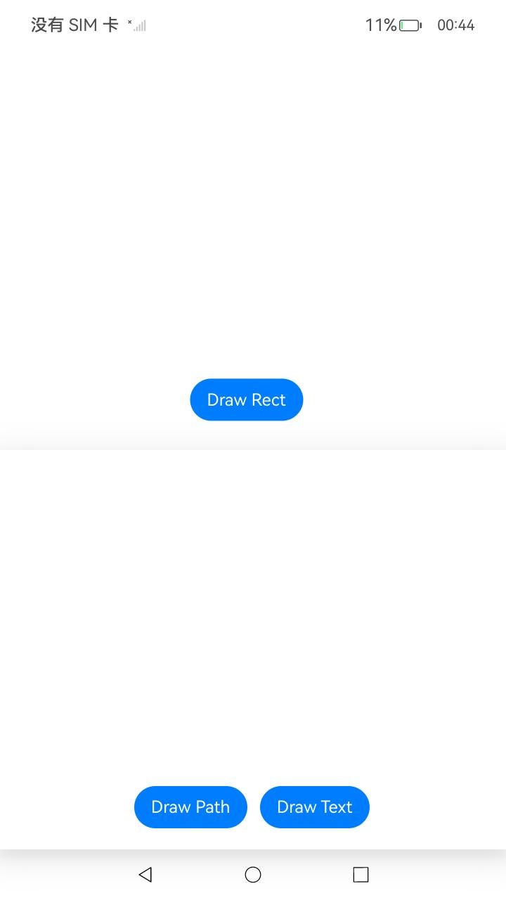
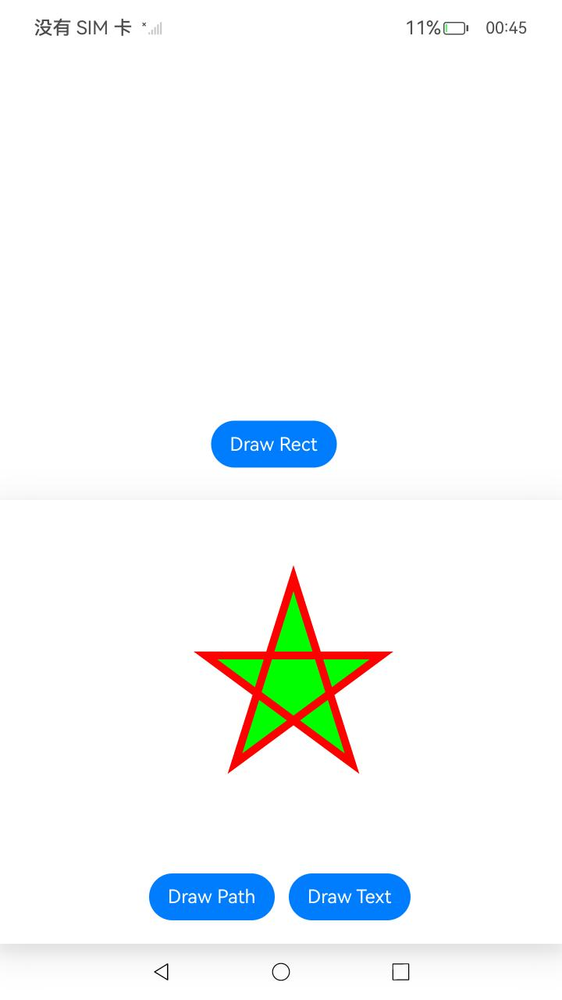
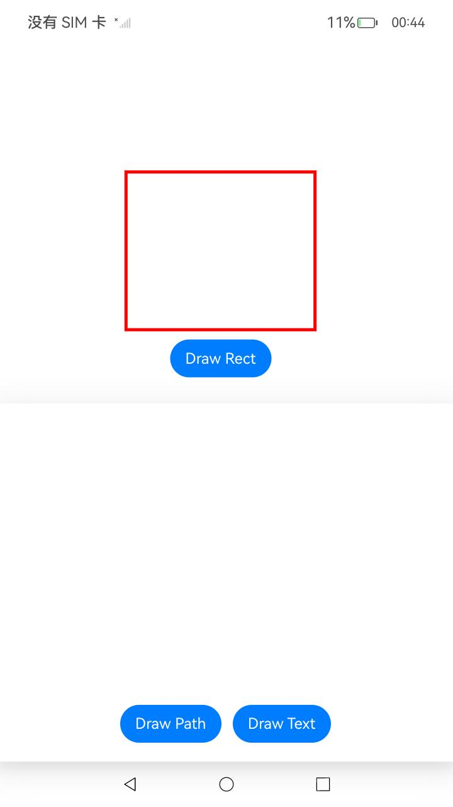

# NdkTsDrawing

### 介绍

本示例使用Drawing进行图形绘制与显示时，使用[@ohos.graphics.drawing](https://gitee.com/openharmony/docs/blob/master/zh-cn/application-dev/reference/apis-arkgraphics2d/js-apis-graphics-drawing.md)模块的画布画笔绘制基本的2D图形和文字，调用绘制和显示的逻辑，在应用上显示图形和文字。功能主要包括点击按钮绘制一个五角星、矩形和“Hello World”文字。

使用说明

1. 安装编译生成的hap包，并打开应用。

2. 点击页面底部“Draw Path”按钮，页面将绘制一个五角星；

3. 点击页面底部“Draw Rect”按钮，页面将绘制一个矩形；

4. 点击页面底部“Draw Text”按钮，页面将绘制“Hello World”。

### 效果预览

| 主页                                 | 绘制五角星                                            | 绘制矩形                                            | 绘制文字                                            |
| ------------------------------------ | ----------------------------------------------- | ------------------------------------ | ------------------------------------ |
|  |  |  |  |

### 工程目录

```
├──entry/src/main
│  ├──ets                           // ets代码区
│  │  ├──entryability
│  │  │  ├──EntryAbility.ts         // 程序入口类
|  |  |  └──EntryAbility.ets
│  │  └──pages                      // 页面文件
│  │     └──Index.ets               // 主界面
|  └──resources         	    // 资源文件目录
```

### 具体实现

在IDE中创建空白工程，在js侧drawing提供两种方式实现自定义绘制：
1. 创建`RenderNode`子类`MyRenderNode`，并在其中定义绘图函数。构建出MyRenderNode类并在其中定义绘图的主要函数后，接下来创建一个MyRenderNode对象，并设置它的像素格式。创建`NodeController`的子类`MyNodeController`，并在其中定义创建`FrameNode`的函数。`NodeController`定义了节点容器的控制器，控制着容器里在生命周期中的节点。通过控制创建的节点即可画出五角星和文字。
2. 创建一张位图并绑定drawing的Canvas，此时Canvas的绘制内容将会绘制到绑定的位图上，在完成绘制后将绑定的位图绘制出来即可实现离屏绘制，本示例中给出了矩形的离屏绘制例子。

源码参考：[pages目录](entry/src/main/ets/pages)下的文件。

涉及到的相关接口：


| 接口名 | 描述 | 
| -------- | -------- |
| drawPath(path: Path) : void | 画一个自定义路径。 |
| drawRect(rect: common2D.Rect): void | 用于绘制一个矩形，默认使用黑色填充。 |
| drawTextBlob(blob: TextBlob, x: number, y: number): void | 用于绘制一段文字。 |
| moveTo(x: number, y: number) : void | 设置自定义路径的起始点位置。 |
| lineTo(x: number, y: number) : void | 添加一条到目标点的线段。 |
| close(): void | 闭合路径，会添加一条到路径起点位置的线段。 |
| setAntiAlias(antiAlias: boolean) : void | 用于设置画笔是否开启反走样。开启后，可以使得图形的边缘在显示时更平滑。|
| setColor(color: common2D.Color) : void | 用于设置画笔和画刷的颜色。|
| setStrokeWidth(width: number) : void | 用于设置画笔的线宽。|
| attachPen(pen: Pen): void | 绑定画笔给画布，画布将使用画笔的样式和颜色去绘制图形形状的轮廓。|
| attachPen(pen: Pen): void | 绑定画笔给画布，画布将使用画笔的样式和颜色去绘制图形形状的轮廓。|
| detachPen(): void | 清空画布上设置的画笔，画布将不再使用画笔绘制图形。|
| detachBrush(): void | 清空画布上设置的画刷，画布将不再使用画刷绘制图形。|

详细的接口说明请参考[Drawing](https://gitee.com/openharmony/docs/blob/master/zh-cn/application-dev/reference/apis-arkgraphics2d/js-apis-graphics-drawing.md)。

### 相关权限

不涉及。

### 依赖

RenderNode。

### 约束与限制

1. 本示例仅支持标准系统上运行。
2. 本示例为Stage模型，已适配API version 11版本SDK，SDK版本号(API Version 11 Release),镜像版本号(4.1 Release);
3. 本示例需要使用DevEco Studio 版本号(4.1 Release)及以上版本才可编译运行。
### 下载

如需单独下载本工程，执行如下命令：

```
git init
git config core.sparsecheckout true
echo code/BasicFeature/Native/NdkTsDrawing/ > .git/info/sparse-checkout
git remote add origin https://gitee.com/openharmony/applications_app_samples.git
git pull origin master
```