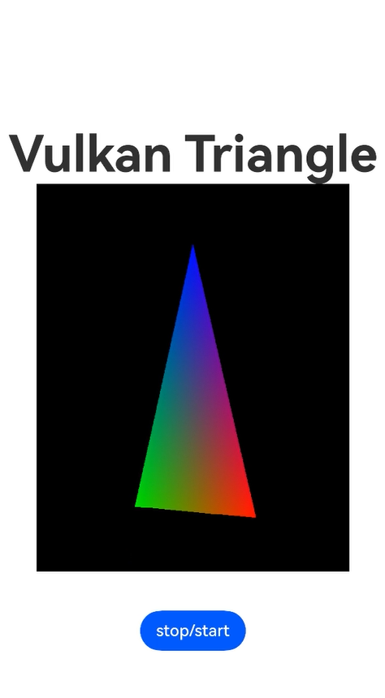

# XComponent组件对接Vulkan
### 介绍
XComponent组件作为绘制组件, 可用于满足开发者较为复杂的自定义绘制需求, 如相机预览流显示和游戏画面绘制。
该组件分为`surface`类型和`component`类型, 可通过指定`type`字段来确定。 其中`surface`类型可支持开发者将相关数据传入XComponent单独拥有的surface来渲染画面。
本篇示例基于"Native C++"模板, 演示了XComponent调用Vulkan API完成三角形绘制, 并将渲染结果显示在屏幕上的流程。

示例主要使用[@ohos.app.ability.UIAbility](https://gitee.com/openharmony/docs/blob/master/zh-cn/application-dev/ui/Readme-CN.md), 
[@ohos.hilog](https://gitee.com/openharmony/docs/blob/master/zh-cn/application-dev/dfx), 
[@ohos.window](https://gitee.com/openharmony/docs/blob/master/zh-cn/application-dev/windowmanager/window-overview.md), 
[NativeWindow](https://gitee.com/openharmony/docs/blob/master/zh-cn/application-dev/graphics/native-window-guidelines.md), 
[Vulkan](https://gitee.com/openharmony/docs/tree/master/zh-cn/application-dev/reference/native-lib)接口。

### 效果预览
如下图所示, 打开应用, 屏幕中心会绘制一个旋转中的三角形, 可以点击'stop/start'按钮控制三角形的旋转状态。

### 工程目录

```
entry/src/main/
|---cpp
|   |---common
|   |   |---logger_common.h                          // Hilog日志宏定义
|   |---render
|   |   |---vulkan
|   |   |   |---shader
|   |   |   |   |   |---triangle.frag                // fragment shader
|   |   |   |   |   |---triangle.vert                // vertex shader
|   |   |   |---vulkan_example.h                     // 本示例中用于实现三角形绘制的VulkanExample类
|   |   |   |---vulkan_example.cpp
|   |   |   |---vulkan_utils.h                       // 本示例中用于加载Vulkan动态库以及Vulkan函数
|   |   |   |---vulkan_utils.cpp
|   |   |---plugin_manager.h                         // 对接XComponent
|   |   |---plugin_manager.cpp
|   |   |---plugin_render.h                          // 对接后端VulkanExample, 使能Vulkan能力
|   |   |---plugin_render.cpp
|   |---CMakeLists.txt
|   |---plugin.cpp                                   // 注册NAPI
|---ets
|   |---entryability
|   |   |---EntryAbility.ts                          // 定义组件的入口点以及日志类封装
|   |---pages
|   |   |---Index.ets                                // 应用界面布局描述以及shader二进制加载
```

### 具体实现
#### XComponent
XComponent组件可通过NDK接口为开发者在C++层提供NativeWindow用于创建Vulkan环境.
##### NAPI注册
首先填充`napi_module`结构体, 然后调用`napi_module_register`函数注册.
```
// entry/src/main/cpp/plugin.cpp
static napi_module SampleModule = {
    .nm_version = 1,
    .nm_flags = 0,
    .nm_filename = nullptr,
    .nm_register_func = Init, // 指定加载C++层编译的动态so的NAPI注册函数名
    .nm_modname = "nativerender", // 指定被NAPI加载的so的名称, 应与cpp目录下CMakeLists.txt指定的编译so名称一致
    .nm_priv = ((void *)0),
    .reserved = {0},
};

extern "C" __attribute__((constructor)) void RegisterEntryModule(void) {
    napi_module_register(&SampleModule);
}
```
注意`napi_module`中的成员变量`.nm_register_func`指定了加载so时的注册函数名为`Init`, 我们通过修改该函数来控制注册NAPI时要执行的操作.
在Init函数中我们封装了一个单例类PluginManager, 以应对多个NativeXComponent实例的情况.
```
// entry/src/main/cpp/plugin.cpp
static napi_value Init(napi_env env, napi_value exports)
{
    if (!PluginManager::GetInstance()->Init(env, exports)) {
        LOGE("Failed to init NAPI!");
    }
    return exports;
}
```
##### PluginManager
PluginManager::Init函数中主要做了两件事
###### 获取NativeXComponent指针
`NativeXComponent`为`XComponent`提供了在`native`层的实例, 可作为ts/js层与`native`层`XComponent`绑定的桥梁.
```
// entry/src/main/cpp/render/plugin_manager.cpp
bool PluginManager::Init(napi_env env, napi_value exports)
{
    napi_value exportInstance = nullptr;
    OH_NativeXComponent *nativeXComponent = nullptr; // NativeXComponent指针
    // 首先调用napi_get_name_property, 传入OH_NATIVE_XCOMPONENT_OBJ, 解析得到exportInstance.
    napi_status status = napi_get_named_property(env, exports, OH_NATIVE_XCOMPONENT_OBJ, &exportInstance);
    // 然后调用napi_unwrap, 从exportInstance中解析得到nativeXComponent实例指针
    status = napi_unwrap(env, exportInstance, reinterpret_cast<void **>(&nativeXComponent));
    ...
}
```

###### 创建和初始化PluginRender
`PluginManager`可以管理多个`PluginRender`实例（示例中只使用一个）, 在`PluginManager::Init`中进行`PluginRender`的创建和初始化.
实际对接`Vulkan`渲染后端是通过`PluginRender`类完成的, 每个`XComponent`实例对应一个`PluginRender`实例, 通过`XComponentId`进行区分.
```
// entry/src/main/cpp/render/plugin_manager.cpp
bool PluginManager::Init(napi_env env, napi_value exports)
{
    // 省略获取nativeXComponent的部分

    // 获取XComponentId
    char idStr[OH_XCOMPONENT_ID_LEN_MAX + 1] = {};
    uint64_t idSize = OH_XCOMPONENT_ID_LEN_MAX + 1;
    // get nativeXComponent Id 
    int32_t ret = OH_NativeXComponent_GetXComponentId(nativeXComponent, idStr, &idSize);
    if (ret != OH_NATIVEXCOMPONENT_RESULT_SUCCESS) {
        LOGE("PluginManager::Export OH_NativeXComponent_GetXComponentId failed, ret:%{public}d", ret);
        return false;
    }

    std::string id(idStr);
    // 获取PluginManger单例指针
    auto context = PluginManager::GetInstance();
    if (context != nullptr) {
        context->SetNativeXComponent(id, nativeXComponent);
        // 传入XComponentId初始化PluginRender
        auto render = context->GetRender(id);
        if (render == nullptr) {
            LOGE("Failed to get render context!");
            return false;
        }
        render->Export(env, exports); // 注册开放给js/ts层调用的native函数
        render->SetNativeXComponent(nativeXComponent); // 设置navetiveXComponent指针和回调函数
        return true;
    }
    LOGE("Failed to get PluginManager instance! XComponentId:%{public}s", idStr);
    return false;
```

##### PluginRender
###### 注册XComponent事件回调
在`PluginManager::Init`中解析得到`NativeXComponent`指针后, 通过`PluginRender::SetNativeXComponent`将指针传递给`PluginRender`并调用`OH_NativeXComponent_RegisterCallback`注册事件回调.
```
// entry/src/main/cpp/render/plugin_render.cpp
OH_NativeXComponent_Callback PluginRender::callback_;

OH_NativeXComponent_Callback *PluginRender::GetNXComponentCallback() {
    return &PluginRender::callback_;
}

PluginRender::PluginRender(std::string &id) : id_(id), component_(nullptr)
{
    auto renderCallback = PluginRender::GetNXComponentCallback();
    renderCallback->OnSurfaceCreated = OnSurfaceCreatedCB;     // surface创建成功后触发,开发者可以从中获取native window的句柄
    renderCallback->OnSurfaceChanged = OnSurfaceChangedCB;     // surface发生变化后触发,开发者可以从中获取native window的句柄以及XComponent的变更信息
    renderCallback->OnSurfaceDestroyed = OnSurfaceDestroyedCB; // surface销毁时触发,开发者可以在此释放资源
    renderCallback->DispatchTouchEvent = DispatchTouchEventCB; // XComponent的touch事件回调接口,开发者可以从中获得此次touch事件的信息
}

void PluginRender::SetNativeXComponent(OH_NativeXComponent *component)
{
    component_ = component;
    OH_NativeXComponent_RegisterCallback(component_, &PluginRender::callback_); // 注册事件回调
}
```
###### 定义暴露给前端的方法
`XComponent`支持将`native`方法暴露给前端调用, 一般将该函数命名为`Export`, 它会通过js引擎绑定到js层的一个js对象
开发者首先需要填充结构体`napi_property_descriptor`, 再调用`napi_define_properties`完成注册.
下面的示例代码中将native方法`stopOrStart`暴露给前端, 后续会关键到触控事件, 使得用户能通过按钮控制本示例中三角形的旋转.
```
// entry/src/main/cpp/render/plugin_render.cpp
napi_value PluginRender::Export(napi_env env, napi_value exports)
{
    napi_property_descriptor desc[] = {
        { "stopOrStart", nullptr, PluginRender::NapiStopMovingOrRestart, nullptr, nullptr, nullptr,
            napi_default, nullptr}
    };
    napi_define_properties(env, exports, sizeof(desc) / sizeof(desc[0]), desc);
    return exports;
}
```
###### 调用Vulkan后端
在`Surface`创建时触发的回调函数里创建`Vulkan`环境和渲染管线, 并将绘制函数绑定到主线程.
```
// entry/src/main/cpp/render/plugin_render.cpp
void PluginRender::OnSurfaceCreated(OH_NativeXComponent *component, void *window)
{
    int32_t ret = OH_NativeXComponent_GetXComponentSize(component, window, &width_, &height_);
    if (vulkanExample_ == nullptr) {
        vulkanExample_ = std::make_unique<vkExample::VulkanExample>();
        vulkanExample_->SetupWindow(static_cast<OHNativeWindow *>(window));
        if (!vulkanExample_->InitVulkan()) {
            LOGE("PluginRender::OnSurfaceCreated vulkanExample initVulkan failed!");
            return;
        }
        vulkanExample_->SetUp();
        renderThread_ = std::thread(std::bind(&PluginRender::RenderThread, this));
    }
}

void PluginRender::RenderThread()
{
    while (vulkanExample_ != nullptr && vulkanExample_->IsInited()) {
        std::unique_lock<std::mutex> locker(mutex_);
        if (isTriangleRotational_) {
            vulkanExample_->RenderLoop();
        } else {
            con_.wait(locker);
        }
    }
}
```

#### Vulkan后端
本示例中用于绘制三角形的`Vulkan`后端被封装成了类`VulkanExample`, 它对外部暴露6个接口:
```
bool InitVulkan();                             // 用于初始化Vulkan环境, 包括加载vulkan动态库, 创建Instance, 选择PhysicalDevice以及创建LogicalDevice
void SetupWindow(NativeWindow* nativeWindow);  // 将NativeXComponent的NativeWindow指针传入, 用于surface创建
void SetUp();                                  // 创建Swapchain, ImageView及渲染相关组件
void RenderLoop();                             // 在渲染线程循环调用, 用于绘制三角形
bool IsInited() const;                         // 判断Vulkan环境是否初始化成功
void SetRecreateSwapChain();                   // 设置下次渲染前重建swapchain
```
因为本示例主要用于展示`XComponent`组件调用`Vulkan`API的流程, 因此对Vulkan绘制三角形的一般流程不做讲解（相关知识可参考[Vulkan官方指导](https://vulkan-tutorial.com/)).
仅讲解与`XComponent`以及`OpenHarmony`相关的部分, 更多`OpenHarmony VulkanAPI`使用指导可参考[鸿蒙Vulkan](https://gitee.com/openharmony/docs/tree/master/zh-cn/application-dev/reference/native-lib).
##### libvulkan.so动态库加载
OpenHarmony操作系统中Vulkan动态库的名称是`libvulkan.so`, 可通过`dlopen`函数加载.

示例代码：
```
// entry/src/main/cpp/render/vulkan/vulkan_utils.cpp
#include <dlfcn.h>

const char* path_ = "libvulkan.so";
void libVulkan = dlopen(path_, RTLD_NOW | RTLD_LOCAL);
```

##### Vulkan函数加载
Vulkan函数分为`Instance`域函数, `PhysicalDevice`域函数, `Device`域函数.

`Instance`域函数中的`全局函数`可通过`dlsym`函数获取其函数指针.

示例代码：
```
// entry/src/main/cpp/render/vulkan/vulkan_utils.cpp
// 全局函数加载
#include <dlfcn.h>
// 省略libvulkan.so的加载
PFN_vkEnumerateInstanceExtensionProperties vkEnumerateInstanceExtensionProperties = 
    reinterpret_cast<PFN_vkEnumerateInstanceExtensionProperties>(dlsym(libVulkan, "vkEnumerateInstanceExtensionProperties"));
PFN_vkEnumerateInstanceLayerProperties vkEnumerateInstanceLayerProperties =
    reinterpret_cast<PFN_vkEnumerateInstanceLayerProperties>(dlsym(libVulkan, "vkEnumerateInstanceLayerProperties"));
PFN_vkCreateInstance vkCreateInstance =
    reinterpret_cast<PFN_vkCreateInstance>(dlsym(libVulkan, "vkCreateInstance"));
PFN_vkGetInstanceProcAddr vkGetInstanceProcAddr =
    reinterpret_cast<PFN_vkGetInstanceProcAddr>(dlsym(libVulkan, "vkGetInstanceProcAddr"));
PFN_vkGetDeviceProcAddr vkGetDeviceProcAddr =
    reinterpret_cast<PFN_vkGetDeviceProcAddr>(dlsym(libVulkan, "vkGetDeviceProcAddr"));
```

在获取`vkGetInstanceProcAddr`函数后, 可通过它加载`Instance`域函数和`PhysicalDevice`域函数; 在获取`vkGetDeviceProcAddr`函数后, 可通过它加载`Device`域函数.

示例代码：
```
// entry/src/main/cpp/render/vulkan/vulkan_utils.cpp
// Instance域函数加载
PFN_vkCreateDevice vkCreateDevice =
    reinterpret_cast<PFN_vkCreateDevice>(vkGetInstanceProcAddr(instance, "vkCreateDevice"));

// Device域函数加载
PFN_vkCreateSwapchainKHR vkCreateSwapchainKHR =
    reinterpret_cast<PFN_vkCreateSwapchainKHR>(vkGetDeviceProcAddr(device, "vkCreateSwapchainKHR"));
```
##### Instance创建
创建`Instance`时, 为保证后续能成功创建`OpenHarmony`平台下的`surface`, 需要开启extension `VK_OHOS_SURFACE_EXTENSION_NAME`和`VK_KHR_SURFACE_EXTENSION_NAME`.

示例代码：
```
// entry/src/main/cpp/render/vulkan/vulkan_example.cpp
bool VulkanExample::CreateInstance() {
    VkInstanceCreateInfo createInfo{};
    createInfo.sType = VK_STRUCTURE_TYPE_INSTANCE_CREATE_INFO;
    ...
    // 省略其他成员变量定义过程
    ...
    std::vector<const char *> extensions = { VK_KHR_SURFACE_EXTENSION_NAME, VK_OHOS_SURFACE_EXTENSION_NAME };
    createInfo.enabledExtensionCount = static_cast<uint32_t>(extensions.size());
    createInfo.ppEnabledExtensionNames = extensions.data();
    if (vkCreateInstance(&createInfo, nullptr, &instance) != VK_SUCCESS) {
        LOGE("Failed to create instance!");
        return false;
    }
    return true;
}
```
##### Surface创建
OHOS上的`surface`创建需要填写结构体`VkSurfaceCreateInfoOHOS`, XCompoenent通过`SetupWindow`函数传入`window`指针用于`surface`的创建.

示例代码：
```
// entry/src/main/cpp/render/vulkan/vulkan_example.cpp
// window为VulkanExample的成员变量, 其类型为NativeWindow*
void VulkanExample::SetupWindow(NativeWindow* nativeWindow)
{
    window = nativeWindow;
}

bool VulkanExample::CreateSurface() {
    VkSurfaceCreateInfoOHOS surfaceCreateInfo{};
    surfaceCreateInfo.sType = VK_STRUCTURE_TYPE_SURFACE_CREATE_INFO_OHOS;
    if (window == nullptr) {
        LOGE("Nativewindow is nullptr. Failed to create surface!");
        return false;
    }
    surfaceCreateInfo.window = window;
    if (vkCreateSurfaceOHOS(instance, &surfaceCreateInfo, nullptr, &surface) != VK_SUCCESS) {
        LOGE("Failed to create OHOS surface!");
        return false;
    }
    return true;
}

```
### 相关权限
本示例不涉及特殊系统权限。
### 依赖
本示例不依赖其他sample。
### 约束与限制
1. 本示例要求设备底层驱动已实现[Vulkan API接口](https://gitee.com/openharmony/docs/tree/master/zh-cn/application-dev/reference/native-lib), rk开发板目前不支持(需厂商驱动实现)。
2. 本示例基于OpenHarmony API 11 SDK(4.1.7.5)。
   如果想要在HarmonyOS工程上运行, 需保证HarmonyOS SDK版本为API10及以上, 运行方法如下：

   1. 新建一个HarmonyOS Native C++工程;
   2. 将本工程AppScope/resources/rawfile目录拷贝至新工程AppScope/resources目录下;
   3. 删除新工程entry/src目录, 将本工程entry目录下所有文件拷贝至新工程的entry目录下。
3. 本示例需要使用DevEco Studio版本号(4.0 Release)及以上版本才可编译运行。
### 下载
如需单独下载本工程,执行如下命令：
```
git init
git config core.sparsecheckout true
echo code/BasicFeature/Native/NdkVulkan/ > .git/info/sparse-checkout
git remote add origin https://gitee.com/openharmony/applications_app_samples.git
git pull origin master
```