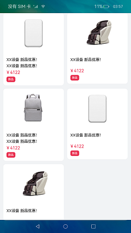

# 自定义Emitter

### 介绍

本示例使用[Emitter](https://gitee.com/openharmony/docs/blob/master/zh-cn/application-dev/reference/apis/js-apis-emitter.md)实现事件的订阅和发布，使用[自定义弹窗](https://gitee.com/openharmony/docs/blob/master/zh-cn/application-dev/reference/arkui-ts/ts-methods-custom-dialog-box.md)设置广告信息。

### 效果预览

|首页|列表页|详情内购买页面|购物车|
|-------|-------|-------|-------|
|||||

使用说明
1. 进入首页后弹出广告弹窗，点击即可关闭。
2. 点击商品列表中的一个商品可以跳转到商品详情页。
3. 在商品详情页点击首页可以返回到商品列表页，点击购物车可以跳转到购物车页面，点击加入购物车可以在购物车页面添加一条商品信息，点击立即购买可以增加一次已购物数量显示在购物车页面。
4. 在购物车页面点击购物车列表内商品的减号图标，可以将此商品信息从购物车列表内删除，点击清空购买数量可以将已购物数量清空、显示为0。

### 工程目录
```
entry/src/main/ets/
|---components
|   |---BottomNavigation.ets                    // 底部按钮导航栏
|   |---Choice.ets                              // 商品规格选择
|   |---EventsDialog.ets                        // 广告弹窗
|   |---Information.ets                         // 详细信息页面
|   |---Valueation.ets                          // 价格页面
|---mock
|   |---DetailData.ets                          // 商品详情数据
|   |---ProductsData.ets                        // 产品列表数据
|---model
|   |---DetailMode.ets                          // 商品详情数据结构
|   |---GoodsModel.ets                          // 商品数据结构
|---pages
|   |---Detail.ets                              // 商品详情
|   |---Index.ets                               // 首页
|   |---ShopCart.ets                            // 购物车
|---shoppingCart
|   |---Cart.ets                                // 购物车
|   |---FavorGoodlist.ets                       // 推荐列表
|---util
|   |---Logger.ets                              // 日志工具
feature/emitter/src/main/ets/
|---common
|   |---EmitterConst.ts                         // 事件通知常量
|---components
|   |---feature
|   |   |---CustomEmitter.ets                   // 封装事件通知类
```

### 具体实现
+ 订阅事件通知在CustomEmitter中实现，源码参考[CustomEmitter.ets](feature/emitter/src/main/ets/components/feature/CustomEmitter.ets)
  + 广告弹窗：使用Emitter的事件单次订阅emitter.once(eventId,call)，eventId为number类型，单次订阅CustomDialogController弹窗事件，弹窗触发后自动取消订阅。
  + 关闭广告弹窗：使用Emitter的事件单次订阅emitter.once(eventId,call)，eventId为string类型，单次订阅CustomDialogController弹窗事件，弹窗关闭后自动取消订阅。
  + 购物车添加商品：使用Emitter.on持续订阅商品添加事件，eventId为number类型，添加商品时更新购物车商品列表。
  + 购物车删除商品：使用Emitter.on持续订阅商品删除事件，eventId为string类型，删除商品时更新购物车商品列表。
  + 购物数量：使用Emitter.getListenerCount获取购买事件订阅者数量，进入购物车页面显示数量结果，清空时取消订阅，结果为0。

### 相关权限

不涉及。

### 依赖

不涉及。

### 约束与限制

1.本示例仅支持标准系统上运行，支持设备：RK3568;

2.本示例为Stage模型，支持API11版本SDK，版本号：4.1.3.5；

3.本示例需要使用DevEco Studio 3.1.1 Release (Build Version: 3.1.0.501, built on June 20, 2023)才可编译运行；

### 下载
如需单独下载本工程，执行如下命令：

```
git init
git config core.sparsecheckout true
echo code/BasicFeature/Notification/CustomEmitter/ > .git/info/sparse-checkout
git remote add origin https://gitee.com/openharmony/applications_app_samples.git
git pull origin master
```