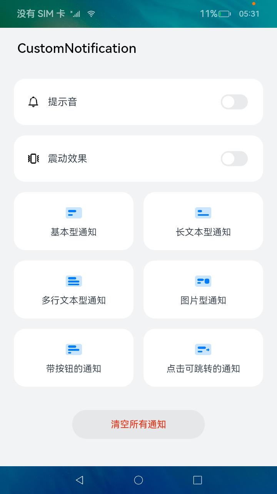
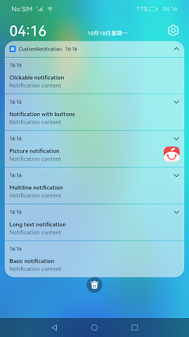
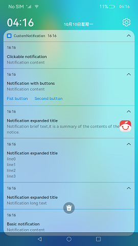

# Custom Notification

### Introduction

This sample shows how to enable the notification feature and how to publish and cancel notifications of various types.

**How to Implement**

1. Implement the notification sender functions as instructed in [Notification](https://gitee.com/openharmony/docs/blob/master/en/application-dev/notification/Readme-EN.md).

2. Implement the APIs described in [@ohos.notification (Notification)](https://gitee.com/openharmony/docs/blob/master/en/application-dev/reference/apis/js-apis-notification.md).

**How to Use**

1. Start the app. When prompted to allow the app to send notifications, touch the Allow button.

2. To publish a notification, touch the button corresponding to the type of notification you want to publish. Swipe down from the status bar to view the published notifications.

3. Touch **Cancel all notifications** to cancel all notifications published by the app.

**Display Effect**

### Required Permissions

N/A

### Dependency

N/A

###  Constraints

1. This sample can only be run on standard-system devices.

2. This sample supports only the SDK of API version 9 (SDK version: 3.2.11.9).

3. DevEco Studio 3.1 Canary1 (Build Version: 3.1.0.100) must be used.