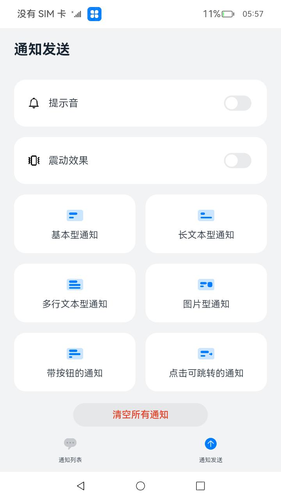
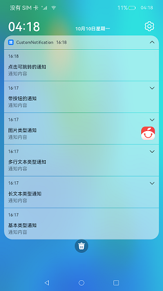
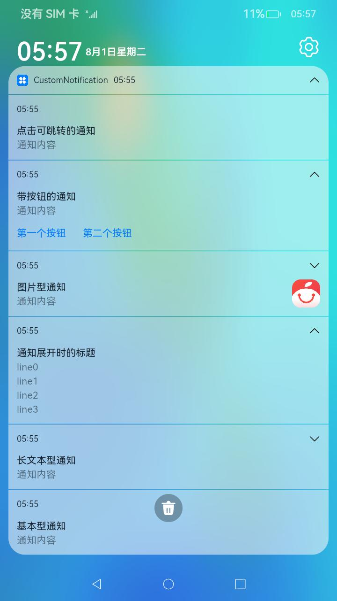

# 自定义通知

### 介绍

本示例使用[@ohos.notification](https://gitee.com/openharmony/docs/blob/master/zh-cn/application-dev/reference/apis/js-apis-notification.md)
等接口，展示了如何初始化不同类型通知的通知内容以及通知的发布、取消，包括基本类型、长文本类型、多行文本类型、图片类型、带按钮的通知、点击可跳转到应用的通知。

### 效果预览：

|首页|通知列表1|通知列表2|
|--------------------------------|--------------------------------|--------------------------------|
|||

使用说明

1.启动应用后，弹出是否允许发送通知的弹窗，点击允许后开始操作；

2.点击界面中对应的按钮发布不同类型的通知，下拉状态栏，在通知栏可以看到发布的通知；

3.点击取消所有通知，可以取消本应用发布的所有通知。

### 工程目录
```
entry/src/main/ets/
|---Application
|---feature
|   |---NotificationOperations.ets           // 对外提供发布通知的接口
|---MainAbility
|---pages
|   |---Index.ets                            // 首页
notification/src/main/ets/
|---notification
|   |---NotificationContentUtil.ets          // 封装各种通知的主体内容
|   |---NotificationRequestUtil.ets          // 接收通知的主体内容，返回完整的通知
|   |---NotificationUtil.ets                 // 封装允许发布通知、发布通知、关闭通知的接口
|   |---WantAgentUtil.ets                    // 封装wantAgent
|---util                                     // 日志文件
```

### 具体实现

* 允许发送通知、发送通知、取消通知的功能接口封装在NotificationUtil，源码参考：[NotificationUtil.ets](https://gitee.com/openharmony/applications_app_samples/blob/master/code/BasicFeature/Notification/CustomNotification/notification/src/main/ets/notification/NotificationUtil.ets)
  * 允许发送通知：在进入[Index.ets](https://gitee.com/openharmony/applications_app_samples/blob/master/code/BasicFeature/Notification/CustomNotification/entry/src/main/ets/pages/Index.ets)
    前通过notificationUtil.enableNotification()调用notification.requestEnableNotification()接口向用户请求发送通知；
  * 发送通知：通过publishNotification()封装发布通知的接口；
  * 取消通知：在[Index.ets](https://gitee.com/openharmony/applications_app_samples/blob/master/code/BasicFeature/Notification/CustomNotification/entry/src/main/ets/pages/Index.ets)
    页面中通过点击事件调用cancelAllNotifications()取消所有的通知或者通过cancelNotificationById()取消指定id的通知；

* NotificationOperations向外提供接口，在页面中调用它们来实现功能，源码参考：[NotificationOperations.ets](https://gitee.com/openharmony/applications_app_samples/blob/master/code/BasicFeature/Notification/CustomNotification/entry/src/main/ets/feature/NotificationOperations.ets)
  * 发布通知：在[Index.ets](https://gitee.com/openharmony/applications_app_samples/blob/master/code/BasicFeature/Notification/CustomNotification/entry/src/main/ets/pages/Index.ets)
    页面中通过点击事件调用NotificationOperations中封装的对应的方法，然后从NotificationContentUtil中获取对应的主体内容content，将
    content传递给NotificationRequestUtil得到完整的发布信息，最后调用NotificationUtil.publishNotification()发布内容；

### 相关权限

不涉及。

### 依赖

不涉及。

###  约束与限制

1.本示例仅支持标准系统上运行。

2.本示例已适配API10版本SDK，版本号：4.0.5.1。

3.本示例需要使用DevEco Studio 3.1 Canary1 (Build Version: 3.1.0.100)及以上版本才可编译运行。

### 下载

如需单独下载本工程，执行如下命令：

```
git init
git config core.sparsecheckout true
echo code/BasicFeature/Notification/CustomNotification/ > .git/info/sparse-checkout
git remote add origin https://gitee.com/openharmony/applications_app_samples.git
git pull origin master
```