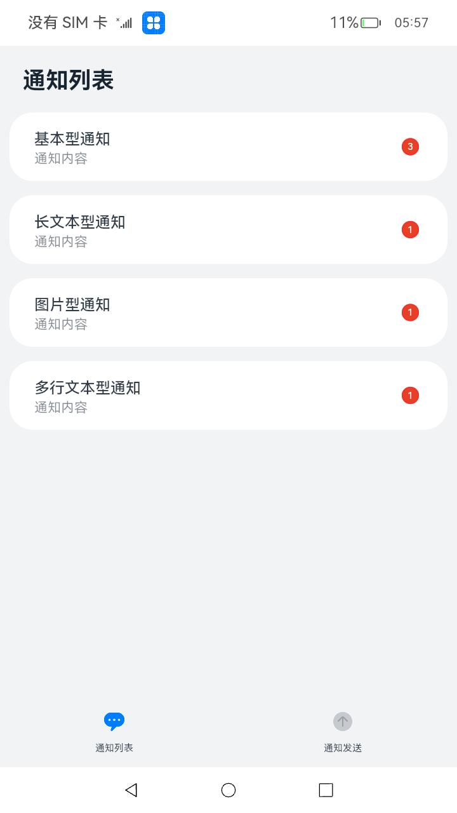

# 自定义通知

### 介绍

本示例使用[@ohos.notificationManager](https://gitee.com/openharmony/docs/blob/master/zh-cn/application-dev/reference/apis/js-apis-notificationManager.md)
等接口，展示了如何初始化不同类型通知的通知内容以及通知的发布、取消及桌面角标的设置，通知类型包括基本类型、长文本类型、多行文本类型、图片类型、带按钮的通知、点击可跳转到应用的通知。

### 效果预览：

| 主页                                                                                    | 通知发送页面                                                                            | 通知列表                                                                                                         |
|---------------------------------------------------------------------------------------|-----------------------------------------------------------------------------------|--------------------------------------------------------------------------------------------------------------|
|  |  |  |

使用说明

1.启动应用后，弹出是否允许发送通知的弹窗，点击允许后开始操作；

2.点击界面中对应的按钮发布不同类型的通知，下拉状态栏，在通知栏可以看到发布的通知；

3.打开提示音和震动效果开关后，再点击对应按钮发布不同类型的通知，在通知的同时会伴有提示音或震动效果；

4.点击消息列表Tab页，可以查看到刚才发送的消息，消息右边会显示数量，点击相应的消息可进行消息读取，取消相应通知；

5.回到仿桌面，可以看到角标数量，对应消息数量（使用前需安装并启动[仿桌面应用](../../../SystemFeature/ApplicationModels/Launcher)）；

6.点击取消所有通知，可以取消本应用发布的所有通知；

### 工程目录

```
entry/src/main/ets/
|---Application
|---components
|   |---NotificationList.ets                 //通知列表控件
|   |---NotificationPublish.ets              //通知发送控件
|   |---TitleBar.ets                         //标题控件
|---feature
|   |---NotificationOperations.ets           // 对外提供发布通知的接口
|---MainAbility
|---pages
|   |---Index.ets                            // 首页
entry/src/ohosTest/ets/
|---test
|   |---Index.test.ets                       // 首页的自动化测试    
notification/src/main/ets/
|---notification
|   |---NotificationContentUtil.ets          // 封装各种通知的主体内容
|   |---NotificationManagementUtil.ets       // 封装消息列表，角标设置的接口
|   |---NotificationRequestUtil.ets          // 接收通知的主体内容，返回完整的通知
|   |---NotificationUtil.ets                 // 封装允许发布通知、发布通知、关闭通知的接口
|   |---WantAgentUtil.ets                    // 封装wantAgent
|---util                                     // 日志文件
```

### 具体实现

* 允许发送通知、发送通知、取消通知的功能接口封装在NotificationUtil，源码参考：[NotificationUtil.ets](notification/src/main/ets/notification/NotificationUtil.ets)
    * 允许发送通知：在进入[Index.ets](entry/src/main/ets/pages/Index.ets)前
    通过notificationUtil.enableNotification()调用notification.requestEnableNotification()接口向用户请求发送通知；
    * 发送通知：通过publishNotification()封装发布通知的接口；
    * 取消通知：在[Index.ets](entry/src/main/ets/pages/Index.ets)
    页面中通过点击事件调用cancelAllNotifications()取消所有的通知或者通过cancelNotificationById()取消指定id的通知；

* 获取应用所有消息通知、取消相关类型通知，角标管理接口封装在NotificationManagementUtil，源码参考：[NotificationManagementUtil.ets](notification/src/main/ets/notification/NotificationManagementUtil.ets)
    * 获取应用所有消息通知：在constructor()
    构造函数中调用@ohos.notificationManager中的getActiveNotifications接口获取所有通知及相应类型通知数量，通过封装getAllNotifications()
    对外提供接口获取当前消息及消息数量。
    * 取消相关类型通知：通过cancelNotificationType()封装取消相关通知类型的接口；
    * 角标管理接口：通过setBadgeNumber()封装设置应用角标数量的接口，通过getBadgeNumber()封装获取当前应用角标数量的接口。
    * 添加一条通知：通过addNotification()封装接口添加一条通知到消息管理器，当发送通知的时候进行调用。

* NotificationOperations向外提供接口，在页面中调用它们来实现功能，源码参考：[NotificationOperations.ets](entry/src/main/ets/feature/NotificationOperations.ets)
    * 发布通知：在[Index.ets](entry/src/main/ets/pages/Index.ets)
    页面中通过点击事件调用NotificationOperations中封装的对应的方法，然后从NotificationContentUtil中获取对应的主体内容content，
    将content传递给NotificationRequestUtil得到完整的发布信息，最后调用NotificationUtil.publishNotification()发布内容；

* 播放提示音、马达震动的功能在NotificationUtil调用发布通知的接口处进行判断是否开启，源码参考：[NotificationOperations.ets](entry/src/main/ets/feature/NotificationOperations.ets)
    * 发布通知：在[Index.ets](entry/src/main/ets/pages/Index.ets)
    通过publishNotification()封装发布通知的接口的同时，根据NotificationUtil类中对应变量的值判断是否开启了提示音或马达，若已开启，则执行对应代码段；
    * 控制提示音或马达的开关：在[Index.ets](entry/src/main/ets/pages/Index.ets)
    通过调用NotificationUtil类两个方法对NotificationUtil类中对应变量进行更改，开启为true，关闭为false；

* 自动化测试，对应用接口或系统接口进行单元测试，并且对基于UI操作进行UI自动化测试
    * 模拟点击：在Index.test.ets的beforeAll中调用startAbility()拉起应用并进入首页，
    然后通过Driver的assertComponentExist、findComponent和findWindow等获取到对应组件的位置，
    最后通过click()模拟出人工点击对应组件的效果；
    * 模拟各种操作流程：在Index.test.ets
    的每个it里面，按一定逻辑顺序排好点击组件的顺序，从而模拟出人为操作的过程，最终，所有的it组成了整一个应用的自动化测试。

### 相关权限

1.调用马达需要应用权限，ohos.permission.VIBRATE：允许应用控制马达振动，权限级别为normal，授权方式为system_grant，ACL使能为TRUE

### 依赖

1.大禹200的板子上没有马达，需要手动自己安装一个，购买链接：https://item.szlcsc.com/2787125.html

2.应用的角标依赖于仿桌面应用进行显示：[仿桌面应用](../../../SystemFeature/ApplicationModels/Launcher)。

### 约束与限制

1.本示例仅支持标准系统上运行，支持设备：RK3568。

2.本示例需自行使用工具签名。

3.本示例为Stage模型，支持API10版本SDK，SDK版本号(API Version 10 Release),镜像版本号(4.0 Release)

4.本示例需要使用DevEco Studio 版本号(4.0 Release)及以上版本才可编译运行。

### 下载

如需单独下载本工程，执行如下命令：

```
git init
git config core.sparsecheckout true
echo code/BasicFeature/Notification/CustomNotification/ > .git/info/sparse-checkout
git remote add origin https://gitee.com/openharmony/applications_app_samples.git
git pull origin master
```
