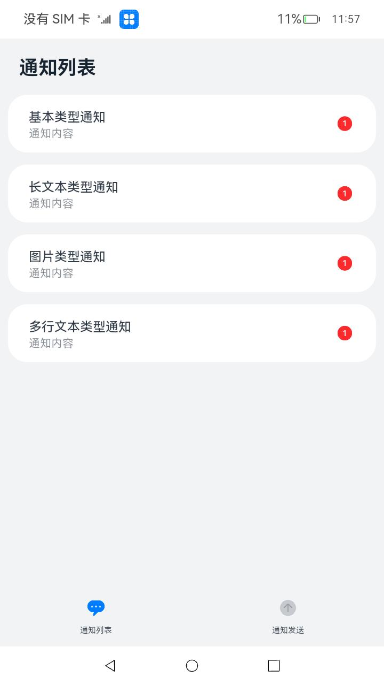
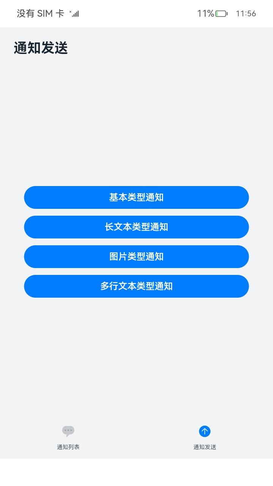

# 自定义通知角标

### 介绍

本示例主要展示了设定应用的桌面图标角标的功能，使用[@ohos.notificationManager](https://gitee.com/openharmony/docs/blob/master/zh-cn/application-dev/reference/apis/js-apis-notificationManager.md)
接口，进行桌面角标的设置，通知的发送，获取等。

### 效果预览

| 主页| 通知发送界面| 通知列表                                           |
|--------------------------------|--------------------------------|------------------------------------------------|
|  |  |  |

使用说明

1. 在使用本应用时，需安装并启动[仿桌面应用](code/SystemFeature/ApplicationModels/Launcher)；
2. 在主界面，可以看到当前应用的所有消息通知；
3. 点击右下角Tab页签进入通知发送页面，点击对应的通知即可发送相应类型的通知，点击几次发送几条；
4. 点击左下角Tab页签进入消息列表，可以查看刚才发送的消息，消息右边会显示消息数量，点击相应的消息可进行消息读取，取消相应通知；
5. 回到仿桌面，可以看到角标数量，对应消息数量。

### 工程目录

```
entry/src/main/ets/
|---components
|   |---NotificationList.ets                 //通知列表控件
|   |---NotificationPublish.ets              //通知发送控件
|   |---NotificationList.ets                 //通知列表控件
|---feature
|   |---NotificationOperations.ets           // 对外提供发布通知的接口
|---entryability
|---pages
|   |---Index.ets                            // 首页
entry/src/ohosTest/ets/
|---test
|   |---Index.test.ets                       // 首页的自动化测试    
notification/src/main/ets/
|---notification
|   |---NotificationContentUtil.ets          // 封装各种通知的主体内容
|   |---NotificationManagementUtil.ets       // 封装消息列表，角标设置的接口
|   |---NotificationRequestUtil.ets          // 接收通知的主体内容，返回完整的通知
|   |---NotificationUtil.ets                 // 封装允许发布通知、发布通知、关闭通知的接口
|---util                                     // 日志文件
```

### 具体实现

* 允许发送通知，发送通知的功能接口封装在NotificationUtil，源码参考：[NotificationUtil.ets](notification/src/main/ets/notification/NotificationUtil.ets)
    * 允许发送通知：在进入[Index.ets](entry/src/main/ets/pages/Index.ets)
      前通过notificationUtil.enableNotification()调用notification.requestEnableNotification()接口向用户请求发送通知；
    * 发送通知：通过publishNotification()封装发布通知的接口；

* 获取应用所有消息通知、取消相关类型通知，角标管理接口封装在NotificationManagementUtil，源码参考：[NotificationManagementUtil.ets](Notification/CustomNotificationBadge/notification/src/main/ets/notification/NotificationManagementUtil.ets)
    * 获取应用所有消息通知：在constructor()构造函数中调用@ohos.notificationManager中的getActiveNotifications接口获取所有通知及相应类型通知数量，通过封装getAllNotifications()对外提供接口获取当前消息及消息数量。
    * 取消相关类型通知：通过cancelNotificationType()封装取消相关通知类型的接口；
    * 角标管理接口：通过setBadgeNumber()封装设置应用角标数量的接口，通过getBadgeNumber()封装获取当前应用角标数量的接口。
    * 添加一条通知：通过addNotification()封装接口添加一条通知到消息管理器，当发送通知的时候进行调用。

* NotificationOperations向外提供接口，在页面中调用它们来实现功能，源码参考：[NotificationOperations.ets](Notification/CustomNotificationBadge/entry/src/main/ets/feature/NotificationOperations.ets)
    * 发布通知：在[Index.ets](entry/src/main/ets/pages/Index.ets)
      页面中进入发送通知Tab页签，通过点击事件调用NotificationOperations中封装的对应的方法，然后从NotificationContentUtil中获取对应的主体内容content，将
      content传递给NotificationRequestUtil得到完整的发布信息，最后调用NotificationUtil.publishNotification()发布内容，并调用NotificationManagementUtil的addNotification()添加一条消息；

### 相关权限

无

### 依赖

应用的角标依赖于仿桌面应用进行显示：
[仿桌面应用](code/SystemFeature/ApplicationModels/Launcher)。

### 约束与限制

1. 本示例仅支持标准系统上运行，支持设备：RK3568;
2. 本示例仅支持API10版本SDK，SDK版本号(API Version 10 Release),镜像版本号(4.0Release)；
3. 本示例需要使用DevEco Studio 版本号(4.0Release)及以上版本才可编译运行。

### 下载

如需单独下载本工程，执行如下命令：

```
git init
git config core.sparsecheckout true
echo code/BasicFeature/Notification/CustomNotificationBadge/ > .git/info/sparse-checkout
git remote add origin https://gitee.com/openharmony/applications_app_samples.git
git pull origin master
```