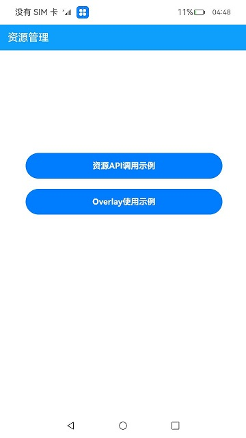
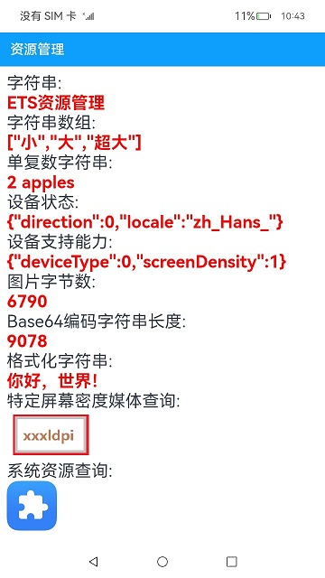
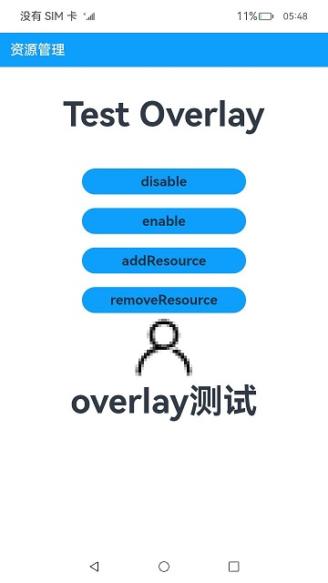
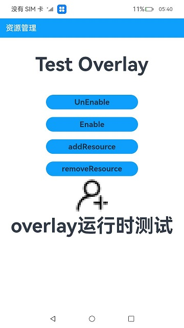

# 资源管理器

### 介绍

本工程使用[@ohos.app.ability.common](https://gitee.com/openharmony/docs/blob/master/zh-cn/application-dev/reference/apis/js-apis-app-ability-common.md)
接口中的AbilityContext类，获取资源管理器resourceManager，使用[@ohos.resourceManager.d.ts](https://gitee.com/openharmony/docs/blob/master/zh-cn/application-dev/reference/apis/js-apis-resource-manager.md)
中的接口，展示了格式化字符串查询、基于指定屏幕分辨率查询媒体资源、获取系统资源管理对象等基础功能，以及展示了资源静态overlay以及运行时overlay的特性功能。

### 效果预览

|主页|
|---|
||

#### 使用说明

此界面为主页面，其中展示了资源管理API各类接口的调用以及特性Overlay场景功能。其作用有：

1、点击资源API调用示例按钮，可跳转到资源API示例页面

2、点击Overlay使用示例，可以跳转到Overlay的使用示例界面。

#### 资源API调用示例

|资源API测试|
|---|
||

#### 使用说明

此页面展示了当前资源管理接口的调用以及接口对应的返回结果。

#### 静态overlay场景

|overlay场景|
|---|
||

#### 使用说明

此页面展示静态overlay功能，功能使用如下：

1、静态overlay是默认使能的，当前显示的是静态overlay中的字符串和图标。

2、点击Disable可以触发去使能，重启应用可以恢复显示应用的字符串和图标。

3、点击enable可以触发使能，重启应用可以再次显示overlay中的字符串和图标。

源码参考：[Overlay示例](entry/src/main/ets/pages/Overlay.ets)

#### 运行时overlay场景

|运行时overlay场景|
|---|
||

#### 使用说明

此页面展示运行时overlay功能，功能使用如下：

1、点击addResource可以触发运行时overlay，此时会使用运行时overlay中的资源覆盖之前的字符串和图标。

2、点击removeResource可以触发移除运行时overlay，此时会移除运行时overlay，恢复到覆盖前的字符串和图标。

### 工程目录

```
entry/src/main/ets/
|---entryability
|---pages
|   |---Index.ets                     // 场景首页
|   |---BasicResources.ets            // 基础资源场景
|   |---Overlay.ets                   // overlay场景      
|---libraryOverlay                    // 静态overlay
|---libraryRuntimeOverlay             // 运行时overlay
```

### 具体实现

#### 资源API调用示例具体实现：

1、使用getContext()接口获取context对象，使用context.resourceManager获取资源管理对象，然后调用resourceManager内部的相关接口获取对应资源，例如：
* 获取字符串资源：resourceManager.getStringValue()
* 获取字符串数组资源：resourceManager.getStringArrayValue()
* 获取图片资源：resourceManager.getMediaContent()
* 获取格式化字符串资源：resourceManager.getStringSync()
* 获取指定屏幕分辨率媒体资源：resourceManager.getMediaContentBase64()

2、导包resourceManager，使用resourceManager.getSystemResourceManager()获取系统资源管理对象，然后获取系统资源。

源码参考：[资源API调用示例](entry/src/main/ets/pages/BasicResources.ets)

#### overlay场景的具体实现：

1、静态overlay主要是通过加载overly中的资源实现资源覆盖，需要在对应的module.json中添加"targetModuleName":"entry"， 表示覆盖entry中的资源，默认使能，也可调用包管理接口进行使能和去使能。

使用步骤为：在安装完entry的hap后，需要把library模块生成的library-default-signed.hsp推送到/data/test下，使用bm install命令进行安装。

脚本语言如下：

hdc_std shell mount -o remount,rw /

hdc_std install ./entry-default-signed.hap

hdc_std shell mkdir /data/test

hdc_std file send ./libraryOverlay-default-signed.hsp /data/test

hdc_std shell bm install -p "/data/test/libraryOverlay-default-signed.hsp"

pause

2、运行时overlay资源加载，主要是在应用运行过程中实现资源的覆盖，需要应用主动调用资源的addResource接口实现资源的覆盖以及资源的移除，此功能不持久化。

使用步骤为: 在安装完entry的hap后，需要把libraryRuntimeOverlay模块生成的libraryRuntimeOverlay-default-signed.hsp推送到应用对应的安装目录下。

脚本语言如下：

hdc_std shell mount -o remount,rw /

hdc_std install ./entry-default-signed.hap

hdc_std file send ./libraryRuntimeOverlay-default-signed.hsp /data/app/el1/bundle/public/ohos.samples.resourcemanager

pause

源码参考：[Overlay示例](entry/src/main/ets/pages/Overlay.ets)


### 相关权限

不涉及。

### 依赖

不涉及。

### 约束与限制

1. 本工程示例仅支持标准系统上运行。

2. 本工程仅支持API10版本SDK，SDK版本号(API Version 10 Release),镜像版本号(4.0Release)。

3. 本工程示例需要使用DevEco Studio 版本号(4.0Release)及以上版本才可编译运行。

### 下载

如需单独下载本工程，执行如下命令：

```
git init
git config core.sparsecheckout true
echo code/BasicFeature/Resource/ResourceManager/ > .git/info/sparse-checkout
git remote add origin https://gitee.com/openharmony/applications_app_samples.git
git pull origin master
```

