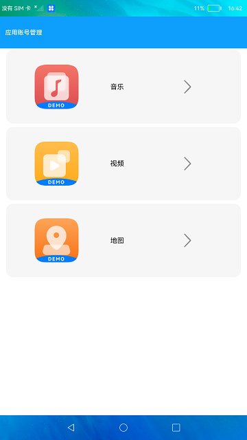
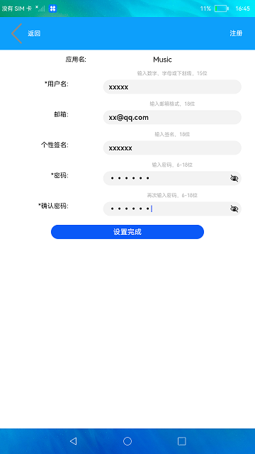

# 应用帐号管理

### 介绍

本示例选择应用进行注册/登录，并设置帐号相关信息，简要说明应用帐号管理相关功能。效果图如下：

### 效果预览

|主页| 注册页面                                 | 登录页面                              | 账户信息页面|
|--------------------------------|--------------------------------------|-----------------------------------|------|
||  |  ||

使用说明

1.首页面选择想要进入的应用，首次进入该应用需要进行注册，如已注册帐号则直接登录。

2.注册页面可设置帐号名、邮箱、个性签名、密码（带*号为必填信息），注册完成后返回登录页面使用注册的帐号进行登录。

3.登录后进入帐号详情界面，点击**修改信息**按钮可跳转至帐号信息修改页面重新设置帐号信息。

4.点击**切换应用**按钮则退出该帐号并返回首页面。重新选择想要进入的应用。

5.点击**删除帐号**按钮则会删除该帐号所有相关信息。

### 工程目录
```
entry/src/main/ets/
|---common
|   |---AccountInfo.ets                    // 切换应用组件
|   |---BundleInfo.ets                     // 首页列表组件
|   |---LoginInfo.ets                      // 登录组件
|   |---ModifyInfo.ets                     // 修改信息组件
|   |---NavigationBar.ets                  // 路由跳转组件
|   |---RegisterInfo.ets                   // 注册组件
|---entryAbility
|   |---EntryAbility.ts             
|---model
|   |---AccountData.ts                     // 数据存储
|   |---AccountModel.ts                    // 数据管理
|   |---Logger.ts                          // 日志工具
|---pages
|   |---Index.ets                          // 首页
|   |---Account.ets                        // 切换应用页面
|   |---Login.ets                          // 登录页面
|   |---Modify.ets                         // 修改信息页面
|   |---Register.ets                       // 注册信息页面

```

### 具体实现

* 本示例分为音乐，视频，地图三个模块
  * 音乐模块
    * 使用Navigation,Button，Text,TextInput组件开发注册，登录，修改信息和切换应用页面， createAppAccountManager方法创建应用帐号管理器对象
    * 源码链接：[AccountData.ts](entry/src/main/ets/model/AccountData.ts)，[AccountModel.ts](entry/src/main/ets/model/AccountModel.ts)
    * 接口参考：[@ohos.account.appAccount](https://gitee.com/openharmony/docs/blob/master/zh-cn/application-dev/reference/apis/js-apis-appAccount.md#account_appaccountcreateappaccountmanager)，[@ohos.data.preferences](https://gitee.com/openharmony/docs/blob/master/zh-cn/application-dev/reference/apis/js-apis-data-preferences.md)，[@ohos.router](https://gitee.com/openharmony/docs/blob/master/zh-cn/application-dev/reference/apis/js-apis-system-router.md)

  * 视频模块
    * 使用Navigation,Button，Text,TextInput组件开发注册，登录，修改信息和切换应用页面，createAppAccountManager方法创建应用帐号管理器对象
    * 源码链接：[AccountData.ts](entry/src/main/ets/model/AccountData.ts)，[AccountModel.ts](entry/src/main/ets/model/AccountModel.ts)
    * 接口参考：[@ohos.account.appAccount](https://gitee.com/openharmony/docs/blob/master/zh-cn/application-dev/reference/apis/js-apis-appAccount.md#account_appaccountcreateappaccountmanager)，[@ohos.data.preferences](https://gitee.com/openharmony/docs/blob/master/zh-cn/application-dev/reference/apis/js-apis-data-preferences.md)，[@ohos.router](https://gitee.com/openharmony/docs/blob/master/zh-cn/application-dev/reference/apis/js-apis-system-router.md)

  * 地图模块
    * 使用Navigation,Button，Text,TextInput组件开发注册，登录，修改信息和切换应用页面，createAppAccountManager方法创建应用帐号管理器对象
    * 源码链接：[AccountData.ts](entry/src/main/ets/model/AccountData.ts)，[AccountModel.ts](entry/src/main/ets/model/AccountModel.ts)
    * 接口参考：[@ohos.account.appAccount](https://gitee.com/openharmony/docs/blob/master/zh-cn/application-dev/reference/apis/js-apis-appAccount.md#account_appaccountcreateappaccountmanager)，[@ohos.data.preferences](https://gitee.com/openharmony/docs/blob/master/zh-cn/application-dev/reference/apis/js-apis-data-preferences.md)，[@ohos.router](https://gitee.com/openharmony/docs/blob/master/zh-cn/application-dev/reference/apis/js-apis-system-router.md)

#### 相关概念

应用帐号管理：本模块不仅用于对应用帐号的添加、删除、查询、修改和授权，且提供帐号将数据写入磁盘和数据同步的能力。

### 相关权限

不涉及。

### 依赖

不涉及。

### 约束与限制

1.本示例仅支持在标准系统上运行。

2.本示例已适配API version 9版本SDK，版本号：3.2.11.9。

3.本示例需要使用DevEco Studio 3.1 Beta2 (Build Version: 3.1.0.400, built on April 7, 2023)及以上版本才可编译运行。

### 下载

如需单独下载本工程，执行如下命令：
```
git init
git config core.sparsecheckout true
echo code/BasicFeature/Security/AppAccountManager/ > .git/info/sparse-checkout
git remote add origin https://gitee.com/openharmony/applications_app_samples.git
git pull origin master

```