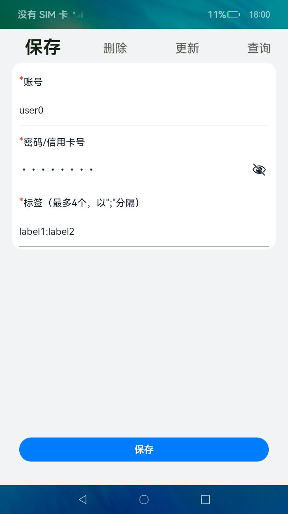
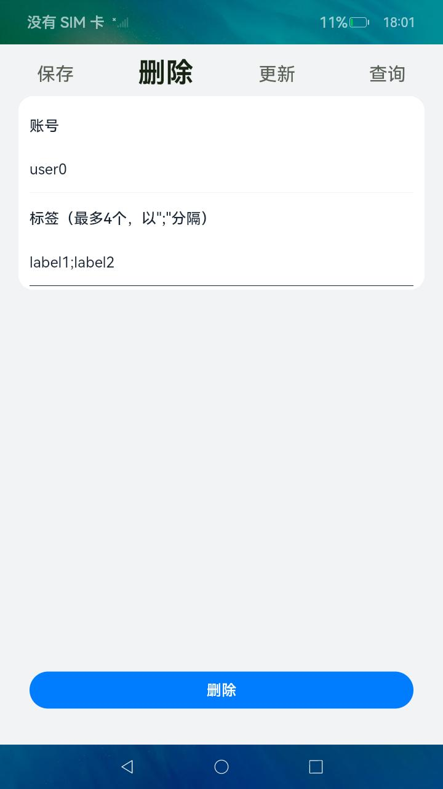
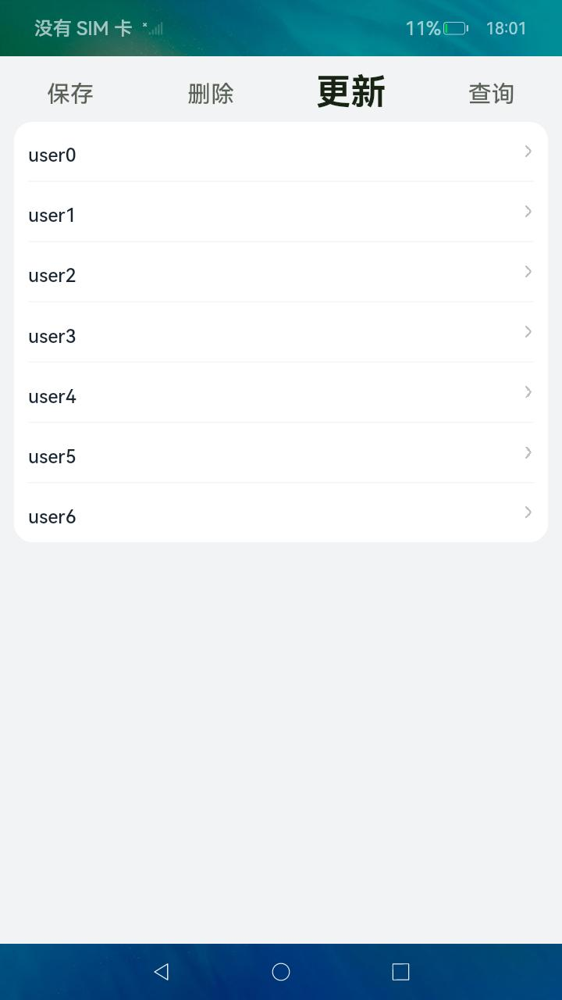
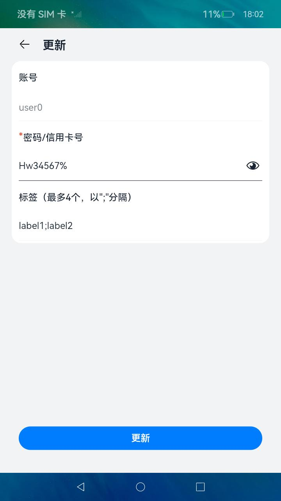
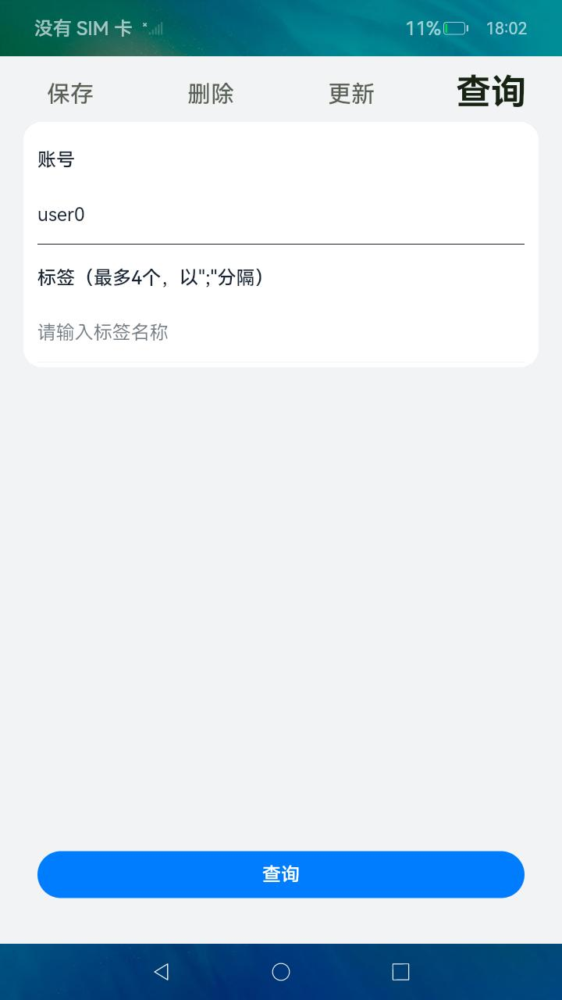
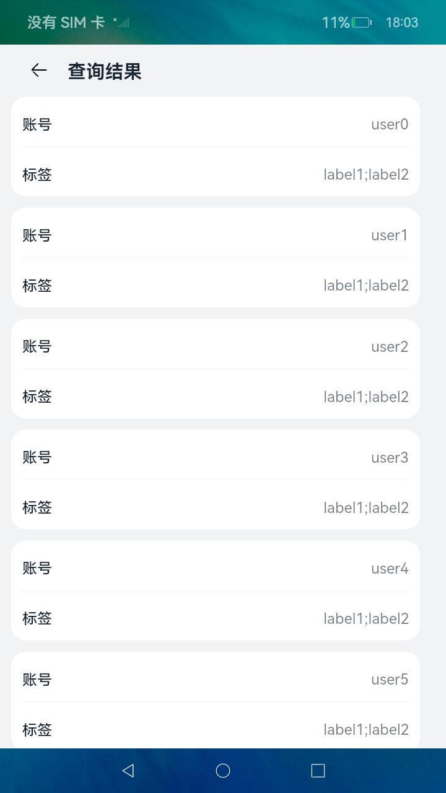
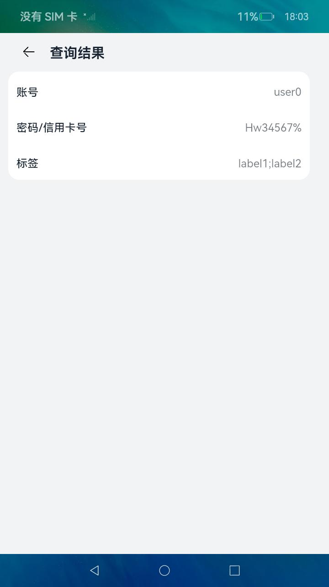

# 关键资产存储服务
## 介绍
本示例使用[@kit.AssetStoreKit](https://gitee.com/openharmony/docs/tree/master/zh-cn/application-dev/security/AssetStoreKit)相关接口实现了对敏感数据的保存、更新、查询、删除操作。

实现场景如下：

1）用户使用本应用保存密码或信用卡号。

2）用户更新本应用管理的密码或信用卡号。

3）用户查询本应用管理的密码或信用卡号。

4）用户删除本应用管理的密码或信用卡号。

## 效果预览
| **保存页面** | **删除页面** | **更新列表页面** | **更新编辑页面** |
|---------|----------|------------|----------|
|||||
| **查询页面** | **批量查询结果页面** | **单个查询结果页面** |
|||

使用说明：
* 保存敏感数据：
  * 输入账号、密码、标签，其中标签可以填写多个，但不超过4个
  * 点击“保存”按钮

* 删除敏感数据，可使用以下任意一种方式删除：
  * 批量删除：不输入任何信息，或输入单个或多个标签），点击“删除”按钮
  * 单个删除：输入账号、标签（可选），点击“删除”按钮
* 更新敏感数据：
  * 点击标题栏的“更新”，进入更新页面
  * 在显示的账号列表中，点击待更新的账号
  * 输入锁屏密码，进入编辑界面
  * 输入更新后的密码和标签，点击“更新”
* 查询敏感数据，可使用以下任意一种方式删除：
  * 批量查询：不输入任何信息，或输入单个或多个标签），点击“查询”按钮，显示保存的信息列表，不含“密码/信用卡号”
  * 单个查询：输入账号、标签（可选），点击“查询”按钮，输入锁屏密码，显示该账号详细信息，含“密码/信用卡号”

## 工程目录
```
entry/src/main/ets/
|---entryAbility
|   |---EntryAbility.ts
|---model
|   |---AssetModel.ets                     // 关键资产存储模型文件
|---pages
|   |---Index.ets                          // 主页面
|   |---QueryResultPage.ets                // 查询结果界面
|   |---UpdatePage.ets                     // 更新页面
```
## 具体实现
本应用分为四个主页面：保存、删除、更新、查询，通过TabBuilder组件实现页面直接的切换。
* **保存页面**：解析用户输入的账号、密码、标签信息，传入@kit.AssetStoreKit提供的add接口，从而实现将短敏感数据存储到关键资产存储服务中。

* **删除页面**：解析用户输入的账号、标签信息，传入@kit.AssetStoreKit提供的remove接口，删除满足条件的短敏感数据。

* **更新页面**：

    1）调用@kit.AssetStoreKit提供的query接口，查询关键资产中存储的全量账号。

    2）调用@kit.AssetStoreKit提供的preQuery接口，将返回的challenge传给@kit.UserAuthenticationKit提供的on接口。

    3）待用户输入锁屏密码后，将onResult接口返回的AuthToken传给@kit.AssetStoreKit提供的query接口，用以查询旧的敏感数据明文。

    4）解析用户输入的账号、标签信息，传入@kit.AssetStoreKit提供的update接口，更新关键资产存储服务中存储的敏感数据。

    5）退出更新界面时，调用@kit.AssetStoreKit提供的postQuery接口清理资源

* **查询页面**：

    用户未输入账号：
    
    解析用户输入的标签信息，传入@kit.AssetStoreKit提供的query接口，查询关键资产存储服务中存储的账号、标签。

    用户输入了账号：

    1）调用@kit.AssetStoreKit提供的preQuery接口，将返回的challenge传给@kit.UserAuthenticationKit提供的on接口。

    2）待用户输入锁屏密码后，将onResult接口返回的AuthToken、用户输入的账号、标签信息传给@kit.AssetStoreKit提供的query接口，用以查询敏感数据明文。

    3）调用@kit.AssetStoreKit提供的postQuery接口清理资源。

## 相关权限
[ohos.permission.ACCESS_BIOMETRIC](https://gitee.com/openharmony/docs/blob/master/zh-cn/application-dev/security/AccessToken/permissions-for-all.md#ohospermissionaccess_biometric)

[ohos.permission.STORE_PERSISTENT_DATA](https://gitee.com/openharmony/docs/blob/master/zh-cn/application-dev/security/AccessToken/permissions-for-all.md#ohospermissionstore_persistent_data)

## 依赖
不涉及

## 约束与限制
1.本示例仅支持标准系统上运行。

2.本示例支持API11版本SDK，SDK版本号(API Version 11 Release), 镜像版本号(4.1Release)。

3.本示例需要使用DevEco Studio版本号(4.1Release)及以上版本才可编译运行。

4.本示例需要在设备设置锁屏密码后使用。其中，更新、查询结果页面输入锁屏密码方可进入。

## 下载
如需单独下载本工程，执行如下命令：

```
git init
git config core.sparsecheckout true
echo code/BasicFeature/Security/Asset/ > .git/info/sparse-checkout
git remote add origin https://gitee.com/openharmony/applications_app_samples.git
git pull origin master

```