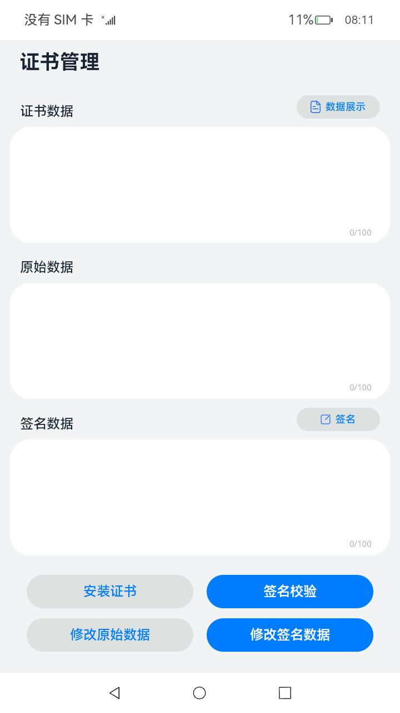
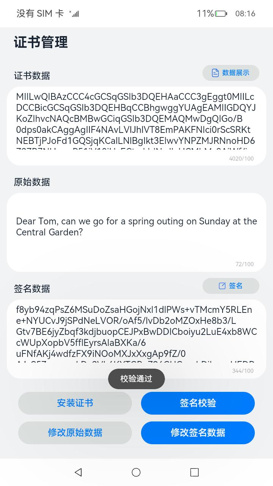
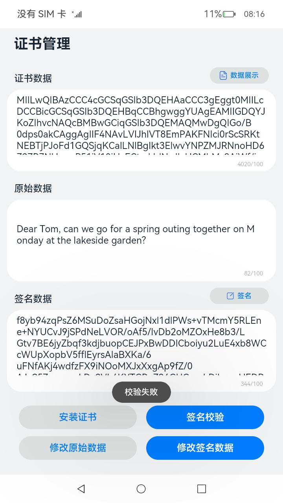

# 证书管理

### 介绍

本示例使用了[@ohos.security.certManager](https://gitee.com/openharmony/docs/blob/master/zh-cn/application-dev/reference/apis/js-apis-certManager.md)相关接口实现了对签名数据进行校验的功能。

实现场景如下：

1）使用**正确**的原始数据和签名数据进行签名校验场景：模拟服务端对签名数据进行校验，验证客户端身份和原始数据完整性。

2）使用**错误**的原始数据或签名数据进行签名校验场景：模拟攻击者修改原始数据或签名数据，服务端进行签名校验时，攻击者身份不可信或原始数据不完整，验证失败。

### 效果预览

|                 主页                 |                   校验通过                   |             校验失败             |
|:----------------------------------:|:------------------------------------------:|:---------------------------------------:|
|  |  |  |

使用说明

1、点击**安装**按钮，页面弹出弹窗，提示**安装成功**。

2、点击**数据展示**按钮，页面文本框中分别显示正确的证书、原始数据内容。

3、点击**签名校验**按钮，页面文本框中分别显示签名数据内容。

4、点击**修改原始数据**按钮，页面显示修改后的原始数据和正确的证书、签名数据；点击校验按钮，页面弹出弹窗，提示**校验失败**。

5、点击**修改签名数据**按钮，页面显示修改后的签名数据和正确的证书、原始数据；点击校验按钮，页面弹出弹窗，提示**校验失败**。

6、点击**校验**按钮，页面弹出弹窗，提示**校验通过**。

### 工程目录

```
entry/src/main/ets/
|---entryability
|   |---EntryAbility.ts       
|---model
|   |---Data.ts                                               // 证书数据
|   |---Model.ts                                              // 证书管理文件
|   |---Logger.ts                                             // 日志文件
|---pages
|   |---Index.ets                                             // 主界面
```

### 具体实现 

* 签名校验的功能接口Verify封装在Model中
    * 安装私有凭据：调用[certManager.installPrivateCertificate](https://gitee.com/openharmony/docs/blob/master/zh-cn/application-dev/reference/apis/js-apis-certManager.md#certmanagerinstallprivatecertificate)接口安装证书，并获取返回结果cmResult。
    * 使用凭据进行签名、验签的初始化操作：调用[certManager.init](https://gitee.com/openharmony/docs/blob/master/zh-cn/application-dev/reference/apis/js-apis-certManager.md#certmanagerinit)接口进行初始化，并获取返回结果signHandle。
    * 填充源数据：调用[certManager.update](https://gitee.com/openharmony/docs/blob/master/zh-cn/application-dev/reference/apis/js-apis-certManager.md#certmanagerupdate)接口填充源数据。
    * 完成签名的操作：调用[certManager.finish](https://gitee.com/openharmony/docs/blob/master/zh-cn/application-dev/reference/apis/js-apis-certManager.md#certmanagerfinish)接口完成签名，并获取签名结果signResult。
    * 完成验签的操作：同上，再依次调用[certManager.init](https://gitee.com/openharmony/docs/blob/master/zh-cn/application-dev/reference/apis/js-apis-certManager.md#certmanagerinit)接口，[certManager.update](https://gitee.com/openharmony/docs/blob/master/zh-cn/application-dev/reference/apis/js-apis-certManager.md#certmanagerupdate)接口，[certManager.finish](https://gitee.com/openharmony/docs/blob/master/zh-cn/application-dev/reference/apis/js-apis-certManager.md#certmanagerfinish-1)接口完成验签操作，最终获取验签结果verifyResult。

### 相关权限

[ohos.permission.ACCESS_CERT_MANAGER](https://gitee.com/openharmony/interface_sdk-js/blob/037c3093d760d2a35d1e28d113da331f06716d9e/api/@ohos.security.certManager.d.ts)

### 依赖

不涉及。

### 约束与限制

1、本示例仅支持标准系统上运行。

2、本示例已适配API version 11版本SDK，适用版本号：2023年12月23日及之后的CI每日构建版本（4.1.5.3），或更新的Beta版本、Release版本。

3、本示例需要使用DevEco Studio 4.0 Release(Build Version: 4.0.0.600)及以上版本才可编译运行，由于hvigor的限制，本Sample工程在同步hvigor的方式存在一定的限制，需要通过如下步骤规避：

（1）将build-profile.json5中的compileSdkVersion、compatibleSdkVersion支持的版本从11修改为10，同步hvigor；

（2）成功同步hvigor后，再将build-profile.json5中的compileSdkVersion、compatibleSdkVersion支持的版本从10修改为11，即可执行编译。

### 下载

 如需单独下载本工程，执行如下命令： 

```
git init
git config core.sparsecheckout true
echo code/BasicFeature/Security/CertManager/ > .git/info/sparse-checkout
git remote add origin https://gitee.com/openharmony/applications_app_samples.git
git pull origin master
```

