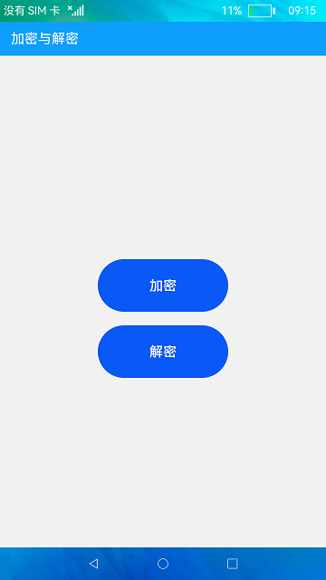
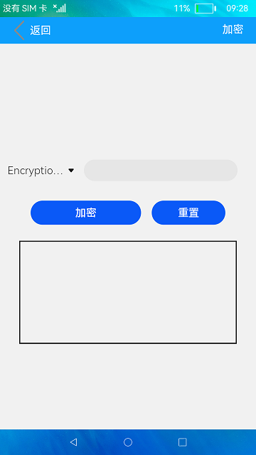
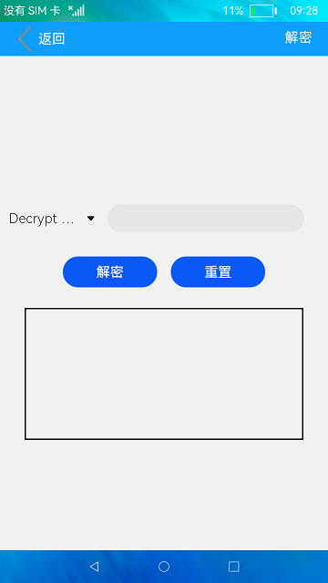

# 加解密

### 介绍

本示例使用[cipher](https://gitee.com/openharmony/docs/blob/master/zh-cn/application-dev/reference/apis/js-apis-system-cipher.md)相关接口实现了字符串加解密算法，包括RSA加密算法与AES加密算法。

RSA加密算法：RSA公开密钥密码体制是一种使用不同的加密密钥与解密密钥，由已知加密密钥推导出解密密钥在计算上是不可行的密码体制。

AES加密算法：AES密码学中的高级加密标准，又称Rijndael加密法，是美国联邦政府采用的一种区块加密标准。

### 效果预览

|主页|加密页面|解密页面|
|--------------------------------|--------------------------------|--------------------------------|
||  ||

使用说明

1.点击主页面的**加密**按钮，在加密界面中点击**Encryption Algorithm**下拉选择加密算法，在输入框中输入待加密的内容，点击**加密**
按钮，下方文本框中显示加密后内容。

2.点击**重置**按钮，清除文本框中内容。

3.点击主页面的**解密**按钮，在解密界面中点击**Decrypt Algorithm**下拉选择解密算法，在输入框中输入待解密的内容，点击**解密**
按钮，下方文本框中显示解密后内容。

4.点击**重置**按钮，清除文本框中内容。

### 工程目录
```
entry/src/main/ets/
|---common
|   |---Decrypt.ets                       // 解密页面
|   |---Encryption.ets                    // 加密页面
|---entryAbility
|   |---EntryAbility.ts
|---model
|   |---CipherModel.ts                    // 加密与解密方法
|   |---Logger.ts                         // 日志工具
|---pages
|   |---Index.ets                         // 首页
|   |---Second.ets                        // 加密与解密页面
```

### 具体实现

* 本示例分成加密与解密两个模块
  * 加密模块
    * 使用到rsaEncrypt(RSA算法加密)与aesEncrypt(AES算法加密)两种加密方法进行加密操作。
    * 源码链接：[Encryption.ets](entry/src/main/ets/common/Encryption.ets)，[CipherModel.ts](entry/src/main/ets/model/CipherModel.ts)
    * 接口参考：[@system.cipher](https://gitee.com/openharmony/docs/blob/master/zh-cn/application-dev/reference/apis/js-apis-system-cipher.md#cipheraes)，[@ohos.prompt](https://gitee.com/openharmony/docs/blob/master/zh-cn/application-dev/reference/apis/js-apis-promptAction.md)，[@system.router](https://gitee.com/openharmony/docs/blob/master/zh-cn/application-dev/reference/apis/js-apis-system-router.md)

  * 解密模块
    * 使用到rsaDecrypt(RSA算法解密)与aesDecrypt(AES算法解密)两种解密方法进行解密操作。
    * 源码链接：[Decrypt.ets](entry/src/main/ets/common/Decrypt.ets)，[CipherModel.ts](entry/src/main/ets/model/CipherModel.ts)
    * 接口参考：[@system.cipher](https://gitee.com/openharmony/docs/blob/master/zh-cn/application-dev/reference/apis/js-apis-system-cipher.md#cipheraes)，[@ohos.prompt](https://gitee.com/openharmony/docs/blob/master/zh-cn/application-dev/reference/apis/js-apis-promptAction.md)，[@system.router](https://gitee.com/openharmony/docs/blob/master/zh-cn/application-dev/reference/apis/js-apis-system-router.md)
  
### 相关权限

不涉及。

### 依赖

不涉及。

### 约束与限制

1.本示例仅支持在标准系统上运行。

2.本示例已适配API version 9版本SDK，版本号：3.2.11.9。

3.本示例需要使用DevEco Studio 3.1 Beta2 (Build Version: 3.1.0.400, built on April 7, 2023)及以上版本才可编译运行。

### 下载

如需单独下载本工程，执行如下命令：
```
git init
git config core.sparsecheckout true
echo code/BasicFeature/Security/Cipher/ > .git/info/sparse-checkout
git remote add origin https://gitee.com/openharmony/applications_app_samples.git
git pull origin master

```