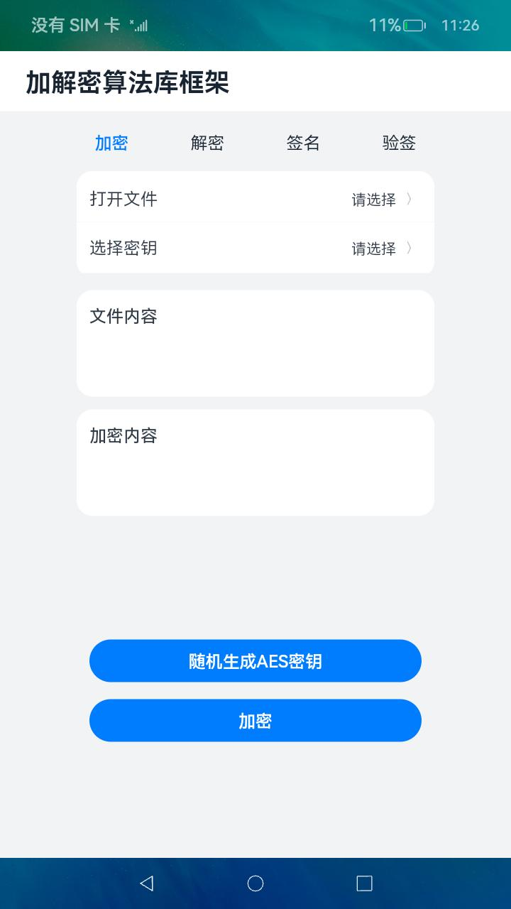
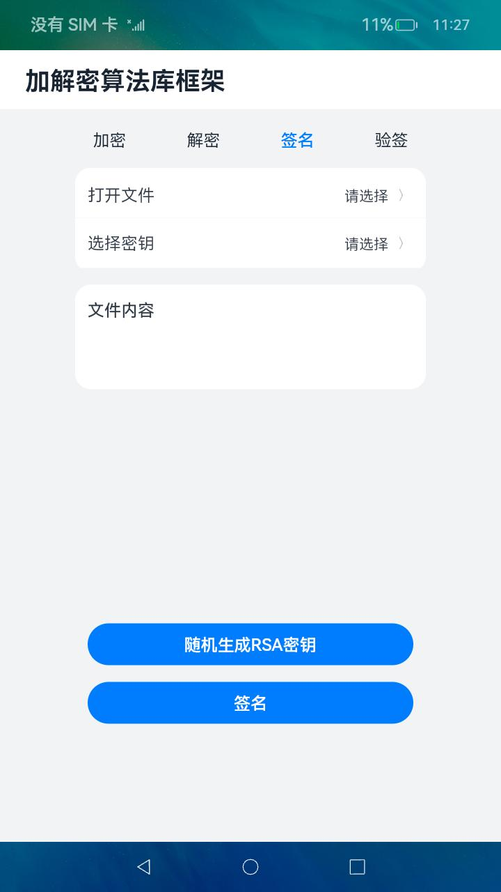
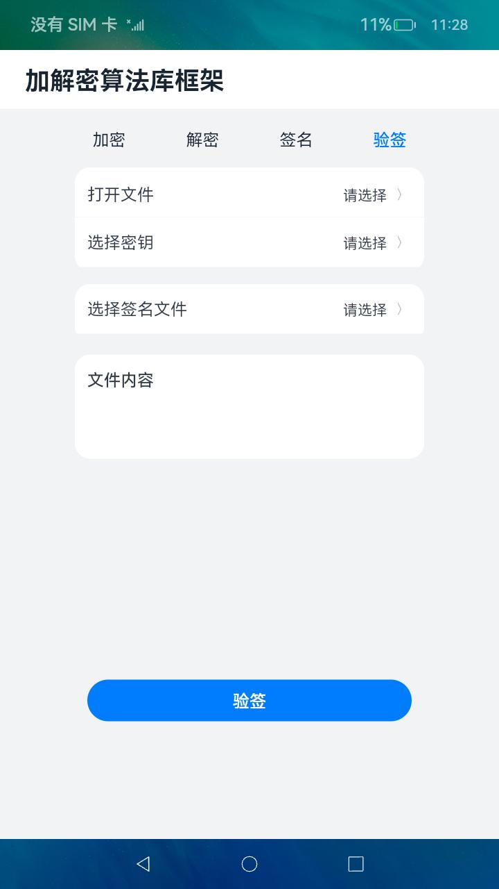

# 通用密钥库系统

### 介绍

本示例使用[@ohos.security.cryptoFramework](https://gitee.com/openharmony/docs/blob/master/zh-cn/application-dev/reference/apis/js-apis-cryptoFramework.md)
相关接口实现了对文本文件的加解密、签名验签操作。

实现场景如下：

1）软件需要加密存储本地文本文件，需要调用加解密算法库框架选择密钥文本文件，对本地文本文件进行加密，其中密钥文本文件可由加解密算法库生成。

2）软件需要解密存储本地文本文件，需要调用加解密算法库框架选择密钥文本文件，对本地文本文件进行解密，其中密钥文本文件可由加解密算法库生成。

3）软件需要对存储本地文本文件签名，调用加解密算法库框架选择密钥文本文件，对本地文本文件进行完整性签名，其中密钥文本文件可由加解密算法库生成。

4）软件需要验证存储本地文本文件的签名完整性，需要调用加解密算法库框架选择密钥文本文件与签名文件，对文件进行验签，其中密钥文本文件可由加解密算法库生成。

### 效果预览

| 加密页面                                 | 解密页面                                 | 签名页面                              | 验签界面                                |
|--------------------------------------|--------------------------------------|-----------------------------------|-------------------------------------|
|  |  |  |  |

使用说明

1.点击主页面tab栏的**加密**，在加密界面点击**打开文件**，通过文件选择器选择文本文件，选择完毕自动返回加密界面，
其内容显示在**文件内容**文本框中，
点击**选择密钥**，选择密钥文件，如果没有密钥文件，可以通过在加密界面点击**随机生成AES密钥**，生成并通过文件选择器保存密钥文件。
选择完文本文件和密钥文件后，点击**加密**按钮，完成加密，并通过文件选择器保存密文文件。
下方**加密内容**文本框中显示加密后的消息内容。

2.点击主页面tab栏的**解密**，在解密界面点击**打开文件**，通过文件选择器选择文本文件，选择完毕自动返回解密界面，
其内容显示在**文件内容**文本框中，
点击**选择密钥**，选择和**加密相同**的密钥文件。
选择完文本文件和密钥文件后，点击**解密**按钮，完成解密，并通过文件选择器保存明文文件。
下方**解密内容**文本框中显示解密后的消息内容。

3.点击主页面tab栏的**签名**，在签名界面点击**打开文件**，通过文件选择器选择文本文件，选择完毕自动返回签名界面，
其内容显示在**文件内容**文本框中，
点击**选择密钥**，选择密钥文件，如果没有密钥文件，可以通过在签名界面点击**随机生成RSA密钥**，生成并通过文件选择器保存密钥文件，注意RSA密钥生成耗时较长。
选择完文本文件和密钥文件后，点击**签名**按钮，完成完整性签名，并通过文件选择器保存签名文件。

4.点击主页面tab栏的**验签**，在验签界面点击**打开文件**，通过文件选择器选择文本文件，选择完毕自动返回验签界面，
其内容显示在**文件内容**文本框中，
点击**选择密钥**，选择和签名一致的密钥文件。点击**选择签名文件**，通过文件选择器选择签名时保存的签名文件，
选择完文本文件、密钥文件和签名文件后，点击**验签**按钮，完成验签。

### 工程目录

```
entry/src/main/ets/
|---cryptoframework
|   |---CryptoOperation.ts                                    // 封装加解密算法库相关算法能力
|---entryability
|   |---EntryAbility.ts       
|---pages
|   |---Index.ets                                             // 主页界面
|---tab
|   |---Decrypt.ets                                           // 解密tab界面
|   |---Encrpyt.ts                                            // 加密tab界面
|   |---Sign.ts                                               // 签名tab界面
|   |---Verify.ts                                             // 验签tab界面
|---textfilemanager
|   |---TextFileManager.ts                                    // 封装文件读写相关能力
|---util
|   |---Logger.ts                                             // 日志文件
```

### 具体实现

*

进行对文本文件进行加解密、签名验签的功能接口封装在CryptoOperation中，源码参考：[CryptoOperation.ts](entry/src/main/ets/cryptoframework/CryptoOperation.ts)

* 对文本文件加密：在[Encrypt.ets](entry/src/main/ets/tab/Encrypt.ets)
  文件中依次点击打开文件、选择密钥，通过filePicker选择明文文本文件和密钥文件，点击加密按钮，调用加密函数实现对文本内容进行加密，并将密文文件通过filePicker保存。
  需要生成密钥文本文件时，可以点击随机生成AES密钥，通过调用[cryptoFramework.symKeyGenerator](https://gitee.com/openharmony/docs/blob/master/zh-cn/application-dev/reference/apis/js-apis-cryptoFramework.md#symkeygenerator)
  生成用于加密的AES密钥，并通过filePicker保存密钥文本文件。
  对消息加密的过程中采用[cryptoFramework.Cipher](https://gitee.com/openharmony/docs/blob/master/zh-cn/application-dev/reference/apis/js-apis-cryptoFramework.md#cipher)
  完成加密操作。
* 对文本文件解密：在[Decrypt.ets](entry/src/main/ets/tab/Decrypt.ets)
  文件中依次点击打开文件、选择密钥，通过filePicker选择密文文本文件和密钥文件，点击解密按钮，调用解密函数实现对文本内容进行解密，并将明文文件通过filePicker保存。
  对消息解密的过程中采用[cryptoFramework.Cipher](https://gitee.com/openharmony/docs/blob/master/zh-cn/application-dev/reference/apis/js-apis-cryptoFramework.md#cipher)
  完成解密操作。
* 对文本文件签名：在[Sign.ets](entry/src/main/ets/tab/Sign.ets)
  文件中依次点击打开文件、选择密钥，通过filePicker选择待签名文本文件和密钥文件，点击签名按钮，调用签名函数实现对文本内容进行加密，并将签名文件通过filePicker保存。
  需要生成密钥文本文件时，可以点击随机生成RSA密钥，通过调用[cryptoFramework.asyKeyGenerator](https://gitee.com/openharmony/docs/blob/master/zh-cn/application-dev/reference/apis/js-apis-cryptoFramework.md#asykeygenerator)
  生成用于签名的RSA密钥，并通过filePicker保存密钥文本文件。
  对消息签名的过程中采用[cryptoFramework.Sign](https://gitee.com/openharmony/docs/blob/master/zh-cn/application-dev/reference/apis/js-apis-cryptoFramework.md#sign)
  完成加密操作。
* 对文本文件验签：在[Verify.ets](entry/src/main/ets/tab/Verify.ets)
  文件中依次点击打开文件、选择密钥、选择签名文件，通过filePicker选择密文文本文件、密钥文件和签名文件，点击验签按钮，调用验签函数实现对文本内容进行验签，并显示验签结果。
  对消息验签的过程中采用[cryptoFramework.Verify](https://gitee.com/openharmony/docs/blob/master/zh-cn/application-dev/reference/apis/js-apis-cryptoFramework.md#verify)
  完成验签操作。

### 相关权限

不涉及。

### 依赖

* filePicker文件选择器[@ohos.file.picker](https://gitee.com/openharmony/docs/blob/master/zh-cn/application-dev/reference/apis/js-apis-file-picker.md)

* 文件管理[@ohos.file.fs](https://gitee.com/openharmony/docs/blob/master/zh-cn/application-dev/reference/apis/js-apis-file-fs.md)

* 应用上下文Context[@ohos.app.ability.common](https://gitee.com/openharmony/docs/blob/master/zh-cn/application-dev/reference/apis/js-apis-app-ability-common.md)

### 约束与限制

1.本示例仅支持标准系统上运行。

2.本示例已适配API version 9版本SDK，版本号：3.2.12.2，镜像版本号：OpenHarmony 4.0.7.2。

3.本示例需要使用DevEco Studio 3.1 Release (Build Version: 3.1.0.500)及以上版本才可编译运行。

4.本示例所选择文件，用filePicker文件选择器保存的文件，比如新增的密钥，能够实时更新，如直接推送至文件夹，需要重启后刷新显示。

5.本示例所选择文本文件内容当前只支持英文字符，作为演示，能成功使用的文本长度不超过8000字节。

### 下载

如需单独下载本工程，执行如下命令：

```
git init
git config core.sparsecheckout true
echo code/BasicFeature/Security/CryptoFramework/ > .git/info/sparse-checkout
git remote add origin https://gitee.com/openharmony/applications_app_samples.git
git pull origin master

```