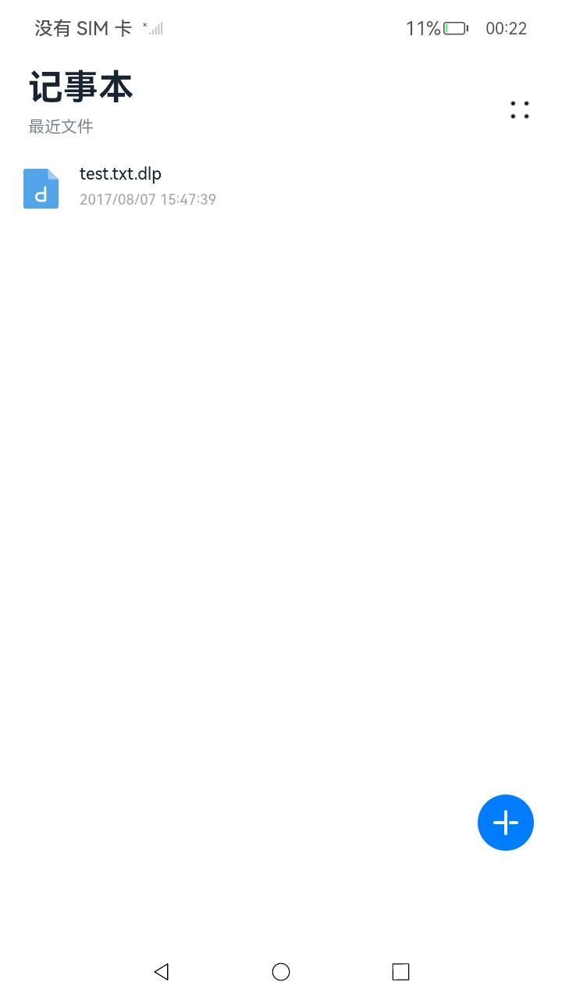
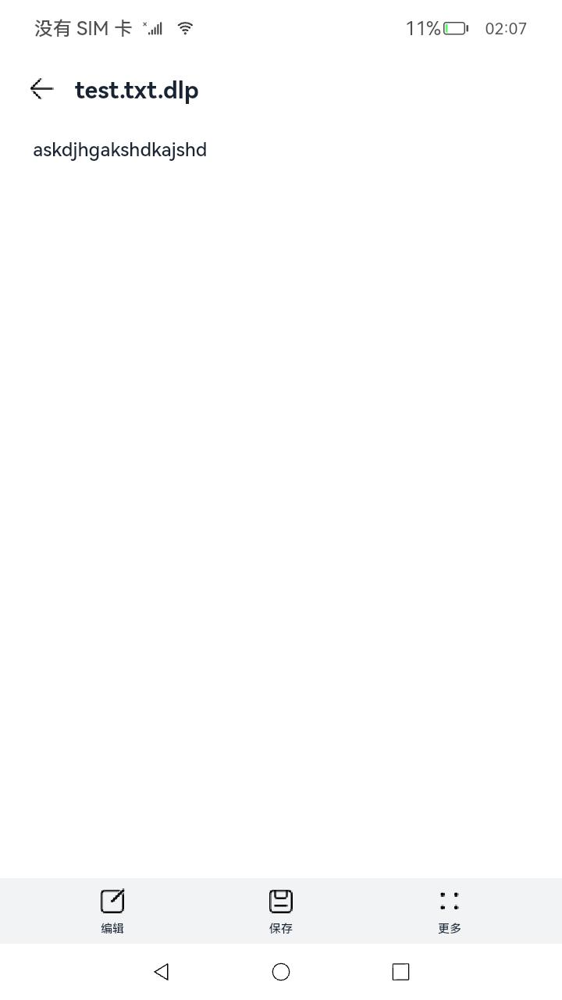

# DLPManager

### 介绍

本示例主要展示了DLP文件管理相关的功能，使用[@ohos.dlpPermission](https://gitee.com/openharmony/docs/blob/OpenHarmony-4.0-Release/zh-cn/application-dev/reference/apis/js-apis-dlppermission.md)、[@ohos.file.fs](https://gitee.com/openharmony/docs/blob/OpenHarmony-4.0-Release/zh-cn/application-dev/reference/apis/js-apis-file-fs.md)、[@ohos.file.fileAccess](https://gitee.com/openharmony/docs/blob/OpenHarmony-4.0-Release/zh-cn/application-dev/reference/apis/js-apis-fileAccess.md)、[@ohos.file.picker](https://gitee.com/openharmony/docs/blob/OpenHarmony-4.0-Release/zh-cn/application-dev/reference/apis/js-apis-file-picker.md)、[@ohos.app.ability.Want](https://gitee.com/openharmony/docs/blob/OpenHarmony-4.0-Release/zh-cn/application-dev/reference/apis/js-apis-app-ability-want.md)等接口，实现了生成和打开DLP文件、查看原始应用沙箱目录的原始文件打开列表、编辑保存文件、拉取文件夹、查看文件权限和监听DLP文件的功能。

### 效果预览

|主页|文件内容页|
|--------------------------------|--------------------------------|
|||

使用说明

1.进入界面，显示原始应用沙箱目录获取原始文件访问列表。

2.点击右上角的图标，可以获取沙箱保留信息。

3.点击右下角的加号图标，可以跳转进入文件夹。

4.点击某个文件，可以显示其文件内容。

5.在文件显示页面，可以点击下面的编辑图标对文件内容进行编辑，编辑后点击保存图标进行保存；点击更多可以文件另存为，查看权限。

6.设置txt文件权限时需输入用户账号点击回车后才能点击确认按钮。

### 工程目录

```
entry/src/main/ets/
|---entryability
|   |---EntryAbility.ets               // dlpSample应用的ability
|   |---FuncAbility.ets                // dlp文件显示的ability
|---media
|   |---dlpPage.ets                    // dlp文件内容页
|   |---filePage.ets                   // 原始文件内容页
|   |---MediaFileUri.ts                // 函数方法
|---pages
|   |---Index.ets                      // 首页
|---utils
|   |---Logger.ts                      // 日志工具
```
### 具体实现

* 本实例获取DLP文件和普通文件列表的功能结主要封装在Index，源码参考：[Index.ets](entry/src/main/ets/pages/Index.ets) 。
    * 获取列表信息：在Index页面中通过onPageShow()调用fs.listFile()、fs.stat()等方法能够应用沙箱路径下的原始文件列表；通过context.startAbility(want)对DLP文件进行生成和打开，通过dlpPermission的接口查看DLP文件的权限。

### 相关权限

| 权限名                                                       | 权限说明                                      | 级别         |
| ------------------------------------------------------------ | --------------------------------------------- | ------------ |
| [ohos.permission.MEDIA_LOCATION](https://gitee.com/openharmony/docs/blob/OpenHarmony-4.0-Release/zh-cn/application-dev/security/permission-list.md#ohospermissionmedia_location) | 允许应用访问用户媒体文件中的地理位置信息      | normal       |
| [ohos.permission.READ_MEDIA](https://gitee.com/openharmony/docs/blob/OpenHarmony-4.0-Release/zh-cn/application-dev/security/permission-list.md#ohospermissionread_media) | 允许应用读取用户外部存储中的媒体文件信息      | normal       |
| [ohos.permission.WRITE_MEDIA](https://gitee.com/openharmony/docs/blob/OpenHarmony-4.0-Release/zh-cn/application-dev/security/permission-list.md#ohospermissionwrite_media) | 允许应用读写用户外部存储中的媒体文件信息      | normal       |
| [ohos.permission.FILE_ACCESS_MANAGER](https://gitee.com/openharmony/docs/blob/OpenHarmony-4.0-Release/zh-cn/application-dev/security/permission-list.md#ohospermissionfile_access_manager) | 允许文件管理类应用通过FAF框架访问公共数据文件 | system_basic |
| [ohos.permission.GET_BUNDLE_INFO_PRIVILEGED](https://gitee.com/openharmony/docs/blob/OpenHarmony-4.0-Release/zh-cn/application-dev/security/permission-list.md#ohospermissionget_bundle_info_privileged) | 允许查询应用的基本信息和敏感信息              | system_basic |
| [ohos.permission.ACCESS_DLP_FILE](https://gitee.com/openharmony/docs/blob/OpenHarmony-4.0-Release/zh-cn/application-dev/security/permission-list.md#ohospermissionaccess_dlp_file) | 允许对DLP文件进行权限配置和管理               | system_core  |
| [ohos.permission.START_INVISIBLE_ABILITY](https://gitee.com/openharmony/docs/blob/OpenHarmony-4.0-Release/zh-cn/application-dev/security/permission-list.md#ohospermissionstart_invisible_ability) | 无论Ability是否可见，都允许应用进行调用       | system_core  |

### 依赖

不涉及。

### 约束与限制

1.本示例仅支持标准系统上运行。

2.本示例已适配API version 11版本SDK，版本号：4.1.3.3。

3.本示例需要使用DevEco Studio 3.1 Beta2 (Build Version: 3.1.0.400 构建 2023年4月7日)及以上版本才可编译运行。

### 下载

如需单独下载本工程，执行如下命令：
```
git init
git config core.sparsecheckout true
echo code/BasicFeature/Security/DLPManager > .git/info/sparse-checkout
git remote add origin https://gitee.com/openharmony/applications_app_samples.git
git pull origin master

```
