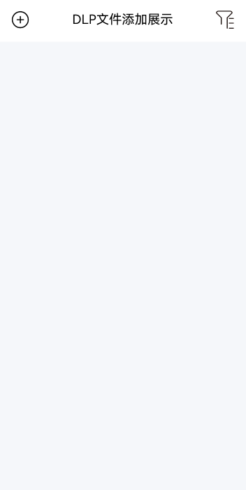
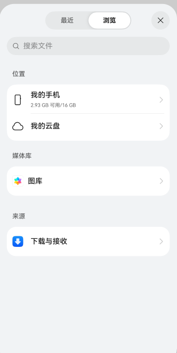
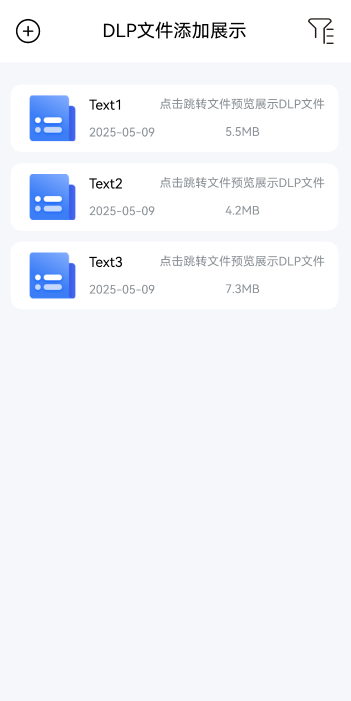

# DLP文件添加展示案例

### 介绍

本示例主要介绍DLP文件添加展示场景，利用picker.DocumentViewPicker打开文件管理选择DLP文件，使用startAbility打开文件预览从而展示DLP文件。

### 效果图预览

| 案例首页            | 打开文件管理         | 添加DLP文件                   | 打开DLP                 |
|-----------------|----------------|---------------------------|-----------------------|
|  | 	  | 		 | DLP文件不允许录屏或截屏，需开发手动验证 |


**使用说明**
（注意：本案例只能真机验证）
1. 开发者需要手动生成DLP文件。
2. 打开DLP文件添加展示案例，点击左上角的加号，打开文件管理选择生成的DLP文件（注意：本案例仅对DLP文件进行展示）。
3. DLP文件生成渲染成列表在应用上，点击列表项从而打开文件预览展示DLP文件（注意：本案例仅对DLP文件进行展示）。

### 实现思路

本例涉及的关键特性和实现方案如下：

1. 需要开发者手动生成DLP文件：
   1. 开发者打开文件管理，点击浏览tab页面，点击文档找到pdf、txt等相关文件。
   2. 长按相关文件点击分享。
   3. 打开分享弹窗，点击加密分享。
   4. 跳转添加用户弹窗，输入手机号需要和本机登录的手机号保持一致，点击确认。
   5. 点击确认后跳转到分享弹窗。
   6. 分享弹窗点击另存为，选择存储的文件夹，点击右上角对号保存

2. 打开文件管理，选择生成的DLP文件，将选择的文件路径进行存储，源码参考[Index.ets](./entry/src/main/ets/pages/Index.ets)。

```typescript
selectDlp() {
  try {
    let context = getContext(this) as common.UIAbilityContext;
    // 文档选择选项
    let documentSelectOptions = new picker.DocumentSelectOptions();
    // 可以选择三个文件
    documentSelectOptions.maxSelectNumber = 3;
    // 文件选择器对象，用来支撑选择和保存各种格式文档
    let documentPicker = new picker.DocumentViewPicker(context);
    documentPicker.select(documentSelectOptions).then((documentSelectResult: Array<string>) => {
      // 将选择的文件路径保存到本地数组中
      for (let index = 0; index < documentSelectResult.length; index++) {
        this.fileArray.push(documentSelectResult[index]);
      }
    })
  } catch (err) {
    logger.error('Select DLP failed ' + JSON.stringify(err))
  }
}
```

3. 构造want参数，开发者可以通过调用startAbility接口，由系统从已安装的应用中寻找文件预览，打开选定的文件。源码参考[Index.ets](./entry/src/main/ets/pages/Index.ets)。

```typescript
viewDlp(dlpUri: string) {
  let context = getContext(this) as common.UIAbilityContext;
  // 构造want参数
  let want: Want = {
     'action': 'ohos.want.action.viewData',
     'uri': dlpUri,
  }
  try {
    // 通过调用startAbility接口，由系统从已安装的应用中寻找文件预览，打开选定的文件
    context.startAbility(want);
  } catch (err) {
    logger.error('View DLP failed ' + JSON.stringify(err))
  }
}
```

### 工程结构&模块类型

   ```
FilePreviewDLP                            
|---pages 
|   |---Index.ets                            // 页面信息
|---log
|   |---Logger.ets                           // 日志信息
   ```

### 参考资料

- [拉起文件处理类应用（startAbility）](https://docs.openharmony.cn/pages/v5.1/zh-cn/application-dev/application-models/file-processing-apps-startup.md)
- [选择器](https://docs.openharmony.cn/pages/v5.1/zh-cn/application-dev/reference/apis-core-file-kit/js-apis-file-picker.md)

### 相关权限

不涉及。

### 依赖

不涉及。

### 约束与限制

1.本示例仅支持标准系统上运行，支持设备：Phone。

2.本示例为Stage模型，支持API13版本SDK，SDK版本号（API Version 5.0.1 Release）。

3.本示例需要使用DevEco Studio版本号（DevEco Studio 5.0.0 Release）及以上版本才可编译运行。

### 下载

如需单独下载本工程，执行如下命令：

```shell
git init
git config core.sparsecheckout true
echo code/BasicFeature/Security/FilePreviewDLP/ > .git/info/sparse-checkout
git remote add origin https://gitee.com/openharmony/applications_app_samples.git
git pull origin master
```