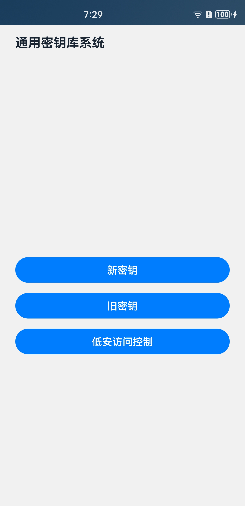
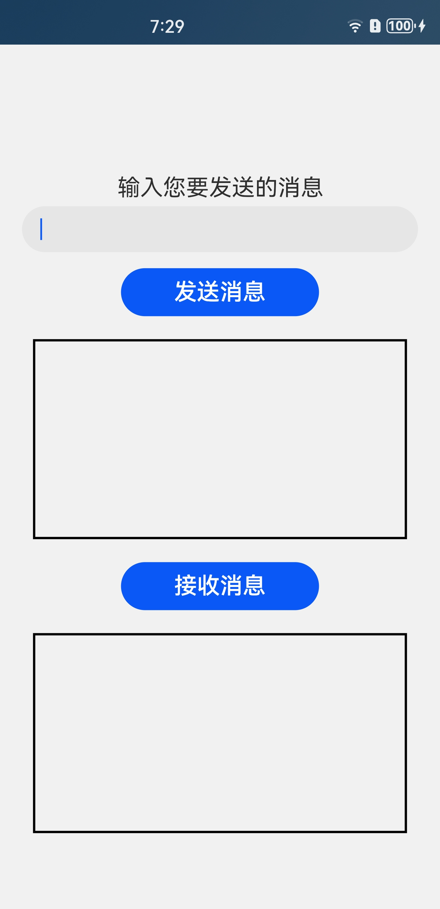
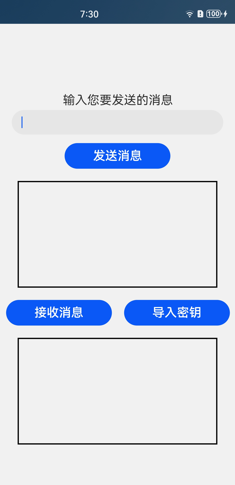

# 通用密钥库系统

### 介绍

本示例使用[@ohos.security.huks](https://gitee.com/openharmony/docs/blob/master/zh-cn/application-dev/reference/apis/js-apis-huks.md)相关接口实现了对任意输入内容进行加密和解密的功能。

实现场景如下：

1）使用新密钥进行消息加解密传输：使用HUKS的生成密钥接口在本地生成一个新密钥，模拟设备对发送的消息进行加密和对接收的消息进行解密场景。

2）使用旧密钥进行消息加解密传输：使用HUKS的导入密钥接口导入一个旧密钥，模拟在旧设备上对发送的消息进行加密，在新设备上对接收的消息进行解密的场景。

3）使用低安访问控制进行密码加解密：使用HUKS的生成密钥接口在本地生成一个新的密钥，模拟设备对密码进行加密和对接收的密码进行解密场景。

### 效果预览

| 主页                                | 使用新密钥消息加解密页面       | 使用旧密钥消息加解密页面                       | 使用低安访问控制保存/读取密码                              |   
|-----------------------------------|--------------------|------------------------------------|----------------------------------------------|
|  |  |  |  |

使用说明

1.点击主页面的**新密钥**按钮，在新密钥界面的输入框中输入待发送的消息内容，点击**发送消息**
按钮，下方文本框中显示加密后的消息内容，然后点击**接收消息**按钮，下方文本框中显示解密后的消息内容。

2.点击主页面的**旧密钥**按钮，在旧密钥界面的输入框中输入待发送的消息内容，点击**发送消息**
按钮，下方文本框中显示加密后的消息内容，首先点击**导入密钥**按钮，弹窗提示导入密钥成功，然后点击**接收消息**按钮，下方文本框中显示解密后的消息内容。

3.点击主页面的**低安访问控制**按钮，在新密钥界面的输入框中输入待保存的密码内容，点击**保存密码**
按钮，下方文本框中显示加密后的密码内容，录入锁屏密码， 然后点击**读取密码**按钮，在输入PIN码（锁屏密码，需要预先录入）之后，下方文本框中显示解密后的消息内容。

### 工程目录

```
entry/src/main/ets/
|---common
|   |---NewKey.ets                                            // 新密钥组件
|   |---OldKey.ets                                            // 旧密钥组件
|   |---MinAccessControl.ets                                  // 低安访问控制组件
|---entryability
|   |---EntryAbility.ts       
|---model
|   |---HuksModel.ts                                          // 通用密钥库模型文件
|   |---Logger.ts                                             // 日志文件
|---pages
|   |---Index.ets                                             // 主页界面
|   |---SelectPage.ets                                        // 选择跳转界面
```

### 具体实现

* 使用新密钥、旧密钥与低安访问控制进行消息的加密和解密的功能接口封装在HuksModel中，源码参考：[HuksModel.ts](entry/src/main/ets/model/HuksModel.ts)
    * 使用新密钥加密：在[NewKey.ets](entry/src/main/ets/common/NewKey.ets)文件中通过HuksModel.encryptData方式调用加密函数实现对发送的消息内容进行加密，设置好生成密钥和解密密钥的密钥属性信息，加密前会先调用生成密钥接口
      [huks.generateKeyItem](https://gitee.com/openharmony/docs/blob/master/zh-cn/application-dev/reference/apis/js-apis-huks.md#huksgeneratekeyitem9-1)
      生成用于加密的AES密钥，对消息加密的过程中采用三段式接口[huks.initSession,huks.updateSession,huks.finishSession](https://gitee.com/openharmony/docs/blob/master/zh-cn/application-dev/reference/apis/js-apis-huks.md#huksinitsession9-1)
      完成加密操作。
    * 使用新密钥解密：在[NewKey.ets](entry/src/main/ets/common/NewKey.ets)文件中通过HuksModel.decryptData方式调用解密函数实现对发送消息的解密，设置好解密密钥的密钥属性信息，使用加密时的密钥对消息进行解密，仍然是采用三段式接口完成解密操作，解密动作完成后调用删除密钥接口
      [huks.deleteKeyItem](https://gitee.com/openharmony/docs/blob/master/zh-cn/application-dev/reference/apis/js-apis-huks.md#huksdeletekeyitem9-1)清除本地保存的密钥。
    * 使用旧密钥加密：在[OldKey.ets](entry/src/main/ets/common/OldKey.ets)文件中通过HuksModel.encryptDataUserOldKey方式调用加密函数对发送的消息内容进行加密，设置好加密密钥的密钥属性信息，采用三段式接口使用本地已保存的旧密钥完成加密操作。
    * 使用旧密钥解密：在[OldKey.ets](entry/src/main/ets/common/OldKey.ets)文件中通过HuksModel.decryptDataUserOldKey方式调用解密函数对发送的消息内容进行解密，首先模拟在新设备上导入旧设备的加密密钥，同样采用三段式接口完成解密操作，解密完成后删除密钥。
    * 使用低安访问控制管理密码：在[MinAccessControl.ets](entry/src/main/ets/common/MinAccessControl.ets)文件中通过 huksModel.encryptDataUseSm2 方式生成SM2密钥并调用加密函数对发送的消息内容进行加密，设置好加密密钥的密钥属性信息，采用两段式接口使用本地已保存的旧密钥完成加密操作。读取密码时（需先设定系统锁屏密码）调用IAM的PIN码（锁屏密码）接口进行验证。


### 相关权限

ohos.permission.ACCESS_BIOMETRIC

### 依赖

不涉及。

### 约束与限制

1.本示例仅支持标准系统上运行。

2.本示例支持API10版本SDK，SDK版本号(API Version 10 Release),镜像版本号(4.0Release)。

3.本示例需要使用DevEco Studio 版本号(4.0Release)及以上版本才可编译运行。

4.本示例在无设备证书的设备中运行时，需预先在本机命令行中"hdc shell setenforce 0"命令，才可保证示例功能正常执行。

### 下载

如需单独下载本工程，执行如下命令：

```
git init
git config core.sparsecheckout true
echo code/BasicFeature/Security/Huks/ > .git/info/sparse-checkout
git remote add origin https://gitee.com/openharmony/applications_app_samples.git
git pull origin master

```