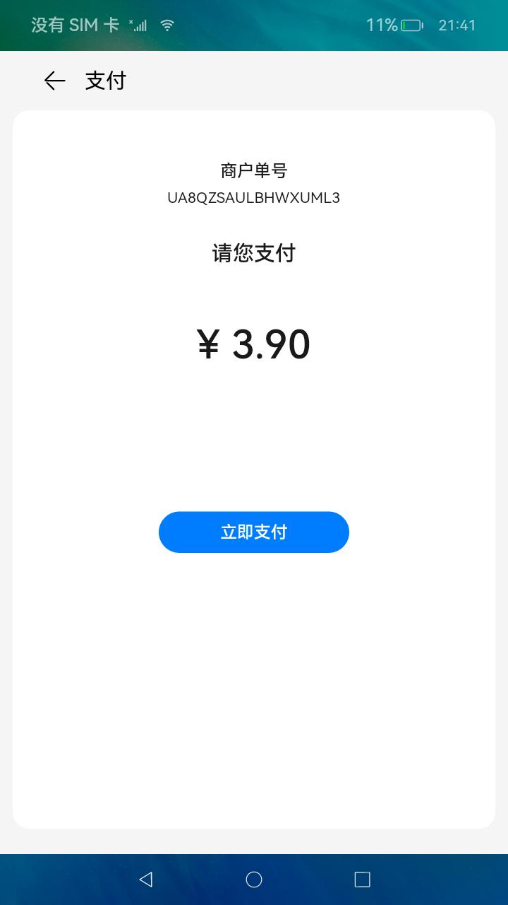
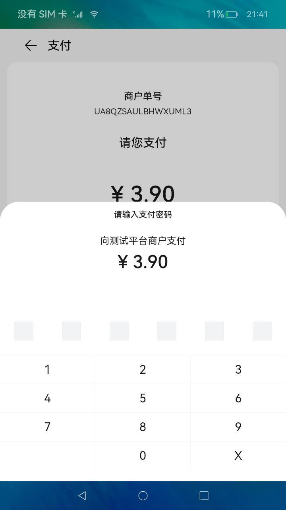
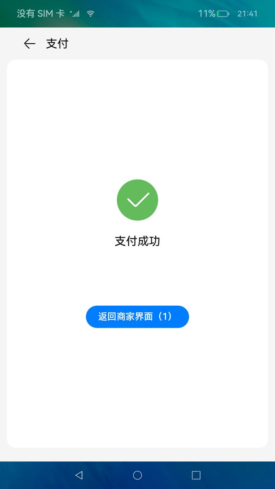
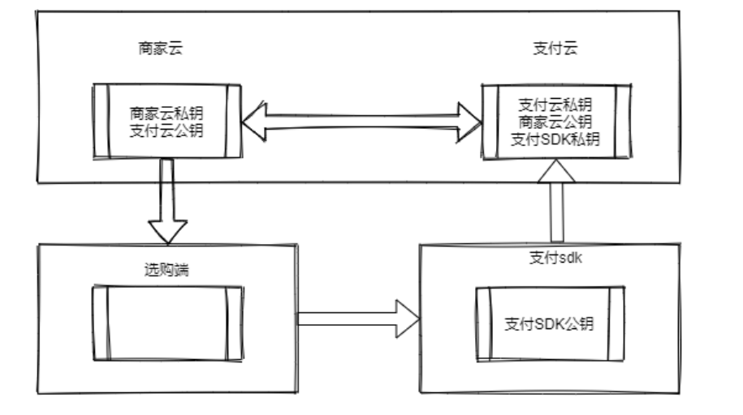

# 支付

### 介绍

本示例主要展示了加解密算法库框架的相关功能，使用[@ohos.security.cryptoFramework](https://docs.openharmony.cn/pages/v4.0/zh-cn/application-dev/reference/apis/js-apis-cryptoFramework.md/)
接口，利用RSA非对称加密、ECC数字签名模拟选购支付功能;

### 效果预览

| 选购首页                          | 支付SDK首页                               | 密码输入界面                                            | 支付成功界面                                           |
|-------------------------------|---------------------------------------|---------------------------------------------------|--------------------------------------------------|
|  |  |  |  |

使用说明

1. 在选购首页，点击任意商品进入对支付主面；
2. 在支付主面，点击立即支付按钮，弹出密码输入框；
3. 输入密码满6位后得到支付结果，支付成功会进入支付成功界面，3s后自动回到选购首页；

### 工程目录

```
entry/src/main/ets/
|---entryability
|---pages
|   |---Index.ets                          // 选购首页
cloud/src/main/ets/
|---MerchantServer.ts                      // 商家云模拟
|---PayServer.ts                           // 支付云模拟
paySDK/src/main/ets/
|---component
|   |---payView.ets                        // 密码输入界面
|   |---TitleBar.ets                       // 标题栏
|---paysdkability
|---pages
|   |---Index.ets                          // 支付首页
|---util
|   |---Logger.ets
```

### 具体实现



1. 选购页面通过商家云获取商品信息，选定商品通过商家云生成订单。
2. 商家云通过RSA非对称加密，使用支付云公钥，将商品信息传输给支付云SDK。
3. 支付云通过支付云私钥解密获得消息后生成订单明文orderString返回商家云。
4. 商家云通过ECC进行数字签名，添加到明文orderString后，形成完整的orderString返回给选购端。
5. 支付SDK通过RSA非对称加密，使用支付SDK公钥，将支付账号密码信息传输给支付云SDK，并携带完整的orderString。
6. 支付云通过支付SDK私钥解密账号密码信息，并通过商家云公钥进行验签。

- 商家云可用接口封装在cloud模块MerchantServer，提供商品获取，生成订单功能，源码参考：[MerchantServer.ts](cloud/src/main/ets/MerchantServer.ts)。
- 支付云可用接口封装在cloud模块PayServer，提供生成支付订单，支付转账功能，源码参考：[PayServer.ts](cloud/src/main/ets/PayServer.ts)
- 支付SDK为单独feature，需要支付时拉起此hap,提供输入密码进行支付功能。逻辑位于PaySDK模块index，源码参考：[Index.ets](paySDK/src/main/ets/pages/Index.ets)

### 相关权限

不涉及

### 依赖

不涉及

### 约束与限制

1. 本示例仅支持标准系统上运行，支持设备：RK3568；
2. 本示例已适配API version 10版本SDK，版本号：4.0.10.11，镜像版本号：OpenHarmony 4.0.10.13；
3. 本示例需要使用DevEco Studio 4.0 Release (Build Version: 4.0.0.600, built on October 17, 2023)及以上版本才可编译运行；

### 下载

如需单独下载本工程，执行如下命令：

```
git init
git config core.sparsecheckout true
echo code/BasicFeature/Security/PaySecurely/ > .git/info/sparse-checkout
git remote add origin https://gitee.com/openharmony/applications_app_samples.git
git pull origin master

```